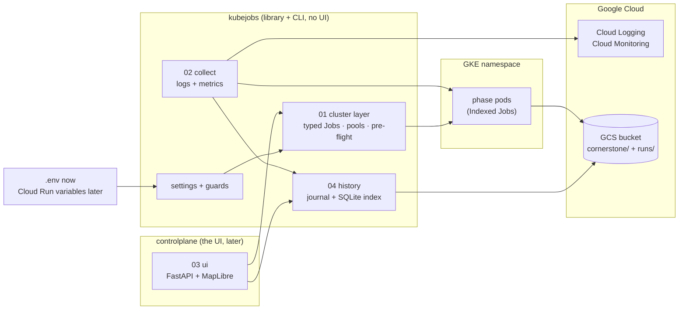

# Managing pipeline jobs on Kubernetes: `kubejobs` now, a UI (`controlplane`) later

**Status:** plans, with the first parts implemented (see Build order). Written 2 Oct 2026 from two independent investigations of the same four questions, with the owner's decisions applied, and updated after review of PR #12 on 5 Oct. "The user" in these documents is Yaroslav, who owns the work and made the decisions.

Today a tile run is started by hand: build an image, write config files, render a Job template, `kubectl apply`, watch logs, and lose them 30 minutes after the Job finishes. The goal is two things that are built and used separately. **`kubejobs`** is a Python package and command line that manages Kubernetes for the pipeline: typed Jobs, per-job RAM, CPU and log monitoring, and a history of every run. It needs no UI and is usable on its own for months. **`controlplane`** is a lightweight UI, built later, that sits on top of `kubejobs` and never talks to the cluster except through it. Both are configured entirely through settings, so the same code runs against the user's namespace today and a new cluster on Cloud Run later.

## The plans

| Doc                                                                      | Covers                                                                                                                                                                                                                                    |
| ------------------------------------------------------------------------ | ----------------------------------------------------------------------------------------------------------------------------------------------------------------------------------------------------------------------------------------- |
| [01-kubernetes-library.md](01-kubernetes-library.md)                     | The `lightkube` library: package layout and import contracts, typed Jobs, node pools with role defaults, the `advance_run` state machine, guardrails, pre-flight and cost, auth modes and RBAC, per-phase sizing, CLI                     |
| [02-monitoring-and-logging.md](02-monitoring-and-logging.md)             | Per-job RAM, CPU and logs: what exists (Grafana is not in `yaroslav`), what survives the TTL, options compared, metric catalogue, verdict rules, sourced best practices, validated Prometheus queries as an appendix                      |
| [03-ui.md](03-ui.md)                                                     | The UI: AdAstra tokens, screens and wireframes (including the per-phase node-pool selector), tile status, map overlay, API, security, phases. Mockup: [assets/03-ui-mockup.html](assets/03-ui-mockup.html)                                |
| [04-history-store.md](04-history-store.md)                               | Run history: write-once GCS objects plus a rebuildable SQLite index, schema, capture before the TTL, replay                                                                                                                               |
| [05-configuration-and-deployment.md](05-configuration-and-deployment.md) | The local `.env` and every setting, what changes on Cloud Run, migration checklist for the new cluster and bucket                                                                                                                         |
| [06-pipeline-alignment-issue-8.md](06-pipeline-alignment-issue-8.md)     | Reference: what [issue #8](https://github.com/AdAstraEco/cornerstone_luc/issues/8) (1° work tiles, named runs, config files) means for `kubejobs`, the UI additions it would bring, and eight small hooks to build now. Not a v1 priority |

## How the pieces fit

## Review of PR #12 (5 Oct 2026)

The reviewer (Dan) asked for three code changes, applied the same day, and raised four design questions that shape the next steps:

- **Environment-first `Config` is dropped** from step 0. Nothing in the stack uses it (the pods still read the mounted Secret file) and a variable left exported in a shell would silently override a developer's `.env`. It returns only as part of a settled design of where a run's configuration comes from (question 3 below). This reverses the 2 Oct decision in rows 3 and 7.
- **`cache_key.py` stays**, described as the cache-key recipe with a test that pins the keys; no consumer is named in code.
- **`mosaic` takes its tiles from the countries** (like `reduce`) and rejects `--tile-ids`, so a country-named mosaic cannot be built from a partial tile list.
- **Open design questions:** (1) a pod killed mid zarr write leaves an entry that looks complete (`zarr.json` is written first), which matters before retries are trusted; (2) the cache key does not include the code version, so a branch image writing to the shared scratch bucket produces cache hits for everyone (the `kubejobs-test` runs did exactly that, on warm data); (3) where a run's image, roots and arguments are recorded and versioned; (4) the plan documents are not on any branch yet, and the reviewer wants the tile-status and `advance_run` direction discussed as a design before code depends on it.

## Decisions

**Decided by the user, 2 Oct 2026:**

| #   | Decision                                                                                                                                                                                                                                                                                                                          |
| --- | --------------------------------------------------------------------------------------------------------------------------------------------------------------------------------------------------------------------------------------------------------------------------------------------------------------------------------- |
| 1   | Two packages. **`kubejobs`** (renamed from `controlplane` on 2 Oct 2026) is the Kubernetes job library and command line, with history in `kubejobs/history/` and the collector in `kubejobs/collect/`; it has no UI dependency and is built first. **`controlplane`** is the UI, a separate later package that imports `kubejobs` |
| 2   | Library **`lightkube`**                                                                                                                                                                                                                                                                                                           |
| 3   | Edits to the pipeline repo **approved**: `infra/run_phase.py`, `infra/resource_monitor.py`, a stdlib-only `jdluc/cache_key.py`. *(Environment-first reading of every `Config` field, issue #8 proposal 17, was approved on 2 Oct and dropped after review on 5 Oct, see above.)*                                                  |
| 4   | Resource sizing **approved** (request equal to limit). **Node pool is selectable per phase and per job**; defaults are the power pool for heavy jobs and the standard-machine pool for light jobs, and the UI form shows and edits them                                                                                           |
| 5   | **Everything lives in the user's bucket and the `yaroslav` namespace for now.** Every variable, Kubernetes connection value and the bucket name is in a local `.env` (created, git-ignored). Cloud Run later, with different variables, a different bucket and a different cluster                                                |
| 6   | **Merge the two plan sets** into this one folder                                                                                                                                                                                                                                                                                  |
| 7   | **Issue #8 follow-ups:** ~~environment-first reading of every `Config` field~~ (dropped 5 Oct); history prefix `cornerstone/control/`; soft cap of 10,000 completions per Job                                                                                                                                                     |

**Defaults applied unless the user objects:** Job TTL stays 1800 s; pools are read-only with a config-driven allow-list; the image is pinned by digest at submit; the UI is local-first; the basemap is Natural Earth with an Esri toggle; Google Fonts are loaded; Grafana is not embedded and Prometheus is not part of v1; confirmations are tiered ($5 or 20 tiles needs a typed `RUN`); tile status is bucket listing plus recomputed cache keys, with no per-pod ledger.

**Confirmed 2 Oct 2026:** "standard pool" for light jobs is `yaroslav-worker-node-pool` (e2-standard-8, autoscaling 0 to 200, the user's own). The shared `standard-node-pool` (always on, 3 nodes, other workloads) stays selectable with a warning but is not the default.

## What the merge took from each set

| Area             | Base                                                                                                                                                                       | Ported in                                                                                                                                         |
| ---------------- | -------------------------------------------------------------------------------------------------------------------------------------------------------------------------- | ------------------------------------------------------------------------------------------------------------------------------------------------- |
| 01 Library       | the more rigorous plan: `mypy`-checked lightkube, exact import contracts, `podFailurePolicy`, per-phase sizing table, the finding that celery workers share the power pool | `advance_run` state machine and API, guardrail table with `suspend` and `gc`, pre-flight table with evidence, cost estimator, auth modes and RBAC |
| 02 Monitoring    | the plan that found Cloud Logging and Monitoring kept everything after the TTL, that Prometheus has no I/O-pressure data, and the verdict rules                            | sourced best practices, validated Prometheus queries (appendix, optional path)                                                                    |
| 03 UI            | exact brand tokens, the fonts-not-loaded finding, basemap licensing, mockup, phased MVP                                                                                    | plan-then-confirm flow, run caps, the four-step Run builder (reworked for per-phase pools), verified cache-key reproduction                       |
| 04 History       | decision matrix over nine options, worked example from the 29 Sept run                                                                                                     | replay from the stored manifest, digest pinning, collision-proof `run_uid`                                                                        |
| 05 Configuration | new, from decision 5                                                                                                                                                       |                                                                                                                                                   |

Two points where the sets disagreed and how they were settled:

- **Image boundary:** the pod does not import `kubejobs`. `phases.py` duplicates six strings behind a parity test (the other option would have coupled the pipeline image to it).
- **Tile status:** `emit` keys are recomputable (verified: `version=2` gives `94cbe56c057a`, the real object); a per-pod ledger was dropped. Only `emit` is verified so far.

## Findings that cut across the plans

| Finding                                                                                                                                                                                                                                     | Where  |
| ------------------------------------------------------------------------------------------------------------------------------------------------------------------------------------------------------------------------------------------- | ------ |
| The user is effectively cluster admin: project-wide `container.clusters.update`, node patch rights, 14 other people's pools on the same cluster, no ResourceQuota on `yaroslav`. Guardrails must live in our code.                          | 01     |
| Both of the user's pools carry the `worker=true` taint. Maverick's celery workers share the power pool and its autoscaler.                                                                                                                  | 01     |
| An `e2-standard-8` has 27.6 GiB allocatable, so the 24 GiB `ingest-tiles` limit is nearly the whole node.                                                                                                                                   | 01     |
| Two of the three failed compare pods were **evicted** (using 59.5 GiB against a 48 GiB request), one was OOM-killed. Request equal to limit fixes the cause; metrics alone cannot tell the two apart.                                       | 01, 02 |
| Ingest is **disk-bound** (`io_psi_full_avg10` up to 59.6), not network-bound as `PhaseSpec` assumed; `compute` peaked near 53 GiB, not 39.                                                                                                  | 01, 02 |
| Cloud Logging (30 days) and Cloud Monitoring (about 6 weeks) kept the 29 Sept run after the pods were deleted. Prometheus keeps 10 days on `emptyDir` and has no I/O pressure.                                                              | 02     |
| Every pod log line is severity ERROR (stderr) and unstructured, with no `run_id` or `tile` fields.                                                                                                                                          | 02     |
| `run_id` is `MMDDHHMM`, so two people in a shared bucket can collide; the store's `run_uid` adds a year and a random suffix.                                                                                                                | 04     |
| `:latest` with `imagePullPolicy: Always` means the tag does not identify what ran; pin by digest at submit.                                                                                                                                 | 01, 04 |
| The map overlay needs per-tile COGs with overviews. **Now exported and verified** for `20N_090W`: 1.09 GiB, 10 bands, 512² blocks, nine overviews, readable through `/vsigs/` from a pod in 0.14 to 0.32 s.                                 | 03     |
| The dLUC viewer names its brand fonts but never loads them, and has no dark mode.                                                                                                                                                           | 03     |
| Issue #8 proposes 1° work tiles: up to 28,000 work units inside today's footprint instead of 280, so a pod must process several tiles. Kubernetes allows it (verified limits); `kubejobs` keeps the hooks cheap and the UI additions gated. | 06     |
| `ingest-world` cannot bootstrap an empty bucket (it reads a boundary layer only ingest creates). The fix is part of the one pipeline-repo change.                                                                                           | 01     |

## Build order

Steps 0 to 3 are the pipeline and **`kubejobs`**; they need no UI. After step 2 a run can be started, watched and reviewed entirely from the command line (`python -m kubejobs submit | status | logs | top | pools | cancel | cleanup | history`), with every setting in `.env`, so `kubejobs` can be used on its own for months. Steps 4 and 5 are the **`controlplane`** UI, which only adds a screen on top of `kubejobs` and can wait.

| Step | Work                                                                                                                                                                                                                                                                                                                                                                                                                                                                                                                                                                                                                                                                                                                                                                                                | Notes                                                                                                                  |
| ---- | --------------------------------------------------------------------------------------------------------------------------------------------------------------------------------------------------------------------------------------------------------------------------------------------------------------------------------------------------------------------------------------------------------------------------------------------------------------------------------------------------------------------------------------------------------------------------------------------------------------------------------------------------------------------------------------------------------------------------------------------------------------------------------------------------- | ---------------------------------------------------------------------------------------------------------------------- |
| 0    | **Done 2 Oct 2026, [PR #12](https://github.com/AdAstraEco/cornerstone_luc/pull/12) (open):** the one pipeline-repo change: JSON logging with `run_id` / `phase` / `tile` fields and incremental flush, richer `resource_monitor` samples, `--tile-ids`, the `ingest-world` fix, `jdluc/cache_key.py` (environment-first `Config` was dropped in review)                                                                                                                                                                                                                                                                                                                                                                                                                                             | Cheapest change and it improves every later step (doc 01 section 5.7)                                                  |
| 1    | **Done for the command line, 3 Oct 2026:** [PR #11](https://github.com/AdAstraEco/cornerstone_luc/pull/11) (settings, phase specs, typed Jobs, `doctor`, `submit --dry-run`) and [PR #13](https://github.com/AdAstraEco/cornerstone_luc/pull/13) (cluster layer, `submit --yes` with a phase barrier, `status`, `logs`, `cleanup`, plus a first `report`), both drafts. A live four-phase run on `20N_090W` worked. **Still to do:** country-only submit, `advance_run`/`suspend`, `top`, `pools`, cost estimate, cluster-dependent pre-flight checks. Full scope: `kubejobs` skeleton, settings from `.env`, import contracts, `doctor`, lightkube cluster layer, typed Jobs with a golden-manifest parity test, pre-flight, CLI (`submit`, `status`, `logs`, `top`, `pools`, `cancel`, `cleanup`) | About 8 to 11 developer days (doc 01 section 7); a first slice, up to read-only dry-runs, carries no cluster risk      |
| 2    | Collector and history: Cloud Logging and Monitoring reads, journal, SQLite index, copy exit status before the TTL                                                                                                                                                                                                                                                                                                                                                                                                                                                                                                                                                                                                                                                                                   | Needs the identifiers from step 1                                                                                      |
| 3    | `export` one tile to a COG                                                                                                                                                                                                                                                                                                                                                                                                                                                                                                                                                                                                                                                                                                                                                                          | **Done 2 Oct 2026** for `20N_090W`: 50 minutes, a 1.09 GiB COG with nine overviews; other tiles follow the same recipe |
| 4    | `controlplane` (UI), read-only: tiles map and job list                                                                                                                                                                                                                                                                                                                                                                                                                                                                                                                                                                                                                                                                                                                                              |                                                                                                                        |
| 5    | `controlplane` (UI) run builder (per-phase pool selector, plan then confirm) and live monitor                                                                                                                                                                                                                                                                                                                                                                                                                                                                                                                                                                                                                                                                                                       | First step that can spend money, so it comes last                                                                      |
| 6    | Cloud Run deployment (doc 05): the `controlplane` service; `kubejobs` runs there too as a library                                                                                                                                                                                                                                                                                                                                                                                                                                                                                                                                                                                                                                                                                                   | Needs the new cluster to exist                                                                                         |
| 7    | Adopt issue #8 as the pipeline supports it: tile-size toggle, hierarchical map, tiles per pod, Runs page (doc 06)                                                                                                                                                                                                                                                                                                                                                                                                                                                                                                                                                                                                                                                                                   | Gated by the pipeline's capabilities; nothing to do until then except the hooks in doc 06 section 4                    |

## Open items

1. **Cloud Run to the new cluster:** networking and IAM depend on how that cluster is built (doc 05 section 6).
2. **Optional and time-sensitive:** Cloud Logging keeps the 29 Sept run's raw logs only until about 29 Oct, and the shared Prometheus its series until about 9 Oct. The run is the evidence behind the PR #6 write-up and the sizing numbers; archive it to GCS if a permanent copy is wanted.
