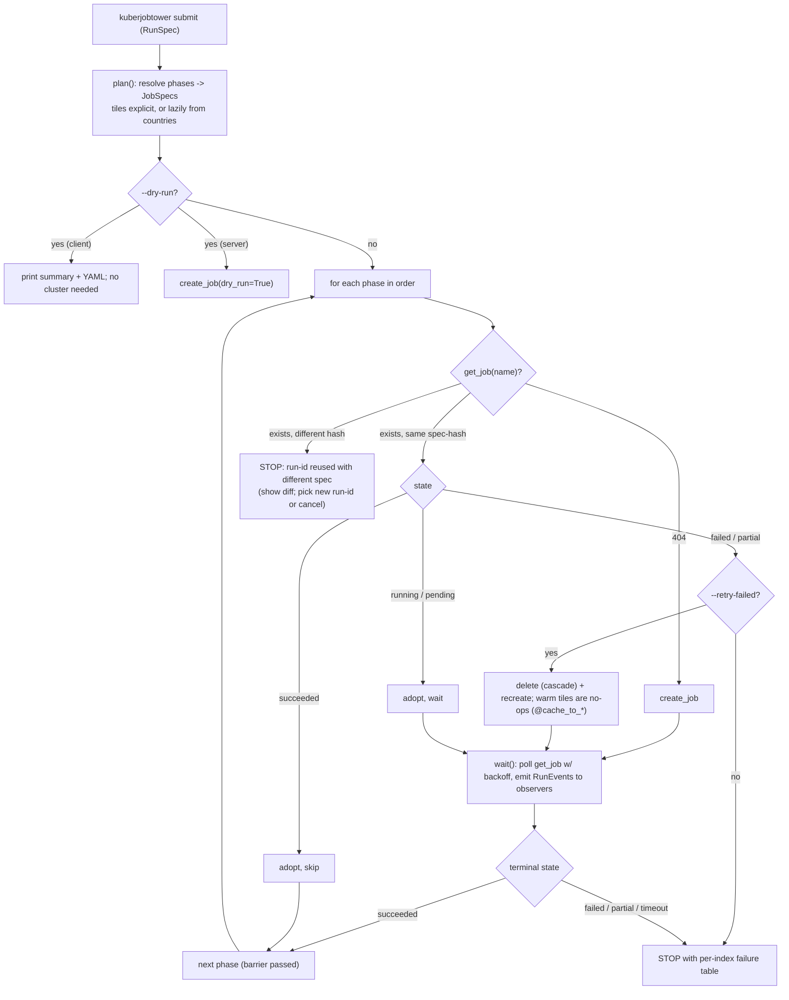
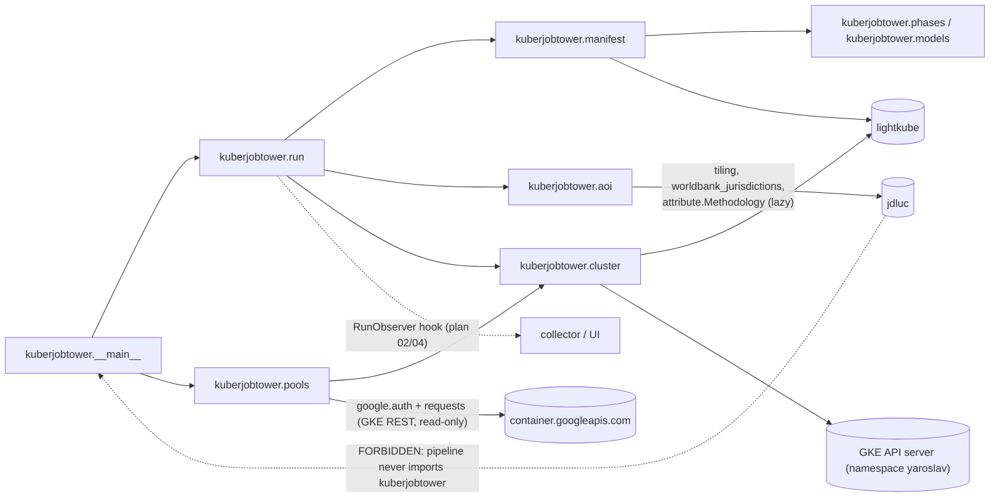
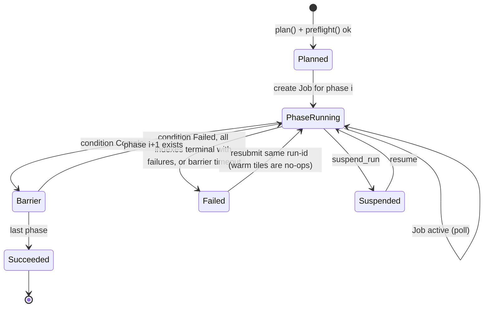

# Plan 01 - Steps 1+2: `kuberjobtower`, a Kubernetes library and command line for pipeline jobs and node pools

Status: **merged plan, 2 Oct 2026.** Combines two independent investigations and applies the user's decisions (section 4, section 10). Implementation status is in the README build order. Siblings: 02 (monitoring), 03 (UI), 04 (history), 05 (configuration and Cloud Run).

Naming (2 Oct 2026): this plan is the `kuberjobtower` package. It is a library and command line with **no UI**, usable on its own; the UI (doc 03) is a separate later package named `controlplane` that imports `kuberjobtower`. Wherever this plan says "UI" it means a future consumer, never a dependency.

Evidence convention: **[V]** = verified when this was written (code read, command run, live read-only cluster call). **[C]** = computed/derived from [V] facts. **[U]** = unverified, must be checked before relying on it.

______________________________________________________________________

## 1. Goals / Non-goals

### Goals

1. Replace `string.Template` + `kubectl` subprocess in `infra/run_aoi.py` with a typed, testable Python layer over a real Kubernetes client.
2. Submit runs from an **explicit tile list** (single-tile runs are first-class, no `submit_one.sh` hack) *and* from country AOIs.
3. Fix the cold-start deadlock of `ingest-world` (it cannot run on an empty `INGEST_ROOT` today).
4. Idempotent, resumable runs keyed by `run-id`; barriers between phases; a failure policy that does not retry hopeless failures (OOM).
5. A small CLI (`submit / status / logs / top / pools / cancel / cleanup`) and a typed event stream a UI can consume.
6. Honest, **read-only** "node pool management": inspect pools, steer pods onto them, read autoscaler state. No pool mutation in v1.
7. Updated per-phase resource specs from the 29 Sept measurements, including admitting the "ingest is network-bound" assumption was wrong.
8. Keep the pipeline image lean (`uv sync --frozen --no-dev` must not pull the client) and keep import-linter contracts meaningful.

### Non-goals

- Creating, resizing or deleting GKE node pools (k8s API cannot; see section 3.3). No IAM changes.
- Designing log/metric storage (plan 02) or the run DB/UI (plan 04). This plan only defines the hook interface (section 5.6).
- Argo/Dask/Airflow. `docs/orbae/scale-out.md` revisit triggers are not met by this plan.
- Touching the celery `celery-config` ConfigMap / custom-scaler (Maverick's; see 3.1).
- Changing any `jdluc` pipeline code. (Small `infra/run_phase.py` changes are required and are flagged as a cross-plan interface, section 5.7.)

______________________________________________________________________

## 2. Current state (verified)

### 2.1 Repo and branch situation [V]

- The tooling is not on `main`. It lives on `origin/run/civ-cie` (`infra/run_aoi.py`, `infra/run_phase.py`, `infra/resource_monitor.py`, `infra/k8s/phase-job.yaml`, `infra/k8s/README.md`, `infra/Dockerfile`, `infra/{cluster,cloud}.env.example`, `tools/*`, `docs/orbae/*`). I read every file with `git show origin/run/civ-cie:<path>`.
- `pyproject.toml` (main): runtime deps include `python-dotenv`, `requests`, `pyyaml` (transitive), `google-auth` (transitive via gcsfs, present in `uv.lock`), no k8s client; `dev` group = mypy, pytest, pre-commit, stubs. Pytest: `addopts = "-s -v -m 'not integration'"`, files `*_test.py` under `__tests__/`. Pre-commit runs `uv run mypy jdluc validation`, ruff (`B,C4,F,I,PIE,RUF,SIM,UP,W`), import-linter, uv-lock, mdformat. CI: `uv sync` then pytest (unit only).
- `infra/Dockerfile`: `uv sync --frozen --no-install-project --no-dev`, then `COPY . .`, `uv sync --frozen --no-dev`, `ENV PATH=/app/.venv/bin:$PATH`. No `ENTRYPOINT`; the Job sets `command: ["python","infra/run_phase.py"]`.

### 2.2 The current mechanism [V]

- `infra/run_aoi.py` (about 500 lines): resolves tiles from ISO codes via `run_phase.get_tile_ids()` -> `worldbank_jurisdictions.get_ten_degree_tile_ids_for_iso_3166s` (reads the World Bank admin-0 FlatGeobuf from `INGEST_ROOT`), renders `infra/k8s/phase-job.yaml` with `string.Template` (17 placeholders), pipes it to `kubectl apply -f -`, then polls `kubectl get job -o json` (retry loop added in commit 0c7b9b3) as the barrier.
- `PHASE_TO_SPEC` per phase: cpu/mem request+limit, `localtmp_size` (pd-ssd generic ephemeral volume, `premium-rwo`), pool var, secret var, per-pod `activeDeadlineSeconds`. Pools/secrets come from `infra/cluster.env` via a hand-written parser (python-dotenv is already installed and does this).
- Job template: `completionMode: Indexed`, `backoffLimitPerIndex: 1`, `maxFailedIndexes: ${COMPLETIONS}`, `ttlSecondsAfterFinished: 1800`, `restartPolicy: Never`, `nodeSelector cloud.google.com/gke-nodepool`, toleration `worker=true:NoSchedule`, `.env` Secret mounted at `/app/.env`, `/localtmp` ephemeral PVC, labels `app=cornerstone, phase, run-id` on Job and pod.
- `infra/run_phase.py` (in-pod): `--phase`, positional ISO codes (**required**, `nargs=ONE_OR_MORE`), `--tile-id`, `--tile-index` (default `$JOB_COMPLETION_INDEX`), `--skip-ingest`, `--methodology-name`, `--concurrency`. Per-tile phases map index -> `sorted(tile ids of the countries)[index]` by recomputing from the countries in-pod.
- `jdluc/config.py` (main) `Config.from_dot_env` reads a **file only** (`dotenv_values`), no process-env override. So per-run knobs such as `NUMBER_OF_DASK_WORKERS` can only vary by swapping the mounted Secret. The approved environment-first change (section 5.7, item 5) fixes this for every field.

### 2.3 Cluster facts, read-only [V]

- Context `gke_maverick-reloaded_us-central1-b_nonprod-shared-cluster`, server v1.35.6-gke; local kubectl is 1.33.9 (skew warning). `kubeconfig` user is an **exec plugin** (`gke-gcloud-auth-plugin`, `client.authentication.k8s.io/v1beta1`), not the removed legacy `auth-provider`.
- `gcloud container node-pools list` works: 15 pools, per-namespace pairs `<ns>-worker-node-pool` (e2-standard-8) and `<ns>-power-node-pool` (e2-highmem-8) plus shared `standard-node-pool`. `describe yaroslav-power-node-pool`: autoscaling enabled, max 200, no min (=0), taint `worker=true:NO_SCHEDULE`, pd-standard 50 GB boot, `locationPolicy BALANCED`. Both yaroslav pools currently at 0 nodes; only the 3 `standard-node-pool` nodes are up.
- Read access I confirmed with `kubectl auth can-i` and live lightkube calls: list nodes (labels incl. `cloud.google.com/gke-nodepool`, allocatable: a standard node has **7910m CPU / 28,930,140 Ki = 27.6 GiB** allocatable of 32 GiB), get ConfigMap `kube-system/cluster-autoscaler-status` (11.9 KB YAML), list `metrics.k8s.io` PodMetrics, list events, pods/log, create/delete jobs in `yaroslav`. `gcloud logging read` also works.
- `cluster-autoscaler-status` `nodeGroups[]` carry, per instance group: `cloudProviderTarget`, `minSize`, `maxSize`, `nodeCounts`, `scaleUp/scaleDown` status, `name` = `.../instanceGroups/gke-nonprod-shared-c-yaroslav-power-n-81341ed6-grp` (**pool names are truncated**). `gcloud ... node-pools describe` gives `instanceGroupUrls` ending in the same `...-grp` name, so a GKE-API join is exact; a prefix guess without it is heuristic.
- GKE logging `WORKLOADS` and monitoring `POD/CADVISOR` + managed Prometheus are enabled; Cloud Logging still returned `app=cornerstone` pod logs from 29 Sept even though the pods were deleted by the 1800 s TTL (`kubectl get pods -l app=cornerstone` returns 0). Plan 02 section 2.3 independently documents retention (30 d). So lesson (c) is **not** data loss; it is only that `kubectl logs` stops working.
- Regional quota is not a constraint: `CPUS 27/9240`, `SSD_TOTAL_GB 704/70000` (us-central1, project maverick-reloaded). 200 compute pods x 8 vCPU = 1600 vCPU fits.
- `celery-config` `NODE_POOL` is `yaroslav-power-node-pool` today: Maverick's celery workers and our compute pods **share the power pool and its autoscaler**.

### 2.4 What celery-autoscaler and `manage-namespace-config` teach [V]

the `celery-autoscaler` repo (a sibling checkout; 1087 lines, no tests, `kubernetes==30.1.0`):

| Pattern                                                                                                                                       | Where                                 | Reuse?                                                                                                                        |
| --------------------------------------------------------------------------------------------------------------------------------------------- | ------------------------------------- | ----------------------------------------------------------------------------------------------------------------------------- |
| `config.load_incluster_config()` at import time, module-global `v1 = CoreV1Api()`                                                             | `kubernetes_manager.py`               | **Avoid**: import-time side effect, not testable, in-cluster only. Use a factory (kubeconfig + context, in-cluster fallback). |
| Pods as one 280-line nested dict, 17 near-identical `configMapKeyRef` env blocks, `# type: ignore` on return                                  | `scaler_pod_config.py`                | **Avoid**: untyped, repetitive. Use typed models (or at least `envFrom`).                                                     |
| Deterministic name + `read_namespaced_pod` -> 404 -> create                                                                                   | `add_celery_worker_pod`               | **Reuse** idea (get-then-create by deterministic name), extended with a spec-hash annotation.                                 |
| `create_kubernetes_pod` swallows `ApiException` and only logs                                                                                 | same                                  | **Avoid** for a barrier: silent create failures would hang the wait. Fail loudly.                                             |
| Exclude pods with `deletion_timestamp` when counting; detect `phase==Failed and reason==Evicted`                                              | `scaler.py`, `get_evicted_pods`       | **Reuse**. Also detect `OOMKilled` (plan 02 shows OOM and Eviction are different mechanisms).                                 |
| Bounded wait with deadline for "all pods gone"                                                                                                | `await_while_all_pods_are_terminated` | **Reuse** (barrier must be bounded).                                                                                          |
| Catch-all `except Exception: log; sleep; continue`                                                                                            | `scaler.py` main loop                 | **Avoid** in a CLI that a human supervises; retry only on transient API errors.                                               |
| Pool selection = `nodeSelector {"cloud.google.com/gke-nodepool": NODE_POOL}` + toleration `worker=true:NoSchedule`; `NODE_POOL` read from env | `scaler_pod_config.py`                | **Same mechanism we already use.** No GKE API calls anywhere in the repo.                                                     |

`manage-namespace-config` (`.claude/skills/manage-namespace-config/`, `scale_celery.sh`): "switch pool" = `kubectl patch configmap celery-config` setting `NODE_POOL=<ns>-{worker|power}-node-pool`, then `rollout restart deployment/<ns>-custom-scaler`. Guards worth copying: hard-coded allowed kube context (`gke_maverick-reloaded_us-central1-b_nonprod-shared-cluster`), namespace must exist, refuses while workers run, only *warns* when no node advertises the pool (a scale-from-zero pool legitimately has none; I confirmed this today). **It never touches GKE node pools; it only changes a label string.** Our control-plane layer must not patch `celery-config` (that would redirect Maverick's workers); per-phase pool choice lives in our Job spec.

______________________________________________________________________

## 3. Options considered

### 3.1 Library comparison (PyPI JSON, GitHub API, a Python 3.14.2 scratch venv, live read-only GKE calls)

|                                                    | `kubernetes` (official)                                                   | `lightkube`                                                                                                                                                              | `kr8s`                                                        | `pykube-ng`                                                  | kubectl subprocess   |
| -------------------------------------------------- | ------------------------------------------------------------------------- | ------------------------------------------------------------------------------------------------------------------------------------------------------------------------ | ------------------------------------------------------------- | ------------------------------------------------------------ | -------------------- |
| Version / last release [V]                         | 36.0.3 (2026-07-13); 37.0.0b1 on 2026-09-24                               | 1.0.1 (2026-08-12; 1.0.0 on 08-08)                                                                                                                                       | 0.20.15 (2026-01-16, 8.5 months ago)                          | 23.6.0 (2023-06-16)                                          | n/a                  |
| Repo activity / size [V]                           | 7.7k stars, pushed 2026-10-01                                             | 138 stars, **single maintainer**, pushed 2026-09-18                                                                                                                      | 988 stars, pushed 2026-09-28                                  | PyPI classifiers stop at 3.10; GitHub repo URL I tried 404'd | n/a                  |
| Python 3.14 [V]                                    | classifier 3.14, pure `py2.py3` wheel                                     | classifier 3.14, pure wheel (dep `msgspec` has cp314 manylinux wheels)                                                                                                   | no version classifiers beyond `3`; imported and ran on 3.14.2 | no                                                           | n/a                  |
| mypy [V, ran mypy 2.4 on snippets]                 | **no `py.typed`**: `import-untyped` error; every model/response is `Any`  | `py.typed`; `c.get(Job,"x")` is `Job`, `.status` is `JobStatus \| None`; mypy clean                                                                                      | `py.typed`; objects typed but `.status` is `Box` (Any-like)   | untyped                                                      | stringly JSON        |
| Sync/async                                         | sync (async = separate `kubernetes-asyncio`)                              | **both in one package** (`Client` / `AsyncClient`)                                                                                                                       | both (sync wrappers on anyio)                                 | sync                                                         | sync                 |
| Watch / log follow / delete cascade [V sigs]       | yes                                                                       | `watch(labels,resource_version,server_timeout)`, `log(follow,since,tail_lines,timestamps)`, `delete(cascade,grace_period)`, `apply` (server-side apply, `field_manager`) | yes                                                           | partial                                                      | `kubectl logs -f`    |
| GKE exec-plugin auth [V live, read-only list jobs] | OK, 2.9 s                                                                 | OK, 1.0 s (re-runs plugin on 401, ignores `expirationTimestamp`)                                                                                                         | OK, **12.5 s** (single sample, cause unknown)                 | `gcp` extra via google-auth                                  | inherits kubectl     |
| In-cluster config                                  | yes                                                                       | yes (`KUBERNETES_SERVICE_HOST`)                                                                                                                                          | yes                                                           | yes                                                          | yes                  |
| Footprint [V]                                      | about 40 MB source (+about 20 MB pyc), requests/oauthlib/websocket-client | about 2 MB + `httpx2`, `h2`, `msgspec`, `wsproto`, `truststore` (about 15 pkgs, only msgspec compiled)                                                                   | about 0.4 MB + httpx, httpx-ws, cryptography                  | small                                                        | none                 |
| Field coverage [V]                                 | `V1JobSpec` has `backoff_limit_per_index`, `max_failed_indexes`           | `JobSpec` has `backoffLimitPerIndex`, `maxFailedIndexes`, `podFailurePolicy`, `EphemeralVolumeSource`, `JobStatus.failedIndexes/completedIndexes`                        | dict/Box (anything)                                           | dict                                                         | anything             |
| Org precedent [V]                                  | celery-autoscaler uses it (pinned 30.1.0, dict manifests)                 | none                                                                                                                                                                     | none                                                          | none                                                         | today's `run_aoi.py` |

Notes: `httpx2` (lightkube's HTTP dep) is a pydantic-org project (`github.com/pydantic/httpx2`, first release 2026-05-11); it is new, not a typosquat, but young. Timing numbers are one sample each and include the exec plugin round trip; indicative only.

Why not kubectl subprocess: it is what works today and inherits auth/context, but results are stringly-typed JSON, retries/backoff are hand-rolled (the 0c7b9b3 patch), there is no typed event stream for a UI, it cannot be unit-tested without mocking `subprocess`, and the client/server skew warning is already visible (1.33 vs 1.35). Why not pykube-ng: unmaintained. Why not kr8s: smallest code, nice API, but untyped fields (`Box`), slowest connect in my sample, and slowing release cadence.

### 3.2 `kubernetes` vs `lightkube` is the real decision

- For `kubernetes`: official, 55x the community, the team already uses it (celery-autoscaler), maximum StackOverflow coverage, no young transitive deps.
- For `lightkube`: the only candidate mypy can actually check (this repo runs mypy in pre-commit over every package), typed `Job(...)` construction catches field typos at lint time instead of at `kubectl apply`, server-side apply and `AsyncClient` included, 1 s connect, tiny footprint, same OpenAPI-generated models. Auth against our real GKE cluster verified.
- Risk accepted for lightkube: bus factor 1 and `httpx2` youth. Mitigation: **all client calls live in one module (`kuberjobtower/cluster.py`) behind a small `Protocol`**; swapping to `kubernetes` is a one-file change, and import-linter enforces the confinement (section 5.3).

### 3.3 What "manage node pools" can honestly mean on GKE

The Kubernetes API has **no** resource for GKE node pools. Pool create/resize/autoscaling-range changes are GKE API calls (`container.googleapis.com`, e.g. `gcloud container node-pools update`) needing IAM such as `container.clusters.update` (roles/container.admin or clusterAdmin class) [U for this user]. What is possible:

| Capability                                                                           | Mechanism                                                                                                                                                                                                                                                                                                               | Verified for this user                                                                                                          | Verdict                                                                         |
| ------------------------------------------------------------------------------------ | ----------------------------------------------------------------------------------------------------------------------------------------------------------------------------------------------------------------------------------------------------------------------------------------------------------------------- | ------------------------------------------------------------------------------------------------------------------------------- | ------------------------------------------------------------------------------- |
| (i) List/inspect pools                                                               | live nodes via label `cloud.google.com/gke-nodepool` (misses pools at 0 nodes) + `cluster-autoscaler-status` ConfigMap (sees 0-node pools, min/max/target, scale-up state; names truncated) + GKE REST `nodePools.list` via `google.auth` (exact machine type, taints, autoscaling, `instanceGroupUrls` for exact join) | nodes [V], CA ConfigMap [V], `gcloud node-pools list/describe` [V]; REST path itself [U] (same permission, different transport) | **Do**, read-only, degrade gracefully per source                                |
| (ii) Steer workloads                                                                 | `nodeSelector` + `tolerations` in the Job spec (today's mechanism)                                                                                                                                                                                                                                                      | [V] works end-to-end                                                                                                            | **Do**, per phase, with a foreign-pool guard                                    |
| (iii) Read autoscaler state                                                          | CA status ConfigMap; pod events `TriggeredScaleUp`, `NotTriggerScaleUp`, `FailedScheduling` (plan 02 shows they are also in Cloud Logging)                                                                                                                                                                              | ConfigMap [V]; events listable [V]                                                                                              | **Do**, surfaced in `status`/`pools`                                            |
| (iv) Mutate pools (pre-warm min nodes, create a Local-SSD pool, change machine type) | GKE API / gcloud / IaC                                                                                                                                                                                                                                                                                                  | IAM unknown, deliberately not probed                                                                                            | **Don't in v1.** Print the exact `gcloud` command for a human to run if wanted. |

Pool mutation is where a mistake costs real money on a shared cluster (200-node max x per-namespace pools), the autoscaler already does 0->N, and scale-from-zero latency is not a measured problem. Creating a **dedicated Local-SSD pool** (the recommendation in `docs/gke-disk-io-findings.md`, which cannot mix with boot-disk emptyDir pods) is a one-time infra task for the platform owners, not a runtime library feature.

### 3.4 Reusing an existing package: the PyPI `kubejobs` (checked 6 Oct 2026, [V] from its source, not installed)

Another author's `kubejobs` (v0.4.8, MIT, 32 stars, last upload April 2025) "creates and runs Kubernetes Jobs". It would only help if it replaced code we have to write, and it does not:

| We need                                                                                                     | PyPI `kubejobs`                                                                          |
| ----------------------------------------------------------------------------------------------------------- | ---------------------------------------------------------------------------------------- |
| Indexed Jobs (`completions`, `parallelism`), `backoffLimitPerIndex`, `maxFailedIndexes`, `podFailurePolicy` | none of these fields exist in its code                                                   |
| Node pool selection with a taint toleration, per-pod scratch volume                                         | a bare `nodeSelector` only, no tolerations, no ephemeral volumes                         |
| Building a CPU-only batch Job                                                                               | `KubernetesJob` requires a Kueue queue name and asserts `gpu_limit > 0`                  |
| Typed, unit-testable construction                                                                           | dictionaries to YAML, written to `temp_job.yaml` in the working directory                |
| Submission                                                                                                  | `subprocess` `kubectl apply` (what `run_aoi.py` did), no API calls, no watch, no dry-run |
| Status, logs, cleanup                                                                                       | `kubectl get -o json` parsed in a Streamlit page and shell one-liners                    |
| Dependencies                                                                                                | `kubernetes`, `streamlit`, `pandas`, `rich`, `fire`                                      |

It is built for GPU experiments on one cluster (labels such as `eidf/user`, Kueue queues, NFS, W&B). Our Job builder is about 170 lines on typed `lightkube` models; reusing theirs would save none of it, since every field we care about would have to be added or overridden, and it would add a second Kubernetes client and a UI framework as dependencies. **Decision: do not depend on it.** Its name also collides with ours on PyPI, which is why the package is `kuberjobtower`. A few of its ideas are worth taking, see section 5.15.

______________________________________________________________________

## 4. Recommendation

Items marked ✓ were confirmed by the user on 2 Oct 2026.

01. ✓ **Library: `lightkube` 1.0.x**, confined to one module, in the dependency group `kuberjobtower`. Fallback, documented: the official `kubernetes` client behind the same `ClusterAPI` protocol (a one-file swap).
02. ✓ **Package: top-level `kuberjobtower/`**, run as `uv run python -m kuberjobtower ...`, with sub-packages `collect` (doc 02) and `history` (doc 04); it has no UI and no UI dependency. The UI (doc 03) is a **separate** top-level package, `controlplane/`, that imports `kuberjobtower`. The pipeline never imports either; `kuberjobtower` reaches `jdluc` through exactly one module (`kuberjobtower/aoi.py`) for tile and country resolution and methodology names. `infra/` stays "things baked into or run inside the image" (`Dockerfile`, `run_phase.py`, `resource_monitor.py`).
03. **Typed Job construction replaces the YAML template**, with golden-file tests and a one-time parity test against the old template, then delete `phase-job.yaml`. `--dry-run` prints YAML so reviewability is not lost.
04. **Explicit tiles are the primary AOI form**; countries resolve to tiles lazily (only when a phase needs `completions`), which also removes the cold-start deadlock.
05. ✓ **Node pools: selectable per phase and per job, with role defaults; read-only inspection; no pool mutation.** Heavy phases default to the power pool (`KJT_POOL_HEAVY`, v1 `yaroslav-power-node-pool`), light phases to the standard-machine pool (`KJT_POOL_LIGHT`, v1 `yaroslav-worker-node-pool`). The UI form shows those defaults and lets the user change them. The pool allow-list is a setting, not code, because the next cluster names its pools differently (section 5.5).
06. **Failure policy:** `podFailurePolicy` fails an index immediately on exit 137, ignores `DisruptionTarget` (node scale-down, eviction), per-phase retry budgets.
07. ✓ **Memory request equals limit** for every phase, sized from the 29 Sept measurements (section 6). This addresses the compare-tool evictions directly.
08. ✓ **Configuration through a local `.env`**, overlaid by process environment variables: every cluster, bucket and path identifier is a setting, so moving to Cloud Run with a different cluster and bucket is a configuration change (doc 05).
09. ✓ **Edits to the pipeline repo are approved:** `infra/run_phase.py`, `infra/resource_monitor.py`, a new stdlib-only `jdluc/cache_key.py`, and environment-first reading of **every** `Config` field in `jdluc/config.py` (issue #8 proposal 17, section 5.7). **Superseded 5 Oct 2026:** environment-first `Config` was dropped after review of PR #12 (README, "Review of PR #12").
10. **Runs are an idempotent state machine** (`advance_run`, section 5.10), so a UI can tick a run forward instead of holding a blocking barrier loop.

______________________________________________________________________

## 5. Concrete design

### 5.1 Module tree

```
kuberjobtower/
  __init__.py        # EMPTY (keep imports light; `kuberjobtower status` must not import jdluc/geopandas)
  __main__.py        # argparse subcommands; thin; mirrors validation/__main__.py
  settings.py        # Settings from .env (python-dotenv) overlaid by os.environ; context guard (doc 05)
  phases.py          # Phase(StrEnum), PhaseSpec, PoolRole, DEFAULT_SPECS   (stdlib only)
  models.py          # frozen dataclasses: Aoi, RunSpec, JobSpec, JobStatus, PodStatus, PodUsage, PoolInfo, RunEvent...
  manifest.py        # PURE: JobSpec -> lightkube Job; to_yaml(); spec_hash()
  cluster.py         # the ONLY lightkube importer: class Cluster (+ Protocol ClusterAPI used by run.py and tests)
  pools.py           # PoolInfo assembly: parse the autoscaler ConfigMap, GKE REST (google.auth + requests), node labels
  preflight.py       # checks and cost estimate (section 5.12)
  run.py             # plan(RunSpec) -> list[JobSpec]; advance_run(); execute() = the CLI barrier loop
  aoi.py             # the ONLY jdluc importer: explicit-tile validation, country -> tiles, Methodology names
  collect/           # doc 02: log and metric collector, verdicts
  history/           # doc 04: write-once journal + SQLite read model
                     # (the UI is NOT here: it is the separate top-level package controlplane/, doc 03)
  __tests__/         # *_test.py, golden/*.yaml, data/ca_status.yaml (trimmed real fixture), fake.py
```

Start flatter if it fits (merge `pools.py` into `cluster.py`, `settings.py` into `models.py`) and split at about 400 lines per the repo's "abstract only when deep" ethos. The non-negotiables are the confinements: `lightkube` only in `cluster.py` and `manifest.py`, `jdluc` only in `aoi.py` (plus the two stdlib-only imports below), stdlib only in `phases.py`.

### 5.2 Key types (signatures, not code)

```python
class Phase(enum.StrEnum):          # values are the CLI contract with infra/run_phase.py --phase
    INGEST_WORLD = "ingest-world"; INGEST_TILES = "ingest-tiles"; COMPUTE = "compute"
    REDUCE = "reduce"; EXPORT = "export"; MOSAIC = "mosaic"
    @property
    def is_per_tile(self) -> bool: ...

class PoolRole(enum.StrEnum): LIGHT = "light"; HEAVY = "heavy"     # -> NODE_POOL_INGEST/_REDUCE vs NODE_POOL
class SecretRole(enum.StrEnum): KEYS = "keys"; NOKEYS = "nokeys"   # -> K8S_SECRET vs K8S_SECRET_COMPUTE

@dataclass(frozen=True)
class PhaseSpec:                    # replaces PHASE_TO_SPEC
    cpu_request: str; cpu_limit: str; memory_request: str; memory_limit: str
    localtmp: str; pool: PoolRole; secret: SecretRole
    pod_deadline_s: int; retries_per_index: int; fail_index_on_oom: bool

@dataclass(frozen=True)
class Aoi:                          # tiles ALWAYS sorted; this order IS the index space
    tiles: tuple[str, ...] | None   # None = "resolve from countries lazily"
    iso_3166s: tuple[str, ...]      # may be empty only for phases that don't need countries
    def slug(self) -> str: ...      # DNS-1123, <=63 chars incl. job-name prefix/suffix

@dataclass(frozen=True)
class RunSpec:
    run_id: str; aoi: Aoi; methodology: str; phases: tuple[Phase, ...]
    parallelism: int = 8; ingest_concurrency: int = 4
    skip_ingest: bool = True        # compute only; False -> compute gets SecretRole.KEYS
    overrides: Mapping[Phase, Mapping[str, str]] = {}   # --set compute.memory=..., see 5.5
    image: str | None = None; ttl_s: int = 1800; fail_fast: bool = False

@dataclass(frozen=True)
class JobSpec:                      # fully resolved: no env lookups left; manifest.build_job is a pure function of this
    name: str; namespace: str; phase: Phase; run_id: str
    completions: int; parallelism: int; tiles: tuple[str, ...]
    command: tuple[str, ...]; args: tuple[str, ...]        # exec-form ONLY, never a shell (lesson e)
    resources: ResourceSpec; node_pool: str; secret: str; image: str
    ttl_s: int; max_failed_indexes: int; retries_per_index: int; labels: Mapping[str, str]

@dataclass(frozen=True)
class JobStatus:                    # from Job.status; failed/completed indexes parsed from "0,3-5" into frozenset[int]
    name: str; phase: Phase; completions: int; active: int; succeeded: int; failed: int
    failed_indexes: frozenset[int]; completed_indexes: frozenset[int]
    conditions: frozenset[str]; failure_reason: str | None
    state: Literal["pending","running","succeeded","failed","partial","gone"]

@dataclass(frozen=True)
class PodStatus: name; job: str; index: int; tile: str | None; node: str | None; pool: str | None
                 phase: str; reason: str | None; exit_code: int | None; oom: bool; evicted: bool; started: datetime | None
@dataclass(frozen=True)
class PodUsage:  pod: str; cpu_m: int; mem_bytes: int; mem_limit_bytes: int | None   # metrics.k8s.io, ~60 s lag [U]
@dataclass(frozen=True)
class PoolInfo:  name: str; machine_type: str | None; taints: tuple[str, ...]; nodes_ready: int
                 ca_target: int | None; ca_min: int | None; ca_max: int | None
                 alloc_cpu_m: int | None; alloc_mem_bytes: int | None; ours_pods: int; sources: frozenset[str]
```

`Cluster` (the deep module; the only thing that knows lightkube):

```python
class ClusterAPI(
    Protocol
):  # what run.py and the CLI need; FakeCluster implements it in tests
    def get_job(self, name: str) -> JobStatus | None: ...
    def create_job(self, spec: JobSpec, *, dry_run: bool = False) -> JobStatus: ...
    def delete_jobs(
        self, *, run_id: str, phase: Phase | None = None
    ) -> list[str]: ...  # cascade=BACKGROUND
    def list_jobs(self, *, run_id: str | None = None) -> list[JobStatus]: ...
    def list_pods(
        self, *, run_id: str, phase: Phase | None = None
    ) -> list[PodStatus]: ...
    def pod_logs(
        self, pod: str, *, follow: bool = False, tail: int | None = None
    ) -> Iterator[str]: ...
    def pod_usage(self, *, run_id: str | None = None) -> list[PodUsage]: ...
    def events(
        self, *, run_id: str, since: datetime | None = None
    ) -> list[ClusterEvent]: ...
    def watch(self, *, run_id: str) -> Iterator[RunEvent]: ...  # see 5.6
    def pools(self) -> list[PoolInfo]: ...
```

`Cluster.__init__(settings)` builds `lightkube.Client(config=KubeConfig.from_file(...).get(context_name=settings.kube_context), namespace=...)`; falls back to in-cluster when no kubeconfig. **Context guard**: refuse unless the active context equals `settings.kube_context` (the `scale_celery.sh` NONPROD guard, generalized); skipped in-cluster.

### 5.3 Import-linter: exact `pyproject.toml` changes

Verified in a scratch package (forbidden contracts, `allow_indirect_imports`, `ignore_imports` and `include_external_packages` behave as below); not yet run against the real repo [U].

```toml
[tool.importlinter]
root_packages = ["jdluc", "validation", "kuberjobtower"]
include_external_packages = true     # needed for the lightkube contract; harmless to the layers contract

# AMEND the existing first contract (rename + extend):
[[tool.importlinter.contracts]]
name = "The pipeline never imports the validator or the Kubernetes job layer"
type = "forbidden"
source_modules = ["jdluc"]
forbidden_modules = ["validation", "kuberjobtower"]

# NEW: kuberjobtower reaches the pipeline through ONE module (history also gets the pure cache_key)
[[tool.importlinter.contracts]]
name = "The Kubernetes job layer reaches the pipeline only through kuberjobtower.aoi"
type = "forbidden"
source_modules = ["kuberjobtower"]
forbidden_modules = ["jdluc"]
allow_indirect_imports = true        # kuberjobtower.aoi -> jdluc.* is allowed; transitive chains are not policed
ignore_imports = [
    "kuberjobtower.aoi -> jdluc.**",
    "kuberjobtower.history -> jdluc.cache_key",   # stdlib-only module (pure cache_key()); added with history
]

# NEW: the Kubernetes client has one home
[[tool.importlinter.contracts]]
name = "Only kuberjobtower.cluster and kuberjobtower.manifest touch the Kubernetes client"
type = "forbidden"
source_modules = ["jdluc", "validation", "kuberjobtower"]
forbidden_modules = ["lightkube"]
allow_indirect_imports = true
ignore_imports = [
    "kuberjobtower.cluster -> lightkube",         # added with cluster.py
    "kuberjobtower.manifest -> lightkube",
]
```

Doc 03 section 7.1 adds the contracts for the separate UI package `controlplane` (`kuberjobtower` never imports it; it reaches the cluster and the pipeline only through `kuberjobtower`) and doc 04 section 7.4 the history-specific ones. `kuberjobtower.__tests__` is deliberately in no `source_modules` list, so tests may import both `jdluc` (parity tests) and `lightkube` (cluster tests).

What `kuberjobtower.aoi` may import from `jdluc` (justified): `jdluc.tiling` (`GLOBAL_NATURE_WATCH_TILE_IDS`, tile-id validity: pure, no I/O, validates explicit tile lists with **no boundary file needed**), `jdluc.datasets.worldbank_jurisdictions` (country to tiles, `iso_3166_str`; needs the boundary FlatGeobuf, hence lazy), `jdluc.attribute.Methodology` (names only, imported lazily inside a function so `status`, `logs` and `top` never pay the dask and xarray import). Nothing else: no `ingest`, `harmonize`, `emit`, `storage` or `config`.

`infra/run_phase.py` does **not** import `kuberjobtower.phases`: in the image the project is installed editable as `jdluc` only, and `python infra/run_phase.py` puts `/app/infra` (not `/app`) on `sys.path`, so `import kuberjobtower` would fail without Dockerfile and packaging changes, and it would couple the pipeline image to `kuberjobtower`. Instead `kuberjobtower/phases.py` duplicates the six `--phase` strings and `is_per_tile`, and `kuberjobtower/__tests__/phases_test.py` asserts parity with `infra/run_phase.Phase` (the test inserts `infra/` on `sys.path`; it imports the pipeline, which is fine in a test).

### 5.4 Dependency change (exact)

```toml
[dependency-groups]
dev = [
    "mypy",
    "pandas-stubs",
    "pre-commit",
    "pytest",
    "types-geopandas",
    "types-networkx",
    "types-requests",
    { include-group = "kuberjobtower" },
]
kuberjobtower = [
    "google-auth",      # already in uv.lock transitively (gcsfs); pin explicitly, used for GKE REST pool reads
    "lightkube",
    "pyyaml",           # manifest dry-run / goldens (already transitive); explicit
    "types-pyyaml",
]
```

Pre-commit: `entry: uv run mypy jdluc validation kuberjobtower`. Marker text: extend the `integration` marker description to "live GCS credentials **or cluster access**". No mypy override needed (lightkube ships `py.typed`; the official `kubernetes` would need `ignore_missing_imports` like the existing `rasterio` override).

Verified in a toy project with this exact structure \[V\]: `uv sync --frozen --no-dev` installs **only** `dependencies` (no lightkube, no pytest); plain `uv sync` (dev, as in CI) installs lightkube. So the pipeline image (`--no-dev`) does not bloat, while `uv run python -m kuberjobtower ...` works for developers and CI. `uv lock` will add about 10 packages (`anyio` if absent, `h11`, `h2`, `hpack`, `hyperframe`, `httpcore2`, `httpx2`, `lightkube`, `lightkube-models`, `msgspec`, `truststore`, `wsproto`); the existing uv-lock pre-commit hook handles it. Do **not** put `kuberjobtower` in `[tool.uv] default-groups` as a separate entry: `--no-dev` removes only `dev`, so a second default group would leak into the image.

The UI's dependencies live in a second group, `ui` (doc 03 section 7.1). `dev` includes both, so CI and developers get everything while the pipeline image (`uv sync --frozen --no-dev`) gets neither.

### 5.5 Manifest construction, resources, secrets, skip-ingest

- `manifest.build_job(spec: JobSpec) -> lightkube Job` built from `batch_v1.JobSpec / core_v1.PodSpec / EphemeralVolumeSource` models \[V: I built a full Indexed Job with ephemeral `premium-rwo` PVC, tolerations, resources and `to_dict()`+`yaml.safe_dump` locally; mypy clean\]. A `spec_hash()` over the canonical dict is stored as annotation `cornerstone.adastra.eco/spec-hash`; the sorted tile list as `cornerstone.adastra.eco/tiles` (CSV, \<3 KB for 280 tiles) so `status` can show tile-per-index without re-resolving countries.
- Preserved from today's template: Indexed, `restartPolicy Never`, per-pod `activeDeadlineSeconds`, KSA, `imagePullPolicy Always`, `TMPDIR/CPL_TMPDIR=/localtmp`, `.env` Secret at `/app/.env`, ephemeral `/localtmp`, ephemeral-storage 2Gi/8Gi, toleration `worker=true:NoSchedule`. **Command is exec-form** `["python","infra/run_phase.py"]` and `JobSpec.command` is validated to not start with `sh/bash` or contain `-l*` (lesson e: `/bin/sh -lc` resets PATH and drops `/app/.venv/bin`; a unit test enforces it).
- Labels on Job and pod template: `app=cornerstone`, `phase`, `run-id`, `aoi` (slug), `app.kubernetes.io/managed-by=kuber-job-tower`; `tile-id` only when `completions == 1`. For multi-tile Jobs a pod template cannot carry a per-pod tile, so tile comes from the native pod label `batch.kubernetes.io/job-completion-index` (+ pod names embed the index, e.g. `cornerstone-compare-cmp4-0-m4xd7` [V]) mapped through the `tiles` annotation. Cloud Logging labels already include `k8s-pod/run-id`, `phase`, `job-completion-index` (plan 02 section 2.3).
- **Failure policy** (new): `backoffLimitPerIndex = retries_per_index`; `maxFailedIndexes = completions` (default: a failed tile never cancels in-flight tiles) or `0` with `--fail-fast`; `podFailurePolicy` = `[FailIndex on exitCode 137 for container "phase"]` and `[Ignore on pod condition DisruptionTarget]` (autoscaler scale-down / eviction does not burn the retry budget). An OOM retried on the same node type fails identically, so retrying it is pure waste; flaky-source ingest keeps `retries_per_index = 2`. `FailIndex` requires `backoffLimitPerIndex` (already set) and `restartPolicy: Never` (set). `podFailurePolicy` semantics for an *evicted* pod (reason `Evicted`, no 137) are \[U\]: needs an integration check; the `Ignore DisruptionTarget` rule is the intended handling.
- **Resource overrides**: `--set PHASE.FIELD=VALUE` (repeatable), `FIELD` in `{cpu, cpu-limit, memory, localtmp, pool, secret, deadline, retries}`; `memory` sets request == limit unless `memory-request` is also given. Quantities validated with a regex before any API call. Overrides participate in `spec_hash`.
- **`--skip-ingest`**: today always passed to `compute`. Keep as `RunSpec.skip_ingest=True` default; `--no-skip-ingest` makes `compute` run the ingest chain *and* switches its secret to `SecretRole.KEYS` (refuse at plan time if the keys Secret is not configured). Ingest phases always use `KEYS`; all others `NOKEYS`.
- **Pool selection (decided 2 Oct 2026).** Each phase has a `PoolRole`: `HEAVY` for `compute`, `LIGHT` for `ingest-world`, `ingest-tiles`, `reduce`, `export` and `mosaic`. The role resolves to a pool from settings: `KJT_POOL_HEAVY` and `KJT_POOL_LIGHT` (v1: `yaroslav-power-node-pool` and `yaroslav-worker-node-pool`). Per phase and per job the user can override with `--pool PHASE=POOL` or `--set PHASE.pool=POOL`; the UI exposes the same choice as a per-phase dropdown that starts on the default (doc 03 section 3.3). Changing a pool re-runs pre-flight (fit, pods per node, estimate).
- **Pool guard.** A pool must match `KJT_ALLOWED_POOL_REGEX` (v1: `^yaroslav-` plus the shared `standard-node-pool`). The pattern is a setting rather than code because the namespace-prefix convention verified on this cluster (`<namespace>-{worker,power}-node-pool`) will not hold on the new one. `standard-node-pool` is untainted, always on (3 nodes), shared with other workloads and has a small maximum: selectable with a warning, never a default. **Confirmed 2 Oct 2026:** "standard pool" for light jobs means the `e2-standard-8` worker pool above, not that shared one.
- **Contention preflight** (S): before submit, list pods on the chosen pool that are not `app=cornerstone` (e.g. `celery-worker-*` share `yaroslav-power-node-pool` [V]) and warn.

### 5.6 Lifecycle: idempotent resubmission, barriers, events, hooks



- **Name** stays `cornerstone-{aoi_slug}-{phase}-{run_id}` (\<=63 chars, property-tested). Same run-id + same inputs = resume; the barrier process dying is harmless (`kuberjobtower submit` again, or `kuberjobtower status --watch`).
- **Lazy tile resolution (this is the cold-start fix on the submit side).** `ingest-world` needs no tile list (`ingest.workflow` replaces `tile_ids` with `(WHOLE_WORLD_TILE_ID,)` for whole-world datasets: `jdluc/ingest.py` lines 42-44 on main [V]). So `plan()` produces `ingest-world` without resolving countries; for a country AOI the tile list is resolved **after** that phase's barrier (boundaries now exist), then `ingest-tiles`/`compute`/... get `completions=len(tiles)`. Dry-run on a cold root prints "tiles: unresolved (boundaries not ingested yet)". With `--tile` given, boundaries are never read at submit time.
- **Barrier**: poll `get_job` every 15-30 s with exponential backoff on transient `ApiError(5xx)`/connection errors (keeps the 0c7b9b3 behaviour), terminal on `Complete`/`Failed` conditions or when `succeeded + failed_indexes >= completions` (keeps the existing belt-and-braces rule), bounded by `deadline * ceil(completions/parallelism) + slack`. Default policy is **strict** (stop on any failed index; ingest is already best-effort inside the pod). Optional `--continue-on-partial` (M, later): run the next phase over `completed_indexes` mapped through the `tiles` annotation.
- **Events/status stream for a UI**: `Cluster.watch(run_id) -> Iterator[RunEvent]`, `RunEvent = JobChanged | PodChanged | K8sEvent`, each a frozen dataclass with a monotonic `seq`. v1 implementation = snapshot-diff polling (robust, trivially testable); v2 swaps to `client.watch(Job/Pod, labels=...)` with `resource_version` resume and 410-Gone relist, without changing the iterator contract. lightkube's `AsyncClient` makes an async UI backend possible without a second library.
- **Hook interface for plan 02 (interface only, no storage design):**

```python
class RunObserver(Protocol):  # must not raise; exceptions are logged and swallowed
    def on_event(self, event: RunEvent) -> None: ...
    def on_pod_terminal(
        self, pod: PodStatus, read_logs: Callable[[], Iterator[str]]
    ) -> None: ...


# run.execute(spec, cluster, observers=[...]); on_pod_terminal is invoked when a pod is first seen Succeeded/Failed,
# i.e. before TTL, so a collector can snapshot logs / final usage while the pod still exists.
```

Plan 02's finding makes this a safety net, not the primary mechanism: Cloud Logging already retains pod logs after TTL deletion [V]. `kuberjobtower logs` therefore reads the k8s API while the pod exists and **falls back to a Cloud Logging query** (filter `labels."k8s-pod/run-id"` + pod name) once it is gone; the fallback's implementation is owned by plan 02 behind `LogSource`, this plan only reserves the seam. TTL default stays 1800 s with `--ttl` as a knob: also because generic-ephemeral PVCs are (I believe, [U]) deleted only with the *pod*, so long TTLs keep `100-200 Gi` pd-ssd volumes alive per finished pod; verify when the next run finishes (`kubectl get pvc` after `Succeeded`).

- `Run` persistence (run-record-after-TTL) is plan 02/04's: `RunSpec` and `JobSpec` are plain frozen dataclasses with `dataclasses.asdict`-friendly fields so they can be stored as JSON by whoever owns the DB.

### 5.7 Required `infra/run_phase.py` changes (cross-plan interface; flagged, not designed here)

These are the minimum `kuberjobtower` needs. The user approved editing `run_phase.py` and `resource_monitor.py` on 2 Oct 2026; plans 02 to 04 also touch them, so everything below lands as **one small, separately reviewable change** and the others rebase onto it:

1. **`--tile-ids T1,T2,...`** (sorted internally; pod i = `sorted(tile_ids)[i]`) as an alternative to resolving countries; **positional ISO codes become optional** (`nargs="*"`), required only by phases that need them (compute: per-(tile,country) attribute leg; reduce; mosaic name). Plan time check in `kuberjobtower` mirrors this.
2. **Cold-start fix for `ingest-world`**: it currently calls `get_tile_ids(iso_3166s)` unconditionally (`run_phase.py` main, `tile_ids=[tile_id] if tile_id else get_tile_ids(...)`), which reads the boundary FlatGeobuf that only `ingest-world` itself can create. Change the `INGEST_WORLD` branch to pass `(tiling.WHOLE_WORLD_TILE_ID,)` (or `--tile-ids`) and never resolve countries. This is safe because `get_dataset_names_for_phase(INGEST_WORLD)` yields only `Partitioning.WHOLE_WORLD` datasets and `ingest.workflow` overrides their tile set anyway [V]. `BOUNDARY_DATASET_NAMES` are first in `get_dataset_names`, so boundaries are written before datasets that reference them. **[U]** whether any whole-world dataset's `ingest_a_tile` itself reads the boundary file: `usda_nass_quickstats.py` and `faostat_production.py` import `worldbank_jurisdictions` but, from grep, only for `AdminLevel`/`iso_3166_str`; confirm with the cold-start e2e test in step 9. A separate `bootstrap` phase is **not** needed (YAGNI): `ingest-world` *is* the bootstrap once it stops needing tiles.
3. Optional (later): `--stages harmonize,emit` so an explicit-tile run with no countries can warm tiles without the attribute leg.
4. **Structured logging and labels (doc 02, phase 0):** JSON to stdout with `severity`, `message`, `time` and fixed `run_id`, `phase`, `tile`, `pod` fields (from the Downward API and the arguments); incremental flushes for long tools; in `resource_monitor.py` add `memory.stat` (`anon`, `file`), `memory.events`, CPU usage and pod-wide write bytes (doc 02 section 8).
5. **Two small edits under `jdluc/` (approved 2 Oct 2026):** a stdlib-only `jdluc/cache_key.py` holding the pure `cache_key()` that `storage.get_cache_decorator` calls (keys must not change; a golden test pins `94cbe56c057a` and `ca71c82005a9`); and **environment-first reading of every `Config` field** in `Config.from_dot_env` (issue #8 proposal 17, approved 2 Oct 2026): a process environment variable overrides the `.env` file and the file is only a fallback, so `NUMBER_OF_DASK_WORKERS`, the three storage roots and the source-API settings can each be set per run, or by a Cloud Run service, without a file. A missing `.env` becomes an error only if a field is still unresolved after the environment has been read. **Superseded 5 Oct 2026:** environment-first `Config` was dropped after review of PR #12 (README, "Review of PR #12").

### 5.8 CLI surface (`uv run python -m kuberjobtower ...`)

Extends the existing convention (`python -m validation`, `python -m jdluc.ingest`); argparse, no new CLI dependency.

```
kuberjobtower submit   [--country ISO ...] [--tile ID ...] [--phases P ...] [--methodology-name N]
             [--parallelism N] [--concurrency N] [--run-id ID] [--image REF] [--ttl 30m]
             [--pool PHASE=POOL ...] [--set PHASE.FIELD=VALUE ...] [--no-skip-ingest] [--fail-fast] [--retry-failed]
             [--allow-foreign-pool] [--dry-run[=client|server]] [-o summary|yaml] [--detach]
kuberjobtower status   [RUN_ID] [--mine] [--watch] [--pods] [--events]
kuberjobtower logs     RUN_ID --phase P [--tile ID | --index N] [--follow] [--tail N] [--save DIR]
kuberjobtower top      [RUN_ID] [--watch]
kuberjobtower pools    [--gke]
kuberjobtower cancel   RUN_ID [--phase P] [--yes]
kuberjobtower cleanup  [RUN_ID] [--mine] [--older-than 2h] [--state succeeded|failed|pending|all] [--yes]
kuberjobtower problems [--stuck-after 15m]        # section 5.15: stuck pods, overdue Jobs, leftover PVCs
```

Example 1: the single-tile run that needed `submit_one.sh` (explicit tile, no country resolution, no boundary read):

```
$ uv run python -m kuberjobtower submit --tile 20N_090W --country HND --phases ingest-world ingest-tiles compute export --dry-run
context    gke_maverick-reloaded_us-central1-b_nonprod-shared-cluster   (matches KJT_KUBE_CONTEXT)
namespace  yaroslav   image .../nonprod-maverick/cornerstone:latest   run-id 1002-1410   STATISTICAL
AOI        1 tile (explicit: 20N_090W)  countries HND  -> boundaries not read
phase         jobs idx par  cpu(req/lim)  mem(req=lim)  localtmp  pool                       secret
ingest-world     1   1   1  2/4           24Gi          100Gi     yaroslav-worker-node-pool  cornerstone-env
ingest-tiles     1   1   1  2/4           24Gi          300Gi     yaroslav-worker-node-pool  cornerstone-env
compute          1   1   1  6/8           56Gi          20Gi      yaroslav-power-node-pool   cornerstone-env-nokeys
export           1   1   1  2/4           24Gi          200Gi     yaroslav-worker-node-pool  cornerstone-env-nokeys
preflight  non-cornerstone pods on yaroslav-power-node-pool: 0 (ok)
# --- cornerstone-t-20n-090w-hnd-compute-1002-1410 --- (-o yaml prints the full Job manifest)
```

Example 2: country AOI, whole chain, with a resource override, then detach and later resume:

```
$ uv run python -m kuberjobtower submit --country HND SLV --parallelism 16 --set compute.deadline=4h --detach
submitted cornerstone-hnd-slv-ingest-world-1002-1415   (1 pod)     # tiles resolve after this barrier
$ uv run python -m kuberjobtower submit --country HND SLV --parallelism 16 --run-id 1002-1415    # same run-id = resume
ingest-world   adopted, succeeded
resolved 4 tiles from boundaries: 10N_090W 10N_080W 20N_090W 20N_080W
ingest-tiles   submitted 4 idx, 4 at a time ...
```

Example 3 (illustrative output, format not yet built):

```
$ uv run python -m kuberjobtower status --watch
RUN        PHASE         STATE    DONE  ACT  FAIL  AGE   NOTES
1002-1415  ingest-tiles  running  1/4   3    0     41m   idx 0..3 -> 10N_080W 10N_090W 20N_080W 20N_090W
$ uv run python -m kuberjobtower status 1002-1415 --pods
POD (idx tile)                          NODE POOL                  PHASE    EXIT  MEM_NOW/LIM    NOTE
...-ingest-tiles-1002-1415-2-xxxxx 20N_080W yaroslav-worker-node-pool Running  -  19.2/24Gi
...-compute-...-1-yyyyy            10N_090W yaroslav-power-node-pool  Failed  137  -              OOMKilled -> index failed, not retried
```

Example 4 (real data from today's read-only calls; machine/size columns from `gcloud`, counts from the autoscaler ConfigMap):

```
$ uv run python -m kuberjobtower pools
POOL                       MACHINE        TAINT              NODES  CA target  min..max  ALLOC mem  OURS  SOURCES
yaroslav-worker-node-pool  e2-standard-8  worker=true:NoSch  0      0          0..200    -          0     gke,ca
yaroslav-power-node-pool   e2-highmem-8   worker=true:NoSch  0      0          0..200    -          0     gke,ca
standard-node-pool         e2-standard-8  -                  3      3          -         27.6 GiB   0     nodes,gke,ca   (shared; not ours)
note: pools with 0 nodes show no allocatable; last-known allocatable cached in `.cache/kuberjobtower/pools.json` once a node has existed
```

Example 5: `kuberjobtower top` = live PodMetrics (`metrics.k8s.io`, verified readable) as % of request/limit per pod, plus per-pool rollup. It shows *current* usage only (about 60 s granularity [U]); peaks and PSI are plan 02's (Cloud Monitoring + our sampler), and `top` must not draw "100% memory" as an alarm because page cache fills the cgroup (plan 02 section 6).

**`infra/run_aoi.py`: keep as a ~15-line compatibility shim for one release**, translating `run_aoi.py HND --phases compute --parallelism 16` into `kuberjobtower submit --country HND ...` with a deprecation warning, then delete it and `infra/k8s/phase-job.yaml` after the parity test has gone green and one real run has used `kuberjobtower` (section 10, default 1). `infra/k8s/README.md` gets the new commands. Settings come from a local `.env` (python-dotenv) overlaid by the process environment, with `KJT_`-prefixed names; the full list and precedence are in doc 05. `infra/cluster.env` is retired for `kuberjobtower`: the legacy `run_aoi.py` shim still reads it while it exists, and its hand-written parser is deleted with the shim.

### 5.9 Module/contract picture



### 5.10 Run state machine: `advance_run()`

The current driver blocks in one process (`wait_for_job`, polling every 30 s). A UI cannot hold that open per run. The fix is not a new engine: `advance_run` looks at the run's Jobs (selected by labels) and does the next thing. State is a pure function of the Jobs plus the `RunSpec`, so a crashed UI process or a closed laptop loses nothing, and the CLI's barrier loop is `advance_run` in a loop.

```python
class ControlPlane:
    def __init__(self, settings: Settings, cluster: ClusterAPI, resolver: TileResolver | None = None): ...

    def preflight(self, spec: RunSpec) -> PreflightReport                       # no cluster writes
    def plan(self, spec: RunSpec) -> RunPlan                                    # the dry run: jobs, tiles, estimate, warnings
    def submit_run(self, spec: RunSpec, *, confirm: bool = False) -> RunState
    def advance_run(self, spec: RunSpec) -> RunState                            # idempotent; creates the next phase when the barrier opens
    def wait_run(self, spec: RunSpec, *, poll_seconds: int = 30) -> RunState    # loops advance_run (CLI parity)
    def list_jobs(self, *, run_id: str | None = None, active_only: bool = False) -> list[JobStatus]
    def get_job(self, name: str) -> JobDetail                                   # status, per-index state, pods, conditions, events
    def tail_logs(self, name: str, *, index: int | None = None, follow: bool = False, tail_lines: int = 200) -> Iterator[str]
    def pod_usage(self, name: str) -> list[PodUsage]                            # metrics.k8s.io vs requests and limits
    def list_pools(self) -> list[PoolInfo]
    def suspend_run(self, run_id: str) -> None                                  # patch spec.suspend: frees nodes, keeps history
    def delete_run(self, run_id: str, *, confirm: bool = False) -> int          # label-scoped; returns Jobs deleted
    def gc(self, *, apply: bool = False) -> GcReport                            # orphan report; deletes only with apply
```



`submit_run` is `preflight`, then create phase 0, then (CLI only) `wait_run`. A server calls `advance_run` on a timer, or once per request on Cloud Run, where background work between requests is throttled (doc 05). Resume semantics are those of the flowchart in section 5.6. The Job TTL (1800 s) can delete a finished Job before a slow UI reads it, so each phase outcome is recorded the first time `advance_run` observes it (the `RunObserver` hook in section 5.6).

### 5.11 Guardrails

| Guardrail            | Behaviour                                                                                                                                                                                                                                  |
| -------------------- | ------------------------------------------------------------------------------------------------------------------------------------------------------------------------------------------------------------------------------------------ |
| Context guard        | Refuse if the active kube context is not `KJT_KUBE_CONTEXT`; print cluster and namespace before any write. Skipped in-cluster and on Cloud Run (token mode), where the target is the configured endpoint. celery-autoscaler had none.      |
| Namespace allow-list | Default `[KJT_NAMESPACE]`; any other namespace is an error. The user's RBAC would allow it (verified), so this is the only fence.                                                                                                          |
| Pool allow-list      | `KJT_ALLOWED_POOL_REGEX` (section 5.5). Needed because the cluster hosts 14 other pools and the user holds project-wide `container.clusters.update`.                                                                                       |
| Max parallelism      | Config hard cap (`KJT_MAX_PARALLELISM`, 16 in v1; the driver's default stays 8) and a node-count cap derived from the pool maximum.                                                                                                        |
| Dry run              | `plan()` is the default for the UI preview and `--dry-run` on the CLI; it never writes.                                                                                                                                                    |
| Confirmation         | `submit` prints plan, estimate and warnings and needs `--yes` or an interactive "y". Above a configured threshold (v1: 20 tiles or an estimated $5), `--yes` is not enough: the CLI wants `--i-know`, the UI a typed "RUN".                |
| Scoped delete        | `delete_run` selects by `managed-by` plus `run-id`; `delete_job(name)` reads labels first and refuses unlabelled Jobs.                                                                                                                     |
| TTL                  | Keep `ttlSecondsAfterFinished: 1800` as the fail-safe. Finished pods keep their per-pod `premium-rwo` volume until the pod is deleted [U], so a long TTL has a small disk cost; history lives in the store and Cloud Logging, not in pods. |
| Orphan cleanup       | `gc` reports Jobs older than their worst-case wall time, pods Pending past N minutes with `FailedScheduling` or `NotTriggerScaleUp`, Jobs whose `run-id` is unknown to the store, and leftover PVCs. It deletes only with `--apply`.       |
| Suspend              | A `spec.suspend` patch lets a user stop spend without losing the run.                                                                                                                                                                      |
| No pool writes in v1 | Section 5.5.                                                                                                                                                                                                                               |

Log persistence \[V\]: `gcloud logging read` returned `cornerstone-compare-cmp4-0-m4xd7` container logs with labels `k8s-pod/phase=compute` and `k8s-pod/run-id=cmp4` from 29 Sept, so pod logs outlive the Job TTL in Cloud Logging, and the user's identity has `logging.logEntries.list`. `tail_logs` reads the pod while it exists and falls back to Cloud Logging by those labels afterwards.

### 5.12 Pre-flight checks and cost estimate

`preflight(spec)` returns a list of `Check(name, severity, message)`. Errors block submit; warnings need confirmation.

| Check                     | Rule                                                                                                                                                                                  | Evidence                                                                                               |
| ------------------------- | ------------------------------------------------------------------------------------------------------------------------------------------------------------------------------------- | ------------------------------------------------------------------------------------------------------ |
| Namespace, pool, context  | The allow-lists of section 5.11                                                                                                                                                       |                                                                                                        |
| Request fits a node       | Request memory and CPU at most the pool node's allocatable, else the pod is Pending forever and the autoscaler logs `NotTriggerScaleUp`                                               | An `e2-standard-8` node has capacity 32,872,540 Ki but **allocatable 28,930,140 Ki (27.6 GiB)** [V]    |
| Limit vs node             | Warn if the limit exceeds 75% of allocatable; error if it exceeds allocatable. The old 24 GiB ingest limit is 87% of 27.6 GiB, so one pod per node                                    | Lesson from the tile run                                                                               |
| Highmem headroom          | `e2-highmem-8` allocatable is probably about 57 GiB (the GKE reserve formula reproduces the standard-8 figure; [C], no highmem node was up). Read live allocatable when a node exists | Compute's 56 Gi request sits just inside it                                                            |
| Pods per node, node count | `floor(allocatable / request)` and `ceil(parallelism / pods_per_node)` against the pool's `maxNodeCount`                                                                              |                                                                                                        |
| Contention                | List pods on the chosen pool that are not `app=cornerstone` and warn. Maverick's celery workers share `yaroslav-power-node-pool` [V]                                                  | Node-fit arithmetic prevents co-scheduling in practice [C]                                             |
| Scratch disk              | `parallelism x localtmp_size` (8 x 200 Gi export is 1.6 TiB) against the regional SSD quota when readable                                                                             | Permission not tested [U]                                                                              |
| Image                     | Registry lookup succeeds; record the digest                                                                                                                                           | `gcloud artifacts docker images list` worked [V]; tags in the listing were blank, so resolve by digest |
| Secrets                   | `cornerstone-env` and `cornerstone-env-nokeys` exist and have the key `.env`                                                                                                          | Both present [V]                                                                                       |
| ServiceAccount            | The KSA exists with `iam.gke.io/gcp-service-account`                                                                                                                                  | [V]                                                                                                    |
| StorageClass              | `premium-rwo` exists                                                                                                                                                                  | [V] (`pd.csi.storage.gke.io`, WaitForFirstConsumer)                                                    |
| Quota                     | ResourceQuota and LimitRange compared if present                                                                                                                                      | The namespace has none [V], so this reports "none"                                                     |
| Concurrency               | Other active `cornerstone` Jobs; a same-name Job with a different spec-hash                                                                                                           |                                                                                                        |
| Cost                      | Estimate against `--max-cost`                                                                                                                                                         | Below                                                                                                  |

**Cost estimate.** `node_hours = pods x duration_h / pods_per_node`, plus a scale-down tail (the README cites 10 to 15 minutes before nodes drain) and persistent-disk time. Durations come from the measured single-tile run (ingest-world 12 min, ingest-tiles 75 min, compute 66 min, boundary bootstrap 2 min, export 50 min; reduce and mosaic are unmeasured) and, once the history store exists, from the median of previous runs per phase. Rates are a configuration table, not constants. With assumed on-demand us-central1 prices (e2-standard-8 about $0.27/h, e2-highmem-8 about $0.36/h; [U], verify against billing), one cold tile is roughly $0.05 (world) + $0.35 (ingest-tiles) + $0.40 (compute) plus disk and the idle tail, about $1, and 51 tiles about $50 to $60. The point of showing it is the order of magnitude before a click, not accounting.

### 5.13 Authentication modes and RBAC

`KJT_AUTH=auto|kubeconfig|incluster|token` (default `auto`: in-cluster when the service-account token path exists, otherwise kubeconfig).

- **`kubeconfig`**: the laptop. Uses the user's identity through `gke-gcloud-auth-plugin` [V working]; the context guard applies.
- **`incluster`**: a service running inside a cluster, under its own ServiceAccount. Create a dedicated one; do not reuse `yaroslav-scaler-sa` (wildcard Role) or `yaroslav-sa` (carries the GCS Workload Identity binding).
- **`token`**: Cloud Run (doc 05). No kubeconfig file exists there, so settings supply the cluster endpoint and CA certificate, and the bearer token comes from the service account's Application Default Credentials. The Google service account must be mapped into Kubernetes RBAC by email. Not testable until the new cluster exists.

Least-privilege RBAC for the last two modes (the user can create these \[V `can-i create roles/rolebindings/clusterroles`\]):

```yaml
kind: Role                      # namespace: the value of KJT_NAMESPACE
rules:
  - {apiGroups: [batch], resources: [jobs], verbs: [get, list, watch, create, patch, delete]}
  - {apiGroups: [""], resources: [pods, events], verbs: [get, list, watch]}
  - {apiGroups: [""], resources: [pods/log], verbs: [get]}
  - {apiGroups: [""], resources: [persistentvolumeclaims, serviceaccounts, resourcequotas, limitranges], verbs: [get, list]}
  - {apiGroups: [""], resources: [secrets], resourceNames: [cornerstone-env, cornerstone-env-nokeys], verbs: [get]}
  - {apiGroups: [metrics.k8s.io], resources: [pods], verbs: [get, list]}
---
kind: ClusterRole               # read-only, optional; degrade to warnings when absent
rules:
  - {apiGroups: [""], resources: [nodes], verbs: [get, list]}
  - {apiGroups: [metrics.k8s.io], resources: [nodes], verbs: [get, list]}
  - {apiGroups: [storage.k8s.io], resources: [storageclasses], verbs: [get]}
```

The `secrets get` rule necessarily lets the service read those two `.env` values, because RBAC cannot express "exists only". If that is unacceptable, drop the check and surface `CreateContainerConfigError` events instead. GKE API reads (pool inventory) and Cloud Logging reads from a hosted service need a Google service account with `roles/container.viewer` and `roles/logging.viewer`; granting those needs project IAM admin, which the user lacks (`getIamPolicy` is denied), so it is a request to whoever administers the project.

### 5.14 Forward-compatibility hooks (issue #8, doc 06)

[Issue #8](https://github.com/AdAstraEco/cornerstone_luc/issues/8) proposes 1° work tiles, named runs, a run config file and one command per run. None of that exists in the pipeline yet, but a few small choices now keep it an addition later (the full list is doc 06 section 4):

- **Tile ids are a scheme** (`kuberjobtower/tiles.py`, stdlib only): `Gfw10` (`20N_090W`) today, `Lattice1` (`x279y082`) later. Nothing else hard-codes an id pattern.
- **`RunSpec` gains optional fields**, all defaulted to today's behaviour: `tiles_per_pod` (1), `tiles_uri` (unset; used instead of an annotation or arguments once a run exceeds a few hundred tiles), `run_name` and `config_path` (unset until named runs exist). `completions = ceil(len(tiles) / tiles_per_pod)`; pod `i` handles tiles `[i·k, (i+1)·k)` of the sorted list.
- **One function builds the pod command** from the phase, tiles and settings: `infra/run_phase.py ...` today, `jdluc run ...` later.
- **`PhaseSpec` is looked up by phase and tile edge**; only the 10° row is filled, and other edges report "unmeasured".
- **Completions cap** per Job as a setting (`KJT_MAX_COMPLETIONS_PER_JOB`, default 10,000, confirmed 2 Oct 2026), splitting a larger run into several Jobs. Verified limits are in doc 06 section 2.2.
- **Pool information carries `spot`.**

### 5.15 Ideas taken from the PyPI `kubejobs` (6 Oct 2026)

Small, and all inside the generic core (no cornerstone knowledge):

1. **An owner label on every Job** (`kuber-job-tower/owner`, from the submitter's user name), so that `status --mine` and `cleanup --mine` work on a shared cluster without touching someone else's run.
2. **`cleanup` by state and age**, beyond one run: `--state failed|succeeded|pending|all --older-than 2h`, `--mine`. Deletes only Jobs carrying our `managed-by` label.
3. **A `problems` report** (the `gc` of section 5.11): pods stuck Pending or ContainerCreating past a threshold with the scheduler's reason, Jobs past their worst-case wall time, and leftover PersistentVolumeClaims from the per-pod scratch volumes. It only reports; deleting needs `--apply`.
4. **A failed pod's log is saved before the TTL removes it**: the first piece of the collector (doc 02, section 5).
5. **Generic knobs in the pipeline descriptor**, added only when a second pipeline needs them: extra environment variables, shared-memory size, extra volume mounts, GPU limits. Until then, "any job" means any pipeline expressible as phases of indexed pods, not a general workflow engine.

Not taken: `kubectl` subprocesses, `generateName` (our deterministic names plus the spec-hash check are what make a run resumable), NFS, Kueue and W&B helpers, the Streamlit page.

______________________________________________________________________

## 6. Per-phase resource recommendations

Inputs: your 29 Sept measurements (ingest-world about 12 min; ingest-tiles about 75 min, `io_psi_full_avg10` 59.6, 19-24 GiB incl. page cache; compute about 66 min, peak about 53 GiB of 60 GiB, dask pause at 80%; compare tool OOM), plan 02 section 2.3 (evidence that the compare pods were **evicted** at 59.5 GiB used vs 48 Gi *request* on a 64 GiB node, plus one true cgroup OOM; ingest-tiles non-evictable memory up to 19.8 GiB), and node allocatable [V: standard node 27.6 GiB]. **[C]** e2-highmem-8 allocatable is about 57-58 GiB by the GKE reserved-memory formula (my formula gives 28.3 GiB for the 32 GiB node vs the measured 27.6 GiB, so treat the highmem figure as +/-1 GiB); `kuberjobtower pools` will print the real value once a power node exists.

Why `memory request == limit`: a Burstable pod whose usage exceeds its *request* is the kubelet's first eviction candidate under node memory pressure, before its own cgroup limit trips (that is what happened to compare cmp1/cmp3 per plan 02). Request == limit makes eviction track the limit. CPU request may stay below limit.

| Phase        | Today (`PHASE_TO_SPEC`)                                         | Recommended                                                                                                                 | Why / confidence                                                                                                                                                                                                                                                                                                                                                                                                                                                                                                                                                                      |
| ------------ | --------------------------------------------------------------- | --------------------------------------------------------------------------------------------------------------------------- | ------------------------------------------------------------------------------------------------------------------------------------------------------------------------------------------------------------------------------------------------------------------------------------------------------------------------------------------------------------------------------------------------------------------------------------------------------------------------------------------------------------------------------------------------------------------------------------- |
| ingest-world | cpu 2/4, mem 4/24Gi, tmp 100Gi, deadline 4h, light pool, KEYS   | cpu 2/4, **mem 24Gi/24Gi** (request raised from 4Gi to equal the limit), tmp 100Gi, **deadline 1h30**, light pool           | Only the 12 min wall-clock is measured; memory is **unmeasured**, so keep the old 24Gi limit and make the request match it until a `resource_summary` line says otherwise. Deadline is 7.5x the measurement.                                                                                                                                                                                                                                                                                                                                                                          |
| ingest-tiles | cpu 2/4, mem 4/24Gi, tmp 100Gi, deadline 2h, light pool, KEYS   | cpu 2/4, **mem 24Gi/24Gi** (request raised from 4Gi), tmp **300Gi** (experiment E1), deadline **3h**, light pool, retries 2 | Request 4Gi vs measured about 20 GiB non-evictable lets the scheduler stack about 3 pods per node (cpu-bound: 7910m / 2000m) = about 60 GiB wanted on a 27.6 GiB node [C]. With request 24Gi it is 1 pod per node. Deadline: 75 min measured, per-tile variance unknown.                                                                                                                                                                                                                                                                                                              |
| compute      | cpu 6/8, mem 48/60Gi, tmp 20Gi, deadline 6h, heavy pool, NOKEYS | cpu 6/8, **mem 56Gi/56Gi**, tmp 20Gi, **deadline 4h**, heavy pool, **FailIndex on 137**, retries 1                          | Peak 52.7-53.5 GiB [V per plan 02]; 56Gi leaves about 5% headroom and fits allocatable [C]. Hardware ceiling: e2-highmem-8; if tiles exceed it, the answer is a bigger-machine pool (infra task), not a bigger limit. Deadline 66 min x about 3.5 (tile-to-tile spread +/-2x per docs).                                                                                                                                                                                                                                                                                               |
| reduce       | 2/4, 8/32Gi, 10Gi, 2h                                           | cpu 2/4, **mem 24Gi/24Gi**, tmp 10Gi, **deadline 1h**                                                                       | Unmeasured at real scale (CZE: seconds). Request==limit and a shorter deadline; **24Gi, not 32Gi**: found in implementation, a 32Gi request cannot fit the light pool's 27.6 GiB nodes and the pod would stay Pending.                                                                                                                                                                                                                                                                                                                                                                |
| export       | 2/4, 8/24Gi, **200Gi**, 3h                                      | cpu 2/4, **mem 24Gi/24Gi**, tmp 200Gi, 3h                                                                                   | **Measured 2 Oct 2026 (`20N_090W`):** 50 min in all (staging the compressed GeoTIFF 29 min, COG conversion 19 min, upload under 1 min), peak scratch disk 44% of 200 Gi (about 88 GiB), 87.8 GiB written, memory at the cap as page cache (the kernel reclaimed five times) with no OOM, peak I/O pressure 18, output 1.09 GiB. So 24 Gi and 200 Gi are adequate and the 3 h deadline has about 3.6× headroom. `cog_translate` uncompressed intermediate is about 33-70 GB per tile; 200 Gi x N pods of pd-ssd lives until the pod is deleted, so keep TTL short and `cleanup` handy. |
| mosaic       | 1/2, 2/8Gi, 10Gi, 1h                                            | cpu 1/2, **mem 8Gi/8Gi**, tmp 10Gi, 1h                                                                                      | Lightest phase; unmeasured; only request==limit changes.                                                                                                                                                                                                                                                                                                                                                                                                                                                                                                                              |

**Pool defaults (approved 2 Oct 2026):** `compute` is `HEAVY` and defaults to the power pool; every other phase is `LIGHT` and defaults to the standard-machine worker pool (section 5.5). The sizes above were approved on the same day; each is one `--set` away from reverting, and the UI shows them as editable presets.

Rows for `ingest-world`, `reduce`, `export`, `mosaic` only apply the request==limit rule and shorter deadlines: their footprints were not in the measurements I was given. Measure each once (`resource_summary` lines) and tighten.

**The old `PhaseSpec` assumption was contradicted by data.** `run_aoi.py` comments describe `ingest-world`/`ingest-tiles` as "network-bound ... cheap pool, modest memory"; `ingest-compute-separation.md` says "network/I/O, about 15 GB"; `scaling-reliability-assessment.md` says "CPU-bound on format conversion, network secondary". The 29 Sept run showed **brief I/O stalls** (`io_psi_full_avg10` up to 59.6, but in only 3 of 275 samples), **CPU about 1 to 1.3 of 4 cores used**, a write total of 117.6 GiB in 75 min (about 26 MiB/s, a tenth of what the volume can do) and **about 20+ GiB memory** including page cache, not 4. So it is not disk-throughput-bound (corrected 8 Oct 2026, after the verdict rules were calibrated on the stored samples); what it is bound by is unmeasured (one busy thread or waiting on downloads). The Sri Lanka tile (6 Oct) repeated the pattern (2 of 201 samples, about 34 MiB/s, 0.9 cores). The compute comment "peak about 39 GiB observed" is also stale (51 GiB on CZE, 53 GiB now). The new `PhaseSpec` docstrings must cite the measurement, not the old guess.

Experiments (cheap, per-phase, measurable with the existing `resource_monitor` and plan 02):

- **E1 (ingest-tiles disk), reconsidered 8 Oct 2026:** the premise was that ingest is bound by scratch-disk throughput. The samples say it is not (see above), so a bigger volume is unlikely to help; the 300Gi default stays only for the room the intermediate files need. A better experiment is to find what the pod waits on, for example by logging per-dataset download and convert times.
- **E2 (ingest-tiles threads):** `--concurrency 4 -> 2` (fewer concurrent 8 GB-class temps; less dirty-page pressure). Pure CLI flag, already supported.
- **E3 (compute memory):** `NUMBER_OF_DASK_WORKERS` 8 -> 6 lowers the 53 GiB peak and avoids the 80% pause. Blocked on `Config.from_dot_env` being file-only (section 2.2): either maintain a second Secret per setting or allow a process-env override in `jdluc.config` (approved 2 Oct 2026 and widened to every `Config` field, section 5.7).

______________________________________________________________________

## 7. Ordered implementation steps (effort: S \<= half day, M 1-2 days, L > 2 days)

| #   | Step                                                                                                                                                                                                      | Effort           | Depends             |
| --- | --------------------------------------------------------------------------------------------------------------------------------------------------------------------------------------------------------- | ---------------- | ------------------- |
| 1   | `pyproject.toml`: `kuberjobtower` group, `dev` include, import-linter contracts + `root_packages`, mypy hook path, marker text; `uv lock`; empty `kuberjobtower/` skeleton; run `lint-imports` and `mypy` | S                | -                   |
| 2   | `phases.py`, `models.py`, `settings.py` (python-dotenv, context guard); unit tests incl. name-length property test, `Phase` parity test vs `infra/run_phase.py`                                           | M                | 1                   |
| 3   | `manifest.py` typed builder + `spec_hash`; golden YAMLs per phase; **parity test** old `phase-job.yaml` render vs new builder for identical inputs (dict equality, run once then retired)                 | M                | 2                   |
| 4   | `cluster.py` (`Cluster`, `ClusterAPI`, `FakeCluster`): get/create/list/delete/pods/logs/events/usage; error mapping (404, 409, 422, 5xx -> typed errors)                                                  | M                | 2                   |
| 5   | `aoi.py` + `run.py`: explicit/country AOI, lazy resolution, idempotent submit (hash compare), barrier, observers, failure policy (`podFailurePolicy`), resume/`--retry-failed`                            | L                | 3, 4                |
| 6   | `__main__.py`: `submit` (+`--dry-run client/server`), `status`, `cancel`, `cleanup`; shim `infra/run_aoi.py`                                                                                              | M                | 5                   |
| 7   | `infra/run_phase.py` changes: `--tile-ids`, optional ISO, `ingest-world` cold-start fix (**coordinate with plans 03/04**)                                                                                 | S-M              | - (parallel with 5) |
| 8   | `logs`, `top`, `pools` (CA parser + node labels first; GKE REST second, behind `try`); trimmed real `ca_status.yaml` fixture                                                                              | M                | 4                   |
| 9   | Integration tests (opt-in, section 9) incl. the **cold-start e2e** on a throwaway `INGEST_ROOT` prefix and a >1 h barrier to exercise exec-token refresh                                                  | M                | 6, 7                |
| 10  | Apply section 6 spec table; run E1-E3; update `infra/k8s/README.md`, docs; delete `phase-job.yaml` and the shim after one real run on `kuberjobtower`                                                     | S + cluster time | 9                   |

Rough total: 8-11 developer days. Vertical slice order if time-boxed: 1 -> 2 -> 3 -> 6(dry-run only) gives reviewable manifests with zero cluster risk.

______________________________________________________________________

## 8. Risks

01. **lightkube bus factor / youth** (single maintainer, 1.0 two months old, young `httpx2` dep). Mitigation: single-module confinement + `ClusterAPI` Protocol + uv.lock pin; fallback to `kubernetes` is about a one-file rewrite.
02. **Exec-plugin token expiry during multi-hour barriers.** lightkube re-runs the plugin on 401 and ignores `expirationTimestamp` [V in source]; GKE tokens are short-lived [U on exact TTL]. Idempotent GETs recover; an open `watch`/`log -f` stream must reconnect on error. Needs the >1 h integration test.
03. **Cluster-autoscaler ConfigMap is a GKE internal**, name-truncated, and can change format. Treat as best-effort; `PoolInfo.sources` records provenance; exact join only when the GKE REST source succeeded.
04. **GKE REST path untested** (`google.auth` + `requests`, same permission as `gcloud node-pools list` which works). Fallback: one `gcloud container node-pools list --format=json` subprocess behind the same function.
05. **`podFailurePolicy` semantics** for evicted pods and node scale-down need confirming on the real cluster (server-side dry-run validates only the schema, not behaviour).
06. **Job template immutability.** Re-running a run-id with different overrides cannot patch a Job; the hash check turns a confusing 422 into a clear stop; `--retry-failed` recreates.
07. **Shared power pool contention** with Maverick celery workers (same `yaroslav-power-node-pool`, shared autoscaler). Preflight warns; node-fit math (request 56Gi + celery 13Gi > allocatable) prevents co-scheduling in practice [C].
08. **`:latest` image drift mid-run** (compute and reduce could pull different builds; `imagePullPolicy: Always`). Record the image in an annotation now; pin by digest at submit time (section 10, default 7; doc 04 section 9.1).
09. **Ephemeral PVC lifetime on finished pods** \[U\]: could make long TTL expensive at scale (200 Gi x N). Short TTL + `cleanup` + Cloud Logging (plan 02) is the safe default.
10. **Cross-plan collision on `infra/run_phase.py`** (3 plans may edit it). Mitigation: step 7 is a tiny, separately reviewable PR; the CLI contract (`--tile-ids`, optional ISO) is the only thing `kuberjobtower` depends on.
11. **Metrics lag:** `top` is about 1 min stale and shows usage, not peak or PSI; do not treat it as an OOM predictor.
12. **mdformat/pre-commit** will rewrite this file's tables; harmless.
13. **Cloud Run reaching a different cluster:** needs the new cluster's control-plane endpoint to be reachable from Cloud Run and the service account mapped into Kubernetes RBAC (doc 05). Not testable until that cluster exists.
14. **Configuration drift** between the laptop `.env` and Cloud Run variables. Mitigation: one `.env.example` listing every setting, validated at startup, with the context and pool guards refusing to run on an unexpected target.

______________________________________________________________________

## 9. Testing strategy

- **Unit, no cluster (default `pytest`):**
  - `manifest_test.py`: golden YAML per phase (6) and per variant (explicit tiles; `--no-skip-ingest`; override; `--fail-fast`), regenerated with an env flag, reviewed in diff. Includes assertions: exec-form command (no `sh -lc`), labels present, `maxFailedIndexes`, `podFailurePolicy`, name \<= 63 chars (hypothesis-style loop over slugs), memory request == limit.
  - Migration **parity test**: render old `infra/k8s/phase-job.yaml` via `string.Template` with the old `render_manifest` inputs, `yaml.safe_load`, compare to `build_job(...).to_dict()` for the same inputs (temporary; delete with the template).
  - `run_test.py` with `FakeCluster` (in-memory jobs with scripted status transitions): idempotent resubmit (404 / same hash / different hash), resume of a succeeded phase, failed phase + `--retry-failed`, lazy tile resolution order (ingest-world before resolution), barrier timeout, observer called once per pod terminal, observer exception swallowed.
  - `pools_test.py`: parse a trimmed **real** `cluster-autoscaler-status` fixture (captured today, 3 node groups kept), join with GKE `instanceGroupUrls`, graceful degradation when a source raises.
  - `aoi_test.py`: explicit tile validation against `GLOBAL_NATURE_WATCH_TILE_IDS` (no I/O); country resolution mocked at the `worldbank_jurisdictions` seam.
  - `cluster_test.py`: lightkube `Client` replaced with a stub to test error mapping and label selectors (the thin layer; real behaviour is integration-tested).
  - `count_indexes`-style parsing of `"0,3-5"` -> `frozenset` (port the existing function and its edge cases).
- **mypy:** `uv run mypy jdluc validation kuberjobtower` clean with lightkube typed models (no `ignore_missing_imports`; scratch run showed typed `Job`/`JobStatus | None`). `ruff` per the existing hook selection.
- **import-linter:** the three contracts above run in pre-commit; add a deliberate-violation check once by hand during step 1.
- **Integration (`@pytest.mark.integration`, excluded by default; marker text updated):** (a) server-side `dry_run=True` create of every phase Job in `yaroslav` (validates schema, admission, PVC template, quota); (b) read-only: `pools()`, `pod_usage()`, `events()` against the live cluster compared to the fixtures' shape; (c) mutating smoke only when `KJT_ALLOW_MUTATION=1`: one-pod `sleep 5` Job with an image override -> create -> barrier -> `logs` -> `cleanup`; (d) cold-start e2e of `ingest-world` on an empty throwaway prefix (`gs://.../cornerstone/ingest-smoke/<ts>/`) after step 7; (e) a >1 h barrier for token refresh.
- **No test mutates anything outside `app=cornerstone` + run-id scoped objects.**

______________________________________________________________________

## 10. Decisions and remaining questions

**Decided by the user, 2 Oct 2026:**

| Question                                                                                | Decision                                                                                                                                                       |
| --------------------------------------------------------------------------------------- | -------------------------------------------------------------------------------------------------------------------------------------------------------------- |
| Library                                                                                 | **`lightkube`**                                                                                                                                                |
| Package name and location                                                               | **`kuberjobtower`**, top level, with `collect` and `history` sub-packages; the UI is the separate `controlplane` package (doc 03)                              |
| Edits to `infra/run_phase.py`, `resource_monitor.py`, and two small ones under `jdluc/` | **Approved**, as one separately reviewable change (section 5.7)                                                                                                |
| Resource sizing                                                                         | **Approved**: request equal to limit, per section 6                                                                                                            |
| Node pools                                                                              | **Selectable per phase and job**; heavy defaults to the power pool, light to the standard-machine pool; the form reflects and edits them                       |
| Configuration                                                                           | **Local `.env` now**, everything in the user's own bucket and `yaroslav` namespace; **Cloud Run variables later** with a different bucket and cluster (doc 05) |
| Environment-first settings in the pipeline                                              | **Dropped 5 Oct 2026** after review of PR #12 (was: every `Config` field, issue #8 proposal 17)                                                                |
| History prefix                                                                          | **`cornerstone/control/`**, so it cannot be confused with the pipeline's `runs/{name}/` (doc 06 section 5)                                                     |
| Completions cap per Job                                                                 | **Soft 10,000**, a setting (`KJT_MAX_COMPLETIONS_PER_JOB`)                                                                                                     |

**Defaults applied unless the user objects:**

1. **`infra/run_aoi.py` and `phase-job.yaml`:** keep a ~15-line shim for one release, then delete both once the parity test is green and one real run has used `kuberjobtower`.
2. **Typed construction replaces the YAML template**; non-Python readers read the manifest through `--dry-run -o yaml`.
3. **TTL stays 1800 s**, with `--ttl` as an override; Cloud Logging holds the logs and events (doc 02).
4. **An explicit-tile run still needs at least one `--country` for `compute` and `reduce`** (the attribute leg is per tile and country), checked at plan time. `--stages` (warm tiles only) is a later extension.
5. **Foreign-pool guard on**, driven by `KJT_ALLOWED_POOL_REGEX`; `--allow-foreign-pool` overrides.
6. **GKE REST for pool details** is an optional second source that degrades silently when forbidden; no pool mutation, and the library prints the `gcloud` command for a human instead.
7. **Image pinning:** record the image in a Job annotation now; resolve `:latest` to a digest at submit time so every phase of a run uses one build (doc 04 section 9.1).

**Confirmed 2 Oct 2026:** "standard pool" means `yaroslav-worker-node-pool` (section 5.5).

## 11. Sources and evidence index

- Repo: `git show origin/run/civ-cie:infra/{run_aoi.py,run_phase.py,resource_monitor.py,k8s/phase-job.yaml,k8s/README.md,Dockerfile,cluster.env.example,cloud.env.example}`, `docs/orbae/{scale-out,ingest-compute-separation,scaling-reliability-assessment}.md`, `docs/gke-disk-io-findings.md`; `main:pyproject.toml`, `main:jdluc/{ingest,config,tiling,attribute}.py`, `main:jdluc/datasets/worldbank_jurisdictions.py`, `.github/workflows/ci.yml`, `.pre-commit-config.yaml`, `.dockerignore`.
- Reference: `celery-autoscaler/{kubernetes_manager,scaler,scaler_pod_config,config}.py`, its `CLAUDE.md`/`requirements.txt`; `maverick/.claude/skills/manage-namespace-config/{SKILL.md,scripts/scale_celery.sh}`.
- Libraries: PyPI JSON for `kubernetes, kr8s, pykube-ng, kubernetes-asyncio, lightkube, lightkube-models, httpx2, msgspec, google-cloud-container`; GitHub API repo stats; scratch venv (Python 3.14.2) with mypy 2.4 snippets and read-only live calls; `lightkube` source (`config/client_adapter.py`, `core/client.py`).
- Cluster (read-only only): `kubectl get/auth can-i/top`, `gcloud container node-pools list/describe`, `gcloud container clusters describe`, `gcloud compute regions describe` (quotas), `gcloud logging read`. No mutating command was run; no credential file was read.
- Sibling plan referenced by interface only: `02-monitoring-and-logging.md` (sections 2.3, 5, 11).
