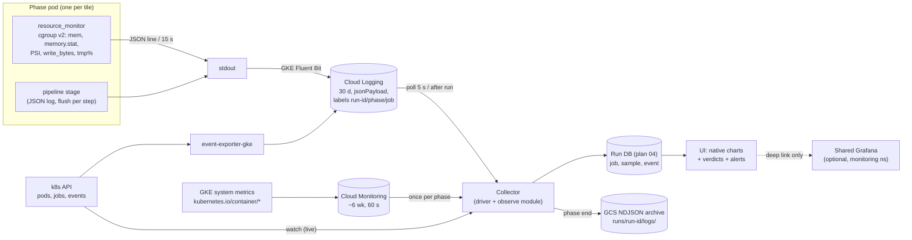

# Plan 02 - Step 2: monitoring Job logs and resources (`kuberjobtower.collect`)

Status: merged plan, 2 Oct 2026; plan only, no code written. Date of verification: 2026-10-02 (run under study: 2026-09-29, run-ids `hnd1`, `hnd2`, `cmp1`-`cmp4`, `boot1`-`boot3`). Sibling plans: 01, 03, 04 (plan 04 owns the run database; this plan only defines record shapes).

All "verified" claims below were obtained with read-only `kubectl get/describe/top`, `kubectl get --raw` (GET against the Prometheus HTTP API through the API-server proxy), `gcloud logging read`, `gcloud container clusters describe`, and `GET` calls to the Cloud Monitoring REST API. Nothing was mutated, no secrets were read.

______________________________________________________________________

## 1. Goals / Non-goals

Goals

1. For every Job/pod of a run, know after the fact (and while running) why it took as long as it did, which resource capped it, and why it died.
2. Surface the failure modes we actually hit: disk-bound ingest (`io_psi`), page-cache "100% memory" that is not memory pressure, compute near the memory ceiling, evictions/OOM kills of 60 GiB pods, autoscaler stalls, silent tools.
3. Survive the Job TTL (`ttlSecondsAfterFinished=1800`): nothing we need may live only in the pod.
4. Stay lightweight: no new always-on infrastructure that we have to run; feed the UI from the run DB (plan 04) with native charts.

Non-goals

- A general cluster monitoring stack, SLO alerting, paging, tracing, multi-tenant dashboards.
- Modifying the shared `monitoring` namespace (Prometheus/Grafana belong to the whole non-prod cluster).
- Cost accounting to the cent (an estimate is enough).

______________________________________________________________________

## 2. Current state (verified, with evidence)

### 2.1 The Grafana the user remembers is NOT in `yaroslav`

`kubectl -n yaroslav get svc,deploy,sts,ingress,cm,pvc` shows only the Maverick app stack (celery-beat, custom-scaler, jdluc-viewer, stac-viewer, nginx-ingress, pgbouncer, rabbitmq, sql-proxy, `celery-config`, GCS-FUSE PVC). No Grafana, Prometheus, Loki, or kube-state-metrics there.

Grafana is a cluster-shared **kube-prometheus-stack** in namespace `monitoring` (age 641d):

| Component                                                                                 | Evidence                                                                                                                                                                                                                                                                                                                                                                                                                  |
| ----------------------------------------------------------------------------------------- | ------------------------------------------------------------------------------------------------------------------------------------------------------------------------------------------------------------------------------------------------------------------------------------------------------------------------------------------------------------------------------------------------------------------------- |
| Grafana 11.1.4 (`prometheus-grafana`, 3/3 containers incl. dashboard/datasource sidecars) | `kubectl -n monitoring get deploy`; image `grafana/grafana:11.1.4`                                                                                                                                                                                                                                                                                                                                                        |
| Service type                                                                              | `ClusterIP` only, port 80. **No Ingress anywhere in `monitoring`** (cluster-wide ingress list has only `<ns>-queue-amqp-ingress` objects). Reachable only by `kubectl port-forward`.                                                                                                                                                                                                                                      |
| Datasources                                                                               | From ConfigMap `prometheus-kube-prometheus-grafana-datasource`: exactly two, `Prometheus` (`http://prometheus-kube-prometheus-prometheus.monitoring:9090`, default, 30s interval) and `Alertmanager`. **No Loki, no Cloud Logging, no Google Cloud Monitoring/GMP datasource.** (Could not enumerate datasources added by hand in the Grafana DB/UI; that would need login or port-forward + credentials, not attempted.) |
| Embedding/auth config                                                                     | `grafana.ini` ConfigMap contains only `[analytics] [grafana_net] [log] [paths] [server]`. No `allow_embedding`, no `[auth.anonymous]`, so Grafana defaults apply: framing denied, login required.                                                                                                                                                                                                                         |
| Prometheus                                                                                | `prometheus-prometheus-kube-prometheus-prometheus-0`; `retention: 10d`; **data volume is an `emptyDir`** (no PVC in `monitoring`), so history is also lost if that pod is rescheduled. `runtimeinfo.startTime` 2026-06-10, `numSeries` ~602k, head min time 2026-10-02 08:00Z.                                                                                                                                            |
| What it scrapes                                                                           | ServiceMonitors selected by label `release=prometheus`: kubelet (incl. `/metrics/cadvisor` with drops: `container_cpu_cfs_throttled_seconds_total`, `container_spec*`, `container_fs_io_*`, ...), kube-state-metrics, node-exporter, apiserver etc.                                                                                                                                                                       |
| kube-state-metrics                                                                        | Present (`prometheus-kube-state-metrics`, **12 restarts**, last 10d ago). Metric families exist: `kube_job_*`, `kube_pod_container_status_last_terminated_reason`, `kube_pod_status_phase`.                                                                                                                                                                                                                               |
| PSI (pressure) in Prometheus                                                              | **Absent.** `count({__name__=~"container_pressure.*"})` returned empty.                                                                                                                                                                                                                                                                                                                                                   |
| Alertmanager                                                                              | Present (kube-prometheus default). No alert rules for our Jobs checked/assumed.                                                                                                                                                                                                                                                                                                                                           |

### 2.2 Other metric plumbing that exists

- **metrics-server** `v1.35.1` in `kube-system`; `kubectl top pods -n yaroslav` and `kubectl top nodes` both work (point-in-time only; they report `working_set`, so page cache looks like usage).
- **Google Managed Prometheus is enabled** on the cluster (`managedPrometheusConfig.enabled: true`; `gmp-system` has a `collector` DaemonSet 3/3 and `gmp-operator`; `PodMonitoring` CRD present, `ClusterPodMonitoring` not served). **No PodMonitoring objects exist** (`kubectl get podmonitorings -A` empty), so GMP is collecting nothing of ours beyond GKE system metrics.
- Cluster `monitoringConfig.componentConfig` enables SYSTEM_COMPONENTS, STORAGE, HPA, POD, DAEMONSET, DEPLOYMENT, STATEFULSET, CADVISOR, KUBELET: i.e. GKE's own "kubernetes.io/container/\*" system metrics go to Cloud Monitoring with no setup. `loggingConfig` enables SYSTEM_COMPONENTS and WORKLOADS: container stdout/stderr go to Cloud Logging with no setup.
- `event-exporter-gke` runs in `kube-system`: Kubernetes Events are exported to Cloud Logging.

### 2.3 What is retained after pods die (this is the key finding)

**Cloud Logging kept everything** (project `maverick-reloaded`, `resource.type="k8s_container"`, `namespace_name="yaroslav"`, `pod_name:"cornerstone-"`, queried 3 days after the run):

- 1,689 entries across 11 pods, 2026-09-29 14:37Z to 20:05Z, including pods long since deleted by TTL. Examples: `cornerstone-ingest-tiles-hnd2-0-c2hvp` 458 lines (17:06-18:21Z), `cornerstone-compute-hnd2-0-m6k2s` 800 lines (18:23-19:29Z), `cornerstone-compare-cmp4-0-m4xd7` 59 lines.
- 583 `resource_sample` lines and the `resource_summary` lines are all there (e.g. ingest-tiles summary: `peak_mem_pct 100.0, peak_io_psi_full_avg10 59.6, total_write_gib 117.61, cpu_throttled_s 190.3`).
- Entry labels carry exactly what we need as filters: `k8s-pod/app=cornerstone`, `k8s-pod/phase`, `k8s-pod/run-id`, `k8s-pod/batch_kubernetes_io/job-name`, `.../job-completion-index`, node name (`compute.googleapis.com/resource_name`). So `labels."k8s-pod/run-id"="hnd2"` is a ready-made per-run, per-phase query.
- Ingestion latency (timestamp to receiveTimestamp) over these entries: median 2.7 s, p95 4.8 s, max 18 s. Good enough for a "live" view.
- Volume: ~2.4 MB of text for the whole day's work. Cost is irrelevant (free tier 50 GiB/project/month).
- `_Default` bucket retention: 30 days (`gcloud logging buckets describe _Default` returned 30). So history is time-bounded: raw logs vanish ~2026-10-29 for this run unless archived.

**Three defects in how the logs land** (all fixable in our code, none need infra):

1. **Everything is `severity=ERROR`.** 1,592 of 1,689 entries are on `logs/stderr` (Python `logging.basicConfig` defaults to stderr) so GKE tags them ERROR, including every INFO `resource_sample`. Severity filters and any "errors" alert are therefore useless today.
2. **Not structured.** All entries are `textPayload` (`2026-09-29 19:29:18,657 - resource_monitor - INFO - {"kind": "resource_sample", ...}`); zero `jsonPayload`. The JSON is embedded in text behind a timestamp/logger prefix, so you must regex it out (feasible and I did, but brittle).
3. **Silent long tool.** `compare-emit-layers` pods have 59 lines total, all emitted at the very end (20:05:27Z). The three earlier attempts (cmp1-cmp3) have **no container logs at all**, consistent with "print at end".

**Kubernetes Events are also retained in Cloud Logging** (`logName:"events"`) and they correct the story of the compare failures:

- `cmp1-0-89jwj` 19:32:24Z `Evicted`: "The node was low on resource: memory ... Container phase was using 59534476Ki, request is 48Gi".
- `cmp3-0-lbmfq` 19:49:06Z `Evicted`: same message (59,533,164Ki used vs 48Gi request).
- Node-level event 19:39:39Z `OOMKilling` "Memory cgroup out of memory: Killed process 5730 (python) ... anon-rss:59428660kB" (a true cgroup OOM, presumably `cmp2`; inferred from timing, not confirmed by name).
- Also retained: 32 `FailedScheduling`, 5 `TriggeredScaleUp` (e.g. power pool `1->2 (max: 200)` at 19:32:38Z) for the cornerstone pods.
- Lesson: "OOMKilled / exit 137" is **two different mechanisms**. A pod whose request (48 GiB) < limit (60 GiB) on a 64 GiB node (allocatable is lower) is a Burstable pod that the **kubelet evicts under node memory pressure** before its own cgroup limit trips. Evicted pods have `status.reason=Evicted` and often no `lastState.terminated.reason=OOMKilled`; the collector must handle both.

**Cloud Monitoring kept the pod metrics too** (REST `timeSeries.list`, `kubernetes.io/container/*`, resource labels `namespace_name=yaroslav`, `pod_name`): `memory/request_bytes` has series for all 14 cornerstone pods of 29 Sep (including the evicted `cmp1-0-89jwj`, `cmp2-0-*`, `cmp3-0-*`). Spot checks:

- compute pod `m6k2s`: `memory/request_bytes` 51,539,607,552 (48 GiB), `memory/limit_bytes` 64,424,509,440 (60 GiB). Prometheus gives the clean per-pod value: `max_over_time(container_memory_working_set_bytes{pod=~"cornerstone-compute-hnd2.*"}[2h])` = 52.7 GiB, matching the 53.46 GiB in our own sampler.
- `memory/used_bytes` has a `memory_type` label (`evictable` vs `non-evictable`). For ingest-tiles the 15-minute max buckets show up to 19.0 GiB evictable and 19.8 GiB non-evictable at different times: the page-cache split is visible in GCM at 60 s resolution (10 points per 10 min verified).
- `cpu/core_usage_time` (cumulative; rate ~1.0-1.3 cores for ingest-tiles, i.e. the 8-core pod was mostly idle), `ephemeral_storage/used_bytes`, `restart_count`, `uptime` all return data.
- **GCM exposes `io/pressure/*` and `memory/pressure/*` descriptors but returned no data** for these pods or any pod in the last 3 h. So the only PSI source for our pods is our own sampler. (Prometheus has no PSI either.)
- Retention: GCM docs say 6 weeks at original resolution for most metric types; I only proved 3 days. The metric-retention doc page did not state the figure for system metrics; treat "~6 weeks" as probable, not proven.

### 2.4 Pipeline's own signals today

`infra/resource_monitor.py` (on `origin/run/civ-cie`) reads the pod's own cgroup v2 files: `memory.current`, `memory.max`, `io.pressure`, `memory.pressure`, `cpu.pressure` (the `full avg10` field), `/proc/self/io write_bytes` (**this process only**, not the pod), and `shutil.disk_usage` of `$TMPDIR` (`/localtmp`). One JSON line per 15 s via `logging` (so stderr) plus a `resource_summary` on clean exit (peaks, `total_write_gib`, `cpu_throttled_s`, and `memory.events` counters). Gaps: no `memory.stat` (anon vs file), no `memory.events` in the periodic samples, no job/run/pod labels inside the JSON (only `label="phase:tile"`; GKE labels on the log entry give the rest), the summary is only written on clean exit (nothing when OOM-killed/evicted: SIGKILL cannot be caught; SIGTERM on eviction/deadline can), and `write_bytes` is per-process (a Dask worker subprocess's writes are not counted unless children are summed or `io.stat` is read).

Calibration data from the 29 Sep run (sampler, 15 s):

| pod               | samples | peak mem_pct | peak io_psi | peak mem_psi | peak cpu_psi |
| ----------------- | ------- | ------------ | ----------- | ------------ | ------------ |
| ingest-world hnd2 | 44      | 21.8         | 53.2        | 0.0          | 0.9          |
| ingest-tiles hnd2 | 275     | 100.0        | 59.6        | 0.75         | 17.6         |
| compute hnd2      | 262     | 89.1         | 4.7         | 0.0          | 1.9          |

For ingest-tiles: 22/275 samples (8%) had `mem_pct>=95`, **0** of them had `mem_psi>5`; only 2/275 samples had `io_psi>30`. The disk-bound signal is spiky, so alerts must key on "fraction of samples over threshold", not a single peak read.

### 2.5 How logs are watched today

`infra/run_aoi.py` prints "Watch: kubectl get jobs,pods -l app=cornerstone -w" and "Logs: kubectl logs -l app=cornerstone --tail=20 -f"; `wait_for_job` polls `kubectl get job -o json` for counts. The Job README itself warns that TTL deletes pods and logs ("pull logs before it fires, or read them from Cloud Logging"). `-l` log tailing replays and caps lines per pod and cannot follow pods that start later.

______________________________________________________________________

## 3. Options

Legend: + good, o ok, - weak. "Ephemeral Jobs" = still useful after the pod is deleted.

| Option                                                                                                              | Setup cost                                                                                                                                                | Per-job granularity                                                             | History/retention                                                   | Signal richness (PSI, anon/file)                                                             | Cost                 | Ops burden                                                                             | Fits our lightweight UI                                 | Ephemeral Jobs                                                                                                      |
| ------------------------------------------------------------------------------------------------------------------- | --------------------------------------------------------------------------------------------------------------------------------------------------------- | ------------------------------------------------------------------------------- | ------------------------------------------------------------------- | -------------------------------------------------------------------------------------------- | -------------------- | -------------------------------------------------------------------------------------- | ------------------------------------------------------- | ------------------------------------------------------------------------------------------------------------------- |
| **A. Grafana + Prometheus/GMP + KSM + Loki/CL datasource**                                                          | M-L: need port-forward/auth, per-run dashboards with variables, add GCM/Cloud Logging datasource (Grafana plugin, SA creds) on shared infra we do not own | o: filter by `run-id` label (exists on pods) but dashboards are cluster-generic | - Prometheus is 10d on emptyDir; GCM ~6w                            | - cAdvisor only: no PSI, throttling metrics dropped, page cache via `container_memory_cache` | + near zero marginal | - shared stack; 12 KSM restarts; every change touches other teams' Grafana             | - iframe needs `allow_embedding` + auth; ClusterIP only | o: pod-name series vanish from KSM when pod is deleted, cAdvisor series stop; history queries still work within 10d |
| **B. Metrics API (`metrics.k8s.io`) polled by our lib**                                                             | S                                                                                                                                                         | + per pod, 15-60 s                                                              | - none, point-in-time; nothing after deletion                       | - working_set only (cache-polluted), no PSI                                                  | + free               | + none                                                                                 | o                                                       | - nothing after TTL unless we poll and store                                                                        |
| **C. Cloud Monitoring + Cloud Logging APIs queried directly**                                                       | S-M: `google-cloud-monitoring`, `google-cloud-logging` (or REST), IAM `roles/monitoring.viewer`, `logging.viewer` for the identity running the tool       | + labels run-id/phase/job/pod                                                   | + 30d logs, ~6w metrics, events too, survives pod deletion (proved) | o system metrics at 60 s with evictable/non-evictable; our JSON lines add PSI                | + free at our volume | + serverless                                                                           | + we pull and store what we need                        | + yes, proven                                                                                                       |
| **D. Our collector parses `resource_sample` lines (k8s stream while running, Cloud Logging after) into the run DB** | S-M (parser is trivial; lines are already JSON)                                                                                                           | + exact per pod/tile, 15 s                                                      | + as long as the DB; source of truth is Cloud Logging for 30d       | + the richest: PSI, tmp disk, write bytes, plus anything we add                              | + free               | + none                                                                                 | + best: native charts from our own store                | + yes (logs outlive pod)                                                                                            |
| **E. Push model: pod pushes metrics (OTel/Pushgateway/GCS write)**                                                  | M-L: new dependency or sidecar, new endpoint to run                                                                                                       | +                                                                               | +                                                                   | +                                                                                            | o                    | - a service or credentials to maintain; **a SIGKILL/evicted pod pushes nothing final** | o                                                       | o; the very failure cases we care about lose the last datapoints                                                    |
| **F. `kubectl top` / events by hand, no storage**                                                                   | S                                                                                                                                                         | o                                                                               | - none                                                              | -                                                                                            | +                    | +                                                                                      | -                                                       | -                                                                                                                   |

Notes behind the table

- kube-state-metrics Job series (`kube_job_status_failed`, `kube_job_complete`, `kube_pod_container_status_last_terminated_reason`) depend on the object existing at scrape time; with TTL=30 min and 30 s scrape they work for live alerts but vanish with the object, and some Job metrics are missing for Jobs without conditions (kubernetes/kube-state-metrics issue #2443). See sources.
- GMP `PodMonitoring` only scrapes a `/metrics` endpoint on our pods, which we do not expose; pointing it at cAdvisor adds nothing over the GKE system metrics we already get for free. Not worth it.
- Label cardinality: Prometheus per-pod series (`pod`, `job_name`) are the textbook cardinality trap; for 51+ tile Jobs x phases x runs it multiplies series on a shared Prometheus that already has 602k. Another reason not to make our run history depend on it.

______________________________________________________________________

## 4. Recommendation (phased)

Decision on Grafana: **do not build on it, do not embed it.** Reasons, all verified above: it is not in `yaroslav` (shared `monitoring` ns, not ours to change); no Ingress and no embed/anonymous config, so an iframe in our UI would 403/X-Frame-Deny and require us to open auth on a shared service; its only datasource is a Prometheus with 10-day, `emptyDir` retention and no PSI; the signals that explained our incidents (PSI, anon/file split) are not in it. Offer an optional "Open in Grafana" deep-link (cluster node/pod dashboards via port-forward) as a debugging convenience, nothing more. If the team later wants Grafana for Cloud data, the lightest correct move is adding the built-in Google Cloud Monitoring datasource to that Grafana (read-only service account), which is a platform-team change, not ours.

Chosen architecture: **C + D**: Cloud Logging is the durable raw store (already happening, free); our driver/UI backend is the collector; the run DB (plan 04) is the query store; native charts in the UI.

Phase 0 - make the logs worth collecting (S, do first; biggest value/effort)

1. Switch phase pods to a JSON stdout log formatter with `severity`, `message`, `time` and fixed fields `run_id, phase, tile, pod` (read from env/Downward API). GKE then parses these into `jsonPayload` and maps `severity`. Retire stderr for INFO.
2. Make `compare-emit-layers` (and any long tool) log + flush incrementally (per layer/per chunk: "layer X done, n/N, elapsed, peak mem"). Cheapest high-value fix: the 60 GiB pod died three times with no trace.
3. Add `memory.stat` (`anon`, `file`, `active_file`, `inactive_file`) and `memory.events` (`high,max,oom,oom_kill`) to each `resource_sample` (see section 8).

Phase 1 - collector + persistence (M) 4. A small `kuberjobtower.collect` module used by `kuberjobtower submit` (and callable standalone for a past run):

- **Lifecycle watcher**: Kubernetes watch (python `kubernetes` client or `kubectl get pods,jobs -l run-id=X -o json -w`) records pod phase transitions, node, `lastState.terminated` (`reason`, `exitCode`), `status.reason` (catch `Evicted`), restarts, start/finish. Write immediately; this is what raw polling in `JobStatus.get` lacks.
- **Events fetcher**: `kubectl get events --field-selector involvedObject.kind=Pod` live, Cloud Logging `logName:"events"` after (retained, proved). Capture `Evicted, OOMKilling, FailedScheduling, TriggeredScaleUp, BackOff`.
- **Log/metric ingester**: query Cloud Logging by `labels."k8s-pod/run-id"` and parse `resource_sample`/`resource_summary` into samples; at phase end pull Cloud Monitoring `memory/request_bytes`, `memory/limit_bytes`, `memory/used_bytes` (by `memory_type`), `cpu/core_usage_time` for the job window and store the aggregates (cheap, once per phase, not a time series copy).

5. At run completion (or each phase end) the driver archives each pod's raw log entries as NDJSON to `gs://<run-bucket>/runs/<run-id>/logs/<phase>/<pod>.ndjson` (S-M). This makes a run self-contained beyond the 30-day log bucket and is the offline fallback if Cloud Logging query access is missing. Keep TTL at 1800: completed pods keep their per-pod pd-ssd (`ephemeral` PVC) until deleted (inference from generic ephemeral volume semantics, not tested), so a longer TTL costs disk money for no benefit once logs are in Cloud Logging.

Phase 2 - UI (M) 6. Native charts (uPlot or Chart.js) from the DB: per-pod timeline of RAM (anon vs file stacked), io/mem/cpu PSI, tmp-disk %; per-phase table of the job record; verdict chips (section 7). Live view = poll the collector (below) and append.

Phase 3 - defer 7. Grafana deep-link; Cloud Logging log-based metrics + alert policies (only if we need unattended paging); Prometheus PodMonitoring/OTel (not needed). Revisit if runs become unattended or multi-user.

______________________________________________________________________

## 5. Log persistence and live tail design

Persistence (belt and braces)

- Primary: Cloud Logging `_Default`, 30 d. Nothing to build; fixed by Phase 0 for structure.
- Secondary: GCS NDJSON archive per pod at phase end (Phase 1, step 5), plus the extracted samples/summaries in the DB (kept indefinitely, tiny).
- Do not rely on `kubectl logs` after the fact (TTL). Do not extend TTL.
- A **failed pod's log is copied to the archive as soon as the pod is first seen failed** (idea from the PyPI `kubejobs`, doc 01 section 5.15): the case where the log matters most is also the case where the 30-minute TTL is about to remove it, and an eviction or OOM can end a pod before anyone is looking.

Live tail

- **While the Job exists**: lifecycle via Kubernetes watch (low latency, authoritative for pending/running/terminated). Log lines via Cloud Logging polling `entries.list` every 5 s with `timestamp > last_seen` filter plus `insertId` dedup, filtered to `run-id`. Single mechanism for live and historical, no replay, picks up pods that start later, includes already-deleted pods, observed lag median 2.7 s / p95 4.8 s. This avoids both `kubectl logs -l` (replay, per-pod caps, misses new pods) and per-pod `logs -f` management.
- Optional fast path: per-pod `kubectl logs -f --timestamps --since-time=<last>` only for the focused pod in the UI (sub-second). Not needed for v1.
- Cloud Logging's streaming `entries.tail` exists but has stream/quotas and ordering caveats; polling is simpler and sufficient. Verify the quota if we ever want it.
- Needed permission for whoever runs the collector: `logging.logEntries.list`, `monitoring.timeSeries.list` (the user's gcloud identity already worked for all my queries). If the UI backend runs in-cluster it needs a Workload Identity KSA with `roles/logging.viewer` and `roles/monitoring.viewer`: ask platform owners, do not change IAM from here.



______________________________________________________________________

## 6. Metric catalogue and record shapes

Source key: K = k8s API/watch, E = events, L = our log lines (Cloud Logging), M = Cloud Monitoring, P = derived.

| Metric                                                                                                                 | Source                                            | Resolution  | Why                                                              |
| ---------------------------------------------------------------------------------------------------------------------- | ------------------------------------------------- | ----------- | ---------------------------------------------------------------- |
| start, end, duration, scheduled_at, pending_s                                                                          | K                                                 | event       | queue time vs run time; autoscale stalls                         |
| exit_code, termination_reason (`OOMKilled`, `Error`, `Completed`, `DeadlineExceeded`), pod `status.reason` (`Evicted`) | K, E                                              | event       | distinguish cgroup OOM vs node eviction (both "137")             |
| restarts, attempt index (`backoffLimitPerIndex`)                                                                       | K                                                 | event       | retries per tile                                                 |
| node, pool, machine type                                                                                               | K (node labels)                                   | event       | cost + failure correlation                                       |
| mem request/limit, cpu request/limit, ephemeral/localtmp size                                                          | K, M                                              | static      | sizing review (request 48Gi < limit 60Gi was the eviction cause) |
| mem total (`memory.current`), anon, file (active/inactive)                                                             | L (new), M (`memory_type`)                        | 15 s / 60 s | real memory vs cache                                             |
| peak/avg RAM, peak anon                                                                                                | P from samples                                    | per pod     | headline                                                         |
| avg CPU cores, cpu throttled s                                                                                         | M `cpu/core_usage_time` rate, L `cpu_throttled_s` | 60 s        | idle-core waste (ingest used ~1 of 8 cores)                      |
| io_psi, mem_psi, cpu_psi full avg10                                                                                    | L                                                 | 15 s        | the disk-bound / mem-bound / cpu-bound discriminator             |
| write_bytes (per process today; pod-wide after fix), total_write_gib                                                   | L                                                 | 15 s        | disk throttle risk                                               |
| localtmp_used_pct, ephemeral used                                                                                      | L, M                                              | 15 s        | `/localtmp` fill                                                 |
| `memory.events` high/max/oom/oom_kill                                                                                  | L (new)                                           | 15 s        | positive proof of cgroup pressure                                |
| log line counts, last-log-age                                                                                          | L                                                 | per phase   | "silent pod" detector                                            |
| cost estimate                                                                                                          | P                                                 | per pod     | below                                                            |

Cost estimate (derived, state the uncertainty in the UI): `node_hours x on-demand $/h`. Third-party aggregators list on-demand us-central1: e2-standard-8 about **$0.268/h** ($195.67/month), e2-highmem-8 about **$0.3616/h** ($263.97/month) (economize.cloud, found 2026-10-02; Google's own page is the authority and prices change). Allocation rule: pod cost = pod duration x machine $/h x (pod request share of node), or the whole node when it was the only pod (which is our case, one pod per node on highmem). Add per-pod pd-ssd (`localtmp`) as GiB x duration x pd-ssd rate (not looked up, mark as a TODO). Spot/CUD discounts and node scale-down lag (10-15 min idle, per README) are not modeled; show as "approx, on-demand list price".

Record shapes (plan 04 maps these to tables; field names are proposals)

```
JobRecord {                     # one per (run_id, phase, tile_index, attempt)
  run_id, phase, job_name, tile_index, tile_id, pod_name, attempt
  node, node_pool, machine_type
  requests{cpu,mem_bytes,ephemeral_bytes}, limits{cpu,mem_bytes,ephemeral_bytes}, localtmp_bytes
  created_at, scheduled_at, started_at, finished_at, duration_s, pending_s
  state: Pending|Running|Succeeded|Failed|Evicted|Unknown
  exit_code, termination_reason, pod_status_reason, restarts
  peak: {mem_bytes, anon_bytes, mem_psi, io_psi, cpu_psi, localtmp_pct}
  avg:  {cpu_cores, mem_bytes}
  write_gib, cpu_throttled_s, mem_events{high,max,oom,oom_kill}
  verdict: {code, severity, reason}       # derived, section 7
  cost_usd_est, cost_basis
  log_archive_uri, log_line_count, last_log_at
}
SampleRecord { run_id, phase, pod_name, ts, mem_current, mem_anon, mem_file, mem_pct,
               io_psi, mem_psi, cpu_psi, write_bytes, localtmp_used_pct }   # from resource_sample
EventRecord  { run_id, pod_name, ts, reason, message, source: k8s|cloud_logging }
```

Retention in DB: samples at 15 s for ~1.2 h/pod x N tiles is small (275 samples for 75 min); keep all, downsample only if the DB gets heavy.

### Why "100% memory" must not be a red bar (page-cache lesson)

cgroup `memory.current` (and cAdvisor `working_set`, and `kubectl top`) include file-backed page cache, which the kernel reclaims under pressure. ingest-tiles wrote 117 GiB through a 24 GiB limit: `mem_pct` pinned at 100 for 8% of samples yet `mem_psi` peaked at 0.75 and the pod never OOMed, while `io_psi` hit 59.6 (the real bottleneck was the disk write path). The UI therefore must:

1. Show memory as a **stacked bar anon (real) + file (cache)** against the limit, with only the anon part drawn in the warning color.
2. Compute the verdict from PSI and `memory.events`, never from `mem_pct` alone.
3. Label the headline "peak RAM (anon)" and show "peak incl. cache" as a secondary number. Until the `memory.stat` change ships, approximate with the rule below (and GCM `memory_type=non-evictable`; note even `working_set` includes active file pages: Prometheus showed ingest-tiles peak `container_memory_working_set_bytes` 22.3 GiB next to peak `container_memory_cache` 21.5 GiB for the window ending 18:25Z, so treat both as upper bounds; only `memory.stat` anon is clean).

______________________________________________________________________

**Multi-tile pods (doc 06).** If a pod processes several tiles, as 1° work tiles would require, the `tile` field of every log line and sample must change as the pod moves through its list, and the pod emits `tile_start` and `tile_done` events with durations. The collector then attributes samples to tiles by time window and keeps per-tile medians, which the Run builder uses to choose tiles per pod. Nothing changes while a pod has one tile.

## 7. Derived alerts / verdicts

Evaluated by the collector over a rolling window of samples (initial thresholds from the 29 Sep calibration; make them constants in one place, tune after the next run).

| Verdict                    | Rule                                                                                                          | Severity       | Meaning / action                                                                                                                                            |
| -------------------------- | ------------------------------------------------------------------------------------------------------------- | -------------- | ----------------------------------------------------------------------------------------------------------------------------------------------------------- |
| `cache_only_memory` (info) | `mem_pct>=90` for >=3 samples AND `mem_psi_full_avg10<2` AND `memory.events.oom==0`                           | info (grey)    | Page cache, not pressure. Ingest-tiles case. Do nothing.                                                                                                    |
| `memory_pressure`          | `anon/limit>=0.90` OR (`mem_pct>=90` AND `mem_psi>=5` for >=2 samples) OR `memory.events.max/high` increasing | warn then crit | Real pressure. Compute at 53 of 60 GiB with Dask pausing at 80% is this class, watch before it dies.                                                        |
| `node_eviction_risk`       | `limit_bytes > node allocatable` OR `request << limit` AND `usage > request` on a pod sharing a node          | warn           | The compare evictions: usage 59.5 GiB vs request 48 GiB on a 64 GiB node. Static check at submit time too.                                                  |
| `disk_bound`               | `io_psi_full_avg10>=20` in >=10% of samples (or `>=30` in any 2 consecutive) AND `cpu_psi<10`                 | warn           | The ingest incident (peak 59.6; ingest-world 53.2 too). Move scratch/lower concurrency. A spike of 1 sample is not enough (only 2/275 samples exceeded 30). |
| `tmp_disk_filling`         | `localtmp_used_pct>=80` or slope projects 100% before deadline                                                | warn/crit      | `/localtmp` size.                                                                                                                                           |
| `cpu_starved`              | `cpu_psi>=20` sustained or `cpu_throttled_s` growing                                                          | warn           | Limit too low.                                                                                                                                              |
| `idle_cores`               | avg cores used < 25% of limit over >10 min and not `disk_bound`                                               | info           | Waste (ingest used ~1/8 cores because disk-bound).                                                                                                          |
| `pending_stall`            | pod `Pending` > 10 min with `FailedScheduling` or no `TriggeredScaleUp`                                       | warn           | Autoscaler stall / quota / taint (we saw 32 FailedScheduling, scale-up completed in ~1-2 min).                                                              |
| `oom_killed`               | `terminated.reason=OOMKilled` OR node `OOMKilling` event naming the pod                                       | crit           | cgroup OOM.                                                                                                                                                 |
| `evicted`                  | `status.reason=Evicted`                                                                                       | crit           | Kubelet eviction, usually memory; read the event message (usage vs request).                                                                                |
| `silent_pod`               | Running > 5 min and no log line in > 5 min (tool prints only at end)                                          | warn           | The `compare-emit-layers` blind spot; still useful after the Phase 0 fix for any tool that goes quiet.                                                      |
| `deadline_risk`            | elapsed > 80% of `activeDeadlineSeconds`                                                                      | warn           | Tile may be killed by `POD_DEADLINE_SECONDS`.                                                                                                               |
| `retry_burned`             | `backoffLimitPerIndex` exhausted                                                                              | crit           | Poisoned tile.                                                                                                                                              |

Delivery: UI chips and a run-level banner in v1. No Alertmanager integration in v1 (Alertmanager exists in `monitoring` but is cluster-owned).

______________________________________________________________________

## 8. Small changes to `infra/resource_monitor.py` (plan items, not code)

1. Emit via a stdout JSON formatter (shared with the rest of the pod) including `severity`, `run_id`, `phase`, `tile`, `pod` (Downward API env `POD_NAME`, `RUN_ID`, `PHASE`) so `jsonPayload` is directly queryable without regexing text and without relying on log-entry labels.
2. Add `memory.stat` fields `anon`, `file`, `active_file`, `inactive_file`, `shmem` and a computed `mem_anon_pct`; add `memory.events` counters (`high,max,oom,oom_kill`) to every sample, not only the summary.
3. Install a SIGTERM handler (eviction, deadline exceeded, node drain send SIGTERM first) that flushes one last `resource_sample` plus a `resource_summary` with `termination_hint="sigterm"`. SIGKILL (cgroup OOM) cannot be caught; that case is covered by the last periodic sample (\<=15 s old) plus the Kubernetes/Events record.
4. Make `write_bytes` pod-wide: read cgroup `io.stat` (`wbytes` summed over devices), or sum `/proc/<pid>/io` over the process tree; `/proc/self/io` misses Dask worker subprocesses.
5. Add `cpu.stat` `usage_usec` and `nr_throttled`/`throttled_usec` to samples, so avg CPU and throttling are available from our own series at 15 s (GCM gives 60 s).
6. Lower the interval to 5 s for the first 2 minutes and when `mem_pct>=85` or `io_psi>=20` (adaptive; the near-death sample is what we lack). Low priority.
7. Include `limit_bytes` (from `memory.max`) and `request` (env) in each sample, so a sample is self-describing.
8. Write `resource_summary` also when the process exits via exception (already via `finally`; verify the `Evicted`/SIGTERM path).

Cheapest log fix repeated for emphasis: any tool that runs longer than ~1 minute must log progress and flush (`print(..., flush=True)` or logging handler with immediate flush; the JSON-to-stdout handler fixes buffering for logging users). `compare-emit-layers` is the offender: 59 lines in 10 minutes, all at the end, three runs lost.

______________________________________________________________________

## 9. Implementation steps and effort

| #   | Step                                                                                                                                                                                          | Effort | Depends on                          |
| --- | --------------------------------------------------------------------------------------------------------------------------------------------------------------------------------------------- | ------ | ----------------------------------- |
| 1   | JSON stdout log formatter + fixed fields in `run_phase.py` / `resource_monitor.py`                                                                                                            | S      | none                                |
| 2   | Incremental progress logs + flush in `compare-emit-layers` and other long tools                                                                                                               | S      | none                                |
| 3   | `memory.stat`, `memory.events`, `cpu.stat`, pod-wide write bytes, SIGTERM flush (section 8)                                                                                                   | S-M    | 1                                   |
| 4   | Verdict function (pure, unit-tested against the real 29 Sep sample JSON as fixtures: ingest => `cache_only_memory`+`disk_bound`, compute => `memory_pressure` near end, compare => `evicted`) | S      | none                                |
| 5   | `kuberjobtower.collect` module: k8s watch, events, Cloud Logging reader (parse text and JSON forms), GCM reader                                                                               | M      | 1 (can start against old text logs) |
| 6   | DB writers per record shape                                                                                                                                                                   | S      | plan 04 schema                      |
| 7   | GCS NDJSON archive at phase end                                                                                                                                                               | S-M    | 5                                   |
| 8   | UI charts + verdict chips + run banner                                                                                                                                                        | M      | 5, 6                                |
| 9   | Cost estimate per pod (price table constants, dated)                                                                                                                                          | S      | 5                                   |
| 10  | Deep-link to Grafana (optional)                                                                                                                                                               | S      | none                                |
| 11  | Log-based metrics / alert policies (deferred)                                                                                                                                                 | M      | only if unattended runs             |

Backfill: steps 4-5 can be developed and tested immediately against run `hnd2`/`cmp1-4` (data retained until ~2026-10-29 in Cloud Logging).

______________________________________________________________________

## 10. Risks

- **Cloud Logging 30-day retention and query permission**: the collector breaks if the running identity lacks `logging.viewer`/`monitoring.viewer`; mitigated by the GCS archive and by running with the user's gcloud identity first.
- **Parse brittleness**: current lines are text with a prefix. Keep the regex fallback until Phase 0 ships, then switch to `jsonPayload`; version the `kind` field.
- **GCM system metrics resolution is 60 s and PSI is not there**; do not promise PSI from GCM. Our sampler is the PSI source of truth, which dies with the pod only for the final \<=15 s.
- **Evicted vs OOMKilled** semantics: the collector must treat `Evicted` as first class; otherwise reports repeat the "OOMKilled x3" misdiagnosis.
- **Shared Prometheus/Grafana reliability**: KSM restarted 12 times, Prometheus is on emptyDir. Another reason not to depend on it.
- **PSI availability**: cgroup v2 PSI worked on these GKE nodes (samples have values); node image upgrades could change this; the sampler omits unreadable keys by design.
- **Thresholds are calibrated on one tile of one country (HND)**; expect retuning for large tiles.
- **Cost numbers are third-party list prices, on-demand, undated, excluding discounts.**
- **Clock/ordering**: Cloud Logging entries can arrive out of order (max latency 18 s observed); poll with an overlap window and dedupe on `insertId`.

______________________________________________________________________

## 11. Decisions and remaining questions

**Decided by the user, 2 Oct 2026:**

| Question                                      | Decision                                                                                                                                                                                                                                                                                                                                                                            |
| --------------------------------------------- | ----------------------------------------------------------------------------------------------------------------------------------------------------------------------------------------------------------------------------------------------------------------------------------------------------------------------------------------------------------------------------------- |
| Who runs the collector in v1?                 | **The user's laptop**, with their gcloud user credentials. Later, a Cloud Run service whose own service account is granted `roles/logging.viewer` and `roles/monitoring.viewer` (see doc 05); this is one more reason the design reads Cloud Logging and Cloud Monitoring and does not depend on the shared Prometheus, which a Cloud Run service could not reach without a tunnel. |
| Touch `run_phase.py` / `resource_monitor.py`? | **Yes**: JSON-to-stdout logging with severity and fixed `run_id` / `phase` / `tile` / `pod` fields, incremental flushes, `memory.stat` and `memory.events` in each sample, CPU usage, pod-wide write bytes.                                                                                                                                                                         |
| Package                                       | **`kuberjobtower`**; the collector is `kuberjobtower.collect`, reading through the cluster layer (doc 01) and writing through `kuberjobtower.history` (doc 04).                                                                                                                                                                                                                     |
| Resource sizing                               | **Approved**: request equal to limit (doc 01 section 6). The `node_eviction_risk` verdict below checks it at submit time as well.                                                                                                                                                                                                                                                   |

**Defaults applied unless the user objects:**

1. **Grafana:** not the primary surface and not embedded (shared `monitoring` namespace, no ingress, no PSI, 10-day `emptyDir` retention). An optional "Open in Grafana" deep link is a later convenience.
2. **TTL:** keep 1800 s. Cloud Logging holds the logs and events, and the collector copies each pod's exit status before it is deleted. Archive each run's raw log entries to GCS as NDJSON under `<history root>/<run_uid>/logs/`.
3. **Retention:** Cloud Logging's 30 days plus the GCS archive; no infra change.
4. **Alerts:** UI chips and a run-level banner in v1. No Slack or email until runs become unattended.
5. **Cost figures:** list-price estimates, labelled approximate.
6. **Platform requests** (a Workload Identity binding with `logging.viewer` / `monitoring.viewer` for a hosted backend): defer until the Cloud Run step.
7. **Time-sensitive and optional:** Cloud Logging keeps the 29 Sept run's raw logs only until about 29 Oct, and the shared Prometheus its series only until about 9 Oct (Cloud Monitoring keeps them longer). The run is the evidence behind the PR #6 write-up and the sizing numbers; archive it to GCS if you want a permanent copy.

______________________________________________________________________

## 12. Sources

- Cloud Logging structured logging (stdout JSON becomes `jsonPayload`): https://docs.cloud.google.com/logging/docs/structured-logging (severity-field mapping per secondary articles: https://medium.com/google-cloud/structured-logging-in-google-cloud-61ee08898888)
- Log buckets and `_Default` retention 30 d: https://docs.cloud.google.com/logging/docs/buckets (confirmed on this project via `gcloud logging buckets describe _Default`)
- Cloud Logging pricing ($0.50/GiB after 50 GiB free; $0.01/GiB-month beyond 30 d): https://cloud.google.com/products/observability/pricing
- Cloud Monitoring retention and latency (6 weeks at original resolution; extended retention for custom/Prometheus metrics): https://docs.cloud.google.com/monitoring/api/v3/latency-n-retention and https://cloud.google.com/blog/products/management-tools/extended-retention-times-for-custom-cloud-monitoring-metrics
- kube-state-metrics Job metrics gaps: https://github.com/kubernetes/kube-state-metrics/issues/2443 and https://github.com/kubernetes/kube-state-metrics/issues/1638; failure reason via `kube_pod_container_status_last_terminated_reason`.
- OOMKilled "metrics lie" background (cache vs real memory): https://medium.com/@rameshavutu/why-your-kubernetes-pod-gets-oomkilled-even-when-memory-looks-fine-e2b17e2ec4cd
- E2 on-demand prices us-central1: https://www.economize.cloud/resources/gcp/pricing/compute-engine/e2-standard-8/ and https://www.economize.cloud/resources/gcp/pricing/compute-engine/e2-highmem-8/ (third party; verify against Google's pricing page).
- Local evidence files: `infra/resource_monitor.py`, `infra/k8s/phase-job.yaml`, `infra/run_aoi.py`, `infra/k8s/README.md` on `origin/run/civ-cie`.

______________________________________________________________________

## Appendix A. Best practices for observing Kubernetes batch Jobs (sourced)

Sources fetched: [kube-state-metrics Job metrics](https://github.com/kubernetes/kube-state-metrics/blob/main/docs/metrics/workload/job-metrics.md), [Kubernetes logging architecture](https://kubernetes.io/docs/concepts/cluster-administration/logging/), [Prometheus naming and label guidance](https://prometheus.io/docs/practices/naming/), [Kubernetes Job docs](https://kubernetes.io/docs/concepts/workloads/controllers/job/), [Google Cloud Observability pricing](https://cloud.google.com/products/observability/pricing) (numbers via search snippet: $0.50 per GiB ingested, first 50 GiB per project per month free, $0.01 per GiB per month beyond 30 d retention; I could not extract the numbers from the page body, so treat them as ASSUMED until checked on the pricing page), and a search on cgroup v2 `memory.peak` (introduced in kernel 5.19; it counts page cache, as the kernel mailing-list results note).

| Practice                                                                                                                                                                                                                                              | Applies to us as                                                                                                                                                                                                                                                                                                                                                                                           |
| ----------------------------------------------------------------------------------------------------------------------------------------------------------------------------------------------------------------------------------------------------- | ---------------------------------------------------------------------------------------------------------------------------------------------------------------------------------------------------------------------------------------------------------------------------------------------------------------------------------------------------------------------------------------------------------- |
| **Label for correlation** with bounded values: `run-id`, `phase`, `tile-id`, `owner`. Prometheus guidance warns every label combination is a new series and unbounded values (user IDs, emails) explode storage.                                      | Labels `run-id` and `phase` already exist on pods and Job; add `owner` and keep `tile-id` as a **pod label only for logs/UI joins, not a metric label we create**. We do not emit custom Prometheus series, so cardinality is bounded by pod count: roughly 100 cAdvisor/ksm series per pod (ASSUMED), so a 200-pod run adds ~20 k series to the existing ~602 k. Acceptable; a 10 k-pod run would not be. |
| **kube-state-metrics job metrics** are STABLE (`kube_job_status_active/succeeded/failed`, `..._start_time`, `..._completion_time`, `kube_job_complete/failed`). `*_labels` need an allowlist.                                                         | Use the stable ones for Job state (verified present). Do not depend on `*_labels` here.                                                                                                                                                                                                                                                                                                                    |
| **Staleness after pod deletion.** A series stops at the last scrape; instant queries stop returning it after the 5 m lookback. A pod shorter than the scrape interval is invisible.                                                                   | Verified: 6 of the 17 pods in the run have no cAdvisor series. Range queries need absolute start/end; the UI must remember pod start/end times in the history store, not ask Prometheus "what ran".                                                                                                                                                                                                        |
| **Retention mismatch.** `ttlSecondsAfterFinished: 1800` deletes Job and Pods, and with them `kubectl logs` and kube-state-metrics' terminal state (Kubernetes keeps logs only on the node, latest rotated file, 10 Mi default; they go with the pod). | In this run the Jobs were deleted within minutes, so kube-state-metrics held `terminated_reason` for only 1-5 samples. **Persist outcome at job end** (summary + pod status) rather than reconstructing later. Cloud Logging (30 d) is the log backstop.                                                                                                                                                   |
| **Structured logging**: one JSON object per line with a stable schema, `severity` in the payload, correlation IDs.                                                                                                                                    | Today lines are `asctime - logger - level - {json}` on **stderr**, so GKE tags all as `ERROR` and `jsonPayload` is not parsed. Fix in section 7.                                                                                                                                                                                                                                                           |
| **OOM and eviction detection**: combine `terminated_reason`, exit code 137, and working-set vs limit; check `kube_pod_status_reason="Evicted"` for evictions.                                                                                         | Verified that no single signal catches all three OOMs.                                                                                                                                                                                                                                                                                                                                                     |
| **Right-size requests/limits from observed peaks**: use peak working set per phase (not `memory.current`, which includes reclaimable page cache; ingest showed `mem_pct=100` while the cAdvisor working set peaked at 22.3 of 24 GiB).                | Compute peak 52.7 of 60 GiB (88 %), compare >= 56 of 60 and OOM-killed: the compare limit is too low or the job needs fixing. The UI should show "peak % of limit" per phase and flag >= 90 %.                                                                                                                                                                                                             |
| **Cost of Cloud Logging ingestion.** Pay per GiB ingested; free 50 GiB/project/month; no charge for queries.                                                                                                                                          | A `resource_sample` line is ~350 B at 15 s (about 300 lines, ~100 KB, per 75-minute pod). Even 1000 pods per run is ~100 MB for samples. Real cost driver is chatty third-party logs (GDAL, dask), not our telemetry. Not measured.                                                                                                                                                                        |

______________________________________________________________________

## Appendix B. Optional path: Prometheus queries validated against the 29 Sept run

Prometheus is **not** part of the v1 design (10-day `emptyDir` retention, no PSI, shared infrastructure owned by others, unreachable from a Cloud Run service). These queries were nevertheless run against real data through the API-server service proxy and are kept for debugging and for anyone who wants live cAdvisor charts on a developer machine.

Run window in Prometheus: pods created 29 Sept 16:46 to 19:51 UTC (`ingest-world-hnd2`, `ingest-tiles-hnd2` on `20N_090W`, `compute-hnd2`, `compare-cmp1..4`). History actually available: first samples ~22 Sept 10:00 UTC (10 d window), so **this run expires from Prometheus around 9 Oct**. All queries ran as `kubectl get --raw "/api/v1/namespaces/monitoring/services/prometheus-kube-prometheus-prometheus:9090/proxy/api/v1/{query|query_range}?..."`. Pods were already gone, so instant queries need `last_over_time(...[10d])` or an explicit `time=`; a plain instant query returns nothing for a deleted pod (staleness, section 5).

### 3.1 Worked (exact queries)

| Need                                                 | PromQL                                                                                                                                                                                                                                              | Result on real data                                                                                                                                                                                                             |
| ---------------------------------------------------- | --------------------------------------------------------------------------------------------------------------------------------------------------------------------------------------------------------------------------------------------------- | ------------------------------------------------------------------------------------------------------------------------------------------------------------------------------------------------------------------------------- |
| Memory working set per pod (the OOM-relevant number) | `max by (pod) (container_memory_working_set_bytes{namespace="yaroslav",pod=~"cornerstone-.*",container="phase"}) / 2^30`                                                                                                                            | compute 52.74 GiB peak (matches the 53 GiB observed), ingest-tiles 22.27, ingest-world 3.26, compare cmp1/cmp3 56.78, cmp2 55.95. 11 series.                                                                                    |
| Peak / mean over the pod lifetime                    | `max_over_time(container_memory_working_set_bytes{pod="<pod>",container="phase"}[2h]) / 2^30` and `avg_over_time(...)`                                                                                                                              | compute peak 52.74 GiB, mean 6.51 GiB (spiky: a 30 s scrape can still miss the true peak; see section 7).                                                                                                                       |
| CPU cores used                                       | `sum by (pod) (rate(container_cpu_usage_seconds_total{namespace="yaroslav",pod=~"cornerstone-.*",container="phase"}[2m]))`                                                                                                                          | compute peak 7.57 cores of 8, ingest-tiles 3.75 of 4, compare cmp4 4.8.                                                                                                                                                         |
| Total CPU seconds                                    | `max_over_time(container_cpu_usage_seconds_total{pod="<pod>",container="phase"}[2h])`                                                                                                                                                               | compute 15 388.7 core-seconds.                                                                                                                                                                                                  |
| CPU throttling ratio                                 | `sum by (pod) (rate(container_cpu_cfs_throttled_periods_total{...}[2m])) / sum by (pod) (rate(container_cpu_cfs_periods_total{...}[2m]))`                                                                                                           | ingest-tiles peaked at 0.53 (53 % of periods throttled), compute 0.036, compare 0. Agrees with the in-pod `cpu_throttled_s=190.3` for ingest-tiles. Use periods; the `_seconds_total` variant is dropped by the ServiceMonitor. |
| Pod phase timeline / scheduling latency              | `kube_pod_status_phase{namespace="yaroslav",pod=~"cornerstone-compute.*"} == 1`                                                                                                                                                                     | Pending 18:23-18:24, Running 18:25-19:29, Succeeded 19:30. Pending duration = scale-up + image pull latency.                                                                                                                    |
| Unschedulable (waiting for a node)                   | `kube_pod_status_unschedulable{namespace="yaroslav"} == 1`                                                                                                                                                                                          | 6 pods, 1-3 samples each = autoscaler triggered.                                                                                                                                                                                |
| Terminal reason                                      | `kube_pod_container_status_terminated_reason{namespace="yaroslav",pod=~"cornerstone-.*"} == 1`                                                                                                                                                      | `Completed` for ingest/compute/cmp4; `OOMKilled` for `compare-cmp2-0-6jhmn`; `Error` for cmp1, cmp3 and the failed hnd1/boot pods.                                                                                              |
| Container limits (for the "% of limit")              | `last_over_time(kube_pod_container_resource_limits{namespace="yaroslav",container="phase",resource="memory"}[10d])`                                                                                                                                 | 60 GiB compute/compare, 24 GiB ingest; cpu 8 / 4; ephemeral-storage 8 GiB.                                                                                                                                                      |
| Job to pod and pod to node                           | `kube_pod_info{namespace="yaroslav"}` labels `created_by_name` (= Job name) and `node`                                                                                                                                                              | e.g. `created_by_name="cornerstone-compare-cmp1"`, `node="gke-...-yaroslav-power-n-...-dqmp"`.                                                                                                                                  |
| Job state                                            | `kube_job_status_active`, `kube_job_complete{condition="true"}`, `kube_job_failed{condition="true"}`, `kube_job_status_failed`, `kube_job_status_start_time`, `kube_job_spec_completions` (all `{namespace="yaroslav",job_name=~"cornerstone-.*"}`) | All present. Job series are short: the Jobs were deleted minutes after finishing, so each has only 1-15 samples (use a 30 s step; a 5 m step misses `kube_job_complete`).                                                       |
| Node-pool scale events (derived)                     | `count by (pool) (label_replace(kube_node_info{node=~".*yaroslav.*"}, "pool", "$1", "node", "gke-nonprod-shared-c-(yaroslav-[a-z]+)-.*"))` and `kube_node_created{node=~".*yaroslav.*"}`                                                            | Two pools, power pool went 1 to 3 nodes at ~19:40, worker pool 1 node 16:50-18:35. Pool must be parsed from the node name because `kube_node_labels` does not exist.                                                            |
| Inventory of pods in run                             | `last_over_time(kube_pod_created{namespace="yaroslav",pod=~"cornerstone-.*"}[10d])`                                                                                                                                                                 | 17 pod series, with creation epoch.                                                                                                                                                                                             |

### 3.2 Did not work (and why)

| Query                                                              | Result                                        | Why / replacement                                                                                                                                                                                                                                                                                                                                                                                                                                                     |
| ------------------------------------------------------------------ | --------------------------------------------- | --------------------------------------------------------------------------------------------------------------------------------------------------------------------------------------------------------------------------------------------------------------------------------------------------------------------------------------------------------------------------------------------------------------------------------------------------------------------- |
| `kube_pod_labels{namespace="yaroslav"}` (to get `run-id`, `phase`) | empty; metric not in `label/__name__/values`  | kube-state-metrics has no `--metric-labels-allowlist` (and Prometheus never stored it). **Derive run/phase from the Job name** `cornerstone-<phase>-<run-id>` (via `kube_pod_info.created_by_name`) with `label_replace`. Phase names contain hyphens (`ingest-tiles`), so match against the known phase list. Alternatively ask the owners to add `--metric-labels-allowlist=pods=[run-id,phase,tile-id],jobs=[run-id,phase]` (shared infra, needs their agreement). |
| `container_oom_events_total`                                       | 0 for all pods, including the OOM-killed ones | cAdvisor counter did not fire for these kills (VERIFIED), probably because the kernel killed a dask worker child while the container's main process then exited non-zero (mechanism ASSUMED). Do not use it as the only OOM signal.                                                                                                                                                                                                                                   |
| `kube_pod_container_status_last_terminated_reason`                 | empty                                         | Only populated after a container **restart**; our pods use `restartPolicy: Never`, retries are new pods. Use `..._terminated_reason` (above).                                                                                                                                                                                                                                                                                                                         |
| `kube_pod_container_status_terminated_exitcode`                    | metric does not exist in v2.13.0              | Only `..._last_terminated_exitcode` exists (and was empty). The exit code (137) must be read from the pod object (`status.containerStatuses[].state.terminated.exitCode`) before the pod is deleted.                                                                                                                                                                                                                                                                  |
| `container_pressure_*` / any PSI                                   | absent                                        | cAdvisor is not scraped with PSI. This is exactly why `resource_monitor` is worth keeping (section 6, option E).                                                                                                                                                                                                                                                                                                                                                      |
| Pods `ingest-world-hnd1`, `bootstrap-boot1/2` in the memory query  | no series                                     | They lived under 30 s (`duration_s: 0.4` in the summary) so no scrape ever hit them. Per-pod metrics cannot see sub-scrape pods.                                                                                                                                                                                                                                                                                                                                      |
| `kube_job_labels`, `kube_node_labels`                              | absent                                        | Same allowlist reason.                                                                                                                                                                                                                                                                                                                                                                                                                                                |
