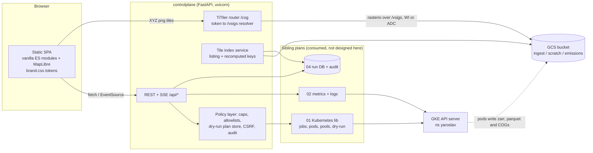
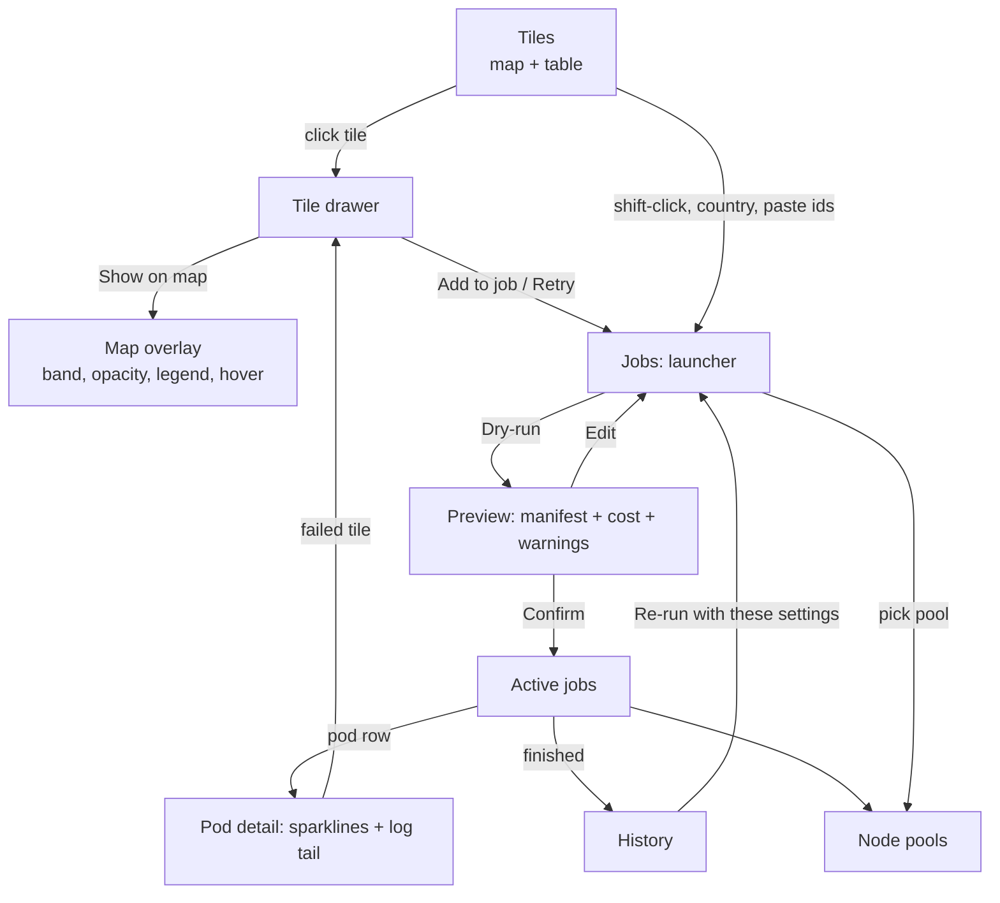

# Plan 03 — Steps 4+5: `controlplane`, the Cornerstone Console UI on top of `kuberjobtower` (tiles, emissions overlays, K8s jobs and node pools)

> **Merged plan (2 Oct 2026).** Combines two independent investigations of the same question and applies the user's decisions: the UI is its own package, `controlplane/`, built later on top of the `kuberjobtower` library and command line (doc 01), which works without it; `lightkube` underneath; node pool selectable per phase with heavy/light defaults; everything configured through a local `.env` today and Cloud Run environment variables later (doc 05). The earlier claim that scratch hashes cannot be recomputed was wrong and is corrected in section 5.

Status: PLAN only (no application code). Written 2026-10-02. Siblings: 01 (Kubernetes library), 02 (metrics/logs), 04 (run DB/history), 05 (configuration and Cloud Run). Design mockup (fake data, open in a browser): [`assets/03-ui-mockup.html`](assets/03-ui-mockup.html). It uses the exact AdAstra tokens below. I could only syntax-check it (`node --check`); I did not eyeball it in a browser, so expect small visual nits.

## 0. TL;DR — decisions

| #   | Decision                                                                                                                                                                                                                                                                                                                                                       | Why (one line)                                                                                                                                                                               |
| --- | -------------------------------------------------------------------------------------------------------------------------------------------------------------------------------------------------------------------------------------------------------------------------------------------------------------------------------------------------------------- | -------------------------------------------------------------------------------------------------------------------------------------------------------------------------------------------- |
| D1  | One **FastAPI** app (uvicorn) serving a **no-build static frontend: vanilla ES modules + MapLibre GL**, SSE for live updates.                                                                                                                                                                                                                                  | Identical shape to the existing dLUC viewer (FastAPI + static + in-process TiTiler), so the AdAstra look and code can be reused; zero Node toolchain in a Python-only repo.                  |
| D2  | Rasters: **TiTiler/rio-tiler in-process**, reading the **export COGs** (they carry overviews) and mosaic VRTs under `EXPORT_ROOT`. The browser never sees a GCS URL; it sends a *token* (`export:10N_010W`) that the backend resolves.                                                                                                                         | `rio-cogeo` and `rasterio 1.5.0` are already locked for py3.14; the dLUC viewer already does exactly this and already locks `?url=` down. Scratch zarr is unusable for map display (see §6). |
| D3  | **Tile↔artifact mapping = list the bucket and recompute the cache key** (verified for `emit`, `version=2` → `94cbe56c057a`). No per-pod ledger: it was designed when the keys were believed unrecomputable. Ingest and export status come from plain listing; harmonize and attribute are recomputed only after each key is checked against a real object.     | The real recipe is already in the pipeline (`jdluc/cache_key.py`, approved edit), so the UI reuses it instead of re-implementing it or asking pods to write bookkeeping.                     |
| D4  | Code lives in **`controlplane/`**, a separate top-level package that depends on `kuberjobtower` (the Kubernetes job library), with its own `ui` dependency group. `jdluc` never imports it; the UI reaches the cluster and history only through the library's ports (doc 01, doc 04) and may import only `jdluc.tiling` and the stdlib-only `jdluc.cache_key`. | One package, one lock, one import-linter config; the lightkube-only CLI install stays light.                                                                                                 |
| D5  | Security and deployment: **loopback bind, run from the laptop with a local `.env`** now; **Cloud Run** later with the same settings supplied as environment variables (doc 05). Server-enforced caps, **dry-run then confirm with a plan hash**, audit log, CSRF token, never read Secrets. Node-pool *writes* are off by default.                             | Proportionate: a privileged tool, one namespace, one team, with a clear path to a hosted service.                                                                                            |
| D6  | **MVP = Tiles map + tile drawer + COG overlay + Jobs (dry-run, launch, list, logs, cancel) + read-only Pools.** History, live sparklines, zarr preview and pool resizing are later phases.                                                                                                                                                                     | Smallest thing usable daily.                                                                                                                                                                 |

Basemap: ship **Natural Earth country polygons** (public domain, ~100–800 KB GeoJSON depending on resolution) as the default flat basemap. They double as the country-AOI picker. Offer Esri Light Gray (what the viewer already uses) as a toggle. Do **not** use tile.openstreetmap.org. See §6.4.

______________________________________________________________________

## 1. What I verified (read-only)

### 1.1 AdAstra visual language (source: `goose/dluc_viewer/templates/static/brand.css`, "ID-3056 spec, section 5")

The skill file `goose/.claude/skills/dluc-viewer/SKILL.md` (read fully) only *cites* "§5 design tokens"; the real values are in `brand.css` (1378 lines) and the page templates. Quoted verbatim:

```css
/* brand greens + accent */ --bg-dark-green:#051701; --sacramento-green:#0b2417; --sea-green:#318150; --mint:#64a77e; --yellow-hunyadi:#eca72c;
/* secondary blues */       --bg-dark-blue:#081119; --rich-dark-blue:#0b1924; --paynes-gray-blue:#316681; --air-force-blue:#6491a7;
/* neutrals */              --white-pure:#ffffff; --white-80:#ffffffcc; --white-60:#ffffff99; --white-30:#ffffff4d;
                            --platinium-1:#fafaf5 /*UI default bg*/; --platinium-2:#f0f0eb /*map bg*/; --platinium-3:#e6e6e1 /*no-data on map*/;
/* data palette (5.9) */    --data-emission-factor:#eca72c; --data-emission:#542344; --data-production:#3a8596; --data-forest-loss:#ad9baa;
/* type (5.2) */            --font-heading:"Averia Serif Libre",Georgia,"Times New Roman",serif;
                            --font-body:"Avenir","Avenir Next","Nunito Sans",system-ui,sans-serif;
                            --font-mono:ui-monospace,SFMono-Regular,Menlo,Consolas,monospace;
                            --fs-1:14px; --fs-2:17px; --fs-3:22px; --fs-4:34px; --fs-5:52px; --fs-6:65px;
/* spacing (5.3) */         --sp-1:5px; --sp-2:10px; --sp-3:15px; --sp-4:20px; --sp-5:30px; --sp-6:45px; --sp-8:90px;
/* radius (5.4) */          --radius-1:2px; --radius-2:5px; --radius-3:22.5px; --radius-full:1000px;
/* shadow (5.5) */          --shadow-3:0 2px 8px rgba(11,36,23,.12); --shadow-6:0 12px 40px rgba(11,36,23,.22);
```

Component conventions found in `brand.css` / `results.html` (reuse verbatim):

- **Body**: 17px `--font-body`, text `--sacramento-green` on `--platinium-1`. **Headings**: serif, weight 300 (h1 34px, h2 22px). **Eyebrow**: uppercase, 0.14em tracking, `--yellow-hunyadi`.
- **Top nav / banner**: full-width `--bg-dark-green` band, links `--white-60` → `#fff` on hover/active, 14px, 0.02em tracking. Header h1 34px/300 white; sub-label uppercase 0.08em `--white-60`. "No wordmark, no company footer" is a stated spec rule for the viewer; the Console is an internal tool, so I use a plain text product name with the viewer's favicon glyph (`#0b2417` rounded square, `#64a77e` "A") — flag if that violates the rule for you.
- **Page**: max-width 1200 (prose) or 1760 (`page--wide`, map pages). **Card**: white, radius 5, `--shadow-3`, padding 30 (I use 20 for denser panels).
- **Segmented toggle**: 1px `--platinium-2` border, radius 2; active = `--sea-green` bg, white, weight 600. **Select**: 5px 8px padding, 1px `--platinium-3`, radius 5, white. **Slider**: `accent-color: --sea-green`.
- **Table** (`.attrs-table`): 13px, header `--platinium-2` bg, 12px bold, sticky; cells `padding 6px 12px`, `border-top 1px --platinium-2`; wrapper `1px --platinium-3`, radius 5, white, scroll.
- **Badge**: 11px/700, pill, `PASS` = `rgba(49,129,80,.15)`/`--sea-green`; `WARN` = `rgba(236,167,44,.2)`/`#9a6d12`; `FAIL` = `rgba(192,86,63,.16)`/`#c0563f`; `SKIPPED` = `--platinium-2`/60% green.
- **Chip** (`.run-chip`): pill, 12.5px, 1px `--platinium-3`, hover border `--mint`, selected = border `--mint` + `--platinium-1` fill + weight 600 (explicitly *not* a saturated fill).
- **Map**: `.map-wrap` radius 5, bg `--platinium-2`, 520px tall; **legend** = flex row, 12px mono, 60% green, 14×12 swatches radius 2; MapLibre box-select armed = `--yellow-hunyadi`; selection rectangle dashed `--sea-green` on `rgba(49,129,80,.12)`.
- **Loading**: required 3px top bar (`--sea-green`) plus a centred blurred-backdrop modal (400px card, 6px track, tabular-nums detail line with a *reserved* height so it never reflows). **Muted text** = `rgba(11,36,23,.6)`. Number formatting uses tabular-nums.
- **Dark mode**: **none exists.** The viewer is light content (platinium) under a dark-green nav; the only dark surfaces are the nav/banner and `--bg-dark-blue`. Plan: ship light only; log panels use `--bg-dark-blue` (as in the mockup). Add `prefers-color-scheme` only if the user asks.
- **Fonts gotcha**: `brand.css` *names* Averia Serif Libre and Avenir but never loads them (no `@font-face`, no Google Fonts link anywhere in the viewer), so today everything renders as Georgia / Nunito-or-system. The Console should load Averia Serif Libre (300/400) and Nunito Sans (400/600/700) from Google Fonts (permitted, SIL OFL) and degrade to the same stack offline.
- **Reusable verbatim**: copy `brand.css` token block + `.card/.segmented/.badge/.legend/.map-wrap/.loading-bar/.load-modal/.eyebrow/.muted/.attrs-table` as `controlplane/static/css/brand.css` (vendor a copy; goose is a different repo, don't import across repos). Console-only additions (mockup): status ramp `--st-none:#e6e6e1; --st-ingested:#b9d9c5; --st-harmonized:#8fc3a3; --st-emit:#64a77e; --st-export:#318150; --st-run:#eca72c; --st-fail:#c0563f`. Failure red `#c0563f` is already the viewer's FAIL colour.
- Colour-blindness: the viewer's own notes say they validated categorical colours with the `dataviz` validator. Status here is a *sequential greens + amber + red* encoding; every status also gets a text/icon in the table and drawer (never colour-only). The emissions overlay ramps are sequential (cream → amber → plum, from `--data-emission-factor` → `--data-emission`).

### 1.2 How the existing viewer is built/deployed

- `goose/dluc_viewer/` is a *generator*: `templates/{Dockerfile,main.py.tmpl,requirements.txt,static/,pages/}` rendered into the hangar repo, published with `adastra-app-publish` to `apps.adastra.eco` (Cloud Run-style: `K_SERVICE`, `CPL_MACHINE_IS_GCE`). Stack: **FastAPI + static HTML/JS (MapLibre 4.5.0 from unpkg, ECharts, DuckDB-WASM) + in-process TiTiler at `/cog`**, `python:3.12-slim` + `libexpat1`, `uvicorn main:app --port 8080`.
- Its tiler lock-down is the pattern to copy: `tile_source_path` only accepts overlay files shipped with the app (rejects absolute paths, `://`, `..`, re-checks `realpath`). GDAL tuning env: `GDAL_DISABLE_READDIR_ON_OPEN=EMPTY_DIR`, `CPL_VSIL_CURL_ALLOWED_EXTENSIONS=.tif,.tiff`, `GDAL_HTTP_MULTIPLEX=YES`, `VSI_CACHE=TRUE`, `GDAL_CACHEMAX=200`. Frontend tile URL shape: `cog/tiles/WebMercatorQuad/{z}/{x}/{y}.png?url=…&colormap=…` (`static/basemap.js`).
- Basemap in the viewer: **Esri Light Gray Canvas** (`World_Light_Gray_Base` + `_Reference` raster tiles) — a code comment says CARTO's free basemaps now need an API key; imagery from Esri Wayback / Sentinel Hub.
- The in-cluster `yaroslav-jdluc-viewer` Deployment (`kubectl describe`, names only): SA `yaroslav-sa`, image `…/maverick-reloaded/nonprod-maverick/yaroslav-jdluc-viewer:latest`, port 8050, 200m/512Mi → 1CPU/1Gi, probes on `/login`, env names `ENVIRONMENT, DEBUG, HOST, PORT, AUTH_USERS` (a Dash-era "hondo" viewer with a built-in login). It is **not** the same stack as the SKILL (that one is Cloud Run). The Console should not copy its auth (a literal user→password JSON env var).
- Reuse `yaroslav-sa` (Workload-Identity-bound, already used by pipeline pods) for a deployed Console.

### 1.3 Cluster / bucket facts

- Jobs are rendered by `infra/run_aoi.py` from `infra/k8s/phase-job.yaml`: one **Indexed Job per phase** (`completionMode: Indexed`, `backoffLimitPerIndex: 1`, `ttlSecondsAfterFinished: 1800`), labels `{app: cornerstone, phase, run-id}`, pod-per-tile where tile = sorted-tile-list\[`JOB_COMPLETION_INDEX`\]. Consequences for the UI: (a) tile↔pod mapping needs the sorted tile list plus the pod's completion-index annotation; the Console should pass an explicit tile list into the Job (plan 01) so it is stored on the Job (annotation) rather than recomputed; (b) **pods/logs vanish 30 min after finish** → history must be copied to the DB/Cloud Logging at completion (plans 02/04).
- Phases: `ingest-world, ingest-tiles, compute (harmonize→emit→attribute), reduce, export, mosaic`.
- `kubectl auth can-i` (my user, ns yaroslav): create jobs yes, get pods/log yes, create pods/exec yes, list nodes yes (cluster-scoped). The in-cluster KSA's rights are unknown — a deployed Console needs a Role (+ a read-only ClusterRole for `nodes`), see §10.
- Bucket (`gs://us-central1-maverick-yarosl-0b64509f-bucket/cornerstone/`): `ingest/` and `scratch/` exist; **`emissions/` holds one COG**, `20N_090W.tif` (1.09 GiB, exported 2 Oct 2026; section 6.3). Ingest layout confirmed: `ingest/raster/<source>/<product>/<version>/ten-degree-tile/<tile>.tif` and `…/whole-world/world.tif`; for `20N_090W` there are 8 per-tile rasters (0.002–0.68 GB each, ~1.6 GB total) + 9 world rasters.
- Scratch: 6 opaque objects. `94cbe56c057a.zarr` = emit output (31 variables incl. `cie-*`, `emissions:…:2000-2005`…; 1.39 GB total on disk), `77da2f344be4.zarr` = harmonize (peat/AGB/TCL/GPW), `3ba250ccc0ff.zarr` = MAPSPAM, `b15c2020d696.zarr` = attribute inputs, `e24fc9b70739.zarr` = oil palm, `db3a48c1a65f.parquet` = attribute. **Every zarr group's `attributes` is `{}`** → artifacts do not self-identify tile or run.
- A scratch variable (`cie-vegetation-emissions-undiscounted:tco2e-per-ha`) is **40000×40000 float32, chunks 2048×2048, zstd, no overviews** → 400 chunks per variable; a world-zoom view from zarr would read every chunk.
- Export COGs (from `jdluc/export.py` on `origin/run/civ-cie`): `{EXPORT_ROOT}/{tile_id}.tif`, EPSG:4326 float32, NaN nodata, band descriptions `cie-*` sorted by name, written by `rio_cogeo` with overviews (`geo.get_overview_level`), DEFLATE profile. Mosaic VRTs: `{EXPORT_ROOT}/mosaics/{name}.vrt`. Band names/units come from the COG band descriptions (`name:unit`).
- `jdluc.tiling` imports only `shapely` (+stdlib); `get_box_for_tile_id` = `box(lon, lat-10, lon+10, lat)`; 280 ids in `GLOBAL_NATURE_WATCH_TILE_IDS` (the task brief calls them GFW). Safe for the UI to import (tile id math only).

______________________________________________________________________

## 2. Architecture



Data flow for the three core interactions:

1. **Tile status**: `IDX` lists the ingest and export prefixes, recomputes emit keys and checks them against a delimiter listing of `scratch/` (cached 30 s), merges with history rows, and emits `tile.updated` over SSE → the map recolours.
2. **Overlay**: click tile → `GET /api/tiles/10N_010W/layers` (bands, units, stats) → MapLibre raster source `/cog/tiles/WebMercatorQuad/{z}/{x}/{y}.png?src=export:10N_010W&bidx=3&rescale=0,320&colormap=emission` → rio-tiler reads the COG overview matching the zoom.
3. **Job**: form → `POST /api/jobs/dry-run` → server validates, renders manifest via plan 01, stores plan (id + sha256), returns preview + cost → user confirms → `POST /api/jobs {plan_id}` submits *exactly that plan*, writes audit row.



______________________________________________________________________

## 3. Screen inventory and wireframes

Global shell: dark-green nav (Tiles · Map · Jobs · History · Node pools) with right-aligned context chips (`ns: yaroslav`, cluster, health dot for GCS/K8s), 3px top loading bar, toast area, global banner for degraded mode ("read-only: no cluster access"). Hash routing (`#/tiles?stage=emit&sel=10N_010W`).

### 3.1 Tiles (home)

```
┌ nav ───────────────────────────────────────────────────────────────────────────────┐
│ TILE BROWSER                                                                        │
│ Pipeline status by 10° tile   Stage [Ingested|Harmonized|•Emit|Export COG]  280 tiles · 9 done · 4 failed │
├──────────────────────────────────────────────────────┬─────────────────────────────┤
│ ┌ world map: 280 coloured 10° cells ───────────────┐ │ TILE  10N_010W              │
│ │  ░░▒▒██  ░░                                       │ │ CIV · GHA · LBR  10°×10°    │
│ │  tiles coloured by selected stage; amber outline  │ │ [!] Failed — OOMKilled …    │
│ │  = in job selection; click select, shift add      │ │ Artifacts                   │
│ └───────────────────────────────────────────────────┘ │  ingest   8 rasters 1.7 GB ✓│
│ ▪ not run ▪ done ▪ running ▪ failed ▫ in selection    │  harmonize scratch/77da…  ✓ │
│ ┌ All tiles ─ filter [CIV___] [status ▾] [+add shown]┐│  emit     scratch/94cb…  ✓ │
│ │ Tile  Countries Ingest Harm Emit Export Last Size  ││  export   emissions/…tif —  │
│ │ …sortable, click row = select                       ││ Last run: id, phase, timings│
│ └─────────────────────────────────────────────────────┘│ peak RAM                    │
│                                                        │ [Show on map][Add to job][Logs↗]
└──────────────────────────────────────────────────────┴─────────────────────────────┘
```

Facets: stage (segmented), status (ok/failed/running/missing), country (ISO3, from static `tile_countries.json`), text. Tile status per stage = `none | running | ok | failed`, with `n_done/n_expected` for ingest (e.g. 8/8 datasets).

### 3.2 Map overlay

```
┌ Tile 10N_010W   Source [•Export COG | Scratch emit (preview) | Mosaic · CIV]  Band [cie-vegetation… ▾]  Opacity ━━●─ │
├────────────────────────────────────────────────────┬────────────────────────────┤
│ MapLibre: flat country basemap + raster overlay    │ Layer                      │
│  hover readout card (lat, lon, value+unit)         │  URI (copyable, masked in  │
│  dashed outline = tile bounds, +/- zoom            │  UI as gs://…/emissions/…) │
│                                                    │  Grid EPSG:4326 40000², f32│
│ legend: 0 ▒▒▒▒▒▒ 320 tCO2e/ha   nodata transparent │  Stretch min/max (p2–p98)  │
│                                                    │  Colour ramp ▾             │
│                                                    │ Pixel under cursor: all bands│
└────────────────────────────────────────────────────┴────────────────────────────┘
```

Band selector is populated from band descriptions (units after the first `:`), stats from a cached `/statistics` over an overview.

### 3.3 Jobs: launch a run and watch active jobs

```
┌ Launch a run ───────────────────────────────────────┬ Active jobs (SSE) ─────────────────────────────┐
│ 1 WHAT                                              │ cs-compute-0930 [Running] compute · 14m · 5/12 ▓▓▓░░ [Cancel][Delete]│
│  Phases [☐ ingest-world][☑ ingest-tiles][☑ compute] │   Pod  Tile      Phase    Node RAM▁▂▃ CPU▂▃ IO-PSI▁  │
│         [☐ reduce][☐ export][☐ mosaic]              │   …-0  10N_010W  Running  n0   ▁▂▃▅ 31G ▂▃▃   ▁▁     │
│  Tiles (3) [10N_010W ×][10N_000E ×]…                │   …-3  10N_020W  Pending  —    (unschedulable: memory)│
│   [paste ids or CIV ____][Add]                      ├ Logs · cs-compute-0930 / pod 0 (10N_010W) ─────────┤
│  Methodology [STATISTICAL ▾]   Run id [auto]        │ dark mono tail, follow ☑  [Open in Cloud Logging ↗]│
│ 2 WHERE AND HOW BIG                  per phase      │ resource_sample {"rss_gib":31.4,"io_psi_full_avg10":1.1}│
│  Phase         Node pool                    Pod (request = limit)   Preset    │
│  ingest-tiles  [yaroslav-worker-node-pool ▾] 2/4 cpu · 24Gi        [Default ▾]  light │
│  compute       [yaroslav-power-node-pool  ▾] 6/8 cpu · 56Gi        [Default ▾]  heavy │
│   pool card: e2-highmem-8 · 8 vCPU / 64 GiB · min 0 max 200 · taint worker=true · fits 1 pod/node  │
│   [Reset pools to defaults]                         │
│  Parallelism ━━●━━ 4  (cap 16)                      │
│ 3 PRE-FLIGHT  ≈ 22 min · ≈ $0.28 · 2 nodes · warnings│
│  [Dry-run: show manifests]  YAML per phase          │
│ 4 CONFIRM  ☐ I have read the manifests              │
│  [Submit run]  (typed "RUN" if estimate > $5 or > 20 tiles)│
└─────────────────────────────────────────────────────┴────────────────────────────────────────────────┘
```

Confirm is disabled until a dry-run of the *current* form exists; any edit invalidates the plan.

**Node pool per phase, with defaults (decided 2 Oct 2026).** Each phase has a role: `heavy` (`compute`) or `light` (`ingest-world`, `ingest-tiles`, `reduce`, `export`, `mosaic`). The role maps to a pool from settings: `KJT_POOL_HEAVY` (v1: `yaroslav-power-node-pool`, e2-highmem-8) and `KJT_POOL_LIGHT` (v1: `yaroslav-worker-node-pool`, e2-standard-8). The form pre-selects the default and marks it. The user can change the pool of any phase from the dropdown, which lists every pool the pool guard allows (the two defaults, plus the shared always-on `standard-node-pool`, flagged "shared, hosts other workloads"). The same selector appears when launching a single phase, so a one-off job can be pointed anywhere allowed.

Changing a pool re-runs pre-flight, so the form never lets a bad choice through silently:

| Choice                                                                                                                | Pre-flight result                                    |
| --------------------------------------------------------------------------------------------------------------------- | ---------------------------------------------------- |
| A phase whose request does not fit one node's allocatable (compute's 56 Gi on an e2-standard-8, 27.6 GiB allocatable) | **Error**, submit disabled                           |
| A light phase on the heavy pool                                                                                       | Warning: allowed, costs more per hour                |
| The shared `standard-node-pool`                                                                                       | Warning: shared, always on, small autoscaler maximum |
| Any pool outside the allow-list                                                                                       | Error (the allow-list is a setting, not code)        |

Every phase row also shows the pool's machine type, allocatable CPU and memory, autoscaler range, current node count, and how many pods of this request fit per node.

Tile entry paths: click or shift-click on the Tiles map, a country code (resolves to tiles via `tile_countries.json`), or pasted ids; unknown ids are rejected inline against the 280-tile list.

**Controls and defaults:**

| Control         | Values                                                                                                                 | Default                   |
| --------------- | ---------------------------------------------------------------------------------------------------------------------- | ------------------------- |
| Phases          | the six members of `Phase`; run order is fixed, not click order                                                        | `ingest-tiles`, `compute` |
| Tiles           | map click, paste (`^\d{2}[NS]_\d{3}[EW]$`, checked against the 280 ids), or ISO3                                       | empty (submit disabled)   |
| Methodology     | `attribute.Methodology` names, sent identically to every phase                                                         | `STATISTICAL`             |
| Node pool       | per phase, from `GET /api/pools`, restricted by the pool guard                                                         | role default (see above)  |
| Resource preset | `Default` (the `PhaseSpec` row in doc 01 section 6), or `Custom` within hard caps (never above the pool's allocatable) | `Default`                 |
| Parallelism     | 1 to `MAX_PARALLELISM` (16 in v1); effective value is `min(parallelism, completions)`                                  | 8                         |
| Ingest threads  | `--concurrency`, only for ingest phases                                                                                | 4                         |

### 3.4 History

Table: run id, started, phases, AOI, tiles, result (ok / failed n/m with reasons), duration, est. cost, **"Re-run with these settings"** (pre-fills Jobs form), row expand → config used (the full dry-run plan), per-tile results with links to the tile drawer and archived logs. Source: plan 04.

### 3.5 Node pools

Cards per pool: machine type, vCPU/RAM, allocatable per node, labels, taints, autoscaler min/max, node count now, pending pods (+ the scheduler's reason text), list price per node-hour. Pool write controls ("Set max nodes…") are **hidden unless `/api/config` says `features.pool_write=true`** (needs GKE API IAM; see §10).

### 3.6 States (all screens)

- **Loading**: top bar + skeleton rows; map shows the grid immediately (static GeoJSON) and fills colours when `/api/tiles` returns.
- **Empty**: Tiles "No tiles processed yet — start with *Launch a run*"; Jobs "No active jobs"; overlay for a tile with no COG: "Export hasn't run for this tile" + button *Run export for 10N_010W* (pre-fills the launcher).
- **Error**: inline banner with the API `detail` and a request id; stale-data chip ("updated 2 min ago, reconnecting…") when SSE drops; degraded mode when K8s is unreachable (Tiles/overlay still work).
- **Partial**: tile with ingest 6/8 shows amber "partial".
- **Garbage-collected pods**: "Pods removed by TTL; logs archived: [Cloud Logging ↗]".

### 3.7 Accessibility basics

Tiles are `role=button` with `aria-label="Tile 10N_010W, emit: failed"` and keyboard focus/Enter (shift+Enter adds); the table is the keyboard-first alternative to the map; focus ring `2px --yellow-hunyadi`; status never colour-only; `aria-live=polite` on the drawer and toasts; labels on all controls; 4.5:1 contrast for text (sea-green on white = 4.9:1, `--mint` is *not* used for text); respects `prefers-reduced-motion` (no sparkline animation); the confirm button states what it will do ("Submit 12 pods to power pool").

______________________________________________________________________

### 3.8 Smaller tiles and batching (future, gated)

Issue #8 proposes processing in 1° tiles instead of 10° (up to 100 times as many work units). The UI will then need a **tile-size toggle**, a **hierarchical map grid** (10° cells at low zoom, 1° cells on zoom, generated in the browser from an 8 KB land bitmap), a **tiles-per-pod** control, **box-select** and **export selection to COG**, and, once named runs exist, a **Runs page** with config validation. All of it is gated by a `pipeline` block in `GET /api/config` that `kuberjobtower` reads from the pipeline's own capabilities and the UI relays, so none of it appears until the code can do it. Today the answer is "10° only" and nothing changes. The design, the verified Kubernetes limits and the small hooks to build into v1 are in doc 06; the hook that matters here is that tile ids are a scheme (the paste check above is scheme-driven, not a fixed pattern).

## 4. Frontend components and file layout

```
controlplane/                       # new top-level package; jdluc never imports it
  __init__.py
  __main__.py                      # `uv run --group ui python -m controlplane [--port 8090]`
  app.py                           # FastAPI factory, mounts /static, /cog, /api, /healthz
  settings.py                      # pydantic-settings: namespace allowlist, caps, buckets (from env/.env-ui, never jdluc .env)
  policy.py                        # caps, allowlists, plan store (id → sha256 → expiry), CSRF, audit hook
  tiles_index.py                   # listing + recomputed keys → tile status model
  overlay.py                       # TiTiler factory, token→/vsigs resolver, band metadata, named ramps
  routes/{tiles,overlay,jobs,pools,runs,events,meta}.py
  adapters/{k8s.py,metrics.py,history.py}   # thin seams onto plans 01/02/04 (Protocols); fakes for tests/demo
  static/
    index.html                     # shell + nav (one page, hash routes)
    css/brand.css                  # vendored token block + components (§1.1) ; console.css (status ramp, layout)
    js/app.js                      # router, store (tiny pub/sub), api client, SSE client
    js/views/{tiles,map,jobs,history,pools}.js
    js/components/{tilegrid,tiletable,drawer,bandpicker,legend,hoverreadout,poolpicker,
                   chips,sparkline,logtail,jobcard,manifestpreview,coststrip,toast,loadbar,badge}.js
    js/lib/{h.js (tiny element helper),fmt.js,sort.js}
    vendor/{maplibre-gl.js,maplibre-gl.css}  # pinned 4.5.0 (as the viewer), vendored not unpkg
    data/{tile_countries.json,tiles_global.geojson,countries.geojson}   # generated once by tools/
  tests/                            # pytest: policy, plan-hash, token resolver, key recomputation (no cluster)
tools/build-console-data.py         # one-off: tiles geojson + tile→countries from jdluc.tiling/worldbank data
```

Estimated size: ~1.5 k lines Python, ~2 k lines JS, ~400 lines CSS for the MVP.

Tile grid layer: one GeoJSON source (280 polygons, `id` = tile id), a data-driven `fill-color` via `feature-state` (`setFeatureState({source,id},{status})`) so SSE updates recolour without re-uploading geometry; a second line layer for selection / job-selection outlines.

______________________________________________________________________

## 5. Tile ↔ artifact mapping (decision)

**What the code does.** `storage.get_cache_decorator` keys each artifact as `sha1("|".join([func.__module__, func.__qualname__, version, *(name, value) for each non-ignored arg]))[:12]`. **Verified 2 Oct 2026:** for `emit.workflow(tile_id="20N_090W")` at `version=2` the key is `94cbe56c057a`, exactly the object the real run wrote (versions 0, 1 and 3 give other keys). An earlier draft of this plan brute-forced the wrong recipe, concluded the hashes could not be recomputed, and proposed a per-pod ledger; that conclusion was wrong and the ledger is dropped. Harmonize also hashes `dataset_names` and `tile_resolution` through `str()`, attribute hashes `(crop_names, iso_3166, tile_id)`, trace hashes the methodology enum. **Only `emit` is verified.**

**Decision.**

| Stage                | How the Tiles screen knows                                                                                                                                                                                                      |
| -------------------- | ------------------------------------------------------------------------------------------------------------------------------------------------------------------------------------------------------------------------------- |
| ingest               | List `ingest/**/ten-degree-tile/<tile>.tif` and count against the expected datasets per tile (a static list generated at build time from the dataset registry, verified against `infra/run_phase.get_dataset_names_for_phase`). |
| emit                 | Recompute the key with the pure `cache_key()` from the new stdlib-only module `jdluc/cache_key.py` (approved edit; the same function the decorator calls, so it cannot drift) and check `scratch/<key>.zarr/zarr.json`.         |
| export               | Existence of `{EXPORT_ROOT}/{tile}.tif` plus size and update time; mosaics by listing `{EXPORT_ROOT}/mosaics/*.vrt`.                                                                                                            |
| harmonize, attribute | Recompute only after each has been checked against a real object, the way `emit` was. Until then show "recorded runs only" from the history store.                                                                              |

Keys depend on the stage's `version` and its arguments, so a recomputed key is only trustworthy for the code version that wrote the artifact. The history store records what each run actually produced (doc 04 section 7.5, optional artifact hook), and the UI marks a recomputed key as `present` only when the object exists. A reverse scan of the zarr's `x` / `y` coordinates is the optional fallback for orphans. Issue #8 (named runs with per-tile `_done` markers, content-based provenance) will make tile status a plain listing and retire key recomputation, so status sits behind a small `TileStatusSource` interface with a `CacheKeyStatus` implementation now and a `DoneMarkerStatus` later (doc 06 section 5).

## 6. Map and overlay technology

### 6.1 Client library: MapLibre GL JS (chosen) vs Leaflet

|                                                                       | MapLibre GL 4.x               | Leaflet 1.9               |
| --------------------------------------------------------------------- | ----------------------------- | ------------------------- |
| Size                                                                  | ~220 KB gz                    | ~42 KB gz                 |
| 280-polygon grid recoloured live                                      | `feature-state`, GPU, instant | re-style 280 layers, fine |
| Raster overlay + opacity + smooth zoom                                | native                        | native                    |
| Reuse from existing viewer (`basemap.js`, legend, box-select)         | **direct**                    | rewrite                   |
| Later: vector basemap / PMTiles / globe                               | yes                           | plugins                   |
| Choice: MapLibre, pinned `4.5.0` as the viewer (vendored, not unpkg). |                               |                           |

### 6.2 Serving rasters: options

| Option                                                                                                                                                                                                                                                                                                                                                                                                                                                                                                                                                                                                                                                                                                                                                                                                                                                                       | Reads 40000² f32 COG at world zoom?                                                                                                                                                   | Auth to private GCS                                           | Fit                                                                                    |
| ---------------------------------------------------------------------------------------------------------------------------------------------------------------------------------------------------------------------------------------------------------------------------------------------------------------------------------------------------------------------------------------------------------------------------------------------------------------------------------------------------------------------------------------------------------------------------------------------------------------------------------------------------------------------------------------------------------------------------------------------------------------------------------------------------------------------------------------------------------------------------- | ------------------------------------------------------------------------------------------------------------------------------------------------------------------------------------- | ------------------------------------------------------------- | -------------------------------------------------------------------------------------- |
| **TiTiler/rio-tiler in-process (chosen)**                                                                                                                                                                                                                                                                                                                                                                                                                                                                                                                                                                                                                                                                                                                                                                                                                                    | yes: GDAL picks the overview matching the zoom; only visible blocks fetched                                                                                                           | server-side (WI/ADC), browser never gets a URL                | same as dLUC viewer; also gives `/point`, `/info`, `/statistics`                       |
| `tools/zarr-tile-server.py`                                                                                                                                                                                                                                                                                                                                                                                                                                                                                                                                                                                                                                                                                                                                                                                                                                                  | **no**: slices the full-resolution `lat/lon` window then resizes with PIL; zarr has **no pyramid** → at z≤5 it reads most of 400 chunks/variable; `lru_cache` per tile in memory only | local gcsfs                                                   | great QGIS debug tool, keep as is; not for the UI                                      |
| Client-side COG (`@geomatico/maplibre-cog-protocol`, geotiff.js)                                                                                                                                                                                                                                                                                                                                                                                                                                                                                                                                                                                                                                                                                                                                                                                                             | yes (overviews) and supports float32/NaN→transparent and colour ramps (per its README)                                                                                                | needs browser→GCS access: signed URLs or public bucket + CORS | later optimisation, not now; adds IAM/CORS surface                                     |
| Pre-rendered PNG/PMTiles                                                                                                                                                                                                                                                                                                                                                                                                                                                                                                                                                                                                                                                                                                                                                                                                                                                     | yes                                                                                                                                                                                   | n/a                                                           | stale after each run, storage + a render job to own; reserve for the zarr-preview case |
| Choice: TiTiler `TilerFactory` mounted at `/cog` with a **`path_dependency` that accepts only tokens** — `export:<tile>`, `mosaic:<name>`, optionally `preview:<tile>:<band>` — validated against the 280-tile list / listed VRT names, resolved server-side to `/vsigs/<bucket>/cornerstone/emissions/<tile>.tif`. Never accept a raw URL (this is the viewer's own `tile_source_path` rule applied to GCS). Rendering: `bidx` for band, `rescale=min,max` (defaults from cached p2/p98 of an overview), server-named `colormap` ramps (`emission`, `green`, `diverging`) defined from the AdAstra data palette, `nodata` = NaN (COG already tagged). Hover: `/cog/point/{lon},{lat}?src=…` returning all band values + names (also feeds the "pixel under cursor" table). For multi-band derived views (e.g. veg+soil+peat) use TiTiler `expression` after verifying cost. |                                                                                                                                                                                       |                                                               |                                                                                        |

### 6.3 Reading efficiency and auth

- GDAL env as the viewer plus `GDAL_HTTP_MAX_RETRY=3`, `CPL_VSIL_CURL_CACHE_SIZE`, `GDAL_CACHEMAX=512`; **Verified on the real export (2 Oct 2026, `20N_090W`):** 40,000 × 40,000, **10 float32 bands**, EPSG:4326, NaN nodata, **512 × 512 blocks**, deflate, **pixel-interleaved**, nine overview levels (2, 4, 8, 16, 32, 64, 128, 255, 506), 1.09 GiB, bounds -90 to -80 longitude and 10 to 20 latitude. HTTP caching: `Cache-Control: private, max-age=60` + ETag keyed by (object `generation`, params) so a re-export is visible within a minute.
- Auth: **local** = ADC (`gcloud auth application-default login`); **in-cluster** = Workload Identity via `yaroslav-sa` (same binding the pods use; no new IAM for read). **Verified for the in-cluster case on 2 Oct 2026:** a pod running as `yaroslav-sa` opened the real COG through `/vsigs/` with rasterio on Python 3.14 in 0.62 s, read a 256-px overview window in 0.14 s and a native 512-px window in 0.32 s (same region as the bucket). **Not yet verified:** a developer laptop with ADC, where latency over the internet will be higher. GDAL can pick up ADC/metadata creds (the viewer needed `CPL_MACHINE_IS_GCE=YES` on Cloud Run for the same reason). For the laptop case, with a fallback: open with `gcsfs` (already a dependency) → `rasterio.open(fs.open(path))` (fsspec file object; range reads, slightly slower).
- Overview stats for the legend: `/statistics` with `max_size=1024` cached per (object generation, band).
- **Design note from the export:** the COG is pixel-interleaved (all 10 bands inside every block), so a single-band overlay reads every band's bytes for each block. The in-cluster reads above are fast enough, but if laptop latency disappoints, exporting band-interleaved or with fewer bands per COG is the first lever, before pre-rendered `preview:` COGs.

### 6.4 Basemap and licensing (verified against sources)

- **tile.openstreetmap.org: not suitable.** OSMF policy: heavy use may be blocked without notice, no SLA, mandatory visible "© OpenStreetMap contributors", unique User-Agent, 7-day minimum caching, **no pre-emptive tile fetching** ([operations.osmfoundation.org/policies/tiles](https://operations.osmfoundation.org/policies/tiles/)). A browser-based internal tool is tolerable at tiny volume but offers nothing we need.
- **CARTO free basemaps**: the viewer's own code comment says they now require an API key and fail silently by stamping "API KEY REQUIRED" into tiles.
- **Esri Light Gray Canvas** (`World_Light_Gray_Base/Reference`): used by the production dLUC viewer, no key. Terms of unauthenticated use are not something I verified; treat as "AdAstra already accepts this risk" and make it a toggle, not the default.
- **Protomaps PMTiles**: free weekly planet builds; you can extract a region/zoom range and host the single file with HTTP range reads (e.g. in the bucket or a static host) and style it with MapLibre ([docs.protomaps.com](https://docs.protomaps.com/guide/getting-started), [protomaps/basemaps](https://github.com/protomaps/basemaps)); ODbL attribution required. Best *upgrade* if we want streets/labels (Phase 3).
- **Default (MVP)**: bundled **Natural Earth** admin-0 polygons as a flat `--platinium-2` land / `--platinium-3` border style: zero network, zero key, no policy risk, doubles as the **country AOI picker**. (Natural Earth is public domain; I did not re-fetch its terms in this session.) The overlay sits over this; at zoom ≥ 8 for 30 m rasters users may want imagery → the Esri toggle.

______________________________________________________________________

## 7. Stack comparison

| Criterion                               | **A. FastAPI + vanilla ES modules** (recommended)                                         | B. FastAPI + htmx (+Alpine)                                           | C. NiceGUI / Streamlit / Panel                                                                                 | D. React + Vite (+ FastAPI)                                |
| --------------------------------------- | ----------------------------------------------------------------------------------------- | --------------------------------------------------------------------- | -------------------------------------------------------------------------------------------------------------- | ---------------------------------------------------------- |
| No build / lightweight                  | yes, static files                                                                         | yes (1 vendored 14 KB lib)                                            | yes, but heavy runtime (NiceGUI ≈ Quasar/Vue bundle; Streamlit ≈ big React app)                                | needs Node, lockfile, CI build step                        |
| Map support                             | MapLibre direct, full control                                                             | MapLibre in islands; htmx swaps fight map state                       | NiceGUI has Leaflet (limited); Streamlit via components (rerun model fights a persistent map)                  | best ecosystem (react-map-gl), most code                   |
| Live updates (SSE)                      | `EventSource` + store, ~60 lines                                                          | `hx-ext=sse` fine for lists, awkward for sparklines/map feature-state | NiceGUI native websocket good; Streamlit reruns = poor for live                                                | good                                                       |
| Python-only tooling / import-linter fit | Python backend + ~2 k lines JS, no npm; lintable `controlplane` package                   | same                                                                  | most Python-only (NiceGUI), but UI logic buried in Python; Streamlit already used elsewhere at AdAstra (viper) | breaks the "Python-only" repo philosophy; second toolchain |
| Matches AdAstra style                   | **exact** (same CSS, same MapLibre/TiTiler pattern as dLUC viewer)                        | exact (same CSS)                                                      | themable but Quasar/Streamlit defaults leak; custom serif/greens possible, effortful                           | exact if CSS reused                                        |
| Maintainability                         | medium: hand-rolled state; mitigated by tiny store + component files + no framework churn | medium-high for forms/tables, lower for map/live                      | low-medium: framework upgrades, off-brand                                                                      | high but heaviest                                          |
| Verdict                                 | **Choose**                                                                                | good fallback if forms get gnarly (can adopt htmx per-view later)     | rejected: map + off-brand + rerun model                                                                        | rejected: toolchain cost for a 4-user internal tool        |

The one genuinely risky thing about A is state sprawl in `jobs.js`; mitigation = single store with typed events and component files < 200 lines each. If the user prefers fewer lines of JS for the forms, adopt htmx for the Jobs launcher only (compatible with A).

### 7.1 Packaging and import-linter

The UI is the separate `controlplane/` package on top of `kuberjobtower` (package split decided 2 Oct 2026), with its own dependency group so the CLI install stays light.

- `pyproject.toml`: `[dependency-groups] ui = ["fastapi", "uvicorn[standard]", "titiler.core", "pydantic-settings", "httpx"]`; the library group (`lightkube`, `google-auth`, `pyyaml`) is in doc 01 section 5.4; `dev` includes both. **Do not** add any of them to `[project].dependencies`, so the pipeline image (`infra/Dockerfile`, `uv sync --frozen --no-dev`) stays lean. **Phase-0 check:** confirm `uv lock` resolves on Python 3.14 (rasterio, pillow and pydantic already lock; fastapi, titiler and starlette are not in `uv.lock` today).
- import-linter (the complete set is in doc 01 section 5.3; these are the ones specific to the UI):
  ```toml
  [[tool.importlinter.contracts]]
  name = "The UI reaches the cluster and the pipeline only through the library"
  type = "forbidden"
  source_modules = ["controlplane"]
  forbidden_modules = ["lightkube", "jdluc.attribute", "jdluc.emit", "jdluc.harmonize", "jdluc.ingest",
                       "jdluc.jurisdictional_direct", "jdluc.statistical", "jdluc.trace", "jdluc.export",
                       "jdluc.storage", "jdluc.config", "jdluc.datasets"]

  [[tool.importlinter.contracts]]
  name = "The library never imports the UI"
  type = "forbidden"
  source_modules = ["kuberjobtower"]
  forbidden_modules = ["controlplane"]
  ```
  (`jdluc.tiling` and `jdluc.cache_key` are allowed: both are stdlib or shapely only.) Add `controlplane` to the mypy and ruff scope; UI tests need no cluster, because every port has a fake.
- Run: `uv run --group ui python -m controlplane` serves `http://127.0.0.1:8090` (8050 is the jdluc-viewer's port). `--demo` serves the fake adapters (the same data as the mockup) for UI work without cluster or bucket.

______________________________________________________________________

## 8. HTTP API contract

All JSON; errors `{"detail": "...", "code": "...", "request_id": "..."}`; mutating verbs require header `X-Console-Token` (CSRF, §9). Supplier column = whose plan implements the logic behind the route (the Console owns the route + validation).

| Method | Path                                         | Request → response sketch                                                                                                                                                                                                                                                                                                                                                                                           | Supplier                                                    |
| ------ | -------------------------------------------- | ------------------------------------------------------------------------------------------------------------------------------------------------------------------------------------------------------------------------------------------------------------------------------------------------------------------------------------------------------------------------------------------------------------------- | ----------------------------------------------------------- |
| GET    | `/api/config`                                | → `{namespace, user, caps:{max_parallelism:16,max_tiles_per_submit:60,phases:[…]}, pool_defaults:{heavy,light}, phase_roles:{phase:"heavy"\|"light"}, features:{pool_write:false,logs:true,metrics:true,history:true}, csrf, roots:{ingest,scratch,export (display only)}}`                                                                                                                                         | 03                                                          |
| GET    | `/healthz`                                   | `{status:"ok"}`; `/readyz` checks GCS list + K8s `get`                                                                                                                                                                                                                                                                                                                                                              | 03                                                          |
| GET    | `/api/tiles`                                 | `?stage=emit&status=failed&country=CIV&q=10N` → `{generated_at, source:"listing+keys", tiles:[{id, bbox:[w,s,e,n], countries:["CIV"], stages:{ingest:{status,done,expected,bytes,updated}, harmonize:{…,run_id}, emit:{…}, export:{…}}, last_run_id}]}`                                                                                                                                                             | 03 (index), 04 (history), `jdluc.cache_key` for emit keys   |
| GET    | `/api/tiles/{id}`                            | → `{id, countries, artifacts:[{stage,uri_display,bytes,updated,run_id,git_sha}], runs:[{run_id,phase,status,started,finished,timings,error,peak_rss_gib}], failure?}`                                                                                                                                                                                                                                               | 03 + 04                                                     |
| POST   | `/api/tiles/reconcile`                       | → `202 {job}`; recomputes index from bucket                                                                                                                                                                                                                                                                                                                                                                         | 03                                                          |
| GET    | `/api/tiles/{id}/layers`                     | → `{layers:[{src:"export:10N_010W", kind:"cog", updated, bands:[{idx:1,name:"cie-vegetation-emissions-undiscounted",unit:"tco2e-per-ha",p2,p98,min,max}], overviews:6, crs:"EPSG:4326"}]}`                                                                                                                                                                                                                          | 03                                                          |
| GET    | `/api/mosaics`                               | → `[{name, src:"mosaic:civ", tiles:[…], updated}]`                                                                                                                                                                                                                                                                                                                                                                  | 03                                                          |
| GET    | `/cog/tiles/WebMercatorQuad/{z}/{x}/{y}.png` | `?src=export:10N_010W&bidx=1&rescale=0,320&colormap=emission` → PNG (RGBA, NaN transparent)                                                                                                                                                                                                                                                                                                                         | 03 (TiTiler)                                                |
| GET    | `/cog/point/{lon},{lat}`                     | `?src=…` → `{values:[…], band_names:[…]}`                                                                                                                                                                                                                                                                                                                                                                           | 03                                                          |
| GET    | `/api/pools`                                 | → `[{name, machine_type, vcpu, memory_gib, allocatable:{cpu,memory_gib}, labels, taints:[{key,value,effect}], node_count, autoscaler:{min,max}, pending_pods:[{pod,reason,waiting_s,wants_pool}], price_per_node_hour_usd?}]`                                                                                                                                                                                       | 01                                                          |
| PATCH  | `/api/pools/{name}`                          | `{autoscaler:{max:8}}` → pool; **404/403 unless `features.pool_write`**                                                                                                                                                                                                                                                                                                                                             | 01 (needs GKE API IAM)                                      |
| POST   | `/api/jobs/dry-run`                          | `{phase, tiles:[ids] \| countries:[iso3], methodology, parallelism, resources?:{cpu,memory,local_ssd}, pools?:{phase:pool} (omitted = the role default), image_tag?}` → `{plan_id, plan_sha256, expires_at, jobs:[{name, kind:"Job", completions, parallelism, manifest_yaml}], estimate:{pods,waves,wall_h:{low,high},cost_usd:{low,high},peak_nodes,assumptions[]}, warnings[], errors[]}` — nothing is submitted | 01 (render+validate), 03 (caps, estimate model, plan store) |
| POST   | `/api/jobs`                                  | `{plan_id, plan_sha256, confirm:true}` → `{run_id, jobs:[{name,uid}]}`; rejects expired/changed plans; writes audit                                                                                                                                                                                                                                                                                                 | 01 (submit), 04 (run row), 03 (guard)                       |
| GET    | `/api/jobs`                                  | `?active=1&run_id=` → `[{name,run_id,phase,status,age_s,completions,succeeded,failed,active,pool}]`                                                                                                                                                                                                                                                                                                                 | 01                                                          |
| GET    | `/api/jobs/{name}`                           | → job + `pods:[{name,tile,index,phase,node,restarts,reason,start,end}]`                                                                                                                                                                                                                                                                                                                                             | 01                                                          |
| POST   | `/api/jobs/{name}/cancel`                    | stop pods, keep Job record (suspend / scale) → job                                                                                                                                                                                                                                                                                                                                                                  | 01                                                          |
| DELETE | `/api/jobs/{name}`                           | delete Job + pods (guarded, audit) → 204                                                                                                                                                                                                                                                                                                                                                                            | 01                                                          |
| GET    | `/api/jobs/{name}/metrics`                   | `?window=30m` → `{interval_s:15, pods:{<pod>:{rss_gib:[…],cpu_cores:[…],io_psi_full_avg10:[…],limit:{memory_gib,cpu}}}}`                                                                                                                                                                                                                                                                                            | 02                                                          |
| GET    | `/api/jobs/{name}/pods/{pod}/logs`           | `?tail=200&follow=1` → `text/event-stream` lines, or JSON if no follow; response includes `archived_url` when pods are gone                                                                                                                                                                                                                                                                                         | 02                                                          |
| GET    | `/api/runs`                                  | `?status=&aoi=&limit=` → `[{run_id,started,phases,aoi,tiles,status,duration_s,est_cost_usd}]`                                                                                                                                                                                                                                                                                                                       | 04                                                          |
| GET    | `/api/runs/{id}`                             | → `{config (the stored dry-run plan), jobs, tiles:[{id,stage_results}], logs_archive}`                                                                                                                                                                                                                                                                                                                              | 04                                                          |
| GET    | `/api/events`                                | SSE: `job.updated`, `pod.updated`, `metrics.sample`, `pool.updated`, `tile.updated`, `heartbeat` (`id:` for `Last-Event-ID`)                                                                                                                                                                                                                                                                                        | 03 (fan-out) fed by 01/02/04 watches                        |

Notes:

- **Dry-run is a real server concept**: a plan is immutable, stored with its sha256 and a 15-min expiry; `POST /api/jobs` references it by id+hash, never re-sends parameters. The UI cannot submit something it hasn't previewed.
- Cost estimate: `pods × per-pod wall time × node-hour price / pods-per-node`. Per-pod wall times come from **history** (plan 04: median per stage per tile, with p90 as the high bound); with no history show wall/cost as "unknown — first run" and the structure only (pods, waves, peak nodes). Prices come from a small table in `settings.py` (list price, to verify against the billing console), labelled "estimate".
- Event volume: ≤ a few KB/s; one SSE connection per tab; backend polls/watches once and fans out.

______________________________________________________________________

## 9. Security (proportionate)

| Threat                                | Control                                                                                                                                                                                                                                                                                                                                                                                                                                                                                                                                                                                                                                                                                 |
| ------------------------------------- | --------------------------------------------------------------------------------------------------------------------------------------------------------------------------------------------------------------------------------------------------------------------------------------------------------------------------------------------------------------------------------------------------------------------------------------------------------------------------------------------------------------------------------------------------------------------------------------------------------------------------------------------------------------------------------------- |
| Anyone on the network drives Jobs     | **Bind `127.0.0.1` by default.** Local development runs from the laptop with its own gcloud credentials. The hosted target is **Cloud Run** (doc 05): `--no-allow-unauthenticated` with IAP or an IAM invoker list, so only named people reach it; no public ingress. Do **not** copy the hondo viewer's built-in `AUTH_USERS` literal-credentials pattern.                                                                                                                                                                                                                                                                                                                             |
| Cross-site request from a browser tab | `X-Console-Token` header on every mutating call (random per-process token embedded in `index.html` response, `SameSite=Strict`, no CORS headers); reject cross-origin `Origin`.                                                                                                                                                                                                                                                                                                                                                                                                                                                                                                         |
| Blast radius                          | Server-enforced caps in `policy.py`: namespace allowlist from settings (v1: `yaroslav`), phases allowlist, node-pool allowlist from settings (`KJT_ALLOWED_POOL_REGEX`; v1: the two yaroslav pools plus the shared `standard-node-pool`; never hard-coded, because the new cluster's pools are named differently), `parallelism ≤ 16`, `tiles ≤ 60` per submission, per-pod CPU/memory ≤ pool allocatable, ephemeral SSD ≤ cap, image must match a configured repo+tag pattern (no arbitrary image), **args are built server-side from structured fields** (no free-form command/args → no injection). Check the autoscaler headroom (`parallelism × nodes ≤ pool max`) and warn/block. |
| Fat-finger submit                     | dry-run → confirm with plan hash (typed `RUN` above an estimated $5 or 20 tiles); summary on the confirm button; destructive ops (cancel/delete) confirm dialog naming the job; delete limited to `app=cornerstone` Jobs only.                                                                                                                                                                                                                                                                                                                                                                                                                                                          |
| Accountability                        | Audit log row for every mutating call: who (OS user / `X-Forwarded-Email`), when, route, plan sha, outcome. Stored via plan 04; also JSONL fallback locally.                                                                                                                                                                                                                                                                                                                                                                                                                                                                                                                            |
| Secrets                               | The Console never reads Secrets or `.env`; manifests reference the Secret **by name**; preview redacts any `env.value` that matches secret-ish keys; no `pods/exec`; logs are passed through but secrets in logs are the pipeline's problem (note to 02). RBAC for a deployed Console: Role in `yaroslav` with `jobs: create,get,list,watch,delete`, `pods: get,list,watch`, `pods/log: get`, `events: list`; read-only ClusterRole for `nodes` (+ metrics API if used); **no** `secrets`, **no** `pods/exec`, **no** wildcards.                                                                                                                                                        |
| Node-pool writes                      | Require the GKE API (`container.nodePools.update`-class IAM), which the namespace-only design (see `infra/k8s/README.md` "no changes to the node pool config") deliberately avoids. Off by default (`features.pool_write=false`); if enabled, a separate GSA with a custom role scoped to the two pools, clamped to `max ≤ 8`, audited.                                                                                                                                                                                                                                                                                                                                                 |
| Bucket access                         | Overlay tokens only; no object browser; GCS role = read on the `cornerstone/` prefix; the Console never writes to the data prefixes.                                                                                                                                                                                                                                                                                                                                                                                                                                                                                                                                                    |

______________________________________________________________________

## 10. State and live updates

- **Store**: `{config, tiles:Map, tileDetail, layers, jobs:Map, pods, pools, runs, ui:{stage, selectedTile, jobSelection, filters}}`; views subscribe to slices; API modules are the only writers. URL hash holds `stage/sel/filters` (shareable); `localStorage` (try/catch) holds job-tile selection, last form values, last stage.
- **Transport**: one `EventSource('/api/events')`; on reconnect resend `Last-Event-ID`; on a 3-miss heartbeat gap show "reconnecting…" and fall back to 5 s polling of `/api/jobs` and `/api/pools`; on reconnect do a full `/api/tiles` + `/api/jobs` resync (events are hints, REST is truth).
- **Backend fan-out**: one asyncio task per source (K8s watch from 01, metric ticker from 02 every 15 s — same cadence as `resource_monitor.DEFAULT_INTERVAL_SECONDS`, tile index reconcile every 5 min + on stage completion), broadcast to subscribers via per-client bounded queues (drop-oldest for `metrics.sample`).
- **Caching**: tile index in-memory 30 s; layer metadata keyed by object generation; static GeoJSON immutable; `/cog` tiles `private,max-age=60`.
- **Sparklines**: inline SVG polylines from the last N samples (no chart lib in MVP; ECharts is available in the viewer if needed later).

______________________________________________________________________

## 11. Implementation phases

| Phase                                                 | Scope                                                                                                                                                                                                                                         | Effort | Acceptance criteria                                                                                                                                                                                                                                                                                                                  |
| ----------------------------------------------------- | --------------------------------------------------------------------------------------------------------------------------------------------------------------------------------------------------------------------------------------------- | ------ | ------------------------------------------------------------------------------------------------------------------------------------------------------------------------------------------------------------------------------------------------------------------------------------------------------------------------------------ |
| **0 — Spike & skeleton**                              | `controlplane` package, `ui` dependency group, import-linter contracts, `--demo` fake adapters, static shell with `brand.css`. Verify: `uv lock` on py3.14 with fastapi+titiler; GDAL `/vsigs` (or gcsfs fallback) reading a COG with ADC.    | S      | `uv run --group ui python -m controlplane --demo` serves the shell; `lint-imports`, mypy, ruff, pytest green; one COG tile renders from a test file; spike notes recorded.                                                                                                                                                           |
| **1 — Tiles + overlay (read-only)**                   | `/api/tiles` from ingest/export listing tile map + table + drawer, COG overlay with band/opacity/legend/hover, mosaic source, Natural Earth basemap, static data generation. Uses the exported `20N_090W` COG, which exists since 2 Oct 2026. | M      | 280-tile grid renders < 1 s; stage switch recolours instantly; a real exported tile (e.g. 20N_090W after `export`) displays at z3–z12 with < 1.5 s median tile latency from a laptop; band units match COG descriptions; hover value matches `rio sample`; works with no cluster access.                                             |
| **2 — Jobs (MVP-complete)**                           | Dry-run / confirm flow, caps, audit, active jobs list, pod table, log tail, cancel/delete, read-only pools view + picker; SSE. Depends on plans 01 and 02 libs.                                                                               | L      | Launch one tile of `export` on the worker pool via UI; manifest preview equals what `infra/run_aoi.py --dry-run` renders for the same inputs; over-cap request rejected server-side; plan edit invalidates confirm; audit row exists; cancel leaves no pods; works from loopback on the laptop with the developer's own credentials. |
| **3 — Tile status for all stages + History**          | Recomputed keys verified for harmonize and attribute (as for emit), then their tile status; History + re-run; costs from history; the optional reverse scan for orphans. Depends on plan 04.                                                  | M      | Tile table shows harmonize and emit for tiles with a verified key; failed tile shows error and one-click retry; History shows config used; estimates carry low/high from ≥ 3 prior runs.                                                                                                                                             |
| **4 — Live metrics + polish**                         | RAM/CPU/PSI sparklines with limit lines and OOM-risk badge, pod detail, Cloud Logging links, a11y pass, empty/error states audit.                                                                                                             | M      | Sparklines update every 15 s; OOM badge fires at ≥ 85 % of limit; keyboard-only run-through of launch flow passes.                                                                                                                                                                                                                   |
| **5 — Cloud Run deployment**                          | Same code, settings from Cloud Run environment variables, service account to the new cluster (doc 05). Optional extras: zarr preview, Protomaps basemap, pool writes via the GKE API, dark theme.                                             | M      | Deploys with only environment variables changed; a run against the new cluster and bucket succeeds with no code change.                                                                                                                                                                                                              |
| **6 — Smaller tiles** (when the pipeline supports it) | Tile-size toggle, hierarchical map, tiles per pod, export selection, Runs page and config validation (doc 06 section 3). Gated by pipeline capabilities.                                                                                      | M–L    | A 1° run is plannable and its estimate uses per-tile medians; the map stays responsive with 28,000 cells in range.                                                                                                                                                                                                                   |

______________________________________________________________________

## 12. Risks

1. **Key recomputation is verified for `emit` only** — each other stage's key must be checked against a real object before the UI relies on it. Mitigation: the "recorded runs only" label until verified, and the history store's optional artifact record (doc 04).
2. **GDAL `/vsigs` from a developer laptop with ADC** is untested (§6.3); it is verified from a pod with Workload Identity on Python 3.14. Mitigation: Phase-0 spike, gcsfs-backed fallback.
3. **py3.14 wheels** for fastapi/titiler stack not in `uv.lock`. Mitigation: Phase-0 `uv lock`.
4. **Overlay speed from a laptop** is unmeasured. In-cluster reads of the real COG are fast (0.14 s for an overview window, 0.32 s for a native one), and it has overviews and 512² blocks. Mitigation: Phase-1 gate on a laptop measurement; if slow, band-interleaved or fewer-band COGs, then `preview:` COGs.
5. **Namespace RBAC vs node-pool visibility/writes**: node list needs a ClusterRole; writes need GKE IAM. Mitigation: pools read-only MVP, capability flag.
6. **Pods TTL (30 min)** erases logs/metrics; Console must archive on completion (plans 02/04) or the History screen is hollow.
7. **Esri basemap terms** unverified for our use; default avoids it.
8. **Cost estimates are only as good as history**; label clearly, never block on them.
9. **Scope creep** (a second Maverick). Mitigation: MVP list in §0, phases gated.

______________________________________________________________________

## 13. Decisions and remaining questions

**Decided by the user, 2 Oct 2026:**

| Question                     | Decision                                                                                                                                                                                         |
| ---------------------------- | ------------------------------------------------------------------------------------------------------------------------------------------------------------------------------------------------ |
| Package name and layout      | UI in `controlplane/` (separate from `kuberjobtower`), own `ui` dependency group                                                                                                                 |
| Library underneath           | **`lightkube`** (doc 01)                                                                                                                                                                         |
| Node pools                   | **Selectable per phase and per job.** Defaults: power pool for heavy jobs, the standard-machine pool for light jobs; the form shows the defaults and lets the user change them (section 3.3)     |
| Where it runs                | **Locally with a `.env`** now, against the user's bucket and `yaroslav` namespace; **Cloud Run** later with different environment variables, a different bucket and a different cluster (doc 05) |
| Changes to the pipeline repo | **Approved** (`infra/run_phase.py`, `resource_monitor.py`, plus `jdluc/cache_key.py`; environment-first `Config` was dropped in review on 5 Oct)                                                 |

**Confirmed 2 Oct 2026:** "standard pool" for light jobs is `yaroslav-worker-node-pool` (e2-standard-8, autoscaling 0 to 200, the user's own). The shared `standard-node-pool` (always on, 3 nodes, also hosts other workloads) stays selectable but is not the default.

**Defaults applied unless the user objects:**

1. **Basemap:** bundled Natural Earth country polygons, with the Esri light-gray basemap as a toggle.
2. **Fonts:** load Averia Serif Libre and Nunito Sans from Google Fonts (the dLUC viewer names them but never loads them).
3. **Branding:** plain text "Cornerstone Console" with a glyph favicon (the viewer's "no wordmark" rule is for client-facing pages).
4. **Cost model:** list-price table plus medians from history, labelled approximate.
5. **Expected datasets per tile (for "8/8" ingest status):** generated at build time from the dataset registry into a static JSON, not imported from `jdluc.datasets` at runtime.
6. **Tile status:** listing plus recomputed keys (section 5); no per-pod ledger.
7. **`export` for `20N_090W`:** done 2 Oct 2026 (50 minutes on the worker pool; section 6.3).
