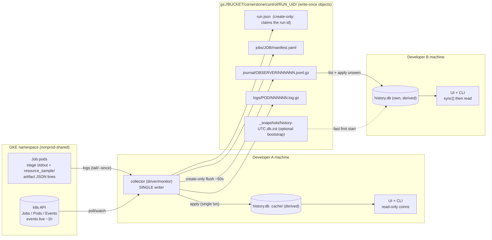

# Plan 04 - Persistence: where a Job's logs, metrics and configuration history live

> **Correction (2 Oct 2026, verified after this plan was written).** This plan says the opaque scratch hashes cannot be recomputed and proposes a per-pod ledger to map tile + stage → artifact. **That is wrong for the current code.** On `origin/run/civ-cie`, `storage.get_cache_decorator` hashes `func.__module__ | func.__qualname__ | version | (name, value) args` (SHA-1, first 12 hex chars). Recomputing it for `emit.workflow(tile_id="20N_090W")` with `version=2` gives `94cbe56c057a`, **exactly** the object written by the real run. (The plan's author most likely used the older git-path recipe on `main`.) Consequences: a ledger is **not needed** to map tiles to artifacts; what is still wanted is a pure `cache_key()` helper in a new stdlib-only module `jdluc/cache_key.py` (called by `storage.get_cache_decorator`; kept out of `jdluc.storage`, which imports pandas and xarray) so the UI/collector reuse the real recipe instead of re-implementing it. Verified for `emit` only; the harmonize/downscale keys depend on the `repr` of enum/dataclass arguments and should be checked the same way before relying on them. Treat every ledger / storage-hook item below as optional.

**Status:** plan only (no code written). **Author scope:** the store and its interface. Plan 01 (k8s library) produces the `JobSpec`/`Run`/`JobStatus` shapes, plan 02 (observability) collects samples/events/logs, plan 03 (UI) reads history. This plan defines the record shapes they exchange and the store behind them, not their internals.

**One-paragraph answer.** Do not commit a SQLite file and do not sync a SQLite file. Make **immutable, write-once objects in GCS the source of truth** (a typed *journal* of records plus log chunks and verbatim manifests, under `cornerstone/control/<run_uid>/`), and keep **SQLite as a local, gitignored, rebuildable read model** (`.cache/`, stdlib `sqlite3`, zero new dependencies) that the collector fills as it goes and that other developers fill with `sync` (pull the journal objects they have not seen). Writers never share a file, so there is nothing to lock, merge or lose; "autosync" becomes "list the bucket, apply new objects idempotently". The same store also carries the `artifacts` catalog that maps tile + stage to the opaque scratch URI.

______________________________________________________________________

## 1. Goals / Non-goals

**Goals**

1. Persist, per Run/Job/Pod: configuration (rendered manifest, resource limits, image digest, code sha, env *names*), resource samples, k8s events, full logs, summaries and alerts - **beyond the Job's `ttlSecondsAfterFinished=1800`** and beyond the k8s Events 1 h TTL.
2. Answer the UI's questions fast: active jobs, a tile's history, a run's peak memory by phase, which pods came close to OOM, why a tile took 75 min.
3. Solve the **tile + stage -> artifact URI** problem (opaque `sha1[:12]` cache names under `SCRATCH_ROOT`).
4. Safe with several developers on different machines and several processes on one machine (collector, UI, CLI).
5. Match the repo ethos (`docs/architecture.md`): start simple, fsspec-backed so local dirs and `gs://` are interchangeable, parquet/JSON for durable data, no new heavy dependency, easy to change.

**Non-goals**

- Not a workflow engine, not a scheduler, not a metrics TSDB (no Prometheus replacement), no alert delivery (plan 02 owns notification; this store only records alerts).
- No change to numerical pipeline behaviour; the two hooks in section 7.5 are logging-only.
- No multi-tenant hosted service in v1 (section 15, question 9, states the trigger for graduating to Postgres).

______________________________________________________________________

## 2. Current state (verified by reading `origin/run/civ-cie`; nothing checked out)

| Precedent / fact                                                                                                                                                                                                                                                                                                                                                                                                                             | Where                                                                          | Relevance                                                                                                                                                                                                                                                                                            |
| -------------------------------------------------------------------------------------------------------------------------------------------------------------------------------------------------------------------------------------------------------------------------------------------------------------------------------------------------------------------------------------------------------------------------------------------- | ------------------------------------------------------------------------------ | ---------------------------------------------------------------------------------------------------------------------------------------------------------------------------------------------------------------------------------------------------------------------------------------------------- |
| Cache key = `sha1("\|".join(module, qualname, version, *(name, value) for bound non-ignored args))[:12]`, file `<root>/<key>.zarr` or `.parquet`; zarr existence probed at `<key>.zarr/zarr.json`                                                                                                                                                                                                                                            | `jdluc/storage.py` (`get_cache_decorator`, `ParquetCacher`, `ZarrCacher`)      | The opaque-name problem. The key is content-blind (no code hash), so the store must record *which code wrote* an artifact.                                                                                                                                                                           |
| Cached stages: `harmonize.workflow` (v0, ignores `skip_ingest`, `ignore_missing_tiles`), `emit.workflow` (v2), `statistical.get_downscaled_luc_emissions` (v1), `statistical.workflow` (v1, parquet), `jurisdictional_direct.workflow` (v2, parquet)                                                                                                                                                                                         | `jdluc/{harmonize,emit,statistical,jurisdictional_direct}.py`                  | These are the `stage` values of the `cache` artifact family.                                                                                                                                                                                                                                         |
| Ingest and export paths are **deterministic** (`<prefix>/<tile_id>.tif` (or `.fgb`, `.parquet`), `{export_root}/{tile_id}.tif`), not hashed; `ingest.workflow` is not cache-decorated                                                                                                                                                                                                                                                        | `jdluc/datasets/base.py`, `jdluc/export.py`                                    | Two more artifact families whose URIs can be derived without any hook.                                                                                                                                                                                                                               |
| `resource_sample` line every 15 s: `{"kind","label","mem_current_gib","mem_pct","io_psi_full_avg10","mem_psi_full_avg10","cpu_psi_full_avg10","write_bytes","localtmp_used_pct"}`; **no timestamp field**, unreadable keys omitted; `resource_summary` at exit has `duration_s`, `peak_mem_pct`, `peak_io_psi_full_avg10`, `peak_localtmp_used_pct`, `total_write_gib`, `mem_events_oom_kill`, `cpu_throttled_s`. `label = "<phase>:<tile>"` | `infra/resource_monitor.py`, `infra/run_phase.py` (`monitor_label`)            | The metric schema. Idempotent re-collection needs a timestamp; today it must come from `kubectl logs --timestamps`. Fix: add `ts_ms` (one line). `mem_current_gib` is cgroup `memory.current`, which **includes page cache** - "88 % of limit" is not the same as OOM risk.                          |
| Run id = `strftime("%m%d%H%M")` (UTC, 8 chars, **no year**, minute resolution) via `dns_safe`; job name `cornerstone-<aoi>-<phase>-<run_id>`; labels `app=cornerstone, phase, run-id`; `ttlSecondsAfterFinished: 1800`; `imagePullPolicy: Always` on a reused tag; `backoffLimitPerIndex: 1`                                                                                                                                                 | `infra/run_aoi.py`, `infra/k8s/phase-job.yaml`                                 | Keys: run ids repeat yearly and can collide within a minute; the image tag does not identify code, the digest does; retries mean several pods per index.                                                                                                                                             |
| Docker image has no `.git` at runtime (decorator uses `func.__module__` "so the image can drop it")                                                                                                                                                                                                                                                                                                                                          | comment in `storage.py`                                                        | Pod-side code sha must come from an env var / image label, not GitPython.                                                                                                                                                                                                                            |
| `tools/measure-drift.py`: per-(methodology,country) parquet + `manifest.json` dataclass (sha, dirty paths, captured_at, scratch_root, row counts, parquet sha256); `--compare-only` re-reads artifacts on disk                                                                                                                                                                                                                               | `tools/measure-drift.py`                                                       | Direct precedent for "parquet + manifest, no database, written once, reread later". Also states the cache is content-blind and keys it as a hazard.                                                                                                                                                  |
| `validation/data/sources.lock.json` (committed, small text: `{path, origin, sha256, bytes, revision}`), `.cache/` gitignored                                                                                                                                                                                                                                                                                                                 | `validation/`, `.gitignore` (`.cache/`, `infra/*.env`)                         | The repo's two conventions: *curated, reviewable* state is committed as small JSON; *machine state* lives in gitignored `.cache/`.                                                                                                                                                                   |
| `infra/cluster.env` (gitignored; template tracked) holds identifiers; `Config.from_dot_env()` requires **all six** fields present (`kuberjobtower`' own settings are in a `.env`, doc 05)                                                                                                                                                                                                                                                    | `infra/cluster.env.example`, `infra/k8s/README.md`                             | Cluster identifiers deliberately stay out of tracked files -> a committed DB containing namespace/node/image/bucket names would break that rule. New settings go in `cluster.env` (read by control-plane tooling), **not** into `jdluc.config.Config` (adding a field breaks every existing `.env`). |
| Dependencies already present: `pyarrow 24.0.0`, `pandas 3.0.3`, `gcsfs 2026.5.0`, `fsspec 2026.3.0`, `google-cloud-storage 3.12.0` (transitive of gcsfs); **absent:** duckdb, sqlalchemy, alembic                                                                                                                                                                                                                                            | `uv.lock`                                                                      | Stdlib `sqlite3` (SQLite 3.51.2 with Python 3.14.2, checked) costs nothing.                                                                                                                                                                                                                          |
| import-linter: `root_packages = ["jdluc","validation"]`; "pipeline never imports the validator"; ETL layers; "Utilities are foundational"                                                                                                                                                                                                                                                                                                    | `pyproject.toml`                                                               | Template for the `kuberjobtower.history` contract (section 7.4).                                                                                                                                                                                                                                     |
| `maverick` (sibling repo) uses Django + Cloud SQL Postgres/PostGIS, has `PipelineRun`/`TaskResult` models and `duckdb>=1.0.0` in deps                                                                                                                                                                                                                                                                                                        | `maverick/pyproject.toml`, `django_config/settings.py`, `docs/ARCHITECTURE.md` | Postgres precedent exists on the AdAstra side, but not in this fork.                                                                                                                                                                                                                                 |
| GCS bucket `.../cornerstone/` holds `ingest/` and `scratch/`; storage-cost-brief proposes lifecycle rules on scratch                                                                                                                                                                                                                                                                                                                         | `docs/orbae/storage-cost-brief.md`                                             | Add `runs/` as a sibling prefix; make sure scratch lifecycle rules do not match it.                                                                                                                                                                                                                  |

______________________________________________________________________

## 3. Honest evaluation of "SQLite in the repo with bucket autosync"

The instinct is half right: SQLite is the right engine for the **read model** the UI/CLI query, and a bucket is the right **durability home**. The combination "one .db file, in the repo, synced to the bucket" does not hold up. Three meanings:

### (i) Commit the `.db` to git - **no**

- Binary file, rewritten on nearly every write (page-level changes): git cannot merge it, each commit stores a near-full new blob (pack delta compression softens but does not fix this), history bloats forever and cannot be pruned without rewriting history.
- A tracked, always-changing file makes the tree permanently dirty. `tools/measure-drift.py` records `git status --porcelain` as provenance; noise there degrades the one place the repo already cares about code-state hygiene.
- Content conflicts with the repo's own rule that cluster identifiers (namespace, node pools, image URIs, bucket names) stay out of tracked files (`infra/*.env` ignored). The DB is full of them. If the repo is or becomes public (it is a fork of `cornerstone-data/luc`), this is also a disclosure issue.
- **What to commit instead:** small, curated, human-reviewable text, exactly like `validation/data/sources.lock.json`: e.g. a generated `docs/runs/<run_uid>.md` or `.json` summary for *notable* runs (the 29 Sept CIV run, a baseline), with identifiers redacted. That is documentation, not a database.

### (ii) DB file in the repo directory, **gitignored**, synced to GCS - **location yes, file-level sync no**

- Location is fine and matches precedent: `.cache/kuberjobtower/history.db` (`.cache/` is already ignored on `main` and on `civ-cie`). Local SSD, same host -> WAL mode is legitimate.
- Whole-file sync loses updates by construction. A uploads v1; B (starting from the old base) uploads v2 -> A's rows are gone. GCS can make this *detectable* (`ifGenerationMatch`: 412 on mismatch [GCS preconditions](https://docs.cloud.google.com/storage/docs/request-preconditions)) but SQLite has no merge, so the loser must re-derive its rows - i.e. you needed a log of changes anyway. It also forces an answer to "who is the source of truth?" for every sync, with no good one.
- Also: GCS allows about 1 write/s per object name ([quotas](https://docs.cloud.google.com/storage/quotas)), so "autosync on every write" to one name throttles; "autosync every N minutes" widens the loss window.
- Acceptable only as a **one-way, read-only bootstrap snapshot** (section 7.3, optional).

### (iii) DB on the bucket only (gcsfuse mount, or open `gs://` as a file) - **no**

- SQLite's own docs: network-filesystem locking "has been known to operate incorrectly ... led to database corruption"; they recommend a client/server DB when data is across a network ([sqlite.org/useovernet](https://sqlite.org/useovernet.html)).
- WAL is explicitly unsupported across hosts: all processes must be on the same host because the wal-index is shared memory ([sqlite.org/wal](https://sqlite.org/wal.html)).
- Cloud Storage FUSE has no file locking and last write wins on concurrent replacement; it is not POSIX ([GCP gcsfuse docs, as summarized in search results; the semantics page itself returned 404 when fetched, so re-verify before relying on specifics](https://docs.cloud.google.com/storage/docs/gcsfuse-integrations)).
- Our writers are four kinds of process at once (collector, UI, CLI, and other developers' machines).

### Sync mechanisms assessed

| Mechanism                                                                                                                     | Verdict                                                                               | Why (sources)                                                                                                                                                                                                                                                                                                                                                                                                                                                                                                                       |
| ----------------------------------------------------------------------------------------------------------------------------- | ------------------------------------------------------------------------------------- | ----------------------------------------------------------------------------------------------------------------------------------------------------------------------------------------------------------------------------------------------------------------------------------------------------------------------------------------------------------------------------------------------------------------------------------------------------------------------------------------------------------------------------------- |
| **Litestream** (local live DB -> continuous replica; restore to local)                                                        | Good *backup of one writer's DB*; not a sharing mechanism; not needed here            | v0.5.x is actively maintained, supports `gs://` replicas (ADC on GCP, key file elsewhere), but one replica destination per DB and a single-writer model ([v0.5.0 post](https://fly.io/blog/litestream-v050-is-here/), [GCS guide](https://litestream.io/guides/gcs/)). It is a Go binary outside `uv`. Our DB is *derived*, so there is nothing to back up. **Revisit** if the collector moves in-cluster with a PVC *and* the DB ever holds non-derivable state (this is the textbook Litestream fit: sidecar + restore at start). |
| **Litestream VFS** (read straight from the replica)                                                                           | Interesting for a hosted read-only UI; not now                                        | Read-only, supports GCS and other backends, ~1 s polling, needs CGO / a loadable extension build (`-tags vfs`) ([VFS guide](https://litestream.io/guides/vfs/)); that is awkward from stock Python `sqlite3`. **VFS write mode** assumes a single writer and only *detects* conflicts ([write mode](https://litestream.io/guides/vfs-write-mode/)); the page does not confirm GCS for write mode.                                                                                                                                   |
| **LiteFS**                                                                                                                    | No                                                                                    | Fly says limited updates and no support, "use with caution"; LiteFS Cloud retired Oct 2024 ([community thread](https://community.fly.io/t/litefs-discontinued/23682)). FUSE + leader lease: far more machinery than this problem.                                                                                                                                                                                                                                                                                                   |
| **`sqlite3 .backup` / `VACUUM INTO` + upload with generation-match**                                                          | Fine as optional bootstrap snapshot, with **unique object names** so no CAS is needed | `Connection.backup()`/`VACUUM INTO` give a consistent copy while the DB is live. Upload `_snapshots/history-<utc>.db.zst` create-only (gcsfs `mode="create"` = `ifGenerationMatch=0`, verified in gcsfs 2026.5.0 source: 412 -> `FileExistsError`; marked "experimental" in its docstring). Readers take the lexicographically greatest name. No overwrite, no lost update. For true CAS on an existing name use `google-cloud-storage` (`if_generation_match=`), already installed transitively.                                   |
| **Object versioning / soft-delete on the bucket**                                                                             | Cheap insurance for `runs/`, not a sync tool                                          | Protects against accidental deletes of journal objects; verify bucket soft-delete setting (not read-only checkable from this repo).                                                                                                                                                                                                                                                                                                                                                                                                 |
| **SQLite over HTTP range requests** ([sql.js-httpvfs](https://github.com/phiresky/sql.js-httpvfs): read-only, static hosting) | Possible later for a static, serverless UI reading a published snapshot               | Needs CORS + signed/public access to the snapshot; read-only; defer.                                                                                                                                                                                                                                                                                                                                                                                                                                                                |

**Verdict on the user's sentence:** *adopt* SQLite (stdlib) as the local read model and *adopt* the bucket as the shared durable store; *change* "sync the db file" to "sync immutable records the db is derived from"; *change* "in the repo" to "next to the repo, ignored" (`.cache/`), plus curated summaries (not the DB) in git when a run deserves a permanent record.

______________________________________________________________________

## 4. Options and decision matrix

Options: **A** SQLite committed to git; **B** SQLite local+gitignored, whole-file sync; **C** SQLite on gcsfuse/bucket; **D** SQLite + Litestream; **E** Parquet/JSONL run bundles only, read with pyarrow/pandas; **F** Parquet bundles + DuckDB; **G (recommended)** immutable journal in GCS + local SQLite read model; **H** Cloud SQL Postgres (new schema on the instance maverick already runs); **I** Firestore.

|                              | Setup cost                                                                                                                        | Concurrency safety                                                                                                            | Multi-developer sharing                                    | UI query ergonomics                                                                                                                                                                                                                  | Offline / local-first                            | Cost                            | Fit with repo ethos                                                                         | Failure modes                                                     |
| ---------------------------- | --------------------------------------------------------------------------------------------------------------------------------- | ----------------------------------------------------------------------------------------------------------------------------- | ---------------------------------------------------------- | ------------------------------------------------------------------------------------------------------------------------------------------------------------------------------------------------------------------------------------ | ------------------------------------------------ | ------------------------------- | ------------------------------------------------------------------------------------------- | ----------------------------------------------------------------- |
| **A** git .db                | none                                                                                                                              | none (merge impossible)                                                                                                       | via git, conflicts                                         | SQL                                                                                                                                                                                                                                  | yes                                              | repo bloat                      | **violates** (binary, identifiers, dirty tree)                                              | merge conflicts, leaked infra names                               |
| **B** file sync              | low                                                                                                                               | lost updates on every race                                                                                                    | one writer of record only                                  | SQL                                                                                                                                                                                                                                  | yes                                              | ~0                              | partial                                                                                     | silent data loss; "who wins?"                                     |
| **C** on bucket              | low                                                                                                                               | unsafe (no locks, no shm)                                                                                                     | nominally shared                                           | SQL                                                                                                                                                                                                                                  | no                                               | ~0                              | violates SQLite's own guidance                                                              | corruption                                                        |
| **D** Litestream             | medium (Go binary, config)                                                                                                        | single writer                                                                                                                 | restore only                                               | SQL                                                                                                                                                                                                                                  | yes                                              | ~0                              | adds non-Python tool                                                                        | backs up derived data; 1 replica/DB                               |
| **E** parquet/JSONL only     | low                                                                                                                               | **safe** (writers never share a file)                                                                                         | **good** (bucket)                                          | poor for live "active jobs", many small objects over network; awkward joins                                                                                                                                                          | partial                                          | ~0                              | **good** (precedent: measure-drift)                                                         | slow cold reads, hand-rolled joins                                |
| **F** + DuckDB               | medium (new native dep)                                                                                                           | safe for files; DuckDB itself is single read-write process ([docs](https://duckdb.org/docs/current/connect/concurrency.html)) | good                                                       | SQL, nice on parquet; GCS needs HMAC keys or a slower fsspec bridge ([GCS guide](https://duckdb.org/docs/current/guides/network_cloud_storage/gcs_import.html), [fsspec](https://duckdb.org/docs/current/guides/python/filesystems)) | good                                             | ~0                              | new dep for a 40 MB problem (maverick already depends on it, so the team knows it)          | does not remove the need for a mutable "active jobs" view         |
| **G** journal + SQLite index | low-medium (~400 lines, no deps)                                                                                                  | **safe**: objects are write-once; DB has one writer per machine                                                               | **good**: `sync` pulls others' objects; each DB is private | SQL, indexed, instant                                                                                                                                                                                                                | **good**: same code on `file://`; DB rebuildable | ~0 (section 12)                 | **good**: fsspec, stdlib, parquet later, rebuildable                                        | collector gap (section 7.6), journal parsing bugs (rebuild fixes) |
| **H** Postgres               | high: credentials on laptops, proxy, IAM/schema outside "namespace-only privileges", couples this fork to AdAstra's prod instance | excellent                                                                                                                     | excellent                                                  | excellent                                                                                                                                                                                                                            | **no** (needs network + creds)                   | instance already paid           | **violates** "keep options open, lightweight", and the fork's "nothing requires GCS" stance | outage blocks run recording; credentials sprawl                   |
| **I** Firestore              | medium (API enable, IAM)                                                                                                          | good                                                                                                                          | good                                                       | weak (no joins/aggregates; peak-by-phase is client-side)                                                                                                                                                                             | no                                               | per-op pricing on ~270k samples | poor                                                                                        | lock-in                                                           |

**Recommendation: G**, with SQL written portably (TEXT/INTEGER/REAL, partial indexes, `ON CONFLICT` upserts) so that **H** remains a mechanical port if a hosted multi-user UI arrives. DuckDB is optional tooling for ad-hoc analysis over the optional parquet bundles; it is **not** added as a dependency.

______________________________________________________________________

## 5. Recommendation in detail

1. **Truth = write-once objects** under `KJT_HISTORY_ROOT` (v1 value: `gs://us-central1-maverick-yarosl-0b64509f-bucket/cornerstone/control/`; `file://.../.cache/runs` offline). Nothing in GCS is ever overwritten except by creating a *new* name.
2. **Read model = SQLite** in `.cache/kuberjobtower/history.db` (override `KJT_HISTORY_DB`), built only by applying records. Schema version mismatch => rebuild from the journal (no Alembic).
3. **Writers:** exactly one *collector* per observing machine (the process that drives/monitors a run: plan 01's driver or plan 02's monitor). It applies records to its own DB and flushes them as a journal chunk. UI and CLI processes only read (read-only connection) and call `sync()` for runs observed elsewhere.
4. **Logs:** full logs are GCS chunk objects written by the collector; Cloud Logging is the fallback, not the system of record (section 10).
5. **Artifacts catalog:** records emitted from `storage.get_cache_decorator` at write/hit time (the source of truth) plus a pure `cache_key()` helper factored out of the decorator for backfill (section 7.5).
6. **Retention:** the local DB is a *window* (default last 180 days of journal); the journal is kept; logs get a bucket lifecycle rule (default 90 days).

______________________________________________________________________

## 6. Record shapes (interface with plans 01/02/03)

Everything crossing the boundary is one JSON object per line, versioned and typed. Plans 01/02 produce them; plan 03 never sees them (it calls the read API).

```json
{"v":1,"t":"sample","run":"202609291015","pod":"<pod_id>","ts":1790003600000,
 "d":{"mem_current_gib":52.9,"mem_pct":88.2,"io_psi_full_avg10":7.0,"mem_psi_full_avg10":0.4,
      "cpu_psi_full_avg10":1.1,"write_bytes":812345678,"localtmp_used_pct":41.0}}
```

| `t`            | Natural key                       | Merge rule on re-apply                                                 | Produced by                                                    |
| -------------- | --------------------------------- | ---------------------------------------------------------------------- | -------------------------------------------------------------- |
| `run`          | `run_uid`                         | latest `observed_ms` wins; `finished_ms/status` terminal-sticky        | plan 01 at submit/finish                                       |
| `config`       | `config_sha`                      | first wins (content-addressed)                                         | plan 01 (normalized spec + hash)                               |
| `job`          | `job_id` = `<run_uid>/<job_name>` | latest wins; `succeeded/failed/deleted` sticky                         | plan 01 poll                                                   |
| `job_tiles`    | `(job_id, idx)`                   | first wins                                                             | plan 01 (the sorted tile list the Indexed Job resolves in-pod) |
| `pod`          | `pod_id` = `<job_id>/<pod_name>`  | latest wins; terminal phase sticky; summaries filled at finalize       | plan 01/02                                                     |
| `sample`       | `(pod_id, ts_ms)`                 | insert-or-ignore                                                       | plan 02 (parse `resource_sample` lines)                        |
| `event`        | `event_id`                        | upsert: `count = max`, `last_ms = max`                                 | plan 02 (k8s Events, driver notes)                             |
| `artifact`     | `uri`                             | first wins for `created_ms`; later fields (`bytes`, `present`) fill in | pod stdout line -> collector                                   |
| `artifact_use` | `(pod_id, uri, outcome)`          | insert-or-ignore                                                       | pod stdout line -> collector                                   |
| `log_ref`      | `uri`                             | insert-or-ignore                                                       | collector after writing a chunk                                |
| `log_mark`     | `(pod_id, ts_ms, line_no)`        | insert-or-ignore                                                       | collector (regex: Traceback, OOM, `resource_summary`)          |
| `alert`        | `alert_id` = `<rule>:<pod_id>`    | latest wins; `closed_ms` sticky                                        | plan 02                                                        |

**Interface surface (names only):**

- `Journal(root, observer_id).append(run_uid, records) -> uri` (create-only chunk), `.list(run_uid)`, `.read(uri)`.
- `Store.open(path)`; `Store.apply(records)`; `Store.sync(run_uids=None, since=None) -> int`; `Store.rebuild(since=None)`; `Store.close()`.
- Reads for plan 03: `active_jobs()`, `runs(limit)`, `run(run_uid)`, `jobs(run_uid)`, `pods(job_id)`, `tile_history(tile_id)`, `peak_by_phase(run_uid)`, `near_limit(pct=85)`, `samples(pod_id, since_ms=None, max_points=None)`, `events(run_uid|pod_id)`, `log_refs(pod_id)`, `artifacts_for(tile_id, only_present=True)` (latest row per `(stage, qualifier)`).
- `artifacts_for` is the **tile+stage -> URI** answer. For `ingest` and `export` families, plan 03 can alternatively derive URIs from `Dataset.get_prefix(tile_id)` and `export._output_uri`; the catalog adds `bytes`, `created_ms`, `present`, and who wrote it.

______________________________________________________________________

## 7. Architecture



### 7.1 Object layout

```
gs://<bucket>/cornerstone/control/<run_uid>/
  run.json                          # create-only; claim + spec + image digest + git shas (atomic id-collision check)
  jobs/<job_name>/manifest.yaml     # verbatim rendered manifest, env VALUES redacted except an allowlist
  journal/<observer>/<seq:06d>.jsonl.gz   # typed records, ~1 object/min/observer while a run is active
  logs/<pod_name>/<seq:06d>.log.gz        # ~1 object per 5 min or 1 MiB per pod; final chunk flagged by a log_ref record
gs://<bucket>/cornerstone/control/_snapshots/history-<utc>.db.zst   # optional
```

`observer` = `<hostname>-<pid>-<start_ms>` (unique per collector process). Chunk names are unique by construction, so even an accidental duplicate writer cannot overwrite; `run.json` is the only name two parties might race on and is written create-only (`fs.pipe_file(path, data, mode="create")`; `FileExistsError` = "run id already used, pick another"). If gcsfs's experimental create-mode misbehaves, fall back to `google-cloud-storage` with `if_generation_match=0` for that one object.

### 7.2 Write path (collector)

1. Poll/tail (plan 02 owns how) -> build records -> `Store.apply(records)` in one transaction -> append to an in-memory buffer.
2. Every ~60 s or 500 records: gzip -> `Journal.append` (create-only). Log chunks flushed per pod every ~5 min/1 MiB and at pod terminal state; each emits a `log_ref`.
3. At pod terminal: compute `peak_*`, `n_samples`, `duration_s`, `oom_kill_count` from samples + the `resource_summary` line, emit a final `pod` record (so summaries survive any later sample pruning).
4. At run end: final `run` record; optional parquet bundle (section 13, step 9). Crash safety: a killed collector loses at most one flush interval of *its own* buffer; a restarted collector re-reads pod logs `--since-time <last ts in DB>` and re-applies (insert-or-ignore on `(pod_id, ts_ms)`).

### 7.3 Read / sync path

- **Same machine as collector:** UI/CLI open `file:.cache/kuberjobtower/history.db?mode=ro`; WAL lets them read while the collector writes. WAL is legitimate only because the DB is on a local disk of one host (never put `.cache/` on NFS, a synced folder, or gcsfuse).
- **Other machines:** `Store.sync()` lists `journal/` for runs that are active or newer than the watermark, skips URIs already in `ingested_objects`, applies the rest with `foreign_keys=OFF` (chunks may arrive before their parent rows) followed by `PRAGMA foreign_key_check`. Lag = flush interval. Poll at most every 60 s while a run is open in the UI; list calls are Class A operations but trivial in volume.
- **Cold start:** `sync --since 180d` lists a few thousand objects (section 12). Optional: `VACUUM INTO` snapshot published create-only so a new machine downloads one file first, then syncs the tail.

### 7.4 Access layer and import-linter

- **stdlib `sqlite3`** with `Row`, explicit transactions, hand-written SQL in two modules; frozen dataclasses for the record shapes. SQLAlchemy/SQLModel are not installed and an ORM over 14 tables with ~12 queries buys nothing; Alembic needs SQLAlchemy.
- Connection pragmas (per connection): `foreign_keys=ON` (OFF only in `sync`), `journal_mode=WAL`, `synchronous=NORMAL`, `busy_timeout=5000`; read-only connections via URI `mode=ro`.
- Module: the **`kuberjobtower.history`** subpackage of the single `kuberjobtower/` package (decided 2 Oct 2026), a sibling of the cluster layer; the UI (`controlplane`, doc 03) reads it through `queries.py`:
  ```
  kuberjobtower/history/records.py   # record dataclasses + JSON (de)serialization, v=1
  kuberjobtower/history/journal.py   # fsspec: create-only append, list, read; local and gs:// identical
  kuberjobtower/history/schema.sql   # section 8 DDL
  kuberjobtower/history/db.py        # connect, SCHEMA_VERSION check, apply(), sync(), rebuild(), prune()
  kuberjobtower/history/queries.py   # named read queries for the UI and CLI
  ```
  CLI: `uv run python -m kuberjobtower history runs|show|tile|near-oom|sync|rebuild|prune`.
- `pyproject.toml` contracts (`root_packages = ["jdluc", "validation", "kuberjobtower"]`; the full set is in plan 01 section 5.3). The ones that matter for history:
  ```toml
  [[tool.importlinter.contracts]]
  name = "kuberjobtower.history depends on neither the cluster layer nor the UI"
  type = "forbidden"
  source_modules = ["kuberjobtower.history"]
  forbidden_modules = ["kuberjobtower.cluster", "kuberjobtower.manifest", "kuberjobtower.run", "controlplane", "lightkube"]

  [[tool.importlinter.contracts]]
  name = "kuberjobtower.history sees the pipeline only through the stdlib-only cache_key module"
  type = "forbidden"
  source_modules = ["kuberjobtower.history"]
  forbidden_modules = [
      "validation", "jdluc.storage", "jdluc.attribute", "jdluc.emit", "jdluc.harmonize", "jdluc.ingest",
      "jdluc.jurisdictional_direct", "jdluc.statistical", "jdluc.trace", "jdluc.export", "jdluc.datasets",
  ]
  ```
  `kuberjobtower.history` may import `jdluc.cache_key` (a new stdlib-only module holding the pure `cache_key()` function that `jdluc.storage.get_cache_decorator` also calls; **not** `jdluc.storage`, which imports pandas and xarray and would make the UI heavy) and `jdluc.tiling`. The pod-side hooks only `logger.info(json.dumps(...))` and import nothing from `kuberjobtower`, so the pipeline-never-imports rule holds with no exceptions.

### 7.5 The artifact problem: three families, two hooks

| Family   | URI                                                   | Mechanism                                                                                                                                                                                                                                                                                                                                                                      |
| -------- | ----------------------------------------------------- | ------------------------------------------------------------------------------------------------------------------------------------------------------------------------------------------------------------------------------------------------------------------------------------------------------------------------------------------------------------------------------ |
| `ingest` | deterministic `<prefix>/<tile>.tif` (or fgb, parquet) | derive from `Dataset.get_prefix`; optionally log `{"kind":"artifact","family":"ingest","stage":"ingest:<dataset>","uri":...,"duration_s":...}` per (dataset, tile) from `run_ingest` (this is what splits the 75 min per dataset)                                                                                                                                              |
| `cache`  | opaque `sha1[:12]`                                    | **Hook 1** in `storage.get_cache_decorator.inner`: after the hit/miss decision log one JSON line `{"v":1,"kind":"artifact","family":"cache","stage":"<module>.<qualname>","version":N,"cache_key":"..","uri":"..","outcome":"hit or miss","duration_s":..,"tile_id":..,"args":{..}}`. `args` are the same bound non-ignored values the hash already stringifies. Logging only. |
| `export` | `{export_root}/{tile_id}.tif`                         | derive; or log from `run_export`                                                                                                                                                                                                                                                                                                                                               |

**Hook 1 prerequisites:** factor the hash into a pure `jdluc.cache_key.cache_key(module, qualname, version, bound_arguments) -> str` used by the decorator and by `kuberjobtower.history` for backfill (recompute for tiles that already have scratch artifacts). Add a golden test that the refactor leaves existing keys unchanged (e.g. the known `94cbe56c057a` / `ca71c82005a9` stores for their args). Backfilled keys are only trustworthy for the code version that wrote them (a changed `DatasetName` list or default arg changes the key), which is why the **write-time record is the truth** and the recompute is a convenience flagged `present` by an existence probe. Because the key is content-blind (`measure-drift.py` docstring), each artifact row carries `run_uid -> runs.git_sha`, and `artifact_uses` shows when a later run merely **hit** an older writer's output.

**Hook 2** (infra, not pipeline): `infra/resource_monitor.py` adds `"v":1,"ts_ms":<epoch ms>` to `resource_sample`/`resource_summary` lines. Without it the timestamp comes from `kubectl logs --timestamps` (nanosecond RFC3339, also stable, so the pipeline still works - just parse the prefix).

### 7.6 Collector gaps, and what actually protects data

| Data                                                                                                                                                                                                                                                                   | Natural lifetime                                                                                                      | Protection                                                                                                                                                                                                                        |
| ---------------------------------------------------------------------------------------------------------------------------------------------------------------------------------------------------------------------------------------------------------------------- | --------------------------------------------------------------------------------------------------------------------- | --------------------------------------------------------------------------------------------------------------------------------------------------------------------------------------------------------------------------------- |
| Pod stdout                                                                                                                                                                                                                                                             | gone ~30 min after Job end (`ttlSecondsAfterFinished=1800`); also kubelet rotation                                    | collector tails during the run; **raise ttl to >=6 h** (one-line manifest change in plan 01); Cloud Logging (if enabled) as backfill source                                                                                       |
| k8s Events                                                                                                                                                                                                                                                             | apiserver default 1 h, not configurable on managed GKE ([source](https://radarhq.io/blog/kubernetes-event-retention)) | collector must be running while a job is live; no backfill possible - the one irrecoverable class                                                                                                                                 |
| Pod/Job status                                                                                                                                                                                                                                                         | until TTL                                                                                                             | final `pod`/`job` records at terminal state                                                                                                                                                                                       |
| Samples                                                                                                                                                                                                                                                                | in stdout only                                                                                                        | as stdout; optional pod-side chunk upload (every 5 min, `gs://.../runs/<uid>/journal/pod-<name>/...`) makes metrics independent of the collector - same record shape, deduped on `(pod_id, ts_ms)`; S effort if gaps are observed |
| A laptop that sleeps is the realistic failure. v1 accepts it (events lost, logs/samples recoverable if within TTL or from Cloud Logging); plan 01/02 may later move the collector into the cluster (needs namespace RBAC for pods, pods/log, events: open question 2). |                                                                                                                       |                                                                                                                                                                                                                                   |

______________________________________________________________________

## 8. Schema (SQLite, `PRAGMA user_version = 1`)

Conventions: times are epoch **milliseconds** UTC (`*_ms`); `STRICT` tables; natural text keys; `phase` is free text (new phases need no migration); no secrets (env *names* only). Derived data: any column here can be recomputed from the journal.

```sql
-- run-history store, schema v1. Derived/rebuildable from the journal; times are epoch milliseconds (UTC).
PRAGMA foreign_keys = ON;

CREATE TABLE runs (
  run_uid      TEXT PRIMARY KEY,                 -- '<year><run_id>' e.g. '202609291015' (sortable; run_id alone has no year)
  run_id       TEXT NOT NULL,                    -- 8-char MMDDHHMM, as in k8s labels / job names
  aoi          TEXT NOT NULL,                    -- 'CIV' or 'HND-NIC'
  methodology  TEXT,
  status       TEXT NOT NULL DEFAULT 'running'
               CHECK (status IN ('running','succeeded','failed','aborted')),
  started_ms   INTEGER NOT NULL,
  finished_ms  INTEGER,
  git_sha      TEXT NOT NULL,                    -- sha BAKED INTO THE IMAGE (image label/build arg); authoritative
  driver_git_sha TEXT,                           -- checkout the driver ran from; differs => image is stale vs working tree
  git_branch   TEXT,
  git_dirty    INTEGER NOT NULL DEFAULT 0 CHECK (git_dirty IN (0,1)),
  image        TEXT,
  image_digest TEXT,
  cluster      TEXT,
  namespace    TEXT,
  submitted_by TEXT,                           -- same value as the kuber-job-tower/owner label on the Jobs (doc 01 section 5.15)
  spec_json    TEXT NOT NULL DEFAULT '{}',       -- CLI args as given (iso list, flags); never secrets
  observed_ms  INTEGER NOT NULL
) STRICT;
CREATE INDEX runs_started ON runs (started_ms DESC);

-- Normalized, de-duplicated job configuration: "configuration history" = distinct config_sha over time.
CREATE TABLE configs (
  config_sha      TEXT PRIMARY KEY,              -- sha256 of canonical normalized_json
  normalized_json TEXT NOT NULL,                 -- resources, node pool, image digest, deadlines, env NAMES (+allowlisted values)
  first_seen_ms   INTEGER NOT NULL
) STRICT;

CREATE TABLE jobs (
  job_id           TEXT PRIMARY KEY,             -- '<run_uid>/<job_name>'
  run_uid          TEXT NOT NULL REFERENCES runs (run_uid) ON DELETE CASCADE,
  job_name         TEXT NOT NULL,
  phase            TEXT NOT NULL,                -- free text on purpose: 'ingest-tiles','compute','compare',... (new phases need no migration)
  config_sha       TEXT REFERENCES configs (config_sha),
  manifest_uri     TEXT,                         -- gs://.../manifest.yaml (verbatim rendered manifest)
  completions      INTEGER, parallelism INTEGER,
  node_pool        TEXT,
  cpu_request      TEXT, cpu_limit TEXT,
  mem_request_gib  REAL, mem_limit_gib REAL,
  localtmp_gib     REAL, pod_deadline_s INTEGER, backoff_limit_per_index INTEGER,
  state            TEXT NOT NULL DEFAULT 'pending'
                   CHECK (state IN ('pending','running','succeeded','failed','deleted')),
  created_ms       INTEGER, started_ms INTEGER, finished_ms INTEGER,
  n_succeeded      INTEGER, n_failed INTEGER, failed_indexes TEXT,
  observed_ms      INTEGER NOT NULL,
  UNIQUE (run_uid, job_name)
) STRICT;
CREATE INDEX jobs_run     ON jobs (run_uid, created_ms);
CREATE INDEX jobs_active  ON jobs (state) WHERE state IN ('pending','running');
CREATE INDEX jobs_config  ON jobs (config_sha);

CREATE TABLE tiles (                              -- optional dimension; tile properties that explain durations
  tile_id       TEXT PRIMARY KEY,                 -- '10N_010W'
  land_fraction REAL,                             -- NULL until measured (ocean tiles compress ~135:1 and run differently)
  notes         TEXT
) STRICT;

CREATE TABLE job_tiles (                          -- index -> tile; lets the UI show tiles that have no pod yet
  job_id      TEXT NOT NULL REFERENCES jobs (job_id) ON DELETE CASCADE,
  idx         INTEGER NOT NULL,
  tile_id     TEXT NOT NULL,
  PRIMARY KEY (job_id, idx)
) STRICT, WITHOUT ROWID;
CREATE INDEX job_tiles_tile ON job_tiles (tile_id);

CREATE TABLE pods (                               -- one row per attempt
  pod_id           TEXT PRIMARY KEY,              -- '<job_id>/<pod_name>'
  job_id           TEXT NOT NULL REFERENCES jobs (job_id) ON DELETE CASCADE,
  pod_name         TEXT NOT NULL,
  pod_uid          TEXT,
  idx              INTEGER,                       -- JOB_COMPLETION_INDEX (NULL for non-indexed jobs)
  attempt          INTEGER NOT NULL DEFAULT 0,    -- 0-based per idx, by creation order
  tile_id          TEXT,                          -- denormalized from job_tiles
  node_name        TEXT, node_pool TEXT,
  image_digest     TEXT,                          -- pod.status.containerStatuses[].imageID: the tag is reused, the digest is not
  phase            TEXT NOT NULL DEFAULT 'Pending'
                   CHECK (phase IN ('Pending','Running','Succeeded','Failed','Unknown')),
  reason           TEXT,                          -- Completed | OOMKilled | Error | DeadlineExceeded | Evicted
  exit_code        INTEGER,
  created_ms       INTEGER, scheduled_ms INTEGER, started_ms INTEGER, finished_ms INTEGER,
  -- summaries, materialized at finalize from samples + the resource_summary line; they survive sample retention
  duration_s       REAL,
  peak_mem_gib     REAL, peak_mem_pct REAL,
  peak_io_psi      REAL, peak_mem_psi REAL, peak_cpu_psi REAL,
  peak_localtmp_pct REAL, total_write_gib REAL, cpu_throttled_s REAL,
  oom_kill_count   INTEGER,
  n_samples        INTEGER NOT NULL DEFAULT 0,
  observed_ms      INTEGER NOT NULL,
  UNIQUE (job_id, pod_name)
) STRICT;
CREATE INDEX pods_job        ON pods (job_id, idx, attempt);
CREATE INDEX pods_tile       ON pods (tile_id, created_ms DESC);
CREATE INDEX pods_active     ON pods (phase) WHERE phase IN ('Pending','Running');
CREATE INDEX pods_near_limit ON pods (peak_mem_pct DESC) WHERE peak_mem_pct >= 80;

CREATE TABLE samples (                            -- from resource_monitor 'resource_sample' lines; ~4/min/pod
  pod_id             TEXT NOT NULL REFERENCES pods (pod_id) ON DELETE CASCADE,
  ts_ms              INTEGER NOT NULL,
  mem_current_gib    REAL, mem_pct REAL,
  io_psi_full_avg10  REAL, mem_psi_full_avg10 REAL, cpu_psi_full_avg10 REAL,
  write_bytes        INTEGER,
  localtmp_used_pct  REAL,
  PRIMARY KEY (pod_id, ts_ms)                     -- idempotent re-collection: INSERT OR IGNORE
) STRICT, WITHOUT ROWID;

CREATE TABLE events (                             -- k8s Events (1 h apiserver TTL!), driver and collector notes
  event_id   TEXT PRIMARY KEY,                    -- k8s event uid, or sha1(source|object|reason|first_ms|message)
  run_uid    TEXT NOT NULL REFERENCES runs (run_uid) ON DELETE CASCADE,
  job_id     TEXT REFERENCES jobs (job_id) ON DELETE CASCADE,
  pod_id     TEXT REFERENCES pods (pod_id) ON DELETE CASCADE,
  source     TEXT NOT NULL CHECK (source IN ('k8s','driver','collector')),
  type       TEXT NOT NULL CHECK (type IN ('Normal','Warning')),
  reason     TEXT NOT NULL,                       -- Scheduled, FailedScheduling, TriggeredScaleUp, OOMKilled, ...
  message    TEXT,
  first_ms   INTEGER NOT NULL, last_ms INTEGER NOT NULL, count INTEGER NOT NULL DEFAULT 1
) STRICT;
CREATE INDEX events_pod  ON events (pod_id, first_ms);
CREATE INDEX events_run  ON events (run_uid, first_ms);
CREATE INDEX events_warn ON events (reason, first_ms) WHERE type = 'Warning';

CREATE TABLE artifacts (                          -- the catalog: (tile, stage) -> uri, for opaque AND deterministic paths
  uri         TEXT PRIMARY KEY,                   -- natural key; works for cache-keyed and plain paths alike
  family      TEXT NOT NULL CHECK (family IN ('cache','ingest','export')),
  stage       TEXT NOT NULL,                      -- cache: 'jdluc.emit.workflow'; ingest: 'ingest:<dataset>'; export: 'export'
  kind        TEXT NOT NULL CHECK (kind IN ('zarr','parquet','cog','fgb','vrt','other')),
  cache_key   TEXT,                               -- family='cache' only: 12-hex sha1 prefix from storage.get_cache_decorator
  version     INTEGER,                            -- family='cache' only: the hand-written cache version int
  tile_id     TEXT,                               -- NULL for whole-world / non-tile artifacts
  qualifier   TEXT,                               -- e.g. iso_3166 for the attribute parquet
  args_json   TEXT,                               -- the bound, non-ignored args that were hashed (cache family)
  bytes       INTEGER,                            -- NULL until measured (zarr = thousands of objects; measure lazily)
  created_ms  INTEGER NOT NULL,                   -- when first WRITTEN (miss), not last hit
  run_uid     TEXT REFERENCES runs (run_uid) ON DELETE SET NULL,
  pod_id      TEXT REFERENCES pods (pod_id) ON DELETE SET NULL,
  present     INTEGER CHECK (present IN (0,1)),   -- NULL = never verified; scratch has lifecycle rules, rows can go stale
  verified_ms INTEGER
) STRICT;
CREATE INDEX artifacts_tile_stage ON artifacts (tile_id, stage, created_ms DESC);
CREATE INDEX artifacts_key        ON artifacts (cache_key) WHERE cache_key IS NOT NULL;

CREATE TABLE artifact_uses (                      -- who touched it: miss = this pod wrote it; hit = reuse (proves warm cache)
  pod_id     TEXT NOT NULL REFERENCES pods (pod_id) ON DELETE CASCADE,
  uri        TEXT NOT NULL,                       -- no FK on purpose: a use can be journaled before its artifact row
  outcome    TEXT NOT NULL CHECK (outcome IN ('miss','hit')),
  ts_ms      INTEGER NOT NULL,
  duration_s REAL,                                -- wall time inside the decorated call; INCLUSIVE of nested cached calls
  PRIMARY KEY (pod_id, uri, outcome)
) STRICT, WITHOUT ROWID;
CREATE INDEX artifact_uses_uri ON artifact_uses (uri);

CREATE TABLE log_objects (                        -- pointers; the bytes live in GCS (or Cloud Logging)
  uri         TEXT PRIMARY KEY,                   -- gs://.../logs/<pod_name>/000003.log.gz
  pod_id      TEXT NOT NULL REFERENCES pods (pod_id) ON DELETE CASCADE,
  seq         INTEGER NOT NULL,
  kind        TEXT NOT NULL DEFAULT 'gcs' CHECK (kind IN ('gcs','cloud_logging')),
  first_ms    INTEGER, last_ms INTEGER,
  line_count  INTEGER, bytes INTEGER,
  is_final    INTEGER NOT NULL DEFAULT 0,
  UNIQUE (pod_id, seq)
) STRICT;

CREATE TABLE log_marks (                          -- jump targets inside logs: Traceback, OOM, 'Saving to', resource_summary
  pod_id      TEXT NOT NULL REFERENCES pods (pod_id) ON DELETE CASCADE,
  ts_ms       INTEGER NOT NULL,
  level       TEXT NOT NULL,
  log_uri     TEXT NOT NULL,
  line_no     INTEGER NOT NULL,                   -- 1-based within that object
  snippet     TEXT NOT NULL,                      -- <= 240 chars
  PRIMARY KEY (pod_id, ts_ms, line_no)
) STRICT, WITHOUT ROWID;

CREATE TABLE alerts (
  alert_id   TEXT PRIMARY KEY,                    -- '<rule>:<pod_id>' : one open alert per rule per pod
  rule       TEXT NOT NULL,                       -- mem_near_limit | io_psi_high | oom_killed | unschedulable | deadline
  severity   TEXT NOT NULL CHECK (severity IN ('info','warn','crit')),
  run_uid    TEXT NOT NULL REFERENCES runs (run_uid) ON DELETE CASCADE,
  job_id     TEXT REFERENCES jobs (job_id) ON DELETE CASCADE,
  pod_id     TEXT REFERENCES pods (pod_id) ON DELETE CASCADE,
  opened_ms  INTEGER NOT NULL, closed_ms INTEGER,
  value      REAL, threshold REAL, detail TEXT
) STRICT;
CREATE INDEX alerts_open ON alerts (opened_ms DESC) WHERE closed_ms IS NULL;

-- Bookkeeping so sync is idempotent and resumable.
CREATE TABLE ingested_objects (
  uri          TEXT PRIMARY KEY,
  generation   INTEGER NOT NULL,
  ingested_ms  INTEGER NOT NULL
) STRICT, WITHOUT ROWID;
```

**Keys and idempotency.**

- `run_uid = <yyyymmddHHMM>-<4 base36>` (e.g. `202610021423-k7q2`), generated once at submit and stamped on every Job as the annotation `cornerstone.adastra.eco/run-uid`. The k8s-facing `run-id` (`MMDDHHMM`, user-overridable) is **unchanged**, so nothing in the existing Job naming moves. The random suffix makes two people submitting in the same minute collision-free with no coordination (the other plan's year-only id relied on create-only `run.json` to turn a collision into an error; the suffix prevents it). The user is not in the id: `created_by` and `namespace` are fields. Job names stay `cornerstone-{aoi}-{phase}-{run_id}` and fit the 63-character limit (property-tested in plan 01).
- `job_id`, `pod_id` are readable composites of natural names, deterministic across machines and rebuilds (no surrogate ids that differ between DBs). `samples` is the only big table (`WITHOUT ROWID`, PK `(pod_id, ts_ms)`); re-collecting is `INSERT OR IGNORE`.
- Retries: `pods.attempt` = creation order within `(job_id, idx)`.
- Terminal states are sticky in `apply()` (a late "Running" observation never regresses a "Succeeded" pod).

**Migrations.** `user_version` = code's `SCHEMA_VERSION`. On open: equal -> go; code newer -> **drop and rebuild from the journal** (`sync --rebuild`); DB newer -> refuse. Rationale: the DB is a cache of immutable objects, so a migration framework would be machinery guarding data that can be regenerated. Revisit only when the DB gains non-derivable state (e.g. alert acknowledgements, notes) - and then journal those as records too, preserving rebuildability. A list-of-SQL-strings migrator keyed on `user_version` is the fallback if rebuild ever becomes too slow (about 20 lines).

### Sample queries

```sql
-- 1. Active jobs (partial index jobs_active)
SELECT j.job_id, j.phase, j.state, j.n_succeeded, j.completions, r.aoi
FROM jobs j JOIN runs r USING (run_uid)
WHERE j.state IN ('pending','running') ORDER BY j.created_ms;

-- 2. A tile's history (pods_tile)
SELECT j.run_uid, j.phase, p.attempt, p.reason, round(p.duration_s/60.0,1) AS minutes,
       p.peak_mem_pct, p.peak_io_psi, p.node_pool
FROM pods p JOIN jobs j USING (job_id) WHERE p.tile_id = :tile ORDER BY p.created_ms DESC;

-- 3. A run's peak memory by phase
SELECT j.phase, count(*) AS pods, round(max(p.peak_mem_gib),1) AS peak_gib,
       round(max(p.peak_mem_pct),1) AS peak_pct, round(max(p.peak_io_psi),1) AS peak_io_psi
FROM pods p JOIN jobs j USING (job_id) WHERE j.run_uid = :run
GROUP BY j.phase ORDER BY min(j.created_ms);

-- 4. Which pods came close to OOM (peak AND actual kills; page cache inflates mem_pct)
SELECT p.pod_id, p.peak_mem_gib, p.peak_mem_pct, p.reason, p.oom_kill_count
FROM pods p WHERE p.peak_mem_pct >= 85 OR p.oom_kill_count > 0 OR p.reason = 'OOMKilled'
ORDER BY p.peak_mem_pct DESC;

-- 5. Why did this tile take N minutes: stall share from the series
SELECT p.pod_id, round(p.duration_s/60.0,1) AS minutes,
       round(100.0*avg(s.io_psi_full_avg10 >= 20),0) AS pct_time_io_stalled,
       max(s.io_psi_full_avg10) AS peak_io_psi,
       round((max(s.write_bytes)-min(s.write_bytes))/1073741824.0,1) AS written_gib
FROM pods p JOIN samples s USING (pod_id)
WHERE p.tile_id = :tile AND p.job_id IN (SELECT job_id FROM jobs WHERE phase = 'ingest-tiles')
GROUP BY p.pod_id;

-- 6. Is this tile slow relative to its peers (same phase, completed)
WITH c AS (SELECT p.tile_id, p.duration_s, p.peak_io_psi FROM pods p JOIN jobs j USING (job_id)
           WHERE j.phase = :phase AND p.reason = 'Completed')
SELECT tile_id, round(duration_s/60.0,1) AS minutes, peak_io_psi,
       round(duration_s / (SELECT avg(duration_s) FROM c), 2) AS vs_mean
FROM c ORDER BY duration_s DESC LIMIT 10;

-- 7. Where is the output of tile T? (plan 03)
SELECT stage, qualifier, uri, bytes, created_ms, present
FROM artifacts a WHERE tile_id = :tile
  AND created_ms = (SELECT max(created_ms) FROM artifacts b
                    WHERE b.tile_id = a.tile_id AND b.stage = a.stage
                      AND coalesce(b.qualifier,'') = coalesce(a.qualifier,''))
ORDER BY stage;

-- 8. Config history: when did a phase's limits change?
SELECT j.phase, c.config_sha, min(j.created_ms) AS first_used, count(*) AS jobs,
       json_extract(c.normalized_json,'$.mem_limit_gib') AS mem_limit_gib
FROM jobs j JOIN configs c USING (config_sha) GROUP BY j.phase, c.config_sha ORDER BY j.phase, first_used;
```

All eight executed without error against a scratch DB built from the DDL above (SQLite 3.45 and 3.51) loaded with the section 11 example rows; `EXPLAIN QUERY PLAN` confirmed `jobs_active` (query 1) and `pods_tile` (query 2) are used. Query plans at volume were not benchmarked.

______________________________________________________________________

## 9. Retention and lifecycle

| Data                                                                                                                                      | Where   | Policy (default)                                                                                           | Mechanism                                                                                                                                                           |
| ----------------------------------------------------------------------------------------------------------------------------------------- | ------- | ---------------------------------------------------------------------------------------------------------- | ------------------------------------------------------------------------------------------------------------------------------------------------------------------- |
| `samples` (local DB)                                                                                                                      | SQLite  | window = last 180 days of journal; older runs not loaded                                                   | `sync --since 180d`; `prune --before` deletes whole runs (`ON DELETE CASCADE`)                                                                                      |
| Pod summaries (`peak_*`, `duration_s`)                                                                                                    | `pods`  | kept as long as the run row                                                                                | materialized at finalize, so they survive any sample pruning                                                                                                        |
| Optional downsampling                                                                                                                     | local   | none in v1: the whole global backfill is ~40 MB of samples (section 12), retention is hygiene not capacity | if wanted later: per-minute max/avg rollup table for runs > 90 days, keep summaries                                                                                 |
| Journal chunks                                                                                                                            | GCS     | keep (tiny); optionally compact per run into parquet and move chunks to Nearline                           | bucket lifecycle on `runs/*/journal/`                                                                                                                               |
| Log chunks                                                                                                                                | GCS     | delete after 90 days                                                                                       | bucket lifecycle `Delete` rule with `matchesPrefix: ["cornerstone/control/"]` + `matchesSuffix: [".log.gz"]` (applying it is a mutating bucket change: user's call) |
| Manifests, `run.json`                                                                                                                     | GCS     | keep                                                                                                       | -                                                                                                                                                                   |
| k8s Job/pod objects                                                                                                                       | cluster | `ttlSecondsAfterFinished` 1800 -> >=21600                                                                  | plan 01 template change                                                                                                                                             |
| `artifacts` rows                                                                                                                          | DB      | keep; re-verify `present` on demand (`verify` command probes `exists`; scratch lifecycle can delete zarrs) | `present`, `verified_ms`                                                                                                                                            |
| Cloud Logging copy                                                                                                                        | GCP     | default `_Default` retention (30 days per my recollection - not re-verified here)                          | none needed                                                                                                                                                         |
| Make sure any scratch lifecycle rule (storage-cost-brief) is scoped to `cornerstone/scratch/` so it never matches `cornerstone/control/`. |         |                                                                                                            |                                                                                                                                                                     |

______________________________________________________________________

### 9.1 Replaying a run from its stored configuration

`kuberjobtower history replay <run_uid> [--phase P] [--dry-run]`; nothing needs the original laptop.

1. Read `run.json` and each `job.json`; refuse if `image.digest` no longer exists in Artifact Registry (print the git sha so the image can be rebuilt).
2. Re-apply the **stored rendered manifest**, not a fresh render from today's code, changing only the Job name, the `run-id` label and the image (to `repo@sha256:<digest>`). The stored manifest is exactly what ran; re-rendering would silently pick up later template edits.
3. For faithfulness going forward, **pin the digest at submit time**: resolve `:latest` to a digest once per run, render `image@sha256:...`, and record both. Today the tag moves under a running Job (`imagePullPolicy: Always`), so two pods of one Job could in principle run different images; recording `containerStatuses[].imageID` on every pod (`pods.image_digest`) makes any such drift visible even before pinning.
4. What replay cannot promise, and the page says so: cache contents in the bucket (a warm tile is a no-op by design), the Secret's contents, and cluster autoscaler behaviour.

### 9.2 Vocabulary after issue #8 (future)

In [issue #8](https://github.com/AdAstraEco/cornerstone_luc/issues/8) a **run** is a named version of the emissions layers (`v1`, `v2`: one set of methods and settings, global, under `runs/{name}/` with a manifest and per-tile `_done` markers). Here a `run_uid` is one **submission**: a set of Jobs advancing some work. Both survive: the submission record gains `run_name` (null until named runs exist) and `config_hash`, and the UI says "run" for the version and "submission" for the set of Jobs. The history root is `cornerstone/control/` (decided 2 Oct 2026), chosen so it cannot be mistaken for the pipeline's `runs/{name}/` (doc 06 section 5). A pod processing several tiles makes the pod-to-tile relation one-to-many; the schema already keys samples by pod and time, so per-tile attribution is a time-window join (doc 02).

## 10. Logs: where the full text goes

**Decision:** GCS chunk objects written by the collector are the system of record; the DB keeps pointers (`log_objects`), jump targets (`log_marks`), the extracted `resource_sample` series and a short tail in the pod summary. **Cloud Logging** (GKE ships container stdout there by default if cluster logging is enabled - unverified for this namespace/IAM) is the fallback and backfill source when a collector gap leaves a hole (`log_objects.kind='cloud_logging'` rows hold a saved filter in `uri`). Why GCS over Cloud Logging as primary: (1) we control retention and permissions with the run's other bundle files; (2) works offline (`file://`) with identical code; (3) no dependence on whether every developer's identity may query Cloud Logging; (4) the run bundle is self-contained and portable. Cost of this choice: one more write path; mitigated by chunk objects being dumb gzip of lines. Interface with plan 02: `LogSink.put(pod_id, seq, first_ms, last_ms, lines) -> LogRef`; plan 02 decides tailing mechanics (`--since-time`, `--timestamps`, follow). **Redaction is required before upload:** the USDA NASS client takes an API key and URLs with `key=`/`api_key=` can appear in warnings; scrub with a small regex list in the sink and never copy `.env` content. Manifests: store env *names* and an allowlist of values (`TMPDIR`, `CPL_TMPDIR`), never Secret contents.

______________________________________________________________________

## 11. Worked example: the 29 Sept 2026 run

Durations and peaks below are the facts from the run; **ids, timestamps, event details, and the tile name are illustrative** (`10N_010W` stands in for the real tile; the AOI is assumed to be a single country on a single tile). Caveat that is itself a finding: the pods were TTL-deleted, so the per-sample series and events of that run are not in any store; only the summary numbers survive. Re-running with this store is what would make the *why* answerable. The rows show what the store would hold.

`runs`

| run_uid      | run_id   | aoi | status    | git_sha         | driver_git_sha   | image_digest      |
| ------------ | -------- | --- | --------- | --------------- | ---------------- | ----------------- |
| 202609291015 | 09291015 | CIV | succeeded | `<image label>` | `<checkout sha>` | `sha256:<digest>` |

`jobs` (phase is free text, so "bootstrap" and "compare" need no schema change)

| job_id suffix               | phase        | node_pool | mem_limit_gib | started -> finished | state     |
| --------------------------- | ------------ | --------- | ------------- | ------------------- | --------- |
| `...-bootstrap-09291015`    | bootstrap    | std       | -             | ~2 min              | succeeded |
| `...-ingest-world-09291015` | ingest-world | std       | -             | ~12 min             | succeeded |
| `...-ingest-tiles-09291015` | ingest-tiles | std       | -             | ~75 min             | succeeded |
| `...-compute-09291015`      | compute      | highmem   | 60            | ~66 min             | succeeded |
| `...-compare-09291015`      | compare      | std       | -             | ~10 min             | succeeded |

`pods` (one attempt each; per-tile rows carry the tile)

| pod (suffix)                                                                                      | tile     | duration_s | peak_mem_gib / pct         | peak_io_psi | reason    | oom_kill_count |
| ------------------------------------------------------------------------------------------------- | -------- | ---------- | -------------------------- | ----------- | --------- | -------------- |
| ingest-tiles-0-xxxxx                                                                              | 10N_010W | ~4500      | n/a (not on 29 Sept) / n/a | **59.6**    | Completed | 0              |
| compute-0-xxxxx                                                                                   | 10N_010W | ~3960      | **~53 / 60 = ~88 %**       | n/a         | Completed | 0              |
| `n_samples` would be about 300 (ingest-tiles) and 264 (compute), the figures quoted in the brief. |          |            |                            |             |           |                |

`events` (illustrative; the pools autoscale 0->N per `infra/k8s/phase-job.yaml`)

| pod                                                                                         | reason           | type    | note                  |
| ------------------------------------------------------------------------------------------- | ---------------- | ------- | --------------------- |
| compute-0                                                                                   | FailedScheduling | Warning | no highmem node yet   |
| compute-0                                                                                   | TriggeredScaleUp | Normal  | highmem pool scale-up |
| compute-0                                                                                   | Scheduled        | Normal  | node assigned         |
| `started_ms - created_ms` on that pod = scheduling wait, separable from the 66 min of work. |                  |         |                       |

`alerts` (rules from plan 02, thresholds illustrative)

| alert_id                         | severity | value / threshold | detail                   |
| -------------------------------- | -------- | ----------------- | ------------------------ |
| `mem_near_limit:<compute pod>`   | warn     | 88.3 / 85         | peak includes page cache |
| `io_psi_high:<ingest-tiles pod>` | warn     | 59.6 / 20         | `io.pressure` full avg10 |

`artifacts` for the tile (after Hook 1; before it, only `ingest`/`export` rows are derivable)

| family                                                                                                            | stage                      | uri                                             | note                                        |
| ----------------------------------------------------------------------------------------------------------------- | -------------------------- | ----------------------------------------------- | ------------------------------------------- |
| ingest                                                                                                            | ingest:<dataset> x N       | `<INGEST_ROOT>/.../10N_010W.tif`                | deterministic path                          |
| cache                                                                                                             | jdluc.harmonize.workflow   | `<SCRATCH_ROOT>/94cbe56c057a.zarr`              | one row per `Stack`; opaque name now mapped |
| cache                                                                                                             | jdluc.emit.workflow        | `<SCRATCH_ROOT>/ca71c82005a9.zarr`              |                                             |
| cache                                                                                                             | jdluc.statistical.workflow | `<SCRATCH_ROOT>/<key>.parquet`, qualifier `CIV` |                                             |
| `log_objects`: `.../runs/202609291015/logs/ingest-tiles-0-xxxxx/000000..000015.log.gz`, final chunk `is_final=1`. |                            |                                                 |                                             |

**Questions the rows answer**

- *Why did this tile take 75 min?* Query 5 gives the share of samples with `io_psi_full_avg10 >= 20` and bytes written; the one hard number from the run is the 59.6 peak, evidence of IO stall (the failure mode `docs/gke-disk-io-findings.md` describes), not proof. Query 6 shows whether this tile is slow against peers (an ocean-dominated tile with `land_fraction` small versus a dense one). The `artifact_uses.duration_s` rows (Hook 1 + the ingest hook) split the time per dataset/stage; note they are **inclusive** of nested cached calls, so exclusive time = parent minus children. `config_sha` + `pods.node_pool` + `jobs.localtmp_gib` show whether the disk fix (pd-ssd `/localtmp`) was even in effect for that pod.
- *Which jobs came close to OOM?* Query 4 returns the compute pod (~88 %) and, if present, any `OOMKilled`; `oom_kill_count` (from `resource_summary.mem_events_oom_kill`) distinguishes real kills from page-cache-inflated peaks.
- *Where is the output of this tile's emit?* Query 7 returns the `ca71c82005a9` URI instead of making someone recompute the sha1.
- *What changed between this run and the last?* Query 8 + `runs.git_sha`/`driver_git_sha`/`image_digest`.

______________________________________________________________________

## 12. Size and cost estimates

**Assumptions** (state, then verify against the next real run): sample every 15 s -> 240 samples per pod-hour (the brief's 260-300 per 66-75 min pod agrees); per-tile pods per tile = `ingest-tiles` (~75 min, 300 samples) + `compute` (~66 min, 264) + `export` (assumed ~10 min, ~40) = **~600 samples, 3 pods** (the global case uses 4 per-tile phases = **1,120 pods, ~269k samples** as the upper bound); ~15 k8s events per pod, ~350 B each; **raw log volume is unknown** - assumed 1 MB per pod-hour typical, 20 MB pathological (dask progress, gcsfs, rasterio warnings), gzip ~8:1; GCS Standard ~$0.020/GB-month and Class A ~$0.005 per 1,000 (figures from memory, verify on the [pricing page](https://cloud.google.com/storage/pricing)); same-region egress to GKE free.

**Measured** on a synthetic random-walk series of 268,800 rows (1,120 pods x 240): SQLite `samples` 37.1 MB = **138 B/row** (text composite PK dominates; ~half with an integer pod key if it ever matters), JSONL+gzip 7.0 MB = **26 B/row**, Parquet+zstd 3.1 MB = **11.7 B/row**. Real series are smoother, so these are upper-ish bounds.

|                                                                                                                                                                                                                                                                                                                                                                                                                                                                                                                                                       | pods   | samples | SQLite (local)                         | Journal in GCS (samples+events+records) | Logs in GCS, typical (pathological) | Total GCS, typical | Monthly storage               |
| ----------------------------------------------------------------------------------------------------------------------------------------------------------------------------------------------------------------------------------------------------------------------------------------------------------------------------------------------------------------------------------------------------------------------------------------------------------------------------------------------------------------------------------------------------- | ------ | ------- | -------------------------------------- | --------------------------------------- | ----------------------------------- | ------------------ | ----------------------------- |
| (a) one tile                                                                                                                                                                                                                                                                                                                                                                                                                                                                                                                                          | 3      | ~600    | ~0.12 MB                               | ~0.05 MB                                | ~0.4 MB (~8 MB)                     | ~0.5 MB            | \<$0.001                      |
| (b) 51-tile continent                                                                                                                                                                                                                                                                                                                                                                                                                                                                                                                                 | ~153   | ~31k    | ~6 MB                                  | ~2 MB                                   | ~20 MB (~0.4 GB)                    | ~22 MB             | \<$0.01                       |
| (c) 280-tile global                                                                                                                                                                                                                                                                                                                                                                                                                                                                                                                                   | ~1,120 | ~269k   | ~45 MB (37 samples + ~6 events + rest) | ~9 MB                                   | ~140 MB (~2.8 GB)                   | ~150 MB            | ~$0.003 (~$0.06 pathological) |
| Operations for (c): log chunks ~12/pod-hour -> ~13k writes, journal ~1/min/observer over an assumed ~40 h -> ~2.4k objects; roughly 15k Class A operations, ~$0.08. Rebuild of the global DB reads ~2.5k journal objects: of the order of a minute (an estimate, not measured). For scale, harmonize+emit zarrs are ~180 GiB **per tile uncompressed** (storage-cost-brief): the run store is five or six orders of magnitude smaller than what it describes. **Conclusion: volume is never the problem; ownership, concurrency and durability are.** |        |         |                                        |                                         |                                     |                    |                               |

______________________________________________________________________

## 13. Implementation steps (effort S/M/L)

| #                                                                       | Step                                                                                                                                                                                                                                    | Effort | Notes                                                      |
| ----------------------------------------------------------------------- | --------------------------------------------------------------------------------------------------------------------------------------------------------------------------------------------------------------------------------------- | ------ | ---------------------------------------------------------- |
| 1                                                                       | Agree record shapes with plans 01/02 (section 6) and package name; add `KJT_HISTORY_ROOT` (bucket prefix) to `.env.example` (see doc 05); default `file://.cache/runs`                                                                  | S      | no `Config` change                                         |
| 2                                                                       | `infra/resource_monitor.py`: add `v`, `ts_ms` to sample/summary lines                                                                                                                                                                   | S      | one line each; backwards compatible                        |
| 3                                                                       | `jdluc/storage.py`: extract pure `cache_key()`, emit `artifact` line (hit/miss, duration) in the decorator; golden test that keys are unchanged; optional per-(dataset,tile) line in `run_ingest`                                       | S-M    | only pipeline touch; logging only                          |
| 4                                                                       | `kuberjobtower/history/`: records, journal (fsspec create-only), `schema.sql`, `apply/sync/rebuild/prune`, queries; tests on `file://` and `memory://`; one `@pytest.mark.integration` test for gcsfs create-only                       | M      | ~400 lines, stdlib only                                    |
| 5                                                                       | import-linter contracts (section 7.4)                                                                                                                                                                                                   | S      |                                                            |
| 6                                                                       | Collector glue with plans 01/02: logs -> records, k8s state -> records, chunk flush, log redaction, `ttlSecondsAfterFinished` >= 6 h                                                                                                    | M      | mostly plan 01/02 code                                     |
| 7                                                                       | CLI `python -m kuberjobtower history` with subcommands runs, show, tile, near-oom, sync, rebuild, prune, verify                                                                                                                         | S      |                                                            |
| 8                                                                       | Bucket lifecycle config for `.log.gz` (document, user applies); confirm `runs/` outside scratch rules                                                                                                                                   | S      |                                                            |
| 9                                                                       | Later: per-run parquet bundle (`samples/pods/events.parquet` + `manifest.json`, `measure-drift`-style) and published `VACUUM INTO` snapshot; artifact `bytes`/`verify`; backfill artifact rows for existing scratch by recomputing keys | M      | only when listing/rebuild gets slow or a hosted UI appears |
| 10                                                                      | Later: pod-side sample chunk upload; in-cluster collector                                                                                                                                                                               | M      | only if laptop gaps are observed                           |
| Dependency order: 1 -> (2, 3, 4 in parallel) -> 5 -> 6 -> 7; 8 anytime. |                                                                                                                                                                                                                                         |        |                                                            |

______________________________________________________________________

## 14. Risks

01. **Collector gaps** lose k8s Events permanently (1 h apiserver TTL, not tunable on managed GKE) and risk logs after the Job TTL. Mitigation in section 7.6; accept for v1.
02. **gcsfs create-only is "experimental"** per its own docstring (not in its test harness). Only `run.json` depends on it; fall back to `google-cloud-storage` `if_generation_match=0`; everything else is unique-named.
03. **Cache-key recompute drift:** backfilled keys can disagree with what was written if args/defaults changed; the write-time record is authoritative, recompute is flagged and verified by existence probe. The decorator refactor must not change keys (golden test).
04. **Log secrets:** API keys in URLs/warnings copied to a shared bucket. Redact before upload; restrict `runs/` IAM to the team; never copy `.env`.
05. **Misleading "near OOM":** `memory.current` includes reclaimable page cache; alerting only on `mem_pct` produces false alarms and can mask real kills. Pair with `OOMKilled`/`oom_kill_count` (plan 02).
06. **Clock skew between observers** for "latest wins" merges: harmless for slow state machines; terminal-sticky rules prevent regressions; sample/event keys use source timestamps, not observer clocks.
07. **Bucket ownership:** the cited bucket name contains a personal identifier, i.e. looks like a per-developer sandbox. Sharing run history across developers needs a team-owned prefix/bucket (open question 1).
08. **Image/tag ambiguity:** reused tag + `imagePullPolicy: Always` means pods of one Job can run different code if the tag moves mid-run; hence `pods.image_digest` and `runs.git_sha` (from the image, not the checkout) plus `driver_git_sha`.
09. **Schema churn:** rebuild-on-bump relies on the journal staying parseable; mitigated by `"v":1` on every record and ignore-unknown-fields readers (as `measure-drift.py`'s `Manifest.read` does).
10. **Over-build:** this is already more than a minimal log directory. The floor if time-boxed is steps 1-4 only (journal + `apply` + three queries); the rest is additive.

______________________________________________________________________

## 15. Decisions and remaining questions

**Decided by the user, 2 Oct 2026:**

| Question                            | Decision                                                                                                                                                                                                          |
| ----------------------------------- | ----------------------------------------------------------------------------------------------------------------------------------------------------------------------------------------------------------------- |
| Where does shared run history live? | **In the user's own bucket for now**, prefix `cornerstone/control/`, set by `KJT_HISTORY_ROOT` in the local `.env`. A different bucket (and cluster) is a config change when the app moves to Cloud Run (doc 05). |
| May we touch `jdluc/`?              | **Yes.** A stdlib-only `jdluc/cache_key.py` with the pure `cache_key()`; optional logging line in the decorator. A golden test pins the existing keys (`94cbe56c057a`, `ca71c82005a9`).                           |
| Where does the collector run in v1? | **The developer's laptop**, with the user's gcloud credentials. In-cluster or Cloud Run later (doc 05 covers what changes).                                                                                       |
| Package                             | **`kuberjobtower`**; this store is `kuberjobtower.history`.                                                                                                                                                       |

**Resolved by verification:** Cloud Logging is enabled and readable for the namespace, and it kept the 29 Sept run's logs after the Jobs' TTL (doc 02). Keep `ttlSecondsAfterFinished` at 1800 s; the collector copies each pod's exit status before it is deleted.

**Defaults applied unless the user objects:**

1. **Log retention and access:** 90 days, team-only IAM, redaction on.
2. **Repo visibility:** assume it may become public. No committed database or cluster identifiers; commit only curated, redacted run summaries under `docs/runs/` for notable runs.
3. **Migrations:** rebuild on schema-version bump, no Alembic; revisit if non-derivable state (acknowledgements, notes) is added.
4. **Graduating to Postgres:** only if a hosted multi-user UI, more than about 5 concurrent observers, or cross-run analytics outgrow a local database. The DDL is kept portable for that day.
5. **Per-stage timing:** add `duration_s` around cached calls and per-dataset ingest timing. It is the only direct answer to "why 75 minutes".
6. **DuckDB:** do not add; use ad hoc on parquet bundles if anyone wants it.
7. **Pod-side sample upload:** defer until a gap is observed.

______________________________________________________________________

## Sources

- SQLite WAL (same-host requirement): https://sqlite.org/wal.html ; SQLite over a network: https://sqlite.org/useovernet.html
- GCS request preconditions (`ifGenerationMatch`, `0` = create-only, 412): https://docs.cloud.google.com/storage/docs/request-preconditions ; quotas (~1 write/s per object name): https://docs.cloud.google.com/storage/quotas
- Cloud Storage FUSE (no locking, last write wins; verify semantics page): https://docs.cloud.google.com/storage/docs/gcsfuse-integrations
- Litestream: v0.5.0 https://fly.io/blog/litestream-v050-is-here/ ; GCS https://litestream.io/guides/gcs/ ; VFS https://litestream.io/guides/vfs/ ; VFS write mode https://litestream.io/guides/vfs-write-mode/
- LiteFS status: https://community.fly.io/t/litefs-discontinued/23682
- DuckDB concurrency https://duckdb.org/docs/current/connect/concurrency.html ; GCS https://duckdb.org/docs/current/guides/network_cloud_storage/gcs_import.html ; fsspec https://duckdb.org/docs/current/guides/python/filesystems
- sql.js-httpvfs: https://github.com/phiresky/sql.js-httpvfs
- k8s Events 1 h default TTL, not configurable on managed services: https://radarhq.io/blog/kubernetes-event-retention
- Local verification: gcsfs 2026.5.0 source (`mode="create"` -> `ifGenerationMatch=0`; 412 -> `FileExistsError`), Python 3.14.2 / SQLite 3.51.2, schema and queries executed on scratch DBs; repo files read from `origin/run/civ-cie` (see section 2).
