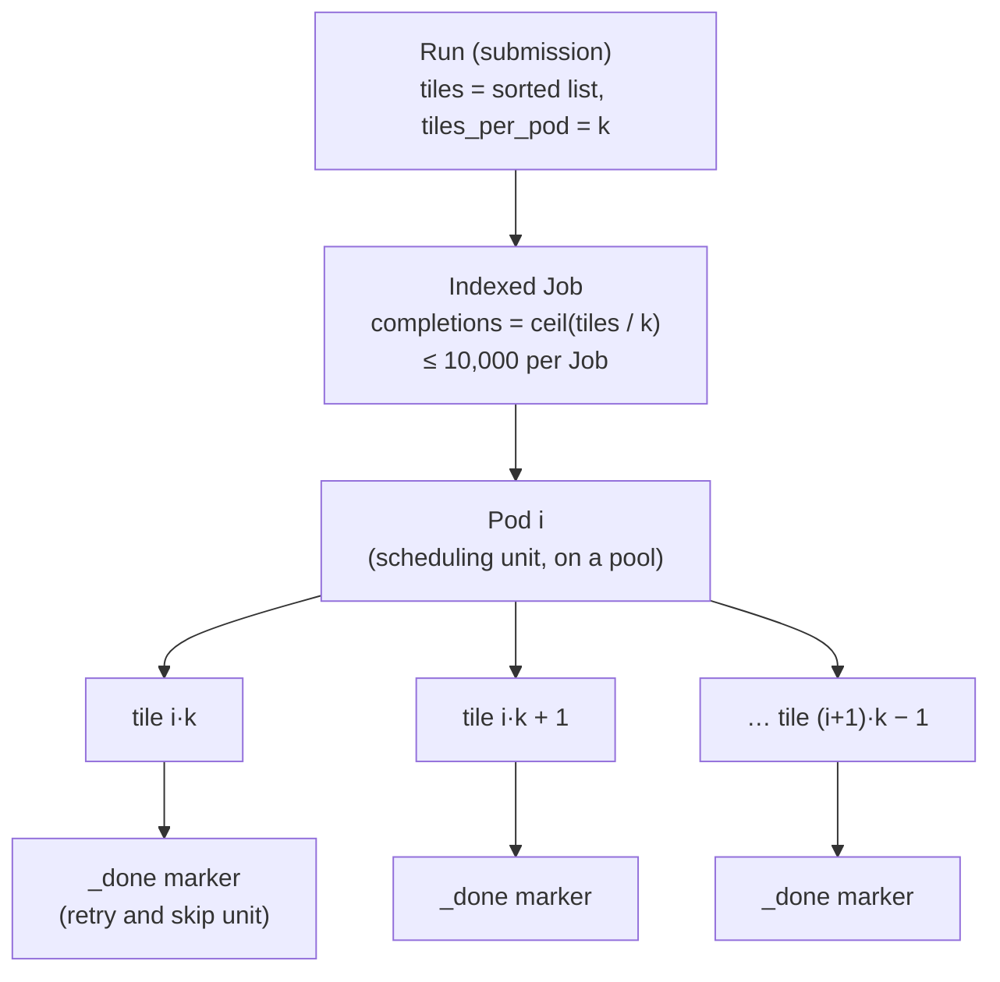

# Plan 06 - Aligning with issue #8: smaller work tiles and what else changes

**Status:** reference and forward plan, 2 Oct 2026. Not a priority for v1. [Issue #8](https://github.com/AdAstraEco/cornerstone_luc/issues/8), "Proposed Pipeline Improvements" (opened by `regislon` on 2 Oct 2026, open, no comments), lists 17 changes to the pipeline, to be taken up one at a time. **The code does not implement them yet**, so this document does two things: it records what each proposal means for `kuberjobtower` and the UI, and it names the small hooks worth building into v1 so that adopting the proposals later is an addition rather than a rewrite.

Evidence convention: **[V]** verified when this was written; **[C]** derived from verified numbers; **[U]** general platform knowledge or unmeasured, to check before relying on it. Headings 7 and 14 of the issue are labelled as proposed by Claude; they are treated here as proposals like the rest.

## 1. The 17 proposals and their effect on `kuberjobtower` and the UI

| #              | Proposal                                                                                            | Effect   | Hook built in now                                                                     | When it lands                                                                |
| -------------- | --------------------------------------------------------------------------------------------------- | -------- | ------------------------------------------------------------------------------------- | ---------------------------------------------------------------------------- |
| 2              | Process in **1° work tiles** instead of 10°                                                         | **High** | tile-scheme abstraction, `tiles_per_pod`, tile lists by reference (section 4)         | tile-size selector, hierarchical map, batching control (section 3)           |
| 6              | **One named run** per version (`runs/v1/`, `manifest.json`, per-tile `_done` markers, `--from-run`) | **High** | `TileStatusSource` interface; `run_name` field; vocabulary (section 5)                | Runs page, status from markers                                               |
| 7              | **Two-level execution**: scheduler hands out 1° tiles; small spot VMs; region-then-marker writes    | **High** | `spot` on pool info, `DisruptionTarget` policy (already planned), pod command adapter | spot pools in the form; this is the model `kuberjobtower` already implements |
| 10             | Methodology rules in a **config file** copied into the manifest                                     | **High** | run spec carries an optional config file and its hash                                 | config chooser and validation in pre-flight                                  |
| 15             | **One command per run** (`jdluc run`, `status`, `export`)                                           | **High** | `PodCommand` adapter and a capabilities probe                                         | the pod entry point changes; `status` feeds the UI                           |
| 1              | Define the **lattice** (`L4000`, index tile ids `x279y082`)                                         | Medium   | tile ids are a scheme, never a hard-coded pattern                                     | tile ids and cell indices in the UI                                          |
| 3              | Chunks on degree lines, **shard per 1° tile**, drop `COMPUTE_LOCK`                                  | Medium   | none; resources keyed by tile edge                                                    | sizing must be re-measured                                                   |
| 12             | **Read only what's needed**, skip empty (ocean) tiles                                               | Medium   | tile counts show "after skipping empty"                                               | smaller, more accurate estimates                                             |
| 13             | **Provenance by content**, no manual `version=`                                                     | Medium   | tile status behind an interface (section 5)                                           | the recomputed-cache-key approach is retired                                 |
| 14             | One dask scheduler per process                                                                      | Medium   | none                                                                                  | re-measure memory                                                            |
| 16             | **Check the config** before running                                                                 | Medium   | pre-flight has a place for an external check                                          | `jdluc check` runs in pre-flight                                             |
| 17             | **Settings from the environment**, `.env` as fallback                                               | Medium   | already doc 05's principle                                                            | extend the approved override to every setting (section 7)                    |
| 4, 5, 8, 9, 11 | native dtypes, shared `raw.zarr`, GeoParquet vectors, rasterized vectors, fill-value semantics      | Low      | none                                                                                  | pipeline internals; the UI only sees smaller stores                          |

## 2. The change that matters: 1° work tiles

### 2.1 Scale

- **Count.** The current footprint is 280 ten-degree tiles; each holds 100 one-degree tiles, so **at most 28,000** inside it [C]. The globe has 64,800 one-degree cells; most are ocean and would be skipped. The issue's own scale indicators are 16,962 non-empty 1° shards for GPW grassland and 6,557 for the Xu peat layer.
- **Per-tile cost.** Our measured compute pod for one 10° tile took about 66 minutes (harmonize 23, emit 13, downscale to the MapSPAM grid about 15, MapSPAM harmonize about 2, attribute about 11, from the log timestamps). If cost scaled with area, a 1° tile would take **about 40 seconds** [C, not measured; land fraction matters].
- **Consequence.** One pod per 1° tile would be dominated by overhead. The measured node scale-up from zero was about 75 seconds [V], plus scheduling, image start and Python imports. So **the unit of scheduling (a pod) and the unit of work and retry (a tile) must be separate**: a pod processes several tiles.

### 2.2 Kubernetes limits, checked

| Limit                                                                                                 | Value                                                                                                                    | Consequence                                                                                                                                                                                  |
| ----------------------------------------------------------------------------------------------------- | ------------------------------------------------------------------------------------------------------------------------ | -------------------------------------------------------------------------------------------------------------------------------------------------------------------------------------------- |
| `backoffLimitPerIndex`                                                                                | only with `completionMode: Indexed` and a pod `restartPolicy` of `Never` [V, API reference]                              | already how the Jobs are built                                                                                                                                                               |
| `maxFailedIndexes`                                                                                    | "null or up to completions"; "required and must be less than or equal to 10^4 when completions is greater than 10^5" [V] | our `maxFailedIndexes = completions` is valid up to 10^5 completions, far above 28,000; beyond that it would have to be 10,000 or fewer                                                      |
| Practical size of one Indexed Job's status and the control-plane load of tens of thousands of indexes | not verified [U]                                                                                                         | adopt a **soft cap of 10,000 completions per Job** (`KJT_MAX_COMPLETIONS_PER_JOB`), splitting a larger run into several Jobs                                                                 |
| Total annotation size on one object                                                                   | 256 KiB [U]                                                                                                              | a 28,000-tile list written as the planned `tiles` annotation is about 250 KB [C], so **tile lists move out of annotations and arguments** (section 4) once a run exceeds a few hundred tiles |

The exact `podFailurePolicy` text did not load from the documentation, so the `FailIndex` and `DisruptionTarget` semantics stay flagged as unverified in doc 01 (to confirm on the real cluster).

### 2.3 Two levels



- **A pod crash loses at most one tile of work** once markers exist: the retried pod recomputes its tile list and skips tiles that already have a marker. Today the cached decorators skip existing outputs, which gives the same effect per stage.
- **Index mapping:** pod `i` handles tiles `[i·k, (i+1)·k)` of the sorted list, the same rule as today with `k = 1`.
- **Choosing `k`:** `pod_minutes = overhead + k × minutes_per_tile`, and the form picks `k` to land near a target pod length (default about 30 minutes) from the history store's per-tile medians. Until a 1° tile has been measured, the form says "no data, run one pod first", as it did for `export` before that was measured.

### 2.4 Sizing depends on tile edge

`PhaseSpec` becomes a function of the tile edge, with the 10° row as the only measured one. The issue's figures are a hypothesis to test: a full 1° stack of about 3.6 GB, small spot VMs of 4 to 8 vCPU and 16 to 32 GB. Our 10° compute peak of about 53 GiB is dominated by in-flight dask chunks rather than by area, so it should not simply be divided by 100. The first 1° pod measures it, through per-tile summaries in the resource sampler (doc 02).

### 2.5 Spot pools

The issue proposes spot VMs. `kuberjobtower` already ignores `DisruptionTarget` failures so a preemption does not burn a retry (doc 01 section 5.5, semantics still to confirm). Two additions: pool information carries `spot` (the GKE spot label), and the form badges spot pools and shows how many times a job was preempted. Roles are settings, so "heavy" can point at a spot pool of ordinary machines once 1° tiles make the highmem pool unnecessary.

## 3. UI additions (gated, not v1)

### 3.1 Capability gating

`kuberjobtower` asks the pipeline what it supports instead of assuming. `infra/run_phase.py --capabilities` (a few lines inside the already-approved pipeline change) prints JSON, `doctor` reads it, and `GET /api/config` returns

```
pipeline: { tile_sizes: [10], lattice: false, named_runs: false, config_files: false, done_markers: false }
```

Every control below renders only when its flag is true, so the UI never offers something the code cannot do. Today the answer is `tile_sizes: [10]` and the rest false, so nothing changes.

### 3.2 Run builder: tile size and batching

The numbers in this wireframe are illustrative.

```
│ 1 WHAT                                                                    │
│  Work tile  (○ 10°)(● 1°)          ← only when pipeline.tile_sizes has 1  │
│  Tiles      [10N_080W ▸ 100 tiles ×]  = 100 → 41 after skipping ocean     │
│             [Expand to 1°] [Select by box on the map]                     │
│  Tiles per pod [ auto ▾ ]  = 41 → 2 pods of ≈ 21 tiles · ≈ 25 min each    │
│  ⚠ no measurement for 1° tiles yet: run one pod first                     │
```

- **Tile size** toggles the unit the map selects and the form counts. It is hidden unless the pipeline reports `tile_sizes` containing 1.
- **Tiles per pod** defaults to `auto` (target pod length from medians) and can be set by hand from 1 to a cap; the form shows the resulting pod count and refuses a plan above the completions cap (section 2.2) by offering to split it.
- **Empty tiles:** counts show the number after the land-mask check (issue #12), because skipped tiles cost nothing and should not inflate the estimate.
- Pre-flight, pool fit and the cost estimate all use per-tile numbers times `k`, and the pool selector (doc 03 section 3.3) is unchanged.

### 3.3 Map: a hierarchical grid

- **Two levels by zoom:** 10° cells at low zoom, 1° cells once the viewport is small enough. The browser **generates the 100 children of the visible 10° blocks itself**; it never loads 28,000 polygons.
- **Land mask:** the ocean/land answer for every 1° cell is 360 × 180 = 64,800 bits, about **8 KB** [C], shipped as a static bitmap for display only. The pipeline's gate layer stays authoritative for processing.
- **Status:** a 1° cell is coloured from its `_done` marker for the chosen stage. A 10° cell shows the fraction of its children done, with a distinct "partial" colour.
- **Selection:** click a 10° cell to select its land children; click a 1° cell to select one; shift-click adds; box-select takes everything inside the rectangle. The drawer for a 10° cell lists its children by status.
- **Tile ids** are rendered by a scheme object (section 4), so `20N_090W` and `x279y082` both work and the paste box accepts whichever the pipeline reports.

### 3.4 Exporting a selection

With 17,000 or more tiles, a COG per tile is too many files for the map. The `export` action takes the selected box (issue #15: `jdluc export v2 emit --bbox …`), writes **one COG for that region**, and registers it as an overlay under "Exports" keyed by run, layer and box. This also matches the issue's own caveat that zarr has no overviews, so a viewer needs an exported COG.

### 3.5 Runs page and config validation (when `named_runs` and `config_files`)

A **Runs** page lists named versions (`v1`, `v2`): their manifest, settings, the run they started from (`--from-run`), and per-stage tile completion. The Run builder gains a config chooser; **pre-flight runs `jdluc check <config>`** (issue #16) so a wrong threshold fails in seconds instead of hours in, and the config hash joins the plan hash so a changed config invalidates a confirmed plan.

## 4. Hooks to build into v1

| Hook | What                                                                                                                                                                                                                                                                                                                                                                                                                                           | Where              |
| ---- | ---------------------------------------------------------------------------------------------------------------------------------------------------------------------------------------------------------------------------------------------------------------------------------------------------------------------------------------------------------------------------------------------------------------------------------------------- | ------------------ |
| H1   | **Tile ids are a scheme.** A stdlib-only `kuberjobtower/tiles.py` with `Gfw10` (`20N_090W`) now and `Lattice1` (`x279y082`) later: parse, format, bbox, parent and children, validity. No pattern like `\d{2}[NS]_\d{3}[EW]` anywhere else (doc 03's paste check is scheme-driven). For the lattice the issue defines indices from the north-west corner (-180°, 90°), so the west edge is `-180 + x` degrees and the north edge `90 - y` [C]. | docs 01, 03        |
| H2   | **`tiles_per_pod`** on the run spec, default 1; `completions = ceil(tiles / k)`; index mapping as in section 2.3.                                                                                                                                                                                                                                                                                                                              | doc 01 section 5.2 |
| H3   | **Tile lists by reference** once above a few hundred tiles: written as one object under the history prefix and passed to pods as a URI, never as an annotation or a long argument.                                                                                                                                                                                                                                                             | docs 01, 04        |
| H4   | **Pod command adapter.** One function builds the pod command from the phase, tiles and settings; today `infra/run_phase.py ...`, later `jdluc run ...`.                                                                                                                                                                                                                                                                                        | doc 01 section 5.5 |
| H5   | **Capabilities probe** (section 3.1) and the `pipeline` block in `/api/config`.                                                                                                                                                                                                                                                                                                                                                                | docs 01, 03, 05    |
| H6   | **`PhaseSpec` keyed by tile edge**, with only the 10° row filled and an explicit "unmeasured" for others.                                                                                                                                                                                                                                                                                                                                      | doc 01 section 6   |
| H7   | **`TileStatusSource` interface**: `CacheKeyStatus` today, `DoneMarkerStatus` after issue #6.                                                                                                                                                                                                                                                                                                                                                   | doc 03 section 5   |
| H8   | **Pool information carries `spot`**, and the completions cap is a setting.                                                                                                                                                                                                                                                                                                                                                                     | docs 01, 05        |

All eight are small and sit inside code that is being written anyway; none needs the pipeline to change first.

## 5. What will be superseded, and the vocabulary clash

- **Recomputed cache keys.** `jdluc/cache_key.py` and the tile-status recomputation (doc 03 section 5) are valuable for the current layout only. Issue #13 removes the manual `version=` and #6 replaces hash-named stores with `runs/{name}/` plus `_done` markers, which makes tile status a plain listing. Keep the helper tiny and behind H7.
- **`infra/run_phase.py` as the pod entry point** gives way to `jdluc run`. H4 confines that to one function.
- **"Run" now means two things.** In the issue a **run** is a named version of the emissions layers (`v2`: one set of methods and settings, global). In doc 04 a `run_uid` is **one submission**: a set of Jobs advancing some work. After #6 the history store keeps both, with `run_name` (nullable until then) and `config_hash` on the submission record, and the UI says "run" for the version and "submission" for the set of Jobs.
- **A prefix that invites confusion: resolved.** The history root was `cornerstone/runs/`, which would sit next to the issue's `SCRATCH_ROOT/runs/{name}/`. It is now `cornerstone/control/` (decided 2 Oct 2026), set by `KJT_HISTORY_ROOT`, so the two cannot be confused.
- **One pod per tile in history.** The pod-to-tile relationship becomes one-to-many; per-tile spans inside a pod come from `tile_start` and `tile_done` log events (doc 02), and the collector attributes samples to tiles by time window.

## 6. Adoption order

| When the pipeline lands                                          | `kuberjobtower` / UI change                                                                                                |
| ---------------------------------------------------------------- | -------------------------------------------------------------------------------------------------------------------------- |
| `--capabilities` in `run_phase.py` (part of the approved change) | nothing visible; probes return today's answer                                                                              |
| Issue #8 proposal 17 (environment first)                         | **dropped 5 Oct 2026** after review of PR #12 (was: environment-first for every `Config` field); doc 05 already assumes it |
| Issue #2 with #1 (1° tiles, lattice ids)                         | tile-size toggle, hierarchical map, tiles per pod, completions cap, per-tile sizing                                        |
| Issue #7 (spot, small VMs)                                       | spot pools in the selector, preemption counts                                                                              |
| Issues #6, #10, #15, #16                                         | Runs page, config chooser, `check` in pre-flight, `status` and markers for tile status, pod command switch                 |
| Issue #13                                                        | retire recomputed cache keys                                                                                               |

## 7. Decisions

Decided by the user on 2 Oct 2026 and applied across the plans and the local `.env`:

1. **Environment-first settings for every `Config` field** (issue #8 proposal 17), not only `NUMBER_OF_DASK_WORKERS`. It is part of the one approved pipeline change (doc 01 section 5.7, item 5): a process environment variable overrides the `.env` file, and the file is a fallback. **Superseded 5 Oct 2026:** environment-first `Config` was dropped after review of PR #12 (README, "Review of PR #12").
2. **History prefix `cornerstone/control/`** instead of `cornerstone/runs/`, so it cannot be mistaken for the pipeline's `runs/{name}/` (section 5). Nothing had been written under the old name.
3. **Soft cap of 10,000 completions per Job**, a setting (`KJT_MAX_COMPLETIONS_PER_JOB`), splitting a larger run into several Jobs (section 2.2).

Nothing here needs the issue's author to act first, and neither `kuberjobtower` nor the UI depends on any of it landing.
