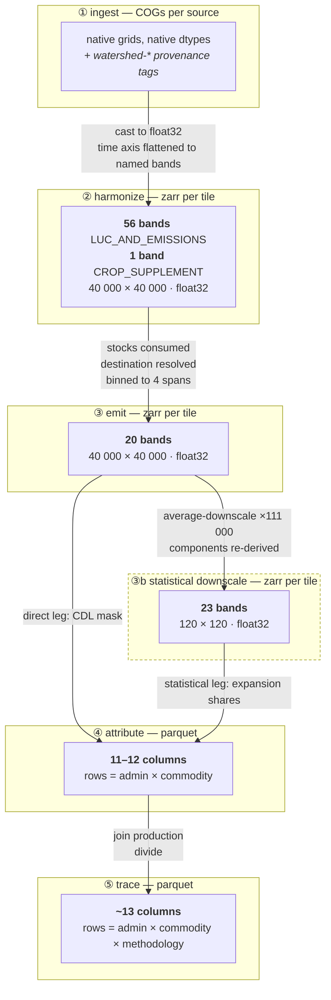
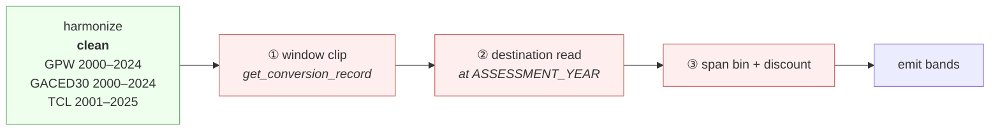
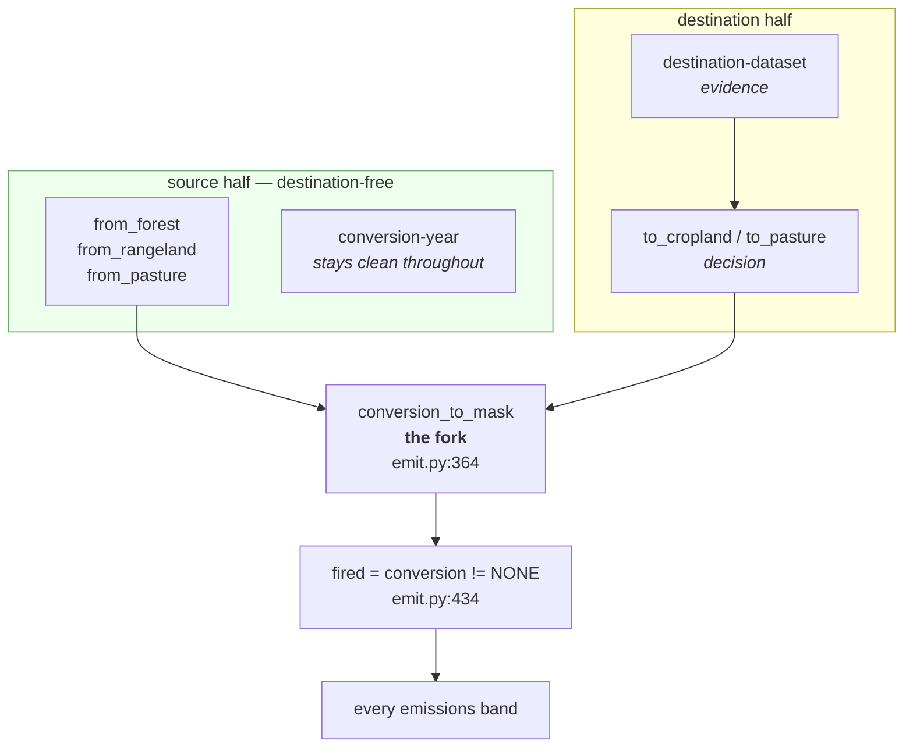

# Data flow and data model — what survives each stage

**Working note, not a deliverable.** Verified against the code at `8130655`; band and column lists are exhaustive as at that commit. Companion to [`architecture.md`](../architecture.md), which has the five-stage overview; this one is about *width* — what each stage carries, and what it stops carrying.

---

## 1 · The pipeline, with widths

Rough magnitudes per 10° tile:

| stage | values held | uncompressed |
|---|---|---|
| harmonize | 57 × 1.6 × 10⁹ ≈ **9.1 × 10¹⁰** | ~340 GiB |
| emit | 20 × 1.6 × 10⁹ ≈ **3.2 × 10¹⁰** | ~119 GiB |
| downscale | 23 × 14 400 ≈ **3.3 × 10⁵** | ~1.3 MiB |
| attribute | ~12 × (admins × crops) | KiB |
| trace | ~13 × rows | KiB |

The collapse between `emit` and the downscale is **×111 000 in area** (40 000² → 120²). Everything after that is tabular.

---

## 2 · Stage by stage

### ② harmonize — 56 + 1 bands

Flat namespace, `{source}:{product}:{band}`, one 2D variable each, no band or time dimension.

| n | band |
|---|---|
| 1 | `gnw:global-peatlands:is-peatland` |
| 1 | `gnw:harris-agb:aboveground-biomass-mg-per-ha` |
| 1 | `gnw:tree-cover-loss:lossyear` |
| 25 | `gpw:grassland:year=2000` … `year=2024` |
| 1 | `huang:bgb:belowground-biomass-mg-per-ha` |
| 1 | `ipcc:climate-zones:climate-zone` |
| 25 | `liao:gaced30:year=2000` … `year=2024` |
| 1 | `soilgrids:organic-carbon-stocks:organic-soil-carbon-mg-per-ha` |
| *1* | *`descals:oil-palm:planting-year`* — separate stack, separate zarr |

#### What the values actually are

Everything is float32 on disk, so the dtype tells you nothing about the content. The semantics:

| band | kind | domain | special values |
|---|---|---|---|
| `gpw:grassland:year=YYYY` | **class enum**, one band per year | `0` other · `1` cultivated · `2` natural/semi-natural · `3` open shrubland | `255` → NaN |
| `liao:gaced30:year=YYYY` | **class enum**, one band per year | `0` not cropland · **`10`** cropland | `255` → NaN |
| `gnw:tree-cover-loss:lossyear` | **ordinal year code**, one band total | `0` no loss · `N` = loss in year `2000 + N`, N ∈ 1…25 | no fill value |
| `gnw:global-peatlands:is-peatland` | **flag** | tested `== 1` | `255` → NaN |
| `ipcc:climate-zones:climate-zone` | **class enum** | `1`…`10` (montane, wet, moist, dry, ×2 temperate, ×2 cool temperate, ×2 boreal) | `255` → NaN; **`0` is not a member** |
| `descals:oil-palm:planting-year` | **ordinal year** | `0` no oil palm · `1989`…`2022` planting year, 1989 saturating | no fill value; `0` is a mapped class, not a gap |
| `gnw:harris-agb:…-mg-per-ha` | **continuous stock** | Mg biomass / ha, year 2000 | `65535` → NaN |
| `huang:bgb:…-mg-per-ha` | **continuous stock** | Mg biomass / ha | no fill; **`0` means absent**, and `emit` substitutes AGB × 0.25 there |
| `soilgrids:…-organic-soil-carbon-mg-per-ha` | **continuous stock** | Mg C / ha, 0–30 cm | `32767` → NaN |

So none of the annual bands are stocks or fractions — they are **land-class codes, one per pixel per year**. GACED30 is binary but coded `0/10`, not `0/1`.

**The structural asymmetry worth noticing.** The two grassland/cropland sources are *annual state series* — 25 bands each, "what class was this pixel in, that year". Tree-cover loss is a *single event date* — one band, "the year this pixel lost forest, ever". They are different kinds of object:

- a **date** comes straight off TCL
- a **date** has to be *derived* from GPW by differencing consecutive years (`get_last_departure_year` finds where `is_source` was true last year and false this year)

That is why forest conversions are dated by loss year and grassland ones by last departure, and why the repo's docs say "no two layers are ever required to agree on a year". It is not a modelling preference — the inputs are shaped differently.

**Two silent-zero paths** that follow from the float cast:

- `climate-zone` has no member `0`, but `get_grassland_carbon` and `get_mineral_soil_emissions` both do `.fillna(0).astype(uint8)` and index a 256-entry zero-filled lookup. A NaN zone therefore yields **factor 0 → zero emission**, not an error.
- `huang:bgb` uses `0` for "no measurement", which `emit` detects and replaces with the root-to-shoot fallback. A genuine zero and a missing value are indistinguishable by construction.

**One unresolved question, inherited.** SoilGrids OCS is ingested with no scale factor applied and the band named Mg/ha. The spec flags this directly — *"the scale factor stored with the layer must be verified against that range before production — the documentation annotation we have is wrong."* Nothing in this repo applies or checks one, so if the source carries a scale the values are wrong by that factor, everywhere the mineral soil term fires. Worth settling.

**Lost here**

- **Native dtypes.** `unify_dtype_and_no_data` casts everything to float32. The 50 annual categorical bands go from 75 GiB to 298 GiB per tile. Policy, not requirement.
- **Time as a dimension.** Annual series arrive as 25 independent variables named `year=YYYY`. No `year` coordinate exists in the product; `emit` manufactures one with `xarray.concat` at read time.
- **Anything outside the requested stack.** `dataset_names` is in the cache key, so each stack is its own zarr.

**Kept, and easy to forget**

- `climate-zone` and `organic-soil-carbon` are both here as plain 2D bands. Those two are the operands for any mineral-soil-by-crop-group variant — nothing further up needs to store the products.
- *Unverified:* whether the `watershed-*` provenance tags survive from the COGs into zarr attrs. `open_rasterio` does surface GDAL metadata, and `unify_dtype_and_no_data` only relocates a specific key list, so they plausibly do. Worth checking.

### ③ emit — 20 bands

| n | band | note |
|---|---|---|
| 1 | `conversion` | 0–5, mutually exclusive |
| 1 | `conversion-year` | **annual**, or 0 |
| 1 | `destination-dataset` | bitmask 0–7 |
| 4 | `emissions:tco2e-per-ha:{span}` | **undiscounted** |
| 4 | `soil-emissions:tco2e-per-ha:{span}` | undiscounted |
| 4 | `vegetation-emissions:tco2e-per-ha:{span}` | undiscounted |
| 1 | `cropland-peatland-occupation:tco2e-per-ha` | annual rate, never amortised |
| 1 | `pastureland-peatland-occupation:tco2e-per-ha` | ditto |
| 1 | `dropped-emissions:tco2e-per-ha` | **discounted** |
| 1 | `emissions-per-hectare:tco2e-per-ha` | **discounted** + both occupation terms |
| 1 | `hectares-per-pixel:ha` | |

**Lost here — the big one.** Everything below is computed inside `workflow()` and discarded:

| discarded | where it existed |
|---|---|
| `forest_carbon`, `grassland_carbon` (full-grid) | `emit.py:641–651` |
| `cropland_soil`, `pasture_soil` before masking | `emit.py:423–431` |
| the soil regime (peat vs mineral switch) | applied, never published |
| **source class on unclaimed pixels** | `conversion` collapses to `NONE`; `dropped-emissions` sums forest + grassland into one number |
| the first-departure year | only the last is kept |
| candidate count / cascade flag | never computed |
| climate zone, SOC stock, peat mask | not carried forward — but still in the harmonize zarr |

**Also lost: annual resolution *of the emissions*.** `conversion-year` stays annual, but the emissions bands are binned to four 5-year spans. Since `get_span_to_charge` returns the same array masked four disjoint ways, the twelve span bands are exactly reconstructible from three unbinned ones plus `conversion-year` — so this is redundancy, not information.

**Never present at all:** no crop or land-use axis, no gas axis, no per-input version stamps.

### ③b statistical downscale — 23 bands at 120 × 120

Re-derives what `emit` didn't publish, then averages to the MapSPAM grid.

- 7 carried straight from `emit` (the 4 `emissions:{span}`, both occupation bands, `dropped-emissions`)
- 12 derived: `{forest,grassland,peatland-conversion}:tco2e-per-ha:{span}` — the component split, recomputed from the published vegetation and soil bands
- 4 derived: `pasture:fraction:{year}` at the MapSPAM snapshot years

**Lost here**

- **Pixel identity, and all sub-cell structure.** One MapSPAM cell averages ~111 000 GLAD pixels. Peat and mineral, forest-sourced and grassland-sourced, converted and not — all become one mean per cell. The occupation bands are split by destination *before* this step precisely so the split survives averaging.
- `conversion`, `conversion-year` and `destination-dataset` are **not** downscaled. After this point the statistical leg has no per-pixel conversion record at all.
- *Not* a lossy step for the direct leg, which skips it entirely.

### ④ attribute — 11–12 columns

Both legs clip to admin-1 polygons and sum. Rows are (admin, commodity).

| direct (`jurisdictional_direct`) | statistical |
|---|---|
| `admin_id`, `admin_level`, `jurisdiction_name`, `commodity_name` | same |
| `commodity_hectares`, `peatland_commodity_hectares` | same |
| `emissions_mt` | same |
| `forest_emissions_mt`, `grassland_emissions_mt`, `peatland_conversion_emissions_mt` | same |
| `peatland_occupation_emissions_mt` | same |
| — | `production_mt` |

**Lost here**

- **All geometry.** Pixels → jurisdiction totals.
- **The span dimension**, collapsed by the linear discount at this step (`jurisdictional_direct.py:149`, `statistical.py:268`). After this the temporal structure is gone.
- **Source × destination detail**, compressed to three component columns. You can no longer ask "forest → pasture" separately from "forest → cropland".

**Kept, notably:** unclaimed carbon survives as a pseudo-commodity row, `commodity_name = "DROPPED"`, carrying `emissions_mt` only. It is reported rather than dissolved — but with no source split and no year.

**Legs diverge here:** the direct leg subtracts `pastureland-peatland-occupation` before allocating, because it allocates to CDL crops alone and peat drained under pasture would have no row to land on.

### ⑤ trace — ~13 columns

Joins production (NASS yields × area for direct; MapSPAM production for statistical), then divides. Rolls provincials up to national by summing eight additive columns.

Adds `production_kg`, `yield_kg_per_ha`, `emissions_factor_kgco2e_per_kg`.

**Lost here:** nothing new, but the national rollup means provincial rows must be summed before dividing — an emissions factor is not additive.

---

## 3 · The loss ledger

What a consumer at each level *could* answer:

| question | harmonize | emit | downscale | attribute | trace |
|---|---|---|---|---|---|
| what class was this pixel in, in year Y? | ✅ | — | — | — | — |
| what is the SOC stock / climate zone here? | ✅ | — | — | — | — |
| did this pixel convert, and when? | — | ✅ annual | — | — | — |
| which layers claimed its destination? | — | ✅ | — | — | — |
| how much carbon did it hold before? | — | ❌ *computed, discarded* | — | — | — |
| was it peat or mineral? | ✅ | ❌ *applied, not published* | — | — | — |
| what would the soil loss be under a different crop group? | ✅ *derivable* | ❌ | ❌ | ❌ | ❌ |
| what was the source class, if no destination resolved? | — | ❌ | ❌ | ❌ | ❌ |
| what would a different amortisation scheme give? | — | ✅ *from undiscounted spans* | ✅ | ❌ | ❌ |
| how much did crop X emit in province P? | — | — | — | ✅ | ✅ |
| what is the emissions factor? | — | — | — | — | ✅ |

Two rows are worth dwelling on.

**"What would the soil loss be under a different crop group?"** is answerable at **harmonize** and nowhere after. The stock and the zone are both there; the factor table is a ~12-entry constant. `emit` destroys the answer by multiplying through with one factor and publishing only the product. The fix is not to publish more variants — it is that every consumer already merges the harmonize zarr anyway.

**"What was the source class, if no destination resolved?"** is answerable **nowhere**. This is the one genuine information loss in the pipeline: `conversion` collapses to `NONE` and `dropped-emissions` adds forest and grassland together. Everything else on this table is either recoverable from an upstream product or reconstructible from what is published.

---

## 4 · Three caching notes that bite

- **Cache keys are the function arguments.** `emit.workflow(tile_id)` takes only `tile_id`, so `ASSESSMENT_YEAR` — a module constant — is **not** in the key. Change it and re-run, and you get the old zarr back unless `version` is bumped by hand.
- **`harmonize.workflow` is keyed on `dataset_names`.** Two stacks means two zarrs; asking for a subset is a cache miss, not a projection.
- **Three zarr products, not one.** harmonize, emit, and the statistical downscale. "The emissions layer" means the middle one.

---

## 5 · Where reference-year dependence enters

Short answer: **at the first operation in `emit`, not at step 4.**

The spec's principle is *"no reference year until the very end … one computation serves every year."* In this repo `ASSESSMENT_YEAR = 2020` is a module constant ([emit.py:203](../../jdluc/emit.py:203)) and it enters through **three separate mechanisms, two of which are at the front of the stage**.

| # | mechanism | where | effect |
|---|---|---|---|
| ① | **Window clip at detection.** `LOOKBACK_YEARS_RANGE` filters the annual bands *before* any departure year is computed ([emit.py:322](../../jdluc/emit.py:322)), and forest loss is bounded by `year_of_loss <= ASSESSMENT_YEAR` ([emit.py:346–347](../../jdluc/emit.py:346)) | front of `get_conversion_record` | Events outside 2000–2020 are **never detected**. Inputs run to 2024/2025; the layer stops at 2020. The spec instead keeps them and marks them at weight zero |
| ② | **Destination read *at* the assessment year.** All three predicates evaluate at 2020 ([emit.py:257](../../jdluc/emit.py:257), [:262](../../jdluc/emit.py:262), [:270](../../jdluc/emit.py:270)) | front of `get_conversion_record` | Moving the reference year changes **which conversions exist at all**, and which one each pixel gets |
| ③ | **Absolute-year spans, and the discount.** `SPAN_TO_LINEAR_DISCOUNT_WEIGHT` is keyed to calendar years 2000–2020, not years-since-conversion; two bands are discounted inside `emit` | back of `workflow` | The conventional, expected dependence — this is the only one the spec's step 4 anticipates |

**Which bands are reference-year-dependent?** All of them except `hectares-per-pixel`.

| band | clean? |
|---|---|
| `hectares-per-pixel:ha` | ✅ pure geometry |
| `conversion`, `conversion-year`, `destination-dataset` | ❌ via ① and ② |
| all 12 per-span bands | ❌ via ①②③ |
| both occupation bands | ❌ via ①② |
| `dropped-emissions`, `emissions-per-hectare` | ❌ via ①②③ + discount applied |

So the layer is not "reference-year-independent until step 4 collapses it." It is reference-year-**bound from the moment `get_conversion_record` opens**, and ③ — the only mechanism the spec's design treats — is the least consequential of the three.

**The practical trap:** `ASSESSMENT_YEAR` is not an argument to `workflow(tile_id)`, and the cache key is the bound arguments. Change it, re-run, and you silently get the 2020 zarr back.

**Where it is *not* a problem:** harmonize is entirely clean — every input year is present. And `validation/` is already parameterised (`REFERENCE_YEAR`, `--year`). The emissions layer is the only stage that hard-codes it.

---

## 6 · Where destination-land-use dependence enters

Also at `get_conversion_record`, but through a narrower channel — and the boundary is unusually clean, which is what makes it tractable.

| band | destination-dependent? |
|---|---|
| `conversion-year` | ✅ **no** — `year_of_loss.where(from_forest, other=max(departures))`, purely source-side ([emit.py:389](../../jdluc/emit.py:389)) |
| `hectares-per-pixel` | ✅ no |
| `destination-dataset` | ⚪ it *is* the destination evidence — but raw, unresolved. Publishes what each layer said, not what was decided |
| `conversion` | ❌ yes — it **is** the intersection |
| 12 span bands | ❌ yes, via the `fired` gate |
| both occupation bands | ❌ yes — gated on `to_cropland` / `to_pasture` ([emit.py:681–686](../../jdluc/emit.py:681)) |
| `dropped-emissions` | ❌ yes — the complement, `.where(~has_destination)` ([emit.py:702](../../jdluc/emit.py:702)) |
| `emissions-per-hectare` | ❌ yes |

**Two dependencies that look alike but are not.**

- **Soil** depends on the destination *for its value* — `cropland_soil` versus `pasture_soil` are different numbers ([emit.py:438–439](../../jdluc/emit.py:438)).
- **Vegetation** depends on the destination only *for its existence*. Its value is source-only — `forest_biomass.where(from_forest) + grassland_biomass.where(from_grassland)` — and then the whole thing is multiplied by `.where(fired, other=0)` ([emit.py:445–448](../../jdluc/emit.py:445)).

That second one is the whole conformance gap in one line. The vegetation carbon is *known*, correctly, from the source class alone. It is then zeroed because no destination layer claimed the pixel.

**What this means for an override.** The destination enters at exactly one place ([emit.py:364](../../jdluc/emit.py:364)) and propagates through exactly one gate ([emit.py:434](../../jdluc/emit.py:434)). Everything the gate masks is already computed full-grid one statement earlier. So:

- the *evidence* is published (`destination-dataset`) separately from the *decision*
- the dating is destination-free (`conversion-year`)
- the arrays exist unmasked at the moment of masking

The obstacle to overriding a destination is not that the pipeline is entangled with it. It is that the unmasked arrays are never written down.
