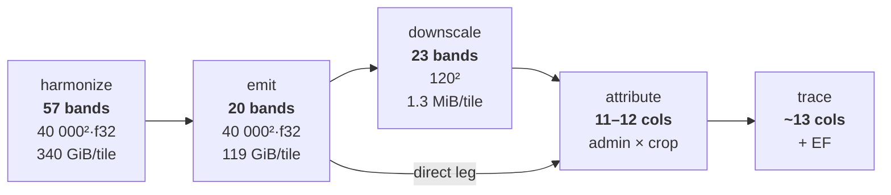

# Data model — what each stage holds

Working note, verified against `8130655` (upstream tip). Companion to [`architecture.md`](../architecture.md), which covers the stage sequence; this is about band contents, dependence, and width.

**Δ** marks what `8130655` — *migrate from GLCLUC to TCL/GPW/GACED30* — changed against its parent `3389d4f`: **+** added · **~** renamed or split · blank unchanged. Removals are listed under each table.

## Harmonize — 57 bands

Flat namespace `{source}:{product}:{band}`, one 2D variable each, no band or time dimension. Everything cast to float32 by `unify_dtype_and_no_data`, so dtype carries no information about content.

| Δ | band | n | kind | values | now | native |
|---|---|---|---|---|---|---|
| **+** | `gpw:grassland:year=YYYY` | 25 | class enum | `0` other · `1` cultivated · `2` natural · `3` shrubland · `255`→NaN | 4 B | uint8 |
| **+** | `liao:gaced30:year=YYYY` | 25 | class enum | `0` not cropland · **`10`** cropland · `255`→NaN | 4 B | uint8 |
| **+** ¹² | `gnw:tree-cover-loss:lossyear` | 1 | ordinal year ¹ | `0` no loss · `N` → loss in 2000+N, N ∈ 1…25 · no fill | 4 B | uint8 |
| **~** | `gnw:global-peatlands:is-peatland` | 1 | flag | tested `== 1` · `255`→NaN | 4 B | uint8 |
|  | `ipcc:climate-zones:climate-zone` | 1 | class enum | `1`…`10` · `255`→NaN · **no member `0`** ² | 4 B | uint8 |
| **+** | `descals:oil-palm:planting-year` ⁴ | 1 | ordinal year | `0` no palm · `1989`…`2022` · no fill | 4 B | uint16 |
| **~** | `gnw:harris-agb:…-mg-per-ha` | 1 | continuous stock | Mg biomass/ha, yr 2000 · `65535`→NaN | 4 B | uint16 |
|  | `huang:bgb:…-mg-per-ha` | 1 | continuous stock | Mg biomass/ha · **`0` = absent** ² | 4 B | float32 |
|  | `soilgrids:…-organic-soil-carbon-mg-per-ha` | 1 | continuous stock | Mg C/ha, 0–30 cm ³ · `32767`→NaN | 4 B | int16 |

**Removed:** `glad:glcluc:year=YYYY` ×5 (2000 · 2005 · 2010 · 2015 · 2020) — the whole GLAD land-class series left the stack. **10 bands → 57.**

**Width, roughly.** 228 B/px as stored vs ~63 native — call it **3–4× larger than it needs to be**: ~340 GiB/tile against ~90, or ~90 TiB against ~25 over 280 tiles. The 50 annual class bands are ~88% of that. Harmonize is ~3× the size of the layer it feeds, and the excess is representational. ⁵

## Emit — 20 bands

| Δ | band | n | contents | ref-yr ⁶ | dest ⁷ | disc. |
|---|---|---|---|---|---|---|
| **+** | `conversion` | 1 | `0`…`5`, mutually exclusive — **the source ∧ destination intersection** | ✗ | ✗ | — |
| **+** | `conversion-year` | 1 | calendar year source class ended, **annual**, or `0` | ✗ | **✓ clean** | — |
| **+** | `destination-dataset` | 1 | bitmask `0`–`7`: Descals `1` · GACED30 `2` · GPW `4` | ✗ | *evidence, not decision* | — |
|  | `emissions:tco2e-per-ha:{span}` | 4 | vegetation + soil | ✗ | ✗ | no |
|  | `soil-emissions:tco2e-per-ha:{span}` | 4 | destination determines **the value** | ✗ | ✗ | no |
|  | `vegetation-emissions:tco2e-per-ha:{span}` | 4 | source determines the value; destination gates **existence** ⁸ | ✗ | ✗ | no |
| **~** | `cropland-peatland-occupation:tco2e-per-ha` | 1 | 37.3 × (peat ∧ to_cropland), annual rate | ✗ | ✗ | never |
| **~** | `pastureland-peatland-occupation:tco2e-per-ha` | 1 | ditto, to_pasture | ✗ | ✗ | never |
| **+** | `dropped-emissions:tco2e-per-ha` | 1 | source carbon no destination claimed | ✗ | ✗ | yes |
|  | `emissions-per-hectare:tco2e-per-ha` | 1 | discounted spans + both occupation terms | ✗ | ✗ | yes |
|  | `hectares-per-pixel:ha` | 1 | pixel area from latitude | **✓ clean** | **✓ clean** | — |

**Removed:** `land-class:{year}` ×5 — `emit` used to republish the GLAD series it consumed. **20 bands → 20**: five land-class bands out, four new records in, and one occupation band split in two. The layer's width did not change; what it holds did — from *the input class series* to *the resolved conversion record*. ¹³

Spans: `2000-2005`, `2005-2010`, `2010-2015`, `2015-2020`. 80 B/px → 119 GiB/tile, 32.6 TiB global.

## What is lost, and where

| | harmonize | emit | downscale | attribute |
|---|---|---|---|---|
| class of a pixel in year Y | ✓ | — | — | — |
| SOC stock · climate zone | ✓ | — | — | — |
| **soil loss under another crop group** | ✓ derivable ⁹ | ✗ | ✗ | ✗ |
| peat vs mineral regime | ✓ | ✗ applied, unpublished | — | — |
| carbon stock before conversion | — | ✗ computed, discarded ¹⁰ | — | — |
| **source class where no destination resolved** | — | ✗ ¹¹ | ✗ | ✗ |
| conversion date | — | ✓ annual | ✗ not downscaled | ✗ |
| alternative amortisation scheme | — | ✓ from undiscounted spans | ✓ | ✗ collapsed |
| emissions per (admin, crop) | — | — | — | ✓ |

Downscale averages ~111 000 GLAD pixels into one MapSPAM cell (40 000² → 120²); everything after is tabular. Attribute collapses geometry and the span dimension; source × destination compresses to three component columns, plus a `DROPPED` pseudo-commodity row. Trace adds `production_kg`, `yield_kg_per_ha`, `emissions_factor_kgco2e_per_kg`.

---

**Footnotes**

1. **The inputs are shaped differently, and this drives the dating rule.** TCL is a *single event date* per pixel. GPW and GACED30 are *annual state series* — a date has to be derived by differencing consecutive years (`get_last_departure_year`). That is why forest is dated by loss year and grassland by last departure, and why "no two layers are ever required to agree on a year" is forced rather than chosen.
2. **Two silent-zero paths.** `climate-zone` has no member `0`, but `get_grassland_carbon` and `get_mineral_soil_emissions` both `.fillna(0)` into a zero-filled 256-entry lookup — a NaN zone yields factor 0, i.e. zero emission, not an error. `huang:bgb` uses `0` for "no measurement", so a true zero and a gap are indistinguishable; `emit` substitutes AGB × 0.25 for both.
3. **SoilGrids scale unresolved.** Ingested with no scale factor applied. The spec flags this — *"the scale factor stored with the layer must be verified … the documentation annotation we have is wrong."* If the source carries one, every mineral-soil emission is wrong by that factor.
4. Separate stack (`CROP_SUPPLEMENT`), separate zarr. `dataset_names` is in the cache key, so each stack is its own entry.
5. **Uncompressed, and unmeasured.** Zarr compresses, and float32-of-small-integers compresses well, so this overstates the *disk* saving — one tile's `du -sh` would settle it. The RAM cost stands regardless: dask decompresses at the stored dtype, and `get_chunk_size` is passed `[float32] * n_bands`, so the cast also fixes the 2048² chunking.
6. **Reference-year dependence enters at the front of `emit`, not at step 4.** Three mechanisms: ① the window clip filters annual bands before any departure is computed ([emit.py:322](../../jdluc/emit.py:322), [:346](../../jdluc/emit.py:346)) so events outside 2000–2020 are never detected; ② all three destination predicates read *at* `ASSESSMENT_YEAR` ([:257](../../jdluc/emit.py:257), [:262](../../jdluc/emit.py:262), [:270](../../jdluc/emit.py:270)), so moving the year changes which conversions exist; ③ absolute-year spans and the discount. Only ③ is what the spec's step 4 anticipates. Harmonize is entirely clean. **Trap:** `ASSESSMENT_YEAR` is a module constant, not an argument, so it is not in the cache key — change it, re-run, get the old zarr.
7. **Destination enters at one fork and one gate.** `conversion_to_mask` ([emit.py:364](../../jdluc/emit.py:364)) and `fired` ([:434](../../jdluc/emit.py:434)).
8. Soil depends on the destination for its *value* (`cropland_soil` vs `pasture_soil`). Vegetation depends on it only for its *existence* — the value is source-only, then multiplied by `.where(fired, other=0)`. That single line is the conformance gap: the carbon is correctly known and then zeroed because no layer claimed the pixel.
9. `SOC_stock × (1 − F_LU[zone, variant])` — both operands are harmonize bands; the factor table is ~12 constants. Every consumer already merges the harmonize zarr, so variants need no new band.
10. `forest_carbon` / `grassland_carbon` ([emit.py:641–651](../../jdluc/emit.py:641)) and `cropland_soil` / `pasture_soil` ([:423–431](../../jdluc/emit.py:423)) are all computed full-grid, then masked at the last step.
11. The only genuine information loss in the pipeline. `conversion` collapses to `NONE` and `dropped-emissions` sums forest and grassland into one number. Everything else above is recoverable upstream or reconstructible from what is published.
12. TCL was already ingested before `8130655` but was **not in the emissions stack** — newly *used*, not newly acquired. The `gfw:` → `gnw:` source rename changed its fully-qualified band name, as it did for Harris AGB and Global Peatlands.
13. Same commit moved harmonize from 5-yearly GLAD snapshots to two annual series, which is where the 5.7× widening and the storage question come from.
