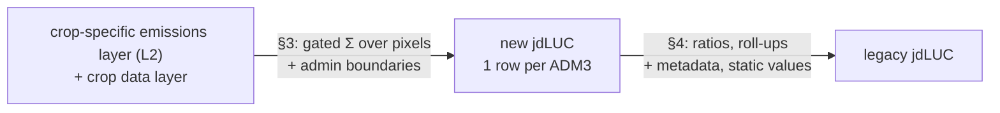

# jdLUC from the proposed emissions data model

Working note, 2026-09-23. Assesses [`orbae_emissions_data_model.md`](orbae_emissions_data_model.md) against
maverick `main` @ `2f87a409`. Calculators are in `adastraeco/calculators/`, post-processing in
`adastraeco/post_processing/core/`; paths below are relative to maverick.

**Proposal.** Don't reproduce legacy jdLUC directly. Introduce a parsimonious **new jdLUC**: one file per
(country, crop, reference year), one row per ADM3, holding extensive values only. Ratios (yield, per kg, %, per ha)
are derived from it. Two derivations must hold:

**Scope.** Out of scope for now: forecasting, backcasting, palm, and the jdLUC proxy (CropGrids allocation).
Annual (per-year) columns are treated separately in §4. Only the annualized-cascade + climate-zone pathway is considered. The legacy residual
chain and the scalar path are excluded.

## 1 · Decisions on the emissions data model

| # | topic | decision |
|---|---|---|
| 1.1 | `crop_present_in_baseline_year` | **Required.** Every emission term is gated on `crop_now ∧ ¬target_crop_at_baseline` (`execution/luc_calculation.py:606`). |
| 1.2 | soil factor | The model's "flu factor" means the *loss fraction* `1 − F_LU` (terminology). Paddy/pasture → 0. |
| 1.3 | peat | A single `is_peat` field. The EF is an annual rate by climate zone × crop class. Transformation = rate × years since conversion, amortised; occupation = rate on crop-on-peat that was not transformed. |
| 1.4 | "most significant" event | A fixed priority, TCL > natural grassland > cultivated grassland (`calculators/pipeline.py:93`). It is conservative: in a conflict it takes the likely-highest-emitting event. |
| 1.5 | `crop_present` | Stays **bool**. Crop-specific processing (probability → bool, exclusions, composite masks) sits behind this interface. |
| 1.6 | harvests per year | Folded into `yield` in crop data. It can be carried as metadata if a user needs it. |
| 1.7 | **layer 2 additions** | Copy the **y-20 cropland bit** (or the whole y-20 bitmask) and **`is_peat`** through from layer 1, so that jdLUC never reads layer 1. Add **`conversion-year`** too if the annual columns in §4 are kept. |
| 1.8 | layer 2 coverage | Layer 2 holds "potential emissions *if* the crop occupies this pixel" for **every** pixel. The crop and baseline gates are applied in jdLUC. |

Still open:

- **Forest-dataset policy.** TCL / TMF / combined / GFW is a per-config choice today (cocoa WCF uses TMF v3). We need either one global choice or layer-1 variants.
- **Prior-agricultural filter.** It is conceptually event cleaning in layer 1, but the mask set varies by config today.
- **DOM.** The cocoa rule (DOM = 7 % AGB vs 5.2 t dm/ha) has to be applicable in layer 2, so AGB must stay separable.

## 2 · New jdLUC

One file per (country, crop, reference year); one row per ADM3. Keys: ADM3 id plus parent ids (ADM2, ADM1, country).

Every column is `Σ over the ADM3's pixels of hectares-per-pixel × value × gate`, using the following notation:

- `E` = `crop_present ∧ ¬crop_present_baseline`, both from crop data.
- `s` ∈ {forest, natural_grassland, pasture}, from L2 `conversion source`.

**Sources: layer 2, the crop data layer, and admin boundaries. Nothing else.**

### 2a · Core — 19 columns

| column | unit | value summed | gate |
|---|---|---|---|
| `crop_area_ha` | ha | 1 | `crop_present` |
| `production_t` | t | crop data `yield` | `crop_present` |
| `crop_expansion_ha` | ha | 1 | `E` |
| `cropland_conversion_ha` | ha | 1 | `E ∧` L2 y-20 cropland bit |
| `{s}_conversion_ha` | ha | 1 | `E ∧ source = s` |
| `forest_conversion_total_ha` | ha | 1 | `source = forest` (all land) |
| `{s}_biomass_amort_t` | tCO2e | L2 `vegetation-emissions-amortized-per-ha` | `E ∧ source = s` |
| `{s}_mineral_soil_amort_t` | tCO2e | L2 `mineral-soil-emissions-amortized-per-ha` | `E ∧ source = s` |
| `peat_transformation_amort_t` | tCO2e | L2 `peat-soil-transformation-emissions-amortized-per-ha` | `E` |
| `peat_transformed_ha` | ha | 1 | `E ∧` L2 peat transformation > 0 |
| `peat_occupation_ha` | ha | 1 | `crop_present ∧` L2 `is_peat ∧ ¬transformed` |
| `peat_occupation_t_per_yr` | tCO2e/yr | L2 `peat-occupation-emissions-per-year` | same |
| `peat_in_admin_ha` | ha | 1 | L2 `is_peat` |

### 2b · Equal allocation (separable) — 7 columns

`{s}_biomass_amort_eq_t`, `{s}_mineral_soil_amort_eq_t`, `peat_transformation_amort_eq_t`: as the core columns,
but with 1/20 weights. **Requires** layer 2 to carry an equal-weight variant of each amortised column.

### 2c · Undiscounted (separable) — 6 columns

`{s}_biomass_t`, `{s}_mineral_soil_t`: as the core columns, but before amortisation (stock × loss fraction).
**Requires** layer 2 to carry undiscounted variants. If both 2b and 2c are kept, the biomass and soil columns of 2b
are redundant (undiscounted / 20); peat is not.

## 3 · Legacy jdLUC ← new jdLUC

Legacy rows exist at ADM3, ADM2, ADM1 and country level. Common rules:

- **Roll-up**: all columns are Σ over child units.
- **Mask** (static `th_ha`): at ADM3, units with `production_t ≤ th_ha × mean(yield)` (pasture: `crop_area_ha ≤ th_ha`) have every column except forest total and peat in admin nulled **before** roll-up, so they drop out of coarser sums (`post_processing.py:4545`).
- **Per kg** = tCO2e ÷ production t.
- `T` = Σ over sources and pools of `amort` + `peat_transformation_amort_t`.

### 3a · Core

| legacy column(s) | derivation |
|---|---|
| Traceability, LUC type, Data Ownership, Commodity, Permanency, Assessment year, Country, ID, Admin 1–3, Harvests Per Year | metadata / static |
| Yield | `production_t / crop_area_ha` |
| Crop production, Crop area, Crop expansion, Cropland / Pastureland / Natural grassland / Forest (crop related) / Forest (total) conversion, Peat occupation, Peat in admin unit, Peat area transformed | direct |
| LUC GHG | `T / production_t` |
| MIN / MAX LUC GHG | min / max of child units' LUC GHG (NaN at ADM3) |
| Peat emissions from land transformation | `peat_transformation_amort_t / production_t` |
| Peat emissions from land occupation | `peat_occupation_t_per_yr / production_t` — not amortised, not in the total |
| every `[%]` (by source, by pool, source × pool, peat) | the matching amortised value(s) / `T` |
| DOM [%], Quality rating | constant NaN |

### 3b · Depends on equal allocation (2b)

| legacy column | derivation |
|---|---|
| LUC GHG, equally allocated | (Σ `amort_eq` + `peat_transformation_amort_eq_t`) / `production_t` |
| Peat emissions from land transformation, equally allocated | `peat_transformation_amort_eq_t / production_t` |

### 3c · Depends on undiscounted (2c)

| legacy column(s) | derivation | consumers today |
|---|---|---|
| `{biomass, soc}_luc_ghg_from_{s}_per_ha` | `{s}_{pool}_t / {s}_conversion_ha` | What-If module; range checks in `post_processing/jdluc_validation.py:56` |

If 2b and 2c are both dropped, new jdLUC needs only layer 2 as specified (plus the §1.7 additions), crop data and
admin boundaries.

## 4 · Annual columns

**What applies to all of them**

- **Same sum, split by year.** Each annual family is the corresponding core sum, split by conversion year
  (`ref−19 … ref`), and added to the same one-row-per-ADM3 file as 20 columns `…_year_YYYY`.
- **One new layer-2 field.** Layer 2 needs **`conversion-year`** copied through from layer 1. Layer 2 as specified
  uses it only inside the linear weight and doesn't expose it.
- **No new values otherwise.** Each pixel has one conversion year, so splitting by year needs no new values; the one
  exception is the undiscounted family, which needs the §2c variant.
- **Mapping to legacy.** Legacy per-kg annual columns = the per-year extensive value ÷ production. Roll-up is still
  a sum. The core totals equal the sums of their families, so they become redundant (they are kept for legibility).

Consumers were checked in maverick `main` only. External readers of the output files are unknown.

| # | legacy family (× 20 years) | new jdLUC family: value × gate | sources | consumers in maverick | rec. |
|---|---|---|---|---|---|
| 1 | `annual_forest_loss_(crop_related)_year_X` | `forest_conversion_ha_year_X`: 1 × (`E` ∧ forest) | L2 source + conversion-year; crop data | `DeforestationYear` import (`database_import/deforestation_import.py`): cumulative loss, deforestation footprint, deforestation-free volume. Validation: crop-related forest conversion ≥ Σ annual (`jdluc_validation.py:371`). | **keep** |
| 2 | `forest_luc_ghg_per_ha_year_X` (What-If: undiscounted kg CO2e per ha of crop) | `forest_emissions_t_year_X`: L2 undiscounted forest biomass + mineral soil × (`E` ∧ forest); ÷ `crop_area_ha` at output | as #1, plus §2c undiscounted (forest only, one combined column) | What-If module via `LucGHGYear` import (`database_import/luc_ghg_year_import.py`) | **keep** |
| 3 | `{forest,native,pasture}_luc_ghg_{biomass,soil}_year_X_dep` (6 families, amortised kg/kg) | `{s}_{pool}_amort_t_year_X`: L2 amortised pool × (`E` ∧ source); ÷ production at output | L2 source + conversion-year + amortised values; crop data | only the temporary What-If demo command (`adastra_admin/management/commands/import_luc_ghg_year_data.py`), which back-calculates what #2 now provides directly | skip |
| 4 | `annual_{natural,cultivated}_grassland_loss_year_X` | `{s}_conversion_ha_year_X`: 1 × (`E` ∧ source) | L2 source + conversion-year; crop data | none found | skip |
| 5 | `total_annual_forest_loss_year_X` | `forest_conversion_total_ha_year_X`: 1 × forest (all land) | L2 source + conversion-year | none found | skip |
| — | `forest_luc_ghg_{biomass,soil}_year_X_depeq` | — | — | computed and aggregated but not published (`col_to_retrieve`) | n/a |

Keeping #1 and #2 costs 40 columns plus `conversion-year` in layer 2. It also pulls a forest-only slice of §2c into
scope. #2 is the only undiscounted value that has a regular consumer.

## 5 · Deferred

Notes for when these come back into scope:

- **Forecasting and backcasting.** Forecasting runs on undiscounted per-year ADM3 series before amortisation, so a
  forecast new jdLUC needs the annualised columns first. Cell-level backcasting needs loss events *after* the
  reference year, which are outside layer 1's window; it belongs in `crop_present` pre-processing. Admin-level
  backcasting and the pre-2001 fill are ADM-level steps.
- **Palm.** This needs a crop sub-class (industrial / smallholder) and planting year (young/mature peat EF, `[OLD]`
  peat columns, palm "past" extent).
- **jdLUC proxy.** CropGrids allocation needs a crop share, not a bool. It is currently ADM3 share × ADM3 totals.
- **Not needed for jdLUC at all:** `continent` / gas breakdown (nothing splits CO2/CH4/N2O today),
  `destination-dataset`, and diagnostics without an output column (tropical-ecozone area, protected areas, TMF
  undisturbed forest, GPW v2 shrubland, canopy cover, cascade transition pairs).
- **Not checked:** exact numerical equality with today's output. H3 level-13 cells vs raster pixels will shift values.
