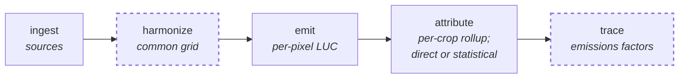

# Orbae Emissions Layer spec vs. Cornerstone LUC — alignment review

**Status:** draft for discussion · **Repo state:** `8130655` (migrate from GLCLUC to TCL/GPW/GACED30) · **Spec state:** `docs/orbae/orbae_emissions_layer_spec.md` as committed in `0db3abd`

This document compares three things that are usually collapsed into two:

1. **The spec** — `docs/orbae/orbae_emissions_layer_spec.md`
2. **The repo's own documentation** — `docs/methodology.md`, `docs/architecture.md`, `docs/further_research.md`, `docs/peatland_methodology_supplement.md`
3. **The code** — what `jdluc/` actually does


---

## 0 · How to read this

### Organising axis

This document is organised by **the repo's five-stage pipeline**, not by the spec's eight-step calculation sequence. That is deliberate and slightly inconvenient for a spec-fluent reader, so here is the map in both directions.

The repo's pipeline, as documented in [`architecture.md`](../architecture.md):



*Dashed: stages the spec has no slot for.*

The crosswalk, spec → repo:

| spec step | repo stage | where in code |
|---|---|---|
| **1a** Event sources | ingest → harmonize | `jdluc/datasets/`, `harmonize.Stack.LUC_AND_EMISSIONS` |
| **1b** Value sources | ingest → harmonize, plus constants in `emit.py` | same, plus module-level tables |
| **2.1** Conversion event | **emit** | `get_conversion_record` |
| **2.2** Peat event & soil regime | **emit** — *not a separate step* | folded into `get_conversion_emissions` |
| **3** Emissions per event | **emit** | `get_conversion_emissions`, `get_peatland_occupation_emissions` |
| **4** Reference year | **emit + attribute** — *split across the stage boundary* | `get_span_to_charge` (emit); `get_linear_discounted_total` (both) |
| **5** Filters | attribute — *no filter layer exists* | fused into each leg's rollup |
| **6** Export | emit (zarr) / attribute / trace (parquet) | `get_dset_for_output`, `cache_to_parquet` |

And in the other direction — **repo stages and components the spec does not name at all**:

| repo stage | what it does | why the spec has no slot for it |
|---|---|---|
| **harmonize** | Aligns every ingested source onto one common 30 m grid, one 10° tile at a time, as a lazy `xarray.Dataset` backed by zarr | The spec assumes a common grid rather than specifying how one is reached — its step 1b output is *"a versioned set of value layers on the same thirty-metre grid"*, which is this stage's product, not an input to it. It is the machinery that makes "every value layer on the same grid" true rather than aspirational, and it is where resampling, nodata and dtype policy per dataset are decided |
| **trace** | Joins the attribution rollups to production and derives the per-(jurisdiction, crop) emissions factor in kgCO₂e/kg | Legitimately out of scope: the spec specifies a layer, not a factor table. Noted because "the emissions layer" in repo terms ends at `emit`, and **two further stages** stand between it and anything a client sees |
| **`validation/`** | A separate package that pulls reference figures and reports the pipeline's output against them | No counterpart in the spec. Notable because it is **the only part of the system already parameterised by reference year** (`REFERENCE_YEAR = 2020`, `--year`) — the emissions layer the spec is about is not |

The asymmetry is worth sitting with. The spec's eight steps map onto **three** of the repo's five stages; two repo stages have no spec counterpart, and one spec step (5, filters) has no repo counterpart. Neither document is a superset of the other.

Several further things fall out of the first table that a spec-ordered reading would not surface — they are the most important architectural facts in this document, and they are gathered in **§2 · Structural findings**.

**Read §1 first, §2 second.** The stage-by-stage sweep is where the repo's shape becomes legible; the structural findings are what that shape implies. Each stage section flags the structural findings it touches and links forward to them, so the cross-cutting issues can be followed either way round.

### Classification

Every finding carries one of these:

**The three that matter** — these describe the relationship between the two *methods*:

| | tag | meaning |
|---|---|---|
| ✅ | **Aligned** | same approach, same result |
| 🤝 | **Convergent** | different route, same number — no action needed, but worth knowing |
| ❌ | **Disagreement** | a genuine methodological fork. Not a verdict: a fork is a place where two defensible answers were given to the same question |

**Two that describe absence or accuracy** rather than disagreement:

| | tag | meaning |
|---|---|---|
| 🛠️ | **Unbuilt** | the spec wants it; neither side has it |
| 📕 📙 📘 | **documentation accuracy** | a document misdescribes something. 📕 **Spec-incorrect** — the spec describes a repo state that never existed · 📙 **Spec-stale** — the spec describes a repo state that no longer exists · 📘 **Doc drift** — the repo's own documentation and the repo's code disagree (all collected in [§6](#6--where-the-repos-documentation-and-code-disagree)) |

### Provenance of claims

Every claim about the code below is cited to `file:line` and was checked against source. Where a claim is about *intent* rather than behaviour — what someone meant, rather than what runs — it says so in the text. Points where the repo's own documentation and its code disagree are flagged 📘 in place and collected in **[§6 · Where the repo's documentation and code disagree](#6--where-the-repos-documentation-and-code-disagree)**.

---

## 1 · Stage by stage

### 1.1 · Ingest & harmonize — spec steps 1a, 1b

> **Structural findings touching this stage:** [§2.3 · reference-year independence](#23--reference-year-independence-is-three-separate-questions) — the event window is clipped *here*, at harmonize, not at export: GPW runs to 2024 and TCL to 2025, but only 2000–2020 reaches `emit`.

**What these stages are for.** `ingest` downloads each external source into tiled COGs with minimal modification, tagged with provenance metadata. `harmonize` aligns them onto one common 30 m grid, one 10° tile at a time, yielding a lazy `xarray.Dataset` per tile backed by a zarr — the machinery that makes "every value layer on the same grid" true rather than aspirational, and which the spec assumes rather than specifies.

**The repo's stack** (`harmonize.Stack.LUC_AND_EMISSIONS` + `CROP_SUPPLEMENT`):

| purpose | repo | spec | tag |
|---|---|---|---|
| Forest loss | GNW Hansen TCL, `lossyear` | GFW TCL (GFC-2025-v1.13) | ✅ **Aligned** |
| Canopy threshold | **not ingested** — `band_names=["lossyear"]` only ([gnw_tcl.py:32](../../jdluc/datasets/gnw_tcl.py:32)) | `treecover2000 > 10%`, kept and marked | ❌ **Disagreement** |
| Grassland | GPW v2-beta, 2000–2024 | GPW v2, 2000–2024 | ✅ **Aligned** |
| Grassland class merge | `NATURAL` + `OPEN_SHRUBLAND` → rangeland; `CULTIVATED` → pasture | shrubland/rangeland merged into natural grassland; pasture separate | ✅ **Aligned** |
| Peat presence | GNW Global Peatlands | **Xu et al. (2018) PEATMAP** — spec says explicitly *"The Global Forest Watch peat composite is a second-version input, not this one"* | ❌ **Disagreement** |
| AGB | GNW Harris | Harris et al. | ✅ **Aligned** |
| BGB | Huang et al., fallback R2S 0.25 ([emit.py:54](../../jdluc/emit.py:54)) | Huang et al., fallback 25% of AGB | ✅ **Aligned** |
| Soil carbon | SoilGrids OCS 0–30 cm | SoilGrids OCS 0–30 cm | ✅ **Aligned** |
| Climate zones | IPCC (Lewis 2022), 10 zones incl. tropical wet/moist/dry/montane | AdAstra FAO GEZ map, tropical moist+wet collapsed | ❌ **Disagreement** (declared by spec) |
| Grassland biomass | Houghton/BLUE, per climate zone ([emit.py:114](../../jdluc/emit.py:114)) | climate-zone stock + CTrees country woody top-up | ❌ **Disagreement** (declared by spec) |
| DOM | CDM AR-TOOL-12 fractions of AGB ([emit.py:96](../../jdluc/emit.py:96)) | CDM AR-TOOL-12, per Cornerstone | ✅ **Aligned** |
| Pixel area | computed from latitude ([emit.py:509](../../jdluc/emit.py:509)) | computed from latitude, not assumed constant | ✅ **Aligned** |
| Destination layers | GACED30 cropland, Descals oil palm, GPW cultivated | **none** — no destination is read | ❌ **Disagreement** (see §2.2) |
| Gas shares | **none** | Fitts et al. (2025), regional | 🛠️ **Unbuilt** on repo side |
| Peat EFs by zone/land use | **none** — two flat constants | Orbae v2.3 per zone and land use, with gas split | ❌ **Disagreement** |

**Note on the canopy threshold.** This is not a disagreement anyone has argued for — it is simply not reachable. The repo ingests `lossyear` alone, so `treecover2000 > 10%` cannot be evaluated without an ingest change. It is a one-band addition, not a redesign.

**Provenance.** The spec's declared difference — *"Cornerstone's cache keys are content-blind and require a manual version bump … We stamp the version of every contributing input into the export"* — is accurate about the cache keys ([storage.py:191](../../jdluc/storage.py:191)) and the repo documents the trade deliberately. But it understates what exists: every ingested COG already carries `watershed-data-version`, `watershed-processing-version` (git SHA), `watershed-processing-time`, `watershed-source-name`, `watershed-product-name` and `watershed-remote-url` tags, under a deterministic path prefix. The gap is that this provenance stops at ingest and is not propagated into emit's zarr or the parquet exports. **Carrying it forward is a smaller job than the spec's framing implies.**

### 1.2 · Emit — spec steps 2.1, 2.2, 3, and half of 4

> **Structural findings originating in this stage — all five of them.** [§2.1 · intermediate products](#21--the-intermediate-products-the-spec-requires-are-not-materialised) · [§2.2 · the destination is read and required](#22--the-destination-class-is-read-and-required) · [§2.3 · reference-year independence](#23--reference-year-independence-is-three-separate-questions) · [§2.4 · five-year spans](#24--five-year-spans-change-the-numbers-and-only-one-consumer-needs-them) · [§2.5 · one soil variant, not a family](#25--the-layer-resolves-one-soil-variant-the-spec-carries-a-family-of-them).
>
> This is not an accident of exposition: four of the spec's eight steps live inside one function here, so anything cross-cutting necessarily originates in it.


**What this stage is for.** One cached function per 10° tile, producing per-pixel conversion and emissions bands as a lazy dask graph persisted to zarr. It is crop-agnostic and feeds both attribution legs. See §2.1 for why its granularity is the central architectural fact.

#### Conversion resolution (spec 2.1)

| aspect | repo | spec | tag |
|---|---|---|---|
| One event per pixel | yes — `Conversion` members are mutually exclusive | yes | ✅ **Aligned** |
| Forest outranks grassland | yes — `from_rangeland = ~from_forest & …` ([emit.py:349](../../jdluc/emit.py:349)) | yes, forest outranks natural grassland outranks pasture | ✅ **Aligned** |
| Repeat departures | last one wins — `get_last_departure_year` ([emit.py:286](../../jdluc/emit.py:286)) | last one wins | ✅ **Aligned** |
| **Rangeland vs pasture** | resolved **by date**: `rangeland_departure_year > pasture_departure_year` ([emit.py:350](../../jdluc/emit.py:350)) | resolved **by materiality**: natural grassland outranks pasture regardless of date — *"a natural grassland loss in 2005 wins over a pastureland loss in 2012"* | ❌ **Disagreement** |
| First departure retained | **no** | yes, as an audit attribute — step 2.2 needs it | ❌ **Disagreement** |
| Candidate count, cascade flag | **no** | yes, both kept for audit | ❌ **Disagreement** |
| Destination read | yes, and required | no | ❌ **Disagreement** — §2.2 |

The **rangeland-vs-pasture rule is worth calling out** because neither document acknowledges it. The repo resolves by recency within the grassland family; the spec resolves by materiality. Both apply "forest first", so the disagreement is confined to pixels that left both natural grassland and pasture inside the window — but on those pixels the two methods can pick different source classes, with different carbon stocks.

📘 **The repo's own documentation does not state this rule at all** — see [D2](#6--where-the-repos-documentation-and-code-disagree). That is why it is not classified here as agreement or disagreement: until someone says which behaviour was intended, there is no repo *position* to compare the spec against, only repo *behaviour*.

#### Soil regime and peat (spec 2.2)

| aspect | repo | spec | tag |
|---|---|---|---|
| Strict either-or soil regime | yes — peat **replaces** the mineral term ([emit.py:426](../../jdluc/emit.py:426)) | yes — *"the two are never both computed on the same pixel"* | ✅ **Aligned** |
| Soil-regime published as a band | **no** | yes | ❌ **Disagreement** |
| Pulse fires once per pixel ever | yes, by construction (one conversion per pixel) | yes | ✅ **Aligned** |
| Pulse dating | the step-2.1 event year (last departure / loss year) | the **first** conversion year observed | ❌ **Disagreement** |
| Flag where pulse year ≠ event year | **cannot be computed** — first departure not retained | yes | ❌ **Disagreement** |
| Peat without a conversion event | **emits nothing** | peat occupation, ongoing, no year | ❌ **Disagreement** |

#### Emissions per event (spec 3)

| aspect | repo | spec | tag |
|---|---|---|---|
| Full source stock released, no differencing | yes ([emit.py:417](../../jdluc/emit.py:417) docstring: *"The whole source stock goes, since a conversion has no destination stock to subtract"*) | yes | ✅ **Aligned** |
| Biomass depends on source only | yes ([emit.py:445](../../jdluc/emit.py:445)) | yes | ✅ **Aligned** |
| DOM forest only | yes — folded into `forest_carbon` | yes | ✅ **Aligned** |
| Mineral SOC keyed on | climate zone alone; one resolved variant ([emit.py:146](../../jdluc/emit.py:146)) | climate zone **×** crop group, carried as 3 (or 5) parallel unresolved variants | ❌ **Disagreement** — [§2.5](#25--the-layer-resolves-one-soil-variant-the-spec-carries-a-family-of-them) |
| Pasture mineral SOC | **zero** — LU and management factors assumed 1.0 ([emit.py:430](../../jdluc/emit.py:430)) | a pasture LUC factor, to be added | 🛠️ **Unbuilt** / spec OPEN task |
| Peat pulse | 621 tCO₂e/ha | 621 tCO₂e/ha | ✅ **Aligned** on value |
| Peat occupation | 37.3 tCO₂e/ha/yr | 37.3 tCO₂e/ha/yr, re-expressed on AR5 → 37.20 | 🤝 **Convergent** on value |
| Occupation coverage | **only where a destination resolved** ([emit.py:681](../../jdluc/emit.py:681)) | **every** organic-soil pixel, converted or not | ❌ **Disagreement** — and see §3.1 |
| Pulse and occupation additive on a converted peat pixel | yes ([emit.py:687](../../jdluc/emit.py:687)) | yes | ✅ **Aligned** |
| Gases | CO₂e only, no gas dimension | CO₂ / CH₄ / N₂O per pool, Fitts et al. shares | ❌ **Disagreement** (declared) |
| GWP | AR6 | AR5 (CH₄ 28, N₂O 265) | ❌ **Disagreement** (declared) |

**On 621 and 37.3.** The spec is right that 37.3 is the temperate cropland value: [`peatland_methodology_supplement.md`](../peatland_methodology_supplement.md) tabulates the IPCC 2013 Wetlands Supplement factors by zone and land use, and temperate cropland totals 29.0 + 1.1 + 1.6 + 5.6 = **37.3** on AR6 GWPs. It is adopted as `E_LM`, the steady state of the blended all-GHG reference curve. 621 is `P_LUC`, a least-squares fit of the GHGP linear ramp to that curve over years 1–20 — which the spec also describes correctly in its step 3.

What the spec reads as an absence is a decision with an argument behind it. The supplement has the full zone × land-use table and deliberately takes the temperate cropland row as the cross-zone steady state, because *"the tropical plantations are under 10 years at median. In contrast, the temperate and boreal peatlands are decades to centuries old … it must be parsed out for time-dependent models."* The tropical elevation is real, but on this reading it is an **age** effect, and the model carries it in the pulse rather than in the annual rate.

That is the substantive disagreement, and it is sharper than a provenance dispute: the spec proposes replacing 37.3 with zone- and land-use-specific occupation factors (tropical annual cropland 56.92). If the supplement's reading is right, doing that **double-counts the early-phase flux** — once in the tropical annual rate and again in the 621 pulse the spec keeps unchanged. ❌ This is where the peat argument has to be had, and the supplement is the document to have it against.

### 1.3 · Attribute — spec steps 4 (second half), 5, 6 (partly)

> **Structural findings touching this stage:** [§2.3 · reference-year independence](#23--reference-year-independence-is-three-separate-questions) — the amortisation discount is applied *here*, by each leg separately, which is what makes the per-span bands re-amortisable without recomputation · [§2.4 · five-year spans](#24--five-year-spans-change-the-numbers-and-only-one-consumer-needs-them) — the span granularity exists for this stage's statistical leg, and the direct leg does not use it.


**What this stage is for.** Clips per-pixel emissions to jurisdiction polygons and crop masks, rolling up to per-(jurisdiction, crop) totals via one of two legs: `JURISDICTIONAL_DIRECT` (mask to CDL crop codes; USA only today) or `STATISTICAL` (downsample to the MapSPAM ~10 km grid and split by crop-expansion share).

**This is where the spec's step 5 should live, and there is no step 5.** The repo has no filter layer. Filtering happens in two places, neither of them detached:

1. **Inside creation**, as the destination requirement (§2.2).
2. **Inside the rollup**, as the crop mask — and differently in each leg. `jurisdictional_direct.py` masks by CDL codes; `statistical.py` splits by expansion share.

Neither of the spec's two named filters can currently be computed: the canopy-threshold filter needs `treecover2000` (not ingested), and the repeat-departure filter needs the first departure year (not retained). Both are input/publishing gaps rather than methodological objections.

**One asymmetry worth noting.** The direct leg explicitly subtracts pastureland peat occupation before allocating, because it allocates to CDL crops alone and *"peat drained under pasture has no row to land on, and leaves the total along with it"* ([jurisdictional_direct.py:190](../../jdluc/jurisdictional_direct.py:190)). That is the repo working around exactly the coverage question the spec's step 5 is designed to make explicit.

### 1.4 · Trace — beyond the spec's scope

**What this stage is for.** Joins the attribution rollups to production (NASS QuickStats yields for the direct leg, MapSPAM production for the statistical leg) and derives the per-(jurisdiction, crop) emissions-factor table in kgCO₂e/kg.

The spec has no slot for this stage and does not need one — it specifies a layer, not a factor table. Noted here for completeness, because "the emissions layer" in repo terms ends at `emit`, and two further stages stand between it and anything a client sees.

---

## 2 · Structural findings

These five cross stage boundaries and cannot be filed under any single one — which is why they are gathered here rather than distributed through §1. Each is cross-referenced from the stage it originates in.

They are ordered by consequence, not by pipeline position.

### 2.1 · The intermediate products the spec requires are not materialised

The spec asks for more than a calculation. Its fourth principle is a requirement about **artifacts**:

> *"Every intermediate result is a real, named product. The layer is built in a handful of steps, and each step leaves behind a stored result with a fixed set of columns and a check that it passed. Each step works only from the result of the step before it."*

Four things are being asked for per step: it is **stored**, it is **named and addressable**, it has a **fixed schema**, and that schema is **checked**.

Across the span the spec calls steps 1a to 6, it names **eight** such products. The repo materialises **two**: the harmonized stack ([harmonize.py:314](../../jdluc/harmonize.py:314)) and the emissions layer ([emit.py:612](../../jdluc/emit.py:612)), each one cached zarr per 10° tile.

| spec step | its named output | materialised in the repo? |
|---|---|---|
| 1a | event sources, unfiltered | folded into the harmonize zarr |
| 1b | versioned value layers | partly — rasters in the harmonize zarr; the climate-zone tables are module constants in `emit.py`, never written |
| 2.1 | conversion event, candidate count, cascade flag | **no** |
| 2.2 | soil regime, peat conversion year, first conversion year, occupation mask | **no** |
| 3 | one layer per pool and gas, undiscounted | **no** — pools are summed into `soil` and `vegetation` before anything is written |
| 4 | amortisation factor, years since conversion, in-window flag | **no** — only the discounted result |
| 5 | one boolean layer per filter | **no** — no filter layer exists (§1.3) |
| 6 | long-form export | **no** (§4) |

**This is not a complaint about decomposition.** Where the spec's steps and the repo's code compute the same thing, they agree, and the fact that the repo does in one function what the spec describes in four is of no consequence by itself. Two real things follow from the missing artifacts, and neither is about tidiness:

**Auditability.** Several quantities the spec requires as output exist inside `emit.workflow()` as intermediate values and are then consumed: the per-pool fluxes before they are summed, the carbon stocks, the soil regime. They are computed, they are correct, and they cannot be inspected. The repo's own assertion discipline reflects the same gap — the parquet stages check their output schema (`assert set(data[0]) == set(SCHEMA)`, e.g. [statistical.py:458](../../jdluc/statistical.py:458)), the zarr stages assert nothing about their band set.

**Interventability.** A stored intermediate is a place to intervene. Because steps 2.1 → 4 resolve to one artifact, the only seam available to anything downstream is the band contract at emit's output — which is why the destination-override question (§2.2) is answered in terms of *which bands are published* rather than *which step to re-run*. That is a consequence of this finding, not a separate one.

**What it would cost.** Splitting `emit.workflow()` into per-step cached stages is tractable and the machinery already exists — `storage.cache_to_zarr` is designed for exactly this, and `statistical.py` already caches an intermediate zarr of its own ([statistical.py:97](../../jdluc/statistical.py:97)). The cost is four cache keys instead of one, four schema definitions, and more storage. The repo's caching design is a deliberate, documented choice — [`architecture.md`](../architecture.md) argues for lightweight stage-output caching over adopting an orchestrator — so this is a disagreement about *where stage boundaries fall*, not about whether intermediates are worth having. It should be scoped and costed on its own, rather than arriving as a side effect of the destination discussion.

**Separate from this:** whether those intermediates would be *reference-year independent* once they exist is a different question with a different answer — see §2.3. A materialised step-3 product that still had the assessment year baked into it would satisfy this principle and fail that one.

**Tag: ❌ Disagreement**

### 2.2 · The destination class is read, and required

This is the single largest divergence and the one from which most others follow.

Spec step 2.1: *"No destination class is read at this point. What the land became is not part of the event."*

The repo computes the source half and the destination half of the conversion independently, then **intersects** them ([emit.py:364–376](../../jdluc/emit.py:364)):

```python
conversion_to_mask = {
    Conversion.FOREST_TO_CROPLAND:    from_forest    & to_cropland,
    Conversion.FOREST_TO_PASTURE:     from_forest    & to_pasture,
    Conversion.RANGELAND_TO_CROPLAND: from_rangeland & to_cropland,
    Conversion.RANGELAND_TO_PASTURE:  from_rangeland & to_pasture,
    Conversion.PASTURE_TO_CROPLAND:   from_pasture   & to_cropland,
}
```

A pixel whose source class is known but whose destination no layer claims falls through to `Conversion.NONE`, and the gate `fired = conversion != Conversion.NONE` ([emit.py:434](../../jdluc/emit.py:434)) zeroes both its soil and vegetation terms ([emit.py:438](../../jdluc/emit.py:438), [:448](../../jdluc/emit.py:445)).

The repo is candid about the size of this. [`methodology.md`](../methodology.md) names it as a conformance gap against LSRS Requirement 11 and prices one of its buckets as *"the majority of tropical forest-loss carbon"*. The vegetation carbon is not lost — it is reported separately as `dropped-emissions` — but it is charged to nobody and nothing downstream can divide it among crops.

**The reason is stated and is not arbitrary** ([methodology.md:142](../methodology.md:142)): requiring the destination layer to confirm the conversion *in the same year, or even the same five-year span*, discards most identified forest losses, because a cleared pixel takes years to read as cropland or pasture in a 30 m annual classification. The repo's answer is to decouple the dating (*"no two layers are ever required to agree on a year"*) and test the destination only at the assessment year. The spec's answer is to not test it at all.

Both are responses to the same real problem. They are not the same response.

**Tag: ❌ Disagreement**

#### What it would cost to defer the destination

Less than it appears, at the emit stage; more than it appears, downstream.

**Already in the spec's favour:**
- `destination-dataset` publishes the *evidence* (which of three layers claimed the pixel) separately from the *decision*, as a bitmask, so the resolution is re-derivable without re-reading inputs.
- `conversion-year` is computed destination-free ([emit.py:389–396](../../jdluc/emit.py:389)).
- `get_span_to_component_to_emissions` ([emit.py:554](../../jdluc/emit.py:554)) already re-derives per-component emissions from *published* bands — an existing post-hoc re-derivation seam.

**The blockers, and what each is:**

| blocker | nature |
|---|---|
| `conversion` collapses to `NONE` for unclaimed pixels, so the **source class is unrecoverable** — and `dropped-emissions` sums forest and grassland into one number | publishing |
| **Carbon stocks are never written.** `forest_carbon` and `grassland_carbon` are computed full-grid at [emit.py:641–651](../../jdluc/emit.py:641) and consumed in place | publishing |
| **Soil terms exist only under the resolved destination.** `cropland_soil` and `pasture_soil` are computed full-grid at [emit.py:423–431](../../jdluc/emit.py:426), then masked | publishing |
| **Occupation is gated on the destination** ([emit.py:681–686](../../jdluc/emit.py:681)) | publishing — `is_peatland` is full-grid and the factor is a constant |

Every one of those arrays already exists, unmasked, inside `workflow()`. Deferring the destination is a **band-publishing change, not an algorithm change.** The masking happens at the last step and throws away work already done.

A minimal shape — roughly five bands: `source-class`, `source-carbon`, `soil-if-cropland`, `soil-if-pasture`, `peatland-occupation-all` — would likely *reduce* total band count, because the twelve per-span bands collapse once `conversion-year` carries the timing.

The real cost is the **output contract**, which is shared by `attribute.py`, `statistical.py` and `jurisdictional_direct.py`. Commit `8130655` is precedent for a larger version of exactly this migration.

### 2.3 · Reference-year independence is three separate questions

The spec's principle — *"no reference year until the very end … one computation serves every year and every amortization scheme"* — lands differently in three places.

**(a) Amortisation weights — Convergent.** The per-span bands `emissions:{span}`, `soil-emissions:{span}`, `vegetation-emissions:{span}` are published **undiscounted**; the discount is a separate reduction applied by each attribution leg ([statistical.py:268](../../jdluc/statistical.py:268), [jurisdictional_direct.py:149](../../jdluc/jurisdictional_direct.py:149)). `conversion-year` is annual. The layer already carries what is needed to re-amortise without recomputation. What is missing is only the *choice*: one scheme (linear), no `equal` or `none`, and spans keyed to absolute calendar years rather than years-since-conversion. Different route, same arithmetic.

*Caveat:* `emissions-per-hectare` and `dropped-emissions` **are** discounted inside emit ([emit.py:688](../../jdluc/emit.py:688), [:694](../../jdluc/emit.py:694)). Those two bands are reference-year-bound; the per-span bands beside them are not.

#### Where an amortisation variant has to be computed

The spec wants `linear`, `equal` and `none` *"computed and kept side by side, so the choice stays an output setting and not a baked-in assumption."* The repo has one scheme. Three things determine where a variant could live.

**First — the span granularity is not neutral between the variants.** A scheme is expressible at five-year granularity only if it is constant within each span. Checked against the repo's spans:

| spec variant | expressible as one weight per 5-year span? |
|---|---|
| **equal** — 1/20 per year | ✅ **exactly**. A constant function bins losslessly (each span weight is 1/20) |
| **linear** — (20−*d*)/210 | ⚠️ **only as an approximation** — the ±12.5% of §2.4 |
| **none** — full amount at *d* = 0 | ❌ **not at all.** *d* = 0 is a single year inside a span covering *d* = 0…4; no per-span constant can isolate it |

So the banding question and the variants question are the same question. `none` cannot be added without going annual; `linear` is currently an approximation of itself; only `equal` would be exact today.

**Second — there is exactly one definition and one function, with five call sites.** This is the good news. The scheme lives in `SPAN_TO_LINEAR_DISCOUNT_WEIGHT` and is applied by `emit.get_linear_discounted_total` ([emit.py:493](../../jdluc/emit.py:493)), which every consumer calls:

| # | call site | what it discounts |
|---|---|---|
| 1 | [emit.py:688](../../jdluc/emit.py:688) | `emissions-per-hectare` — the headline per-pixel total |
| 2 | [emit.py:694](../../jdluc/emit.py:694) | `dropped-emissions` |
| 3 | [jurisdictional_direct.py:149](../../jdluc/jurisdictional_direct.py:149) | per-component emissions, direct leg |
| 4 | [statistical.py:268](../../jdluc/statistical.py:268) | per-component emissions × expansion share, statistical leg |
| 5 | [statistical.py:242](../../jdluc/statistical.py:242) | **the production denominator** |

Parameterising the scheme is therefore a small, well-bounded change: give the function a scheme argument and thread a selector through five places. The weight is a per-pixel scalar and commutes with the spatial reduction to jurisdictions, so nothing about the clipping or summing has to move.

**Third — two obstacles that are not obvious from the spec's side.**

*Call sites 1 and 2 bake the scheme into published bands.* `emissions-per-hectare` is what the direct leg uses for its headline `emissions_mt`, while its component columns come from re-discounting the per-span bands at call site 3. Those two paths are meant to reconcile — `get_span_to_component_to_emissions` exists so that *"`emissions_mt` check[s] them rather than restate[s] them"*. Change the scheme at the consumer without changing it in `emit`, and the components stop summing to the total. So the variant selection cannot simply be pushed downstream while those bands remain pre-discounted.

*Call site 5 is the denominator, and the spec has no counterpart for it.* [`methodology.md`](../methodology.md) reduces production over the same window with the same ramp, deliberately: *"This ties emission allocation and production to the same years with the same recency weighting."* An amortisation variant therefore re-weights **both sides of the emissions factor**. The spec's claim that *"one computation serves every year and every amortization scheme"* holds for the layer — the per-span bands genuinely do serve all of them — but it does **not** hold for the emissions factor, which has to be recomputed per scheme because its denominator moves too. The spec stops at the layer and so never meets this; anyone reading the principle as "variants are free at every level" would be wrong about `trace`.

**Where the variants belong.** Not in `emit`. Publishing three amortisation variants × three-or-five soil variants × pools × gases materialises a cross-product that the undiscounted bands already imply — and the repo's existing shape, *publish undiscounted and reduce at the consumer*, is both smaller and strictly more general than the spec's three named schemes, because it admits any scheme rather than an enumerated set. The change that gets the repo to the spec's intent is narrower than the spec's own design: **stop pre-discounting call sites 1 and 2, go annual so `none` becomes expressible, and make the scheme a parameter of the attribution stage** — with `trace` re-run per scheme because of the denominator.

**(b) The event window — Disagreement.** `LOOKBACK_YEARS_RANGE` clips detection at creation ([emit.py:204](../../jdluc/emit.py:204)): grassland bands outside 2000–2020 are dropped before departure years are computed, and forest loss is bounded by `year_of_loss <= ASSESSMENT_YEAR`. Inputs run to 2024 (GPW) and 2025 (TCL); the layer stops at 2020. The spec keeps out-of-window events *and marks them at weight zero*; the repo never detects them.

**(c) Destination resolution — Disagreement, and the sharpest.** All three destination predicates read **at** `ASSESSMENT_YEAR` ([emit.py:257](../../jdluc/emit.py:257), [:262](../../jdluc/emit.py:262), [:270](../../jdluc/emit.py:270)). Moving the reference year therefore changes *which conversions exist at all*, and which one each pixel gets. This is precisely the spec's principle 8 — *"avoid cleaning rules that create artificial changes in the results for different reference years"* — and the repo's structure violates it directly. Fix §2.2 and this dissolves; leave §2.2 and no amount of downstream parameterisation repairs it.

**A concrete hazard, worth flagging on its own:** `ASSESSMENT_YEAR` is a module constant ([emit.py:203](../../jdluc/emit.py:203)), not an argument to `workflow(tile_id)`. The cache key is `sha1(module, qualname, version, *bound_args)` ([storage.py:191–208](../../jdluc/storage.py:191)). **Changing `ASSESSMENT_YEAR` and rerunning silently returns the zarr built for the old one.** Producing a second reference year today requires a manual `version` bump. This is a known, documented trade — [`architecture.md`](../architecture.md) states the manual-bump policy explicitly and argues for it — but it interacts badly with a parameter the spec wants to vary routinely.

Note the asymmetry: `validation/` **is** already parameterised by reference year (`REFERENCE_YEAR = 2020`, `--year` flag). The emissions layer is not.

### 2.4 · Five-year spans change the numbers, and only one consumer needs them

**Linear discounting itself is aligned.** Both methods apply a 20-year linear decline, and both conserve mass — the spec's `(20−d)/210` sums to 1.00 over the window, and so does the repo's span scheme (four weights summing to 0.2, each held for five reference years). The repo's documentation misdescribes how its constants were derived, but that is a **bug to fix, not a methodological difference** — it is [D1](#6--where-the-repos-documentation-and-code-disagree), and nothing in this section depends on it.

What is left is the **granularity**, and it is not neutral.

#### Yes, banding changes the output independently of MapSPAM

Every conversion inside a span receives the same weight regardless of its actual year. Against the repo's own annual ramp:

| conversion year | *d* | span weight | annual weight | error |
|---|---|---|---|---|
| 2020 | 0 | 0.0875 | 0.1000 | **−12.5%** |
| 2019 | 1 | 0.0875 | 0.0950 | −7.9% |
| 2018 | 2 | 0.0875 | 0.0900 | −2.8% |
| 2017 | 3 | 0.0875 | 0.0850 | +2.9% |
| 2016 | 4 | 0.0875 | 0.0800 | **+9.4%** |

These cancel only if conversions are distributed uniformly within the span. They are not: the Matopiba figure in [`methodology.md`](../methodology.md) shows clearance falling "in a few blocks rather than advancing as a front," concentrated between 2006 and 2015. A jurisdiction whose clearance clusters at one end of a span carries a systematic error of up to ~12%, in whichever direction its clustering falls.

This applies to the **direct leg**, which touches MapSPAM nowhere: `jurisdictional_direct.py:149` collapses all four spans immediately, over a CDL band with no time dimension at all. So the answer to the question is yes — the banding is not an artifact confined to the statistical leg's accounting, it changes per-pixel emissions everywhere.

#### A separate, smaller difference in the discounting convention

Worth isolating because it is easy to mistake for the banding effect. The repo normalises by **200** (the integral of the continuous ramp), the spec by **210** (the sum over 20 integer years). Both conserve mass; they distribute differently:

| years since conversion | repo | spec | repo/spec |
|---|---|---|---|
| 0–4 | 0.4375 | 0.4286 | 102.1% |
| 5–9 | 0.3125 | 0.3095 | 101.0% |
| 10–14 | 0.1875 | 0.1905 | 98.4% |
| 15–19 | 0.0625 | 0.0714 | **87.5%** |

The repo front-loads slightly relative to the spec, most visibly on the oldest block. This is a continuous-vs-discrete convention difference, not a disagreement about the shape of the ramp. 🤝 **Convergent** in intent; worth one sentence of agreement about which convention to standardise on.

This also **corrects the spec**, whose declared difference asserts the repo sums to 1.05 — see §3.1.

#### How deeply baked in is the banding?

Shallower than it looks in `emit`, real in exactly one consumer.

**In `emit`: the per-span bands are pure redundancy.** `get_span_to_charge` returns `{span: darray.where(conversion_year in span, other=0)}` ([emit.py:482](../../jdluc/emit.py:482)) — the *same array*, masked four disjoint ways. Since every pixel has exactly one conversion year and `conversion-year` is published annually, the twelve per-span bands (`emissions`, `soil-emissions`, `vegetation-emissions` × 4 spans) are **exactly reconstructible from three unbinned bands**. The span binning inside `emit` buys nothing that `conversion-year` does not already carry; it could happen at each consumer, at each consumer's own granularity.

**In `jurisdictional_direct`: zero coupling.** It collapses spans on the first line it touches them.

**In `statistical`: real, and in three places.**
- `SPAN_TO_MAPSPAM_SPAN` maps each emissions span to a MapSPAM snapshot pair ([statistical.py:224](../../jdluc/statistical.py:224)), with 2010–2015 and 2015–2020 both borrowing the 2010→2020 expansion because MapSPAM has no 2015 snapshot.
- `get_discounted_snapshot_mean` reuses `emit.SPAN_TO_LINEAR_DISCOUNT_WEIGHT` for the **production denominator**, so the emissions span weights serve double duty on both sides of the emissions factor.
- `assert set(SPAN_TO_MAPSPAM_SPAN) == set(emit.SPAN_TO_LINEAR_DISCOUNT_WEIGHT)` ([statistical.py:232](../../jdluc/statistical.py:232)) — the concrete line that welds the two definitions together.

That assertion is the whole of the architectural coupling, and it couples two things that are conceptually distinct: *the granularity emissions are charged at* and *the granularity MapSPAM can speak to*. The statistical leg genuinely needs the second. Nothing needs the first.

**So the shape of the change** is: publish unbinned emissions plus `conversion-year` from `emit`, give `statistical.py` its own span definition for its expansion shares, and let the direct leg weight annually. Twelve bands become three. The statistical leg's numbers need not change at all — it can bin annual emissions into its own MapSPAM spans and get what it has today.

**Tag: ❌ Disagreement** — on granularity, not on scheme.

### 2.5 · The layer resolves one soil variant; the spec carries a family of them

This is the spec's **third principle** — *"No crop information inside the layer"* — and it is as structural as the destination question, but on a different axis.

> **Note on sources.** This section draws on AdAstra's internal climate-zone factor work (the `GEZ_FLU_PeatEF` geopackage and its implementation plans), which sits outside this repository. Only the IPCC-derived structure is reproduced here — the underlying tables are IPCC 2019 Refinement Vol. 4 Ch. 5 Table 5.5 (cropland F_LU), Ch. 6 Table 6.2 (grassland F_LU) and Table 6.4 (pasture biomass), all of which this repo already cites. Internal identifiers, licensed third-party values and unpublished per-country figures are deliberately omitted.

The spec asks for the mineral-soil result to be computed **in parallel for every supported land-use category and never collapsed**:

> *"Because the layer does not know which crop grows where, it carries the soil-carbon result for all three crop groups side by side."*

The repo has **one** cropland soil factor, keyed on climate zone alone ([emit.py:146](../../jdluc/emit.py:146)), and `emit.workflow()` emits no band with a crop or land-use axis. There are two soil treatments in the whole layer: **cropland**, which takes the zone factor, and **pasture**, which assumes land-use and management factors of 1.0 and is therefore accounted-and-zero on mineral soil ([emit.py:430](../../jdluc/emit.py:430)).

#### The family is smaller than it looks — two members, not five

This is the most important thing to know before costing the change, and it is not visible from the spec's text.

Under IPCC Tier 1, **three of the spec's five categories carry no mineral-soil loss at all**:

| spec category | F_LU (IPCC) | as applied | mineral SOC loss |
|---|---|---|---|
| annual / long-term cultivated | 0.69 – 0.92 by zone | unchanged | **real** |
| perennial / tree crop | 0.72 temperate · **1.01** tropics | 1.01 → **1.00** | **real outside the tropics; zero inside them** |
| paddy rice | **1.35**, all climates | 1.35 → **1.00** | **zero** |
| pastureland | 1.00, all climates (Table 6.2) | unchanged | **zero** |
| forestry | reference state | — | **zero** |

The two capped values are worth stating precisely, because the usual shorthand gets them backwards. IPCC does **not** say paddy rice and tropical perennials lose no soil carbon — it says they *gain* it (F_LU above 1.0 means the new land use sustains a stock above reference). The cap to 1.00 is a modelling decision: `soc × (1 − F_LU)` would go negative, and the pipeline does not model SOC gain from land-use change, so the gain is discarded and the loss is zero. That is conservative in the accounting sense, and it is a choice, not an IPCC finding.

Paddy and pasture therefore need **no band** — not a band of zeros, no band. And because forest, natural grassland and pasture all sit at reference SOC on the source side, the source class does not enter the soil term at all: **the filter carries the source dimension, the F_LU variant carries the destination dimension**, and only the latter touches SOC. The source document makes this explicit in the way it labels its own tables — Table 5.5 is *"from any natural land use to cropland **or pasture to cropland**"*, one factor set for both, because pasture is itself at reference.

So the spec's "three or five parallel variants" resolves to **two real numbers**, one of which the repo already has.

#### Why the spec needs variants at all

Worth stating plainly, because it determines whether this is a requirement the repo should adopt or a consequence it can decline.

`F_LU` is a property of the **destination**. If you know the destination, you need exactly one factor. The spec carries a family *because it refuses to read the destination* — the variants are downstream of the deferred-destination principle (§2.2), not an independent requirement standing beside it.

So the repo's position is not "we are missing a family." Resolving destinations and resolving one factor is internally coherent. The repo's problem is narrower: **it resolves destinations at a granularity that cannot tell annual from perennial, and applies the annual factor to all of them.** GACED30 is a binary cropland mask and genuinely cannot support the distinction. Descals oil palm can, and the bit is already published in `destination-dataset` — so the information needed to stop over-charging tropical palm exists today, with no new data.

#### One number that should temper all of this

These are Tier 1 defaults carrying **±50–95% uncertainty**. The gap between the annual factor and the perennial one in the tropics — 17% of stock versus 0% — sits comfortably inside that band.

That is not an argument against carrying variants. The reason to carry them is structural: the layer cannot attribute to crops if it has already collapsed the crop dimension, and a wrong-variant charge is a systematic bias rather than noise. But it does mean the case should be made on **attributability and bias**, not on precision. Anyone defending the change on accuracy grounds will be met with the uncertainty band, and rightly.

#### The repo's existing factor is the annual variant — verified

Checked value-by-value, `CLIMATE_ZONE_TO_SOC_RETENTION_FRACTION` **is** the long-term-cultivated (annual cropland) row of Table 5.5:

| zone | repo | Table 5.5 F_LU, long-term cultivated |
|---|---|---|
| tropical wet / moist | 0.83 | 0.83 |
| tropical dry | 0.92 | 0.92 |
| warm temperate moist | 0.69 | 0.69 |
| warm temperate dry | 0.76 | 0.76 |
| cool temperate / boreal moist | 0.70 | 0.70 |
| cool temperate / boreal dry | 0.77 | 0.77 |
| **tropical montane** | **0.76** | **0.83** (mapped to tropical moist/wet) |

The repo is not applying an unlabelled generic factor. It is applying the **annual-cropland** factor to every cropland destination, and the spec's `annual` variant is what it already computes. One zone diverges: the repo approximates tropical montane as the mean of warm-temperate-moist and tropical-moist ([emit.py:149](../../jdluc/emit.py:149)), where the reference mapping puts it at tropical moist/wet.

#### The consequence: a known over-charge on tropical perennials

This follows directly and is the sharpest practical finding in this section. The repo **does** resolve tropical perennial destinations — Descals oil palm is an admitted destination layer — and charges them the annual factor. In the tropics, F_LU for perennial/tree crop is **1.00**: no mineral SOC loss. So for tropical oil palm the repo charges roughly 17% of the SoilGrids stock (tropical wet/moist, 1 − 0.83) where Tier 1 charges nothing.

Note this runs **opposite** to the gap `further_research.md` already documents. For tropical tree crops the repo both *under*-detects the destination (carbon falls into `dropped-emissions`) and *over*-charges mineral soil on the pixels it does detect. The two errors are independent and do not cancel in any principled way.

#### Storage: one band, not four

The user-facing worry is that carrying variants inflates the layer. On these numbers it does not:

- paddy, pasture and forestry need **no band** (structurally zero)
- annual is the band the repo already computes
- **perennial is the one addition**

And the multiplication is hoistable: `soc_stock × (1 − F_LU_variant)` is source-agnostic and year-agnostic, so it is one full-grid array per variant — which is already how [emit.py:161](../../jdluc/emit.py:161) computes the single variant today. Set against §2.4, where the twelve per-span bands collapse to three once `conversion-year` carries the timing, the net band count still falls.

#### What the change actually requires

| | what it changes | where |
|---|---|---|
| **Architecture** | carry the soil result as two variants rather than one resolved number | `emit.py` — one extra band; §2.1 and §2.2 are the same migration |
| **Value sources** | acquire the perennial F_LU column keyed by climate zone | spec step 1b — data this repo does not hold, but which exists in AdAstra's climate-zone work |

The architectural half rides along with the destination-deferral migration nearly free, because the soil terms are already computed full-grid and masked at the last step (§2.2). The value half is a lookup-table addition, not a modelling exercise — the factors exist and are IPCC Tier 1.

#### Two caveats

- **The zone systems differ.** This repo keys on IPCC climate zones (Lewis 2022, 10 zones); the reference factor set keys on FAO Global Ecological Zones mapped to 6 IPCC climate/moisture regimes. The regimes line up, but the underlying rasters are different products, so adopting the factors means deciding which zone map is authoritative — which is also the spec's declared climate-zone difference (§1.1), now with a second consequence attached.
- **The spec is internally inconsistent** about whether the family has three members or five (§3.3). On the analysis above the answer is neither: two.

**Tag: ❌ Disagreement** — real, but substantially cheaper than the spec's framing implies.

---

## 3 · Corrections to the spec

Held separately from the disagreements above, because the distinction matters: a reader needs to know which claims to defend and which to simply update. Within this section, **stale** (written against an older repo) and **never-true** are also held apart.

### 3.1 · Spec-incorrect — claims that were not true of any repo state

**Peat occupation coverage.** The spec states, in step 3:

> *"This is also how the Cornerstone proof of concept combines them — its final sum is the discounted conversion total, which contains the pulse, plus an occupation term computed over all peatland independently of any event."*

**Not so.** `get_peatland_occupation_emissions(destination, is_peatland)` computes `37.3 × (destination & is_peatland)` ([emit.py:472–480](../../jdluc/emit.py:472)), and it is called twice — once with `to_cropland`, once with `to_pasture` ([emit.py:681–686](../../jdluc/emit.py:681)). Occupation fires **only** where a destination resolved. It is not independent of any event; it is conditional on the same destination resolution as everything else.

This is the most consequential correction in this document, because the spec currently believes the two methods **agree** here. They do not — and the repo's position is the more restrictive one, so the gap runs the opposite way from what the spec assumes.

**Amortisation mass balance.** The spec's declared difference:

> *"Cornerstone uses a continuous form over 200, applied to five-year spans, which sums to 1.05 across the same window. Both are linear declines; only ours conserves mass."*

**Not so.** The repo's four span weights sum to 0.2, each covering five years of the window: 0.2 × 5 = **exactly 1.00**. The 1.05 figure is what the *annual* `(20−d)/200` form gives — a form the repo does not use. Both methods conserve mass. See §2.5; this is exactly why the repo uses the interval midpoint rather than the per-span mean.

**Position of filtering — the cropland claim.** The spec states:

> *"Cornerstone filters inside creation — its soil term fires only on transitions that end in cropland."*

**Not so, in two ways.** Post-migration, the soil term fires on transitions ending in cropland **or pasture** ([emit.py:438](../../jdluc/emit.py:438)) — `pasture_soil` is a real term. Pre-migration, the cropland restriction did not live in the emissions core either; it lived downstream in `attribute.py` and has since been removed entirely — [`cdl_glad_comparison_supplement.md`](../cdl_glad_comparison_supplement.md) is now explicitly a historical record.

The *substance* of the spec's point — that the repo filters inside creation, and that this is the most consequential architectural difference — **is correct**, and §2.2 agrees with it. Only the description of the filter is wrong. Worth fixing precisely because the headline claim is the right one and should not be dismissed on a detail.

*(An earlier draft of this review listed the provenance of 621 and 37.3 here. That was my error: the spec describes both correctly. 37.3 **is** the IPCC temperate cropland total, and the spec's step 3 describes 621 accurately as a least-squares fit rather than a sum of gas terms. The live disagreement is about whether the flat cross-zone rate should be replaced, not about where the numbers came from — see §1.2.)*

### 3.2 · Spec-stale — true of the pre-migration repo, overtaken by `8130655`

The "Declared differences" section opens:

> *"Differences in the input data stack are excluded here — Cornerstone will follow our stack (tree cover loss plus Global Pasture Watch), so those are not differences to declare."*

**That migration has happened.** Commit `8130655` moved the repo from GLAD GLCLUC onto TCL + GPW v2 + GACED30. The exclusion was written in the future tense and is now in the past, which means the section is scoped against a repo that no longer exists, and several items inside it have moved:

| spec claim | current state |
|---|---|
| Grassland biomass: *"Cornerstone uses Houghton/BLUE"* | still true ([emit.py:114](../../jdluc/emit.py:114)) |
| Crop-group handling: *"Cornerstone resolves one soil loss factor per pixel"* | still true |
| GWP: AR5 vs AR6 | still true |
| Gas disaggregation: *"Cornerstone reports CO₂e only"* | still true |
| Climate-zone keys | still true |
| Input stack excluded as "will follow" | ❌ **has followed** — this should be re-read as an alignment, not an exclusion |

Several *new* input differences are now visible that the exclusion previously hid, and which nobody has declared: **the peat presence layer** (GNW vs PEATMAP — the spec explicitly rejects the GNW composite) and **the canopy threshold** (not ingestable today). Both are in §1.1.

**Recommendation:** the "Declared differences" section needs re-basing against `8130655` as a whole, not patching item by item.

### 3.3 · Internal inconsistencies, and numbers that do not reconcile

**Soil-variant count.** Given as **three** in "Declared differences" (*"annual, perennial, rice"*), **five** in §1 Requirements and step 3 (*"annual crops, perennial crops, rice, pasture, forestry"*), and three again in the attribute skeleton table. On the Tier 1 analysis in §2.5 the answer is neither: paddy, pasture and forestry are structurally zero, so the family has **two** members. Settling this changes the cost estimate substantially, in the spec's favour.

**The 621 pulse and the 37.3 occupation rate cannot be separated.** This is the most consequential problem inside the spec, and it is not a wording issue.

The spec keeps Cornerstone's 621 t CO₂e/ha drainage pulse unchanged while replacing the flat 37.3 t CO₂e/ha/yr occupation rate with climate-zone- and land-use-specific factors (tropical annual cropland 56.92, and so on). Both halves are defensible on their own. Together they are not, because of how 621 was derived.

[`peatland_methodology_supplement.md`](../peatland_methodology_supplement.md) fits the two parameters **sequentially, and the second depends on the first**:

> *"First we set **E_LM** equal to the steady-state of the all-GHG reference curve … That is **37.3** t CO₂-eq ha⁻¹ yr⁻¹. Second, we set **P_LUC** by least-squares fit of the GHGP linear ramp to the all-GHG reference curve over years 1 to 20, **with E_LM fixed from the previous step**. That comes to **621** t CO₂ ha⁻¹."*

621 is the *transient above a 37.3 floor* — the area between the reference curve and the steady state over the first twenty years. Raise the floor to 56.92 and hold the pulse at 621, and the twenty-year total is inflated: the same emissions are counted once in the raised occupation rate and again in a pulse that was sized against a lower one.

This is not an argument for the flat rate. It is a statement about what has to be done to move off it: **replacing E_LM requires refitting P_LUC against the same curve.** The spec's peat proposal is one derivation, not two independent parameter choices, and adopting half of it changes the answer in a direction nobody intended.

Worth adding that the two models are structurally different in a way the spec does not surface. AdAstra's climate-zone peat work has **no one-off pulse at all** — it charges the same annual emission factor to both occupation and transformation, with the conversion year halved as an amortisation convention. This repo's supplement charges a pulse plus a steady state. The spec takes the pulse structure from one and the factor table from the other, and those two were built under different assumptions about how drainage emissions decay.

**The peat emission factors are not on the GWP basis the spec declares.** The spec states its global warming potentials as *"AR5, hundred-year: methane 28, nitrous oxide 265."* The climate-zone peat table it adopts — including the tropical annual cropland figure of 56.92 it quotes — was built with **CH₄ = 34 and N₂O = 298**. Those are also AR5, but the variants *with* climate-carbon feedback; 28 and 265 are the values without.

So the spec's peat totals and its non-peat pools would sit on different bases. Re-expressing the peat factors on the declared 28/265:

| land use | as published | on declared AR5 | shift |
|---|---|---|---|
| tropical annual cropland | 56.92 | 56.62 | −0.5% |
| tropical pasture | 42.32 | 41.75 | −1.4% |
| temperate annual cropland | 38.18 | 37.16 | −2.7% |
| boreal annual cropland | 37.48 | 36.46 | −2.7% |

Small, and systematically negative — larger where N₂O carries more of the total, which is why temperate and boreal move most. Easily fixed rather than argued about: the source publishes the gas-level split for every land use, so the re-expression is arithmetic. Flagged because the spec is otherwise careful about exactly this — it explicitly re-expresses the 37.3 occupation components off AR6 and calls that *"the only self-consistent way to carry them into our accounting."* The same care has not been applied to the factors it proposes to replace them with.

*Verified in passing:* the spec's tropical pulse gas split — 94.13% CO₂ — reproduces exactly as the magnitude-weighted mean of the four tropical land-use rows. That arithmetic is correct.

**The grassland biomass figure does not reconcile with the work it cites.** The spec's declared difference gives, for the tropical moist and wet zone in Brazil, *"32.0 plus 15.93 tonnes of carbon per hectare, or 175.7 tonnes of carbon dioxide per hectare in total"* — a climate-zone stock plus a country woody top-up.

The construction matches AdAstra's climate-zone grassland work exactly (native grassland = per-zone non-woody stock + per-country woody top-up), and the country top-up figure matches it exactly too. The **per-zone stock does not.** That term comes from IPCC Table 6.4, which for tropical moist/wet gives 16.1 t d.m./ha → **7.57 tC/ha**, not 32.0.

The gap is not a rounding or mapping difference. 32.0 tC/ha implies **68.1 t d.m./ha** — more than double the largest Tier 2 field value anywhere in the source document's own literature comparison, which tops out at 32.6 t d.m./ha for Inner Mongolian steppe. Nothing in the tropical rows of that table comes close.

Three numbers are therefore in play for the same quantity:

| source | tCO₂/ha |
|---|---|
| this repo (Houghton/BLUE, [emit.py:114](../../jdluc/emit.py:114)) | ~66 |
| AdAstra climate-zone plan (IPCC Table 6.4 + country woody top-up) | ~86 |
| the spec's declared difference | 175.7 |

The spec's figure is ~2.7× the repo's, which is what makes the declared difference look large — but it is also ~2× AdAstra's own implementation of the same construction. Someone should establish which is intended before this is read as a settled difference between two methods; on present evidence it is not yet settled *within* one of them.

*(There is a licensing note attached to the country woody top-up in the source work — its terms require written consent for commercial use, unconfirmed as of that document. Worth checking before it enters a published layer.)*

---

## 4 · Unbuilt on both sides, and shared blind spots

Neither method has these today. They are roadmap, not disagreement — but the last two are different in kind from the rest: they are not gaps either side has noticed in the other, because both sides inherit them. A three-corner review is the only place they become visible, so they are recorded here rather than dropped.

| item | notes |
|---|---|
| **Gas disaggregation** | The spec specifies the mechanism (Fitts et al. regional shares, CH₄ partitioned out of released carbon so the carbon balance closes); the repo has no gas dimension at all. The spec itself marks the peat-pulse gas split as *"a placeholder and needs refinement"* and *"a defensible proxy, not a derivation"*. |
| **Pasture and forestry SOC factors** | The spec's own OPEN task — *"we need to compute SOC losses specifically towards pastureland but also towards forest conversion"*. On IPCC Tier 1 this task may already be answered: F_LU for grassland/pasture is **1.00 in every zone** (Table 6.2), and forest is the reference state, so **both are zero by construction** — which is exactly what the repo computes today ([emit.py:430](../../jdluc/emit.py:430)). Either the spec wants something beyond Tier 1 here, or the task is closed. Worth resolving before it is scheduled: see §2.5. |
| **h3 delivery** | The spec wants pixel-or-h3 as a computation format and h3 as an export. The repo is zarr-on-a-GLAD-grid throughout, parquet at rollup. No h3 anywhere. |
| **Long-form export** | Spec step 6 wants one row per pixel with every pool × gas, every filter flag unapplied, and every input version stamp. Repo exports per-tile zarr and per-(jurisdiction, crop) parquet. |
| **Per-input version stamps in the export** | Exists at ingest as COG metadata tags; not propagated downstream. See §1.1. |
| **Amortisation variants** | Spec wants linear / equal / none side by side. Repo has linear only — though per-span bands are undiscounted, so the others are derivable without recomputation (§2.3a). |
| 🔍 **Reference vs current-state soil stock** | **Shared flaw, and larger than the variant question.** IPCC Tier 1 is `ΔSOC = SOC_ref × (1 − F_LU)`, where `SOC_ref` is the *native, pre-disturbance* stock. Both methods multiply the factor into **SoilGrids `ocs_mean`**, a present-day observed stock. For a pixel converted in 2000–2020, that stock has already lost some of the carbon the factor is meant to be releasing — so the loss is applied to an already-depleted base. Systematic undercount, same direction on both legs. [`further_research.md`](../further_research.md) flags it and points at Sanderman 2017 NoLU, which runs ~30% above the current-state read across the Plains states. Neither the spec nor its declared differences mention it, because the spec inherits the same choice. |
| 🔍 **Shrubland carbon treated as grassland** | **Shared flaw.** The spec merges *"the shrubland and rangeland category"* into natural grassland; the repo merges `NATURAL` + `OPEN_SHRUBLAND` into rangeland ([emit.py:328–333](../../jdluc/emit.py:328)). Both then apply one grassland carbon density. The IPCC source behind the climate-zone work warns explicitly that its Table 6.4 values *"represent non-woody grassland after conversion and should not be applied to shrublands or woody savannas"*. GPW now separates the classes, so the merge is a choice rather than a data limitation on either side — see D3. |

---

## 5 · Summary

**Genuinely aligned, and more than the spec's "Declared differences" suggests:** event sources and the grassland class merge; last-departure-wins; forest-outranks-grassland; one mutually-exclusive conversion per pixel; full source stock with no differencing; strict either-or soil regime; the additivity of pulse and occupation on a converted peat pixel; BGB fallback; DOM factors; latitude-derived pixel area; and — contrary to the spec's own claim — amortisation mass balance.

**Convergent:** amortisation weights (repo publishes undiscounted spans and discounts downstream); the 37.3 occupation value.

**Genuine disagreements, in rough order of consequence:**

1. **The destination is read and required** (§2.2) — everything below follows from this or is made harder by it.
2. **Peat occupation is gated on the destination** (§1.2, §3.1) — and the spec does not currently know this.
3. **One soil variant where the spec carries a family** (§2.5) — the spec's "no crop information inside the layer" principle. **Much cheaper than the spec's framing implies**: paddy, pasture and forestry are zero under Tier 1, so the family has two members and the repo already computes one of them. One extra band. But it does not resolve by the destination migration alone — it also needs the perennial F_LU column, which the repo does not hold. It carries a live correction with it: the repo applies the *annual* factor to tropical perennial destinations it already resolves, where Tier 1 charges nothing.
4. **Reference-year dependence of the destination test** (§2.3c).
5. **The intermediate products the spec requires are not materialised** (§2.1).
6. **Five-year spans rather than annual** (§2.4) — changes per-pixel emissions by up to ±12% independently of MapSPAM, and only the statistical leg needs the banding.
7. Gas disaggregation and GWP vintage — declared, understood, unbuilt.
8. Peat layer choice, climate-zone map, grassland biomass source — input-stack items the spec's exclusion hid.
9. Peat pulse dating; rangeland-vs-pasture rule; retained audit attributes.

**The thing most worth saying to the spec's authors:** items 1, 2, 4, 5 and 6 largely resolve by the same move. Deferring the destination, publishing the arrays `workflow()` already computes full-grid, and moving the collapse downstream would address the largest disagreement, the occupation gap, the reference-year dependence and — with the same output-contract migration — the intermediate-product principle. It is one change, and it is a publishing change at the emit stage rather than a rewrite of the method. What it costs is the band contract shared with `attribute.py`, `statistical.py` and `jurisdictional_direct.py`. Commit `8130655` is precedent that a migration of that size is tractable in this codebase.

**And the thing most worth saying second:** item 3 does not come with it. Carrying the soil result as a family of crop-group variants needs factors that are not in the repo's value sources at all, so it is an acquisition as much as a migration — and it should be scoped separately rather than folded into the destination discussion, which is where it would naturally but wrongly be filed.
## 6 · Where the repo's documentation and code disagree

📘 Corner 2 against corner 3. These are not disagreements with the spec — they are places where the repo describes itself inaccurately, which matters here because several are load-bearing for changes the spec asks for. **Reported, not fixed:** each needs the repo owners' view on which side is correct before anything moves.

| # | where | the discrepancy | which side is right | why it matters here |
|---|---|---|---|---|
| **D1** | [`methodology.md:165`](../methodology.md:165) | Describes `SPAN_TO_LINEAR_DISCOUNT_WEIGHT` as *"the unbiased mean of that span's candidate conversion years."* The constants are the **continuous interval midpoint** — 0.0875, not the 0.0900 the described method gives | **The code.** The midpoints sum to exactly 1.00 over the window; the per-span means sum to 1.05. Implementing what the doc describes would break mass conservation | Load-bearing. It is the reason the spec's "only ours conserves mass" claim is wrong (§3.1), and it sets the arithmetic for any move to annual banding (§2.4) |
| **D2** | nowhere — `emit.py` only | The rangeland-vs-pasture rule resolves **by date** (`rangeland_departure_year > pasture_departure_year`, [emit.py:349–350](../../jdluc/emit.py:349)). No repo document states this, and the spec resolves the same question **by materiality** | **Unknown.** This reads as an oversight rather than a decision, but that is a reading, not a finding | A real methodological difference that neither document acknowledges. Until someone says which was intended, it cannot be classified as agreement or disagreement (§1.2) |
| **D3** | [`further_research.md`](../further_research.md) | §"Short vegetation carbon stock for shrubland" argues from GLAD's undifferentiated short-vegetation class — a constraint that no longer exists | **Neither, cleanly.** The *premise* is stale: GPW does separate `NATURAL` from `OPEN_SHRUBLAND` ([gpw_grassland.py:50](../../jdluc/datasets/gpw_grassland.py:50)). The *problem* is not — `get_conversion_record` merges them back into one rangeland class ([emit.py:328–333](../../jdluc/emit.py:328)) and applies one grassland carbon value | Higher than it looks. The entry should be rewritten rather than deleted: the data limitation became a modelling choice, and the separation is now available for free. See §4 |
| **D4** | [emit.py:280–283](../../jdluc/emit.py:280) | The comment says the declaration order of `DestinationDataset` *"lets a pixel be tested against the two groups in turn"*. The `assert` it annotates is a declaration-order guard; the actual precedence is the `~to_cropland &` on the following line | **The code.** The comment overstates what the assertion protects | Low, but would mislead anyone adding a third destination group — which is exactly what a destination-override change would do (§2.2) |
| **D5** | [emit.py:241](../../jdluc/emit.py:241) | `DestinationDataset` docstring: *"Which datasets (the can superpose)…"* | typo, `the` → `they` | None |

**Two items resolved by `8130655`**, noted so they are not re-raised from earlier drafts of this review:

- Biomass is no longer computed as a delta between source and destination states; the full source stock is released.
- Repeated peatland drainage pulses are structurally impossible (one conversion per pixel ever); the `further_research.md` entry has been removed.

---

