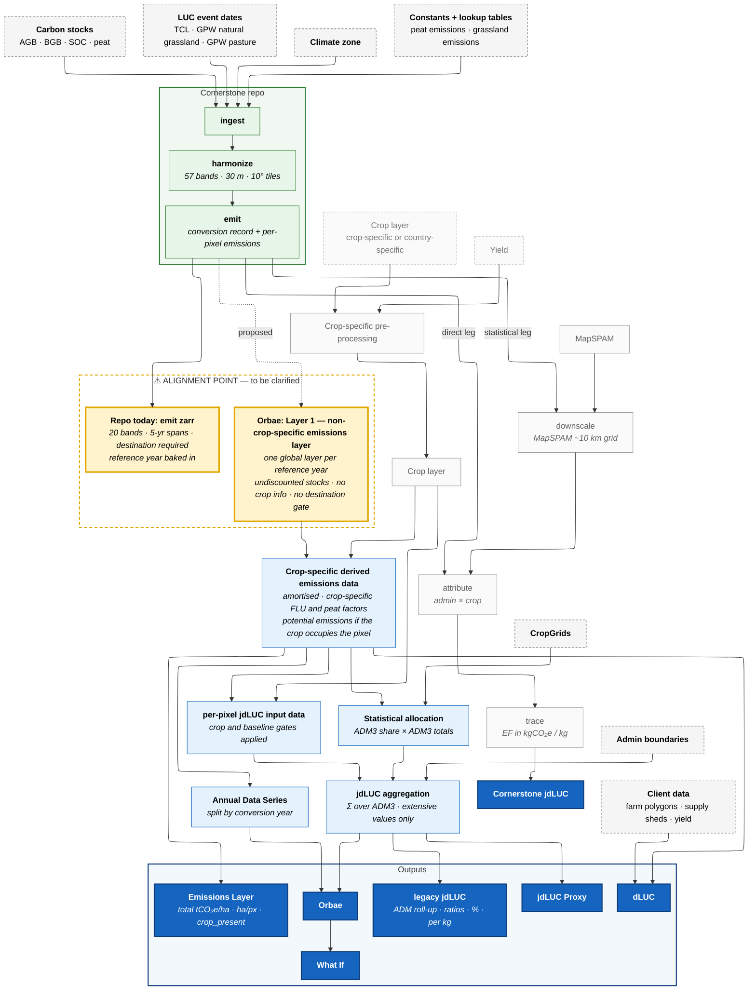

# Overall data flow — repo pipeline and Orbae data model

First pass, 2026-09-24. One chart for both flows: the Cornerstone repo as it runs today
(green) and the Orbae emissions data model as proposed (blue). They share everything up to
and including `emit`; the two amber boxes below `emit` are the **alignment point still to
be clarified** — what `emit` produces today versus what the data model asks it to produce.

Drawn from [`data_flow.md`](data_flow.md), [`orbae_emissions_data_model.md`](orbae_emissions_data_model.md),
[`jdluc_derivability.md`](jdluc_derivability.md), and [`orbae_spec_alignment.md`](orbae_spec_alignment.md) §0.

Green: Cornerstone repo stages. Light blue: Orbae data model intermediates. Dark blue:
outputs. Grey dashed: external data sources. Amber: the two candidate outputs of `emit`, side by side.

Italic lines inside boxes are detail. For a headings-only version, run
`tools/strip-mermaid-detail.py docs/orbae/overall_data_flow.md` and render the result.

## Notes

- **Alignment point.** "Repo today: emit zarr" is what `emit` writes at `8130655`
  ([data_flow.md](data_flow.md#emit--20-bands)). Layer 1 is what the data model pitches as
  "the output of the emit step". The dotted edge is the proposal, not the state of the code.
- **Cornerstone downstream.** Drawn from `emit` rather than from the "Repo today" box so it
  sits level with the alignment point; it consumes the same data. The direct leg skips
  `downscale`; the statistical leg goes through it onto the MapSPAM grid.
- **Orbae lane.** Crop-specific derived emissions data holds values for every pixel; the crop
  and baseline gates are applied in the per-pixel jdLUC input data (derivability §5,
  decision 1.8), and jdLUC aggregation sums it over admin boundaries. How dLUC is produced
  from it and client data is not yet specified.
- **Not drawn.** Forecasting, backcasting, palm, the `validation/` package, and the spec's
  step-5 filter layer.
